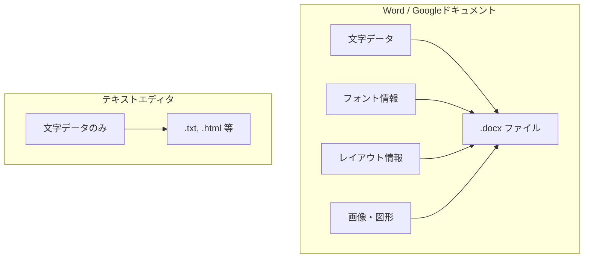

# テキストエディタとはなにか

## はじめに

Cursorを使い始める前に、まず「テキストエディタ」とは何かを明確にしておきましょう。普段お使いのWordやGoogleドキュメントとは、根本的に目的が異なるツールです。この章では、テキストエディタの本質と、身近な文書作成ツールとの違いを丁寧に解説します。

## 📊 この章の重要度：🔴 必須

**Cursorを活用するために：**
- テキストエディタの概念理解は、Cursorを使いこなすための土台
- WordやGoogleドキュメントとの混同を避け、適切に使い分けられるようになる
- 習得目安：Cursorを開く前に

## あなたがこれを知ると変わること

**ツール選択での変化：**
- 以前：「設定ファイルをWordで開いたら文字化けした」
- 今後：「テキストエディタで開けば正しく表示されます」

**開発者との会話での変化：**
- 開発者：「このJSONファイルをエディタで確認してください」
- あなた（修得前）：「Wordで開きますか？」
- あなた（修得後）：「Cursorで開いて確認しますね」

**学習での変化：**
- 以前：「コードを見てもどこが重要かわからない」
- 今後：「色分け表示で構造が一目でわかる」

## テキストエディタの定義

### 一言でいうと

**テキストエディタ**とは、**プレーンテキスト（純粋な文字データのみ）を編集するためのソフトウェア**です。

**プレーンテキスト**：装飾情報（太字・色・フォントサイズなど）を含まない、文字そのものだけで構成されたデータ。コンピューターにとって最もシンプルで、あらゆるシステムで読み書きできる形式です。

### 比喩で理解する

| 比喩 | 説明 |
|------|------|
| **原稿用紙** | マス目だけが並んでいる用紙。文字を書くことはできるが、印刷時の見た目（フォント、色）は含まない。 |
| **メモ帳** | 装飾なしで文字だけを記録するツール。Windowsのメモ帳が最もシンプルなテキストエディタの例。 |
| **設計図の下書き** | 構造や指示は書けるが、最終的な見た目（色・装飾）は別の工程で決める。 |


## Word・Googleドキュメントとの違い

### 根本的な目的の違い

| 観点 | テキストエディタ | Word / Googleドキュメント |
|------|------------------|---------------------------|
| **目的** | 文字データそのものを編集する | 人間が読みやすい文書を作成・共有する |
| **扱うデータ** | プレーンテキストのみ | テキスト＋装飾情報（書式・レイアウト） |
| **保存形式** | .txt, .html, .css, .py など | .docx, .pdf（内部に書式情報を埋め込む） |
| **想定ユーザー** | プログラマー、システム管理者、設定担当者 | 一般のビジネスユーザー |

### Word / Googleドキュメントの特徴

**文書作成ソフト**と呼ばれ、以下のような「見た目」の情報を保存します。

- **フォント**：游ゴシック、明朝体など
- **文字の装飾**：太字、斜体、下線、色
- **レイアウト**：余白、行間、ページ番号
- **挿入要素**：画像、表、図形

これらはすべて「メタデータ」としてファイル内部に保存されます。そのため、同じ「こんにちは」という文字でも、Word形式（.docx）は「こんにちは」＋「游ゴシック・14pt・青」といった付加情報を抱えています。

### テキストエディタの特徴

テキストエディタは**文字そのものだけ**を扱います。

- 「こんにちは」と入力すれば、ファイルには「こんにちは」だけが記録される
- フォントや色の情報は一切含まない
- その代わり、どのOS・どのアプリでも開ける普遍的な形式になる



### スプレッドシート（Excel / Googleスプレッドシート）との違い

スプレッドシートは**表計算ソフト**です。テキストエディタともWordとも、また違う目的を持ちます。

| 観点 | テキストエディタ | スプレッドシート |
|------|------------------|------------------|
| **目的** | 文字列・コードを編集 | 数値計算・表の管理・グラフ作成 |
| **構造** | 行と列はあるが、主に「行」単位でテキスト | セル（マス目）単位でデータを格納 |
| **得意なこと** | プログラム・設定ファイル・ログ | 合計・平均・グラフ、データ分析 |
| **保存形式** | .txt, .csv, .json など | .xlsx, .csv（表構造を持つ） |

**注意**：CSV（カンマ区切り）ファイルは、テキストエディタでもスプレッドシートでも開けます。テキストエディタでは「生の文字列」として編集し、スプレッドシートでは「表」として整形して表示・計算します。どちらで開くかは「何をしたいか」で変わります。

## なぜこの違いが重要なのか

### プログラム・設定ファイルは「プレーンテキスト」で書かれる

WebサイトのHTML、スタイルのCSS、設定のJSON、プログラミング言語のソースコード（Python, JavaScriptなど）は、すべてプレーンテキストです。

- Wordで開くと、書式情報の解釈に失敗したり、不要な情報が混ざって壊れることがある
- テキストエディタで開けば、コンピューターが期待する形式のまま編集できる

### 例：JSONファイルをWordで開くと

JSONはプログラム同士がデータをやり取りするためのテキスト形式です。

```
{"name": "商品A", "price": 1000}
```

Wordで開いて保存すると、Wordが独自の書式を追加するため、この形式が崩れ、プログラムが読み込めなくなる可能性があります。テキストエディタであれば、この文字列をそのまま安全に編集できます。

## プログラミング用テキストエディタの追加機能

CursorやVS Codeのような**プログラミング用テキストエディタ**は、単なる「メモ帳」の延長ではありません。以下のような付加機能があります。

| 機能 | 説明 |
|------|------|
| **シンタックスハイライト** | コードの種類（タグ、キーワード、文字列）に応じて色分け表示 |
| **ファイルツリー** | プロジェクト内のフォルダ・ファイルを一覧表示 |
| **検索・置換** | 複数ファイルを横断して文字列を検索・置換 |
| **補完・ヒント** | 入力の途中で候補を表示（AI搭載時はさらに高度） |

これらはすべて「プレーンテキストを編集しやすくする」ためのものです。ファイルに保存される内容はあくまでプレーンテキストのままです。

## まとめ

### この章で学んだこと

1. **テキストエディタ**はプレーンテキスト（装飾なしの文字データ）を編集するためのツール
2. **Word / Googleドキュメント**は「見た目」を含む文書を作るツールで、目的が異なる
3. **スプレッドシート**は表計算・データ分析用で、テキスト編集が主目的ではない
4. プログラム・設定ファイルはプレーンテキストなので、**テキストエディタ**で扱うのが正しい

### 次のステップ

テキストエディタで「できること」と「できないこと」を明確にし、適切な場面で使えるようにしましょう。次章 [02_必須_できることとできないこと.md](./02_必須_できることとできないこと.md) に進みます。
