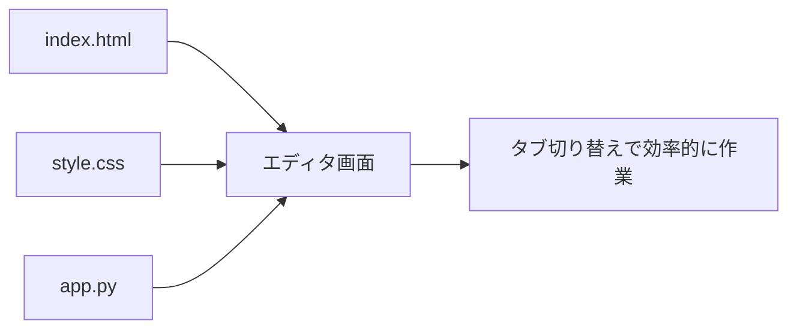
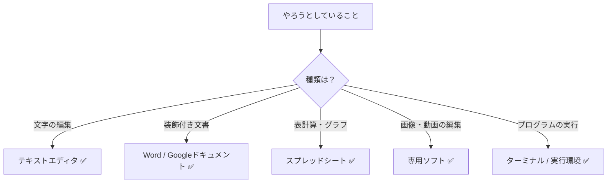

# できることとできないこと

## はじめに

テキストエディタが「プレーンテキストを編集するツール」だとわかったら、次は「何ができて、何ができないか」をはっきりさせましょう。適切な期待を持てば、ストレスなく効率的に使えます。この章では、テキストエディタ（およびCursor）のできること・できないことを整理します。

## 📊 この章の重要度：🔴 必須

**Cursorを適切に使うために：**
- できないことを無理にやろうとして時間を無駄にしない
- できることを最大限に活かす
- 習得目安：Cursorを日常的に使う前に

## あなたがこれを知ると変わること

**期待の調整：**
- 以前：「テキストエディタで表を作りたい」（→ Wordやスプレッドシートの方が適切）
- 今後：「表データはCSVで扱い、見やすくするならスプレッドシートで開く」

**ツールの使い分け：**
- 以前：「全部Cursorでやればいいかな」
- 今後：「文書作成はWord、コード・設定はCursor」と使い分けられる

**AIへの質問：**
- 以前：「画像を挿入して」とCursorに依頼（→ テキストエディタの範囲外）
- 今後：「画像を表示するHTMLタグを書いて」と正しい依頼ができる

## テキストエディタで「できること」

### 1. プレーンテキストの編集

**文字の追加・削除・修正**が基本です。

- メモを取る
- 設定ファイル（JSON, YAML, INIなど）を編集する
- プログラムのソースコード（HTML, CSS, JavaScript, Pythonなど）を書く・読む
- ログファイルを確認する
- CSVなどの表形式テキストを編集する

これらはすべて「文字列」として扱うため、テキストエディタの本領です。

### 2. 複数ファイルの同時表示・編集

多くのテキストエディタ（Cursorを含む）では、複数のファイルをタブで開いて切り替えられます。

- 関連する複数ファイルを並べて確認
- コピー＆ペーストでファイル間を移動
- 参照しながら編集

### 3. 検索・置換

- **ファイル内検索**：現在開いているファイル内で文字列を探す
- **プロジェクト全体検索**：フォルダ内の全ファイルから文字列を探す
- **置換**：見つかった文字列を一括で別の文字列に置き換える

例：「`<h1>` を `<h2>` に一括変更したい」といった作業に最適です。

### 4. シンタックスハイライト（色分け表示）

プログラミング用テキストエディタでは、ファイルの種類に応じて**キーワード・タグ・文字列**などを色分けして表示します。

- コードの構造が一目でわかる
- typo（入力ミス）に気づきやすい
- 学習時にも理解しやすい

### 5. フォルダ（プロジェクト）単位での管理

特定のフォルダを「プロジェクト」として開くと、その中にあるすべてのファイルをツリー表示で一覧できます。

- ファイルの階層構造を把握
- ダブルクリックでファイルを開く
- 新規ファイル・フォルダの作成

### 6. Cursorに特化：AI機能

Cursorは**AI搭載**のテキストエディタです。上記に加えて以下のことができます。

- **コードの説明を求める**：「このコードは何をしていますか？」
- **コードの生成**：「ボタンをクリックしたらアラートを出すコードを書いて」
- **修正の提案**：「このエラーを修正して」
- **リファクタリング**：「このコードをもっと読みやすくして」

これらはあくまで「テキスト（コード）の生成・編集」の延長です。AIが出力するのも文字列であり、テキストエディタで表示・編集できます。

## テキストエディタで「できないこと」

### 1. 見た目の装飾（WYSIWYG）

**WYSIWYG**（What You See Is What You Get：見たままが結果） editing は、WordやGoogleドキュメントの特徴です。

テキストエディタでは：

- ❌ 文字を「太字」「斜体」「赤色」にして保存することはできない
- ❌ 画像をドラッグ＆ドロップで挿入することはできない
- ❌ 表のセルをマウスで結合することはできない

これらは「見た目情報」であり、プレーンテキストの範囲外だからです。

**補足**：HTMLを書けば、ブラウザで「太字」「画像」として表示されます。ただし、それはテキストエディタが「HTMLという文字列」を書いているだけで、エディタ自体が装飾を理解しているわけではありません。

### 2. 計算・グラフ・数式

- ❌ セルに「=SUM(A1:A10)」と入力して合計を自動計算することはできない
- ❌ データからグラフを自動生成することはできない
- ❌ 数式エディタで数式を描画することはできない

これらは**スプレッドシート**や**数式ソフト**の役割です。テキストエディタでは「=SUM(A1:A10)」はあくまで文字列として扱われ、計算は行われません。

### 3. 画像・動画・音声の編集

- ❌ 画像のトリミング・リサイズ
- ❌ 動画の切り取り・結合
- ❌ 音声の編集

テキストエディタは**バイナリファイル**（画像・動画・音声など）の内容を編集する用途には向いていません。バイナリは0と1の列であり、人間が直接編集するには不向きです。画像編集ソフト・動画編集ソフトを使います。

**補足**：画像ファイルの「ファイル名」や「パス」をテキストで記述することはできます（例：HTMLの``）。あくまで「文字列としてパスを書く」だけで、画像そのものを編集するわけではありません。

### 4. プログラムの「実行」

テキストエディタは**コードを書く・読む**場所です。書いたコードを「実行」する機能は、標準では持ちません。

- ❌ 「このPythonコードを実行して」は、テキストエディタ単体ではできない
- ✅ ターミナル（黒い画面）で `python script.py` のようにコマンドを入力して実行する
- ✅ Cursorには**ターミナル機能**が内蔵されているため、同じウィンドウ内で実行できる

### 5. リアルタイム共同編集（Googleドキュメント風）

Googleドキュメントのように、複数人が同時に同じファイルを編集して、相手のカーソル位置がリアルタイムで見えるような**同時編集**は、通常のテキストエディタだけではできません。

-  Git などのバージョン管理を使えば「変更の共有」は可能
- Cursor 自体はリアルタイム共同編集には標準では対応していない（※ 機能は製品により変わる）

## 表にまとめる

| やりたいこと | 適切なツール |
|-------------|---------------|
| コードを書く・読む | テキストエディタ（Cursor） |
| 設定ファイルを編集 | テキストエディタ |
| メモ・ログを取る | テキストエディタ |
| レポート・提案書を作成 | Word / Googleドキュメント |
| 表・グラフ・集計 | スプレッドシート |
| 画像の編集 | 画像編集ソフト |
| コードの実行 | ターミナル・実行環境 |

## CursorのAIで「できること」「できないこと」

### AIでできること（テキストの範囲内）

- コードの説明・要約
- コードの生成・修正・リファクタリング
- エラーの原因推測と修正提案
- 自然言語での質問への回答（技術的な内容）
- ドキュメントの要約・翻訳

これらはすべて**テキストの入出力**で完結します。

### AIでできないこと（テキストの範囲外）

- 画像の生成・編集（Cursor単体では不可。※ 画像生成AIは別サービス）
- 実際のプログラム実行（AIは「コードを書く」だけで、実行はユーザーがターミナル等で行う）
- インターネットのリアルタイム検索（学習データに基づく回答。時期によっては古い情報の可能性）
- 企業の機密情報を含む内容の「記憶」（会話履歴はセッション内のみのことが多い）

## まとめ

### この章で学んだこと

1. **テキストエディタ**は「プレーンテキストの編集」に特化したツールである
2. 装飾・計算・画像編集・プログラム実行は、それぞれ別のツールで行う
3. **Cursor**はその上にAI機能を載せており、テキスト（コード）の生成・説明・修正に強力
4. 適切なツールを選ぶことで、作業効率とストレスが大きく改善する

### 次のステップ

テキストエディタやCursorは、多くの場合「プロジェクト」という単位で作業します。プロジェクトとは何か、フォルダとどう関係するかを理解しましょう。次章 [03_必須_プロジェクトとはなにか.md](./03_必須_プロジェクトとはなにか.md) に進みます。
