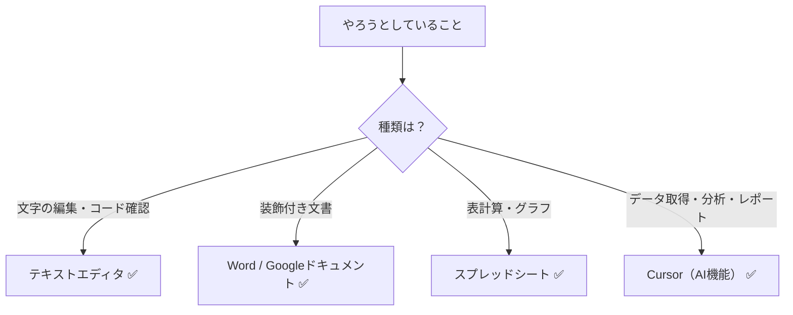

# エディタの機能と限界

## はじめに

このドキュメントは**マーケティングチーム**の方を主な読者として想定しています。仕様検討やマーケティングリサーチなど、ビジネス業務でCursorを活用する際に、「何ができて、何ができないか」を理解しておくと、期待値のズレを防ぎ、効率的にツールを選べるようになります。

まずは**従来型のテキストエディタ**でできることを押さえ、そのうえで**Cursor独自のAI機能**がどこまでできるかを解説します。

## 📊 この章の重要度：🔴 必須

**Cursorを適切に使うために：**
- 従来型エディタとAI搭載エディタの違いを理解する
- マーケティング業務で活かせる使い方を知る
- 習得目安：Cursorを日常的に使う前に

## あなたがこれを知ると変わること

**仕様検討の場面で：**
- 以前：「開発者とのすり合わせに時間がかかる」
- 今後：「Cursorで仕様書（mdファイル）を書き、AIに確認や補足を依頼できる」

**マーケティングリサーチの場面で：**
- 以前：「情報収集は手作業でコピペ、集計はExcelで」
- 今後：「CursorのWeb検索機能で最新情報を取得し、PythonでBigQueryからデータを取り出してレポート化できる」

**ツール選択で：**
- 以前：「全部ExcelかWordでやろうとする」
- 今後：「テキスト編集・データ分析・レポート作成の役割分担がわかる」

---

## 従来型のテキストエディタで「できること」

従来型のテキストエディタ（メモ帳、Notepad++、VS Codeの基本機能など）は、**プレーンテキスト（装飾なしの文字）の編集**に特化したツールです。

### 1. プレーンテキストの編集

**文字の追加・削除・修正**が基本です。

- メモを取る
- 設定ファイル（JSON、YAML、INIなど）を編集する
- プログラムのソースコード（HTML、CSS、JavaScript、Pythonなど）を書く・読む
- ログファイルを確認する
- CSVなどの表形式テキストを編集する

これらはすべて「文字列」として扱うため、従来型テキストエディタの得意分野です。

### 2. 複数ファイルの同時表示・編集

多くのテキストエディタでは、複数のファイルをタブで開いて切り替えられます。

- 関連する複数ファイルを並べて確認
- コピー＆ペーストでファイル間を移動
- 参照しながら編集

### 3. 検索・置換

- **ファイル内検索**：現在開いているファイル内で文字列を探す
- **プロジェクト全体検索**：フォルダ内の全ファイルから文字列を探す
- **置換**：見つかった文字列を一括で別の文字列に置き換える

例：「特定のキーワードを一括で別の表現に変更したい」といった作業に使えます。

### 4. シンタックスハイライト（色分け表示）

プログラミング用テキストエディタでは、ファイルの種類に応じて**キーワード・タグ・文字列**などを色分けして表示します。

- コードや設定ファイルの構造が一目でわかる
- 入力ミスに気づきやすい
- 学習時にも理解しやすい

### 5. フォルダ（プロジェクト）単位での管理

特定のフォルダを「プロジェクト」として開くと、その中にあるすべてのファイルをツリー表示で一覧できます。

- ファイルの階層構造を把握
- ダブルクリックでファイルを開く
- 新規ファイル・フォルダの作成

---

## 従来型のテキストエディタで「できないこと」

### 1. 見た目の装飾（Wordのような編集）

- 文字を「太字」「斜体」「赤色」にして保存することはできない
- 画像をドラッグ＆ドロップで挿入することはできない
- 表のセルをマウスで結合することはできない

これらは**Word**や**Googleドキュメント**の役割です。

### 2. 計算・グラフの自動生成

- セルに「=SUM(A1:A10)」のように数式を入れて合計を自動計算することはできない
- データからグラフを自動生成することはできない

これらは**スプレッドシート**の役割です。

### 3. 画像・動画・音声の編集

画像のトリミング、動画の切り取りなどは、**専用ソフト**で行います。テキストエディタは文字データの編集専用です。

### 4. プログラムの「実行」

従来型のテキストエディタは、**コードを書く・読む**だけのツールです。

- コードを「実行」して結果を得る機能は標準ではない
- 実行したい場合は、ターミナル（黒い画面）でコマンドを入力する必要がある

※ Cursorでは、AIがターミナル操作まで代行できるため、この制約が緩和されます（後述）。

### 5. リアルタイムのWeb検索

従来型のテキストエディタ単体では、インターネット上の最新情報を自動で検索・取得する機能はありません。

---

## Cursorに特化：AI機能で「できること」

Cursorは**AI搭載**のテキストエディタです。従来型の機能に加えて、以下のことができます。

### 1. コードの説明・生成・修正

- **コードの説明**：「このコードは何をしていますか？」
- **コードの生成**：「〇〇する処理を書いて」
- **修正の提案**：「このエラーを修正して」
- **リファクタリング**：「このコードをもっと読みやすくして」

プログラミングに詳しくなくても、自然な日本語で指示を出すだけで、AIがコードを生成・修正してくれます。

### 2. Web検索による最新情報の取得

Cursorには**Web検索機能**があります。

- **@Web** を指定すると、AIがインターネット上の最新情報を検索して回答に反映できる
- エージェントモードでは、質問に応じて自動的にWeb検索を行う場合がある
- マーケティングリサーチ、競合調査、技術情報の確認などに活用できる

例：「この業界の2025年のトレンドを調べて」「〇〇の最新のベストプラクティスを教えて」といった質問が可能です。

### 3. プログラムの実行と自動化（AIによるターミナル操作）

従来型エディタでは「コードを書くだけ」でしたが、Cursorでは**AIがターミナル（黒い画面）を操作し、プログラムを実行**まで代行できます。

代表的な活用例：

| 用途 | できることの例 |
|------|----------------|
| **データ分析** | PythonでBigQueryにクエリを投げ、結果を取得 |
| **可視化** | 取得したデータをグラフ化し、画像ファイルとして保存 |
| **レポーティング** | 分析結果をmd（Markdown）ファイル形式でレポートとして出力 |
| **CSV処理** | CSVファイルを読み込み、集計・変換・整形を自動化 |
| **作業の自動化** | 繰り返し行っていた手作業を、スクリプトで自動実行 |

**マーケティング業務での例：**
「BigQueryから先月の売上データを取得し、商品別の棒グラフを作成して、分析結果を `report.md` として出力して」と依頼すれば、AIがPythonコードを書き、実行し、必要なファイルを生成するまでを一連の流れで行えます。プログラミング経験が少なくても、自然な日本語で指示を出すことで実現できます。

### 4. ドキュメントの要約・翻訳

- 長い仕様書や技術ドキュメントの要点をまとめる
- 英語のドキュメントを日本語に翻訳する
- 会議メモや議事録を整理する

仕様検討やマーケティングリサーチの際の情報整理に役立ちます。

### 5. 自然言語での質問応答

- 「この設定の意味は何ですか？」
- 「このAPIはどう使いますか？」
- 「セキュリティ上の注意点はありますか？」

技術用語や仕様について、その場で質問して回答を得られます。開発者に都度確認する前に、自分で理解を深める際に活用できます。

---

## 従来型エディタとCursorの違い：一覧

詳しくは [06_必須_従来型エディタとCursorの比較.md](./06_必須_従来型エディタとCursorの比較.md) を参照してください。

| 機能 | 従来型テキストエディタ | Cursor |
|------|------------------------|--------|
| プレーンテキストの編集 | ✅ | ✅ |
| 検索・置換 | ✅ | ✅ |
| シンタックスハイライト | ✅ | ✅ |
| プログラムの実行 | ❌（手動でターミナル操作） | ✅（AIが実行まで代行） |
| Web検索 | ❌ | ✅（@Webなど） |
| コード生成・説明 | ❌ | ✅ |
| データ分析～レポート作成の一連の自動化 | ❌ | ✅（要環境構築） |

---

## 表にまとめる：やりたいこと別のツール選び

| やりたいこと | 適切なツール |
|-------------|---------------|
| コード・設定ファイルを書く・読む | テキストエディタ（Cursor含む） |
| 仕様書・レポートを書く（図・表も含む） | mdファイル + Cursor |
| レポート・提案書を作成（装飾重視） | Word / Googleドキュメント |
| 表・グラフ・集計 | スプレッドシート |
| BigQuery等からデータ取得→可視化→レポート | Cursor（AI＋Python等） |
| 最新情報のリサーチ | Cursor（Web検索機能） |

---

## まとめ

### この章で学んだこと

1. **従来型テキストエディタ**は、プレーンテキストの編集に特化している
2. **Cursor**は、その上にAI機能を載せており、Web検索・プログラム実行・レポート作成まで一連の流れで支援できる
3. **mdファイル**（Markdown）の詳しい書き方は [04_必須_Markdownとmdファイル入門.md](./04_必須_Markdownとmdファイル入門.md) を参照
4. マーケティング業務では、仕様検討・リサーチ・データ分析・レポーティングにCursorを活用できる

### 次のステップ

プロジェクトの概念を学び、Cursorでフォルダを開く操作に慣れましょう。次章 [03_必須_プロジェクトとフォルダ入門.md](./03_必須_プロジェクトとフォルダ入門.md) へ進みます。
