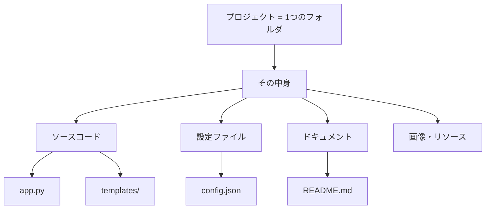

# プロジェクトとはなにか

## はじめに

CursorやVS Codeなどのテキストエディタを使うとき、「プロジェクトを開く」「プロジェクトフォルダ」といった言葉がよく出てきます。開発者の会話でも「このプロジェクトは」「プロジェクトのルート」といった表現を耳にすることがあるでしょう。この章では、「プロジェクト」がどのような意味で使われるかを、非エンジニア向けに丁寧に解説します。

## 📊 この章の重要度：🔴 必須

**Cursorを正しく使うために：**
- 「フォルダを開く」と「プロジェクトを開く」の意味がつかめる
- 左側のファイルツリーが何を表示しているか理解できる
- 習得目安：Cursorで初めてフォルダを開く前に

## あなたがこれを知ると変わること

**操作での変化：**
- 以前：「ファイルをひとつずつ開いている」
- 今後：「プロジェクトフォルダを開いて、関連ファイルをまとめて扱える」

**会話での変化：**
- 開発者：「プロジェクトのREADMEを確認してください」
- あなた（修得前）：「READMEってどこにあるんですか？」
- あなた（修得後）：「プロジェクトルートのREADME.mdですね」

**AI活用での変化：**
- 以前：「このファイルだけ見て質問している」
- 今後：「プロジェクト全体をコンテキストとして、より正確な回答を得られる」

## プロジェクトの定義

### 一言でいうと

**プロジェクト**とは、**一つの目的を達成するためにまとめられた、フォルダとファイルの集まり**です。

開発者の世界では、多くの場合「ひとつのフォルダ」が「ひとつのプロジェクト」に対応します。そのフォルダの中に、その仕事に必要なファイルやサブフォルダが階層的に並んでいます。



### 比喩で理解する

| 比喩 | 説明 |
|------|------|
| **仕事の書類入れ** | 一つの案件に関する書類をまとめて入れておくフォルダ。中に複数のファイルがある。 |
| **レシピ本の一冊** | 一冊の本（プロジェクト）の中に、複数のレシピ（ファイル）がある。目次（ファイルツリー）で構成がわかる。 |
| **建物の設計図一式** | 一つの建物に関する図面・仕様書が一つのフォルダにまとまっている。 |

## フォルダとの違いは何か

### フォルダ（ディレクトリ）

**フォルダ**は、ファイルや他のフォルダを入れておく「入れ物」です。Windowsのエクスプローラーでおなじみの概念です。

- 任意のフォルダを作成できる
- 中に何を入れてもよい（関連性がなくてもよい）

### プロジェクト

**プロジェクト**は、**「一つの仕事・一つの成果物」を単位としたフォルダの使い方**です。

- 通常、そのプロジェクトに必要なファイルだけが入る
- フォルダの「使い方」や「意味づけ」であり、フォルダそのものとは少しニュアンスが違う

つまり：

- **技術的には**：プロジェクト = フォルダ（同じもの）
- **概念的には**：プロジェクト = 「ある目的のためにまとめられたフォルダ」

Cursorで「フォルダを開く」と言うとき、それは多くの場合「プロジェクトを開く」と同じ意味で使われています。

## プロジェクトの典型的な構造

### 例：Webアプリケーションのプロジェクト

```
my-website/                 ← プロジェクトのルート（一番上のフォルダ）
├── README.md               # プロジェクトの説明
├── index.html              # トップページ
├── style.css               # スタイル
├── script.js               # スクリプト
├── images/                 # 画像用フォルダ
│   ├── logo.png
│   └── banner.jpg
└── config/                 # 設定用フォルダ
    └── settings.json
```

- **プロジェクトルート**：`my-website/` が「根」であり、ここからすべてのファイルへの道（パス）が始まる
- **サブフォルダ**：`images/`、`config/` のように、役割ごとに分けることが多い

### 例：この学習リポジトリ

このリポジトリ全体も、一つの「プロジェクト」です。

```
workspace/                  ← プロジェクトルート
├── README.md
├── docs/                   # 理論学習ドキュメント
│   ├── 01_コンピューター基礎知識/
│   └── ...
├── tutorials/              # 実践学習
│   ├── step01_flask_setup/
│   └── ...
└── cursor-tutorial/        # Cursor入門（今読んでいる場所）
```

## なぜ「プロジェクト」という単位が重要なのか

### 1. 関連ファイルをまとめて扱える

ひとつのWebサイトやアプリには、HTML、CSS、JavaScript、画像、設定ファイルなど、多数のファイルが関わります。これらを一つのフォルダ（プロジェクト）にまとめておくことで：

- どこに何があるか把握しやすい
- 検索・置換をプロジェクト全体に適用できる
- バージョン管理（Git）もプロジェクト単位で行いやすい

### 2. エディタが「文脈」を理解するため

Cursorのようなエディタは、**開いているプロジェクト内のファイル**を把握します。

- ファイルツリーで構造を表示
- 検索時にはプロジェクト内のファイルを対象にする
- AIに質問するとき、プロジェクト内のファイルを**コンテキスト**として参照できる

プロジェクトを開いていないと、エディタは「どのファイルが関連しているか」を判断できません。

### 3. 開発者との共通言語

「このプロジェクト」「プロジェクトのルート」「プロジェクト内の〜」といった言い方は、開発現場でよく使われます。同じ意味で理解しておくと、コミュニケーションがスムーズになります。

## Cursorでの「プロジェクトを開く」操作

### フォルダを開く

1. メニューから **ファイル → フォルダを開く**（または `Ctrl + K`, `Ctrl + O`）
2. 開きたいフォルダを選択
3. 「フォルダの選択」をクリック

すると、左側のサイドバーにそのフォルダの中身がツリー表示されます。これが「プロジェクトを開いた」状態です。

### 複数のフォルダを開く

Cursorでは、複数のフォルダを同時に「ワークスペース」として開くこともできます。詳しくは [05_推奨_作業空間とコンテキスト.md](./05_推奨_作業空間とコンテキスト.md) を参照してください。

## まとめ

### この章で学んだこと

1. **プロジェクト**は、一つの目的のためにまとめられたフォルダとファイルの集まり
2. 技術的には、プロジェクト = フォルダ（一つのフォルダが一つのプロジェクトに対応することが多い）
3. プロジェクトを開くことで、エディタが関連ファイルを把握し、検索・AI活用がしやすくなる
4. 「プロジェクトルート」は、そのプロジェクトの一番上のフォルダを指す

### 次のステップ

Cursorの「モデル」と「エディタ」の違いを理解し、AI機能を正しく使えるようになりましょう。次章 [04_必須_Cursor入門_モデルとエディタの違い.md](./04_必須_Cursor入門_モデルとエディタの違い.md) に進みます。
