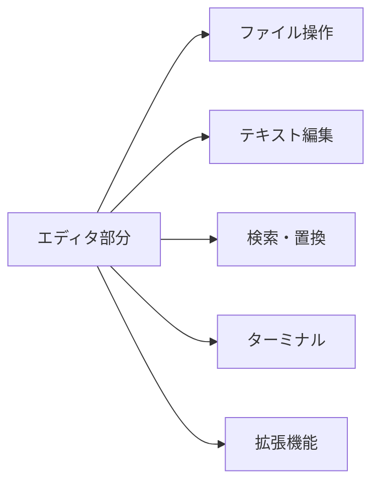
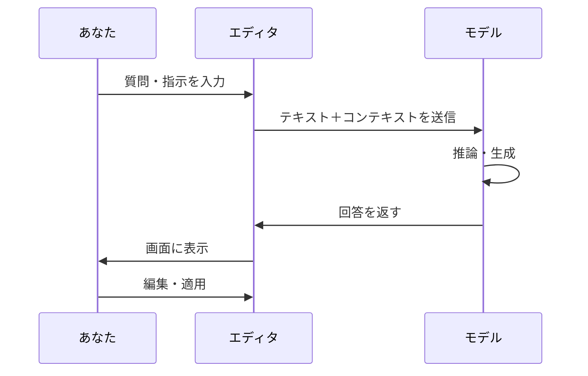

# Cursor入門 - モデルとエディタの違い

## はじめに

Cursorは**AI搭載のテキストエディタ**です。ふつうのエディタ機能に加えて、AIがコードの説明をしたり、コードを生成したりする機能が組み込まれています。この章では、Cursorを構成する2つの大切な要素——**エディタ**と**モデル**——の役割の違いを解説します。この違いを理解すると、Cursorをより効果的に使いこなせるようになります。

## 📊 この章の重要度：🔴 必須

**Cursorを正しく理解するために：**
- 「何がAIで、何が従来のエディタか」が明確になる
- 回答の質が変わるときの原因を推測できる
- 習得目安：AIチャットを初めて使う前に

## あなたがこれを知ると変わること

**理解の変化：**
- 以前：「Cursorは全部AIがやってるんだ」
- 今後：「テキスト編集はエディタ、思考・生成はAIモデルが担当している」

**トラブル対応：**
- 以前：「AIの回答が変だ。Cursorがおかしい」
- 今後：「モデルを変えてみるか、プロンプトを工夫してみよう」

**設定の変化：**
- 以前：「設定が多すぎてわからない」
- 今後：「エディタ設定」と「AI（モデル）設定」を分けて考えられる

## エディタとは何か

### 定義

**エディタ**とは、Cursorの**テキスト編集を担当する部分**です。ファイルを開く、文字を入力・削除する、検索する、タブで切り替える——といった、従来のテキストエディタやVS Codeと同じ機能を提供します。

Cursorは**VS Code**を土台（ベース）として作られています。そのため、見た目や操作方法の多くはVS Codeと共通です。

### エディタが担当すること

| 機能 | 説明 |
|------|------|
| ファイルの表示・編集 | テキストを表示し、キーボードで編集する |
| ファイルツリー | プロジェクト内のフォルダ・ファイルを一覧表示 |
| タブ | 複数ファイルを開いて切り替える |
| 検索・置換 | 文字列を検索し、必要に応じて置換する |
| シンタックスハイライト | コードの種類に応じて色分け表示 |
| ターミナル | コマンドを実行できる黒い画面を内蔵 |
| 拡張機能 | 追加の機能をインストールして拡張 |

これらは**AIを使わなくても動く**機能です。AIがオフラインでも、エディタ部分は従来のテキストエディタとして使えます。

## モデルとは何か

### 定義

**モデル**とは、**AIが「考える」「文章を生成する」ために使っているプログラム（AIの頭脳）**のことです。大規模なデータで学習された巨大な計算システムで、人間の言葉（自然言語）やコードを理解し、適切な応答を生成します。

Cursorでは、複数のモデルから選択できます。代表的なものに、Claude、GPT-4、その他のモデルがあります。製品のバージョンにより、利用できるモデルは変わります。

### モデルが担当すること

| 機能 | 説明 |
|------|------|
| チャットでの質問応答 | 「このコードは何をしていますか？」に答える |
| コード生成 | 「〇〇するコードを書いて」と依頼してコードを生成 |
| コード修正 | エラーを指摘し、修正案を提案する |
| リファクタリング | コードを読みやすく、保守しやすい形に書き換える提案 |
| 説明・要約 | 長いドキュメントやコードの要点を要約する |
| 翻訳 | コード内のコメントやドキュメントを翻訳する |

これらは**モデル（AI）が処理**しています。モデルが「考える」ためには、通常、インターネット経由でサーバーと通信し、クラウド上の計算資源を使います。

## エディタとモデルの関係

### 役割の分担

| 担当 | 役割 | 例 |
|------|------|-----|
| **エディタ** | 画面表示・入力・ファイル操作 | ファイルを開く、文字を入力する、タブを切り替える |
| **モデル** | 理解・推論・生成 | 質問に答える、コードを書く、説明する |

### 協調の流れ

1. **あなた**がエディタ上でチャットを開き、質問や指示を入力する
2. **エディタ**がその入力をモデルに送る（必要に応じて、開いているファイルなども一緒に送る）
3. **モデル**が考え、回答やコードを生成する
4. **エディタ**がその結果をチャット欄やエディタ上に表示する
5. **あなた**がエディタ上でその結果を確認し、必要なら編集・適用する

### 重要：モデルは「編集」しない

モデルは**テキストを生成する**だけで、あなたのファイルを直接編集することはありません。

- モデルが出力したコードを、**あなたがエディタ上で確認し、適用する**
- 「適用」ボタンを押すと、エディタがその変更をファイルに反映する
- つまり、**最終的な編集操作は常にエディタが行う**

## モデルを選ぶとはどういうことか

### モデルには個性がある

異なるモデル（例：Claude、GPT-4）は、それぞれ違う設計・学習データを持っています。そのため：

- **得意なこと**が異なる（コード生成が得意、説明が丁寧、など）
- **回答のスタイル**が異なる（簡潔、詳しめ、など）
- **対応言語**や**知識の鮮度**もモデルによって違う

### モデルの切り替え

Cursorでは、チャット画面などで**使用するモデルを選択**できます。

- 回答が期待と違うときは、**別のモデルを試す**と改善することがある
- 無料枠・課金プランによって、利用できるモデルが異なる場合がある

## まとめ

### この章で学んだこと

1. **エディタ**：テキストの表示・編集・ファイル操作を担当。従来のテキストエディタの機能。
2. **モデル**：AIの「頭脳」。質問への回答、コード生成、説明などを担当。
3. 両者は**役割が分かれている**：エディタが入力と表示を、モデルが思考と生成を担当する。
4. モデルを選ぶことで、回答の質やスタイルを変えられる。

### 次のステップ

モデルがより正確に回答するためには、「コンテキスト」（どのファイルや情報を参照するか）が重要です。作業空間とコンテキストについて学び、AIを効果的に活用しましょう。次章 [05_推奨_作業空間とコンテキスト.md](./05_推奨_作業空間とコンテキスト.md) に進みます。
