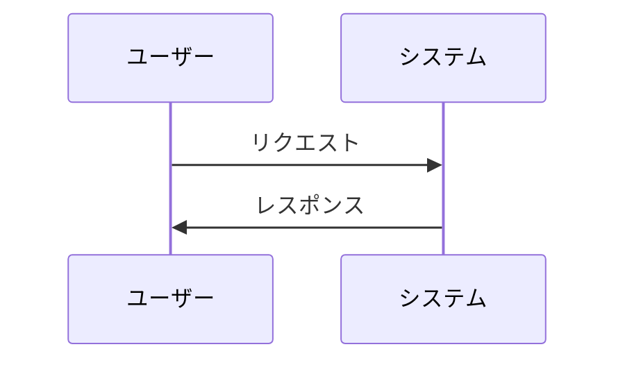
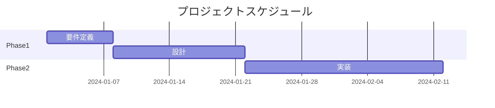

# Markdownとmdファイル入門

## はじめに

CursorやGitHub、多くの開発ツールで使われている **.md ファイル**（Markdown形式）について、ノンエンジニア・マーケティング担当者向けに解説します。Wordのようにマウスで装飾するのではなく、**記号を打ち込むだけで見出しや表を作れる**のがMarkdownの特徴です。この章を読めば、仕様書やレポートをmd形式で書くための基礎が身につきます。

## 📊 この章の重要度：🔴 必須

**mdファイルを書きたい方に：**
- 仕様書・レポートをテキストベースで管理したい
- GitHub上でドキュメントを読む・書く機会がある
- 習得目安：Cursorでレポート作成を始める前に

## あなたがこれを知ると変わること

**ドキュメント作成で：**
- 以前：「Wordで書いて、PDFで共有」
- 今後：「mdファイルで書き、GitHubやCursorで共有・共同編集」

**レポート作成で：**
- 以前：「グラフは画像で挿入するしかない」
- 今後：「Mermaidでフローチャートをテキストで書いて、バージョン管理しやすい」

**開発者とのやり取りで：**
- 以前：「READMEってどうやって見るの？」
- 今後：「.mdファイルなので、Cursorで開いてプレビューできます」

---

## md（Markdown）とは

### 一言でいうと

**Markdown**は、**シンプルな記号で文書を書くための形式**です。ファイルの拡張子は `.md` です。

- **プレーンテキスト**なので、どのテキストエディタでも編集できる
- 見出し・太字・リストなどを、`#` や `-`、`**` などの記号で表現する
- GitHub、Cursor、多くのツールで、整形されて読みやすく表示される（**プレビュー**機能）

### Wordとの違い

| 観点 | Word | Markdown（.md） |
|------|------|-----------------|
| **編集方式** | マウスで装飾を選ぶ | 記号を打ち込む |
| **ファイル形式** | バイナリ（.docx） | プレーンテキスト |
| **扱いやすさ** | 専用ソフトが必要 | どのエディタでも開ける |
| **バージョン管理** | 差分がわかりにくい | 差分が明確（Git向き） |
| **共同編集** | リアルタイム共同編集が得意 | テキストなのでマージしやすい |

### なぜmdが使われるのか

- **プログラマーに馴染みがある**：コードと同じようにテキストで管理できる
- **GitHubの標準**：READMEやドキュメントは多くの場合md形式
- **軽量で汎用的**：メールやチャットに貼り付けても崩れにくい
- **AIが扱いやすい**：テキスト形式なので、CursorのAIが編集・要約しやすい


---

## Markdownの基本記法

### 見出し

行の先頭に `#` を付けると見出しになります。`#` の数でレベルが変わります。

```markdown
# 大見出し（レベル1）
## 中見出し（レベル2）
### 小見出し（レベル3）
```

**表示例：**
- 1つで最も大きい見出し
- 2つで中くらいの見出し
- 3つで小さい見出し

### 太字・斜体

| 書き方 | 表示 |
|--------|------|
| `**太字**` | **太字** |
| `*斜体*` | *斜体* |

### リスト

**箇条書き（先頭に - または *）：**
```markdown
- 項目1
- 項目2
- 項目3
```

**番号付きリスト：**
```markdown
1. 第一
2. 第二
3. 第三
```

### リンク

クリックできるリンクを挿入します。

```markdown
[表示する文字](https://example.com)
```

例：`[Google](https://google.com)` → Google（クリックするとGoogleに飛ぶ）

### 画像の参照

mdファイル内で画像を表示するには、次の形で書きます。

```markdown

```

**例1：プロジェクト内の画像ファイル**
```markdown

```
→ `images/sales_chart.png` は、プロジェクトフォルダ内の画像ファイルへの相対パスです。

**例2：Web上の画像**
```markdown

```

**ポイント：**
- 画像ファイルは、プロジェクトフォルダ内に置いておくか、URLで指定する
- GitHubにmdと一緒に画像をアップロードすると、表示したときに画像も一緒に表示される
- レポートや仕様書に、グラフや画面キャプチャを埋め込みやすい

### 表

`|`（縦線）で区切って表を書きます。

```markdown
| 列1 | 列2 | 列3 |
|-----|-----|-----|
| A   | B   | C   |
| D   | E   | F   |
```

**表示例：**

| 列1 | 列2 | 列3 |
|-----|-----|-----|
| A   | B   | C   |
| D   | E   | F   |

### コードブロック

プログラムや設定をそのまま表示したいときに使います。

````markdown
```
ここにコードを書く
```
````

言語を指定すると、色分け表示されることがあります。

````markdown
```python
print("Hello, World!")
```
````

### 水平線

`---` や `***` で区切り線を引けます。

```markdown
---
```

---

## Mermaidによる図・グラフの作成

### Mermaidとは

**Mermaid**は、**テキストで図やグラフを描く**ための記法です。mdファイル内に埋め込んで使います。

- コードのように記述するため、**バージョン管理（Git）に適している**
- GitHubやCursorのプレビューでは、そのまま図として表示される
- ドキュメントと図を同じファイルで管理できる

### フローチャート

処理の流れを表す図です。


**書き方の例：**（mdファイル内にそのまま書く）
````

````

- `flowchart LR`：左から右（Left to Right）に流れる図
- `flowchart TD`：上から下（Top to Down）に流れる図

### シーケンス図

やり取りの時系列を表す図です。APIの説明や処理の流れの説明に使えます。



### ガントチャート

スケジュールやプロジェクトの進捗を表す図です。



### マーケティングでの活用例

- **業務フロー**：調査→分析→レポートの流れをフローチャートで表現
- **顧客ジャーニー**：ユーザーとシステムのやり取りをシーケンス図で表現
- **プロジェクト計画**：マイルストーンをガントチャートで可視化

---

## Cursorでのmdファイルの扱い方

### プレビュー表示

Cursorでは、mdファイルを開いた状態で**プレビュー**を表示できます。

- 右クリックメニューから「Open Preview」を選択
- または、エディタ右上のプレビューアイコンをクリック

記号で書いた内容が、整形された見た目で表示されます。

### AIでmdを作成・編集

CursorのAIに、次のように依頼できます。

- 「この内容をmd形式でまとめて」
- 「このセクションに見出しを追加して」
- 「表形式で整理して」

自然な日本語で指示を出せば、AIが適切なMarkdown記法で書き換えてくれます。

---

## Wordとの使い分け

| 用途 | 向いている形式 |
|------|----------------|
| 社内の公式文書・稟議 | Word |
| 装飾を細かく調整したい | Word |
| 仕様書・技術ドキュメント | md |
| レポート（図表を埋め込む） | md（Mermaid・画像参照） |
| GitHubで管理するドキュメント | md |
| AIに編集・要約してもらう | md |

---

## まとめ

### この章で学んだこと

1. **Markdown**は記号で文書を書く形式。拡張子は `.md`
2. 見出し・太字・リスト・リンク・表・画像参照が基本記法で書ける
3. **Mermaid**でフローチャート・シーケンス図・ガントチャートなどをテキストで表現できる
4. Cursorではプレビュー表示やAIによる編集が可能

### 次のステップ

実際にmdファイルを書いてみましょう。Cursorで新規ファイルを作成し、`.md` の拡張子で保存して、この章の記法を試してみてください。次章 [05_必須_Cursorのモデルとエディタ.md](./05_必須_Cursorのモデルとエディタ.md) へ進み、CursorのAI機能の仕組みを理解します。
