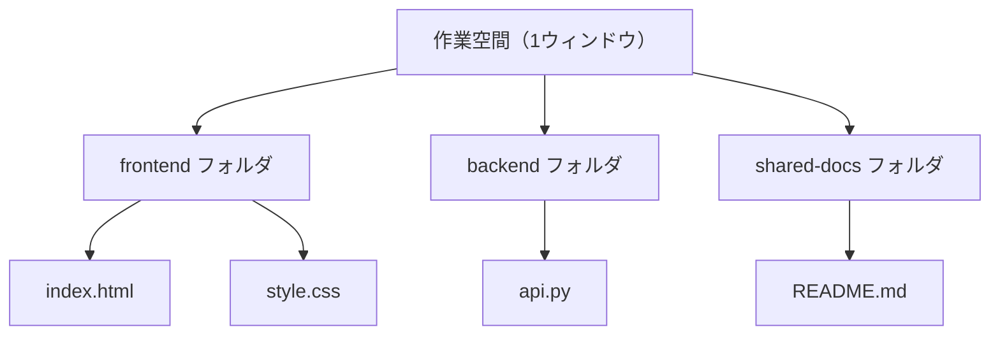
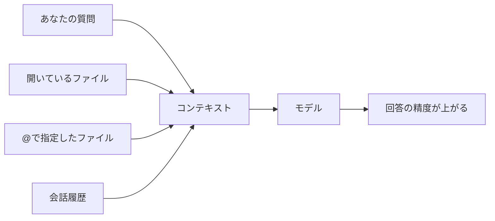
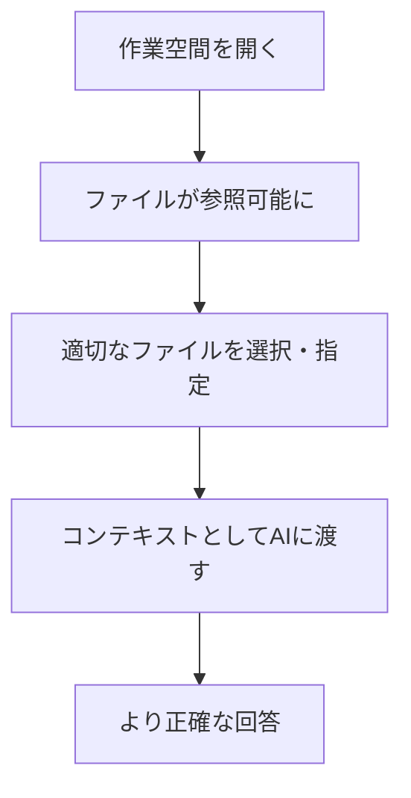

# 作業空間とコンテキストの活用

## はじめに

Cursorで効率的に作業するには、「作業空間」と「コンテキスト」という2つの概念を理解しておくことが大切です。作業空間は「どこで作業しているか」、コンテキストは「AIが何を参照して答えているか」を表します。この章では、これらの概念と、効果的な使い方を解説します。

## 📊 この章の重要度：🟡 推奨

**AIの回答精度を高めるために：**
- コンテキストを正しく渡すことで、より的確な回答が得られる
- 作業空間の考え方で、複数プロジェクトの切り替えがスムーズになる
- 習得目安：AIチャットを頻繁に使うようになってから

## あなたがこれを知ると変わること

**AI活用の変化：**
- 以前：「このコードを説明して」→ どのファイルか曖昧で、AIが的外れな回答をすることがある
- 今後：「このファイルを選択した状態で説明して」→ 正確な説明が得られる

**作業効率の変化：**
- 以前：「関連する3つのプロジェクトを別々に開き直している」
- 今後：「ワークスペースにまとめて開き、一つの画面で切り替える」

**理解の変化：**
- 以前：「AIが全部知ってるはず」
- 今後：「AIには、渡したコンテキストの範囲で考えてもらう」と意識できる

## 作業空間とは何か

### 定義

**作業空間**とは、**Cursorのウィンドウで現在開いている「作業の場」**のことです。多くの場合、それは「開いているフォルダ（プロジェクト）」または「複数のフォルダをまとめたワークスペース」に対応します。

### ワークスペースの種類

#### 1. 単一フォルダ

一つのフォルダを開いた状態です。最も基本的な作業空間です。

```
開いているもの：C:\projects\my-website
→ このフォルダ内のファイルが左のツリーに表示される
```

#### 2. マルチルートワークスペース

複数のフォルダを一つのウィンドウにまとめて開いた状態です。関連する複数プロジェクトを同時に扱いたいときに便利です。

```
開いているもの：
- C:\projects\frontend
- C:\projects\backend
- C:\projects\shared-docs
→ 3つが一つのツリーに並んで表示される
```



### 作業空間を意識するメリット

- **検索範囲が明確**：プロジェクト内検索をしたとき、作業空間内のファイルだけが対象になる
- **AIのコンテキスト**：開いているファイルやフォルダが、AIに渡す情報の候補になる
- **切り替えの簡素化**：作業が終わったらフォルダを閉じ、次のプロジェクトのフォルダを開けば、スッキリと切り替えられる

## コンテキストとは何か

### 定義

**コンテキスト**とは、**AIモデルが回答を生成する際に「参照する情報」**のことです。コンテキストに含まれるものの例は以下の通りです。

- **あなたが入力したメッセージ**（質問・指示）
- **明示的に添付・選択したファイル**の内容
- **現在開いているファイル**の内容（設定によっては自動で含まれることがある）
- **会話の履歴**（直前の質問と回答）
- **@で参照したファイル・フォルダ**（Cursorの機能）

モデルは、これらを「手がかり」として読み、それに基づいて回答を組み立てます。

### なぜコンテキストが重要なのか

AIモデルは、**渡された情報の範囲内で考える**だけで、あなたのPC内のすべてのファイルに自由にアクセスできるわけではありません。

- コンテキストが不足していると、推測で答えるため、不正確になったり、関係のない回答になったりすることがある
- 適切なファイルやコードをコンテキストに含めると、その内容に基づいた正確な回答が得られやすい



### コンテキストの渡し方（Cursorでの例）

| 方法 | 説明 |
|------|------|
| **コードを選択してから質問** | 説明してほしい部分を選択し、その状態でチャットで質問する。選択したコードがコンテキストに含まれる。 |
| **@でファイルを指定** | チャット入力欄で `@` と入力し、ファイル名を選択する。そのファイルの内容がコンテキストに含まれる。 |
| **@でフォルダを指定** | `@フォルダ名` のように指定すると、そのフォルダ内のファイルを参照対象にできる（製品のバージョンによる）。 |
| **関連ファイルを開いたまま質問** | 関連するファイルをタブで開いておくと、コンテキストとして使われる場合がある。 |

### コンテキストの「大きさ」の制限

モデルには**入力できる情報量の上限**（トークン数）があります。コンテキストが多すぎると、一部が省略されたり、重要な部分が省かれたりすることがあります。

- 必要最小限のファイルだけを指定する
- 長いファイルなら、**関係する部分だけを選択**して渡す

といった工夫をすると、効果的です。

## 作業空間とコンテキストの関係

### 作業空間がコンテキストの土台になる

作業空間（開いているフォルダ）は、**どのファイルが「参照可能か」の範囲**を決めます。

- プロジェクトを開いていないと、その中のファイルを `@` で指定したり、開いたりすることは難しい
- プロジェクトを開く → ファイルツリーに表示される → 検索・開く・AIに渡す、という流れが可能になる



### 実践の流れ

1. **作業空間を整える**：今から作業するプロジェクトのフォルダを開く
2. **関連ファイルを開く**：作業対象のファイルをタブで開く
3. **コンテキストを明示する**：説明してほしい部分を選択する、または `@ファイル名` で指定する
4. **質問する**：「この部分は何をしていますか？」「この処理を〇〇に変更して」など、具体的に伝える

## 効果的なコンテキストの渡し方

### 具体例

**悪い例：**
```
「このコードを説明して」
```
→ どのコードか不明。モデルは推測で答えることになる。

**良い例：**
```
（説明してほしいコードをマウスで選択した状態で）
「この関数は何をしていますか？また、エラーハンドリングは適切ですか？」
```
→ 選択したコードがコンテキストに含まれるため、的確な説明が得られやすい。

**さらに良い例：**
```
@utils/helper.py の validate_email 関数について、
このプロジェクトでどのように使われているか教えて
```
→ 特定のファイルと関数を指定し、使い方まで質問している。

### コンテキストに含めると効果的なもの

| 場面 | 含めると良いもの |
|------|------------------|
| コードの説明 | 該当するコード（選択範囲）、そのファイル全体 |
| エラー修正 | エラーメッセージ、該当するコード、関連する設定ファイル |
| 機能追加 | 既存の類似処理があるファイル、API仕様や要件 |
| リファクタリング | 変更対象のファイル、関連するテストや呼び出し元 |

## まとめ

### この章で学んだこと

1. **作業空間**：Cursorのウィンドウで開いているフォルダ（プロジェクト）またはワークスペース。作業の「場」を表す。
2. **コンテキスト**：AIが回答を考えるときの「参照情報」。質問文、選択したコード、@で指定したファイルなど。
3. 作業空間をきちんと開くことで、参照したいファイルにアクセスしやすくなる。
4. コンテキストを適切に渡すことで、AIの回答の精度と有用性が大きく向上する。
5. コードを選択する、`@` でファイルを指定する、などの方法で、意図した情報をコンテキストに含められる。

### 実践のヒント

- **プロジェクトを開いてから質問する**：関連ファイルが見える状態にする。
- **説明してほしい部分は選択する**：曖昧な指定より、選択による明示が効果的。
- **長い内容は要点だけ渡す**：不要な部分が多いと、重要な情報が省かれることがある。
- **エラーは全文貼る**：エラーメッセージは省略せず、そのままコンテキストに含める。

### 次のステップ

Cursor入門の学習は以上です。次は `docs/01_コンピューター基礎知識/` や `tutorials/` に進み、Webの仕組みや実践的な開発の流れを学んでいきましょう。
