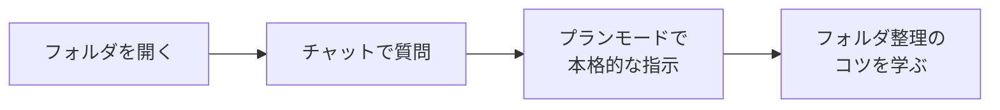
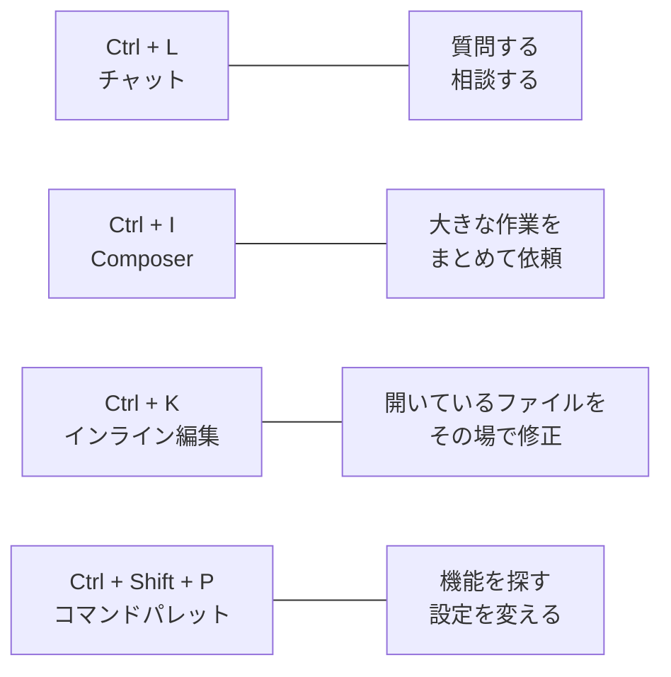
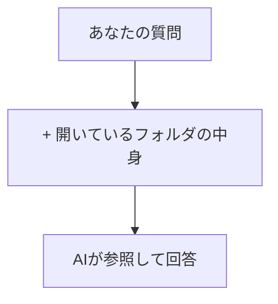

# マーケター向け Cursor ワークショップ（30分）

## ワークショップ概要

| 項目 | 内容 |
|------|------|
| **対象者** | 非エンジニアのマーケティング担当者 |
| **所要時間** | 30分 |
| **前提** | Cursorがインストール済み・ログイン済み |
| **目標** | Cursorの「プランモード」を使って、マーケティング業務に役立つ指示を出せるようになる |
| **進行スタイル** | 説明は最小限、手を動かすハンズオン中心 |

---

## タイムテーブル

| 時間 | パート | 内容 |
|------|--------|------|
| 0:00–3:00 | 1. オープニング | Cursorとは？一言紹介＋本日のゴール |
| 3:00–8:00 | 2. まず触ってみよう | フォルダを開く → チャットを開く → 最初の質問 |
| 8:00–18:00 | 3. プランモードで体験 | 市場調査・競合分析の実践プロンプト |
| 18:00–23:00 | 4. フォルダ分けのコツ | プロジェクトとコンテキストの考え方 |
| 23:00–28:00 | 5. 明日から使えるプロンプト集 | マーケター向け厳選プロンプト例 |
| 28:00–30:00 | 6. まとめ＆次のステップ | 振り返りと自習リソースの案内 |

---

## パート1：オープニング（3分）

### スライド 1-1：本日のゴール

> **30分後、あなたは「AIに仕事を手伝わせる」感覚をつかんでいます。**

- 今日は技術的な話をしません
- Cursorを「マーケターの新しい相棒」として使う体験をします
- プログラミング経験ゼロでOK

### スライド 1-2：Cursorって何？（一言で）

> **Cursor = AIが中に住んでいるテキストエディタ**

| 普段使っているもの | Cursorでできること |
|--------------------|--------------------|
| Googleで検索して手動でまとめる | AIが検索→要約→レポートまで作る |
| Excelでデータを手作業で整理 | AIにCSV処理を丸ごと依頼できる |
| ChatGPTにコピペで相談 | ファイルを見ながらAIと対話できる |

**ChatGPTとの最大の違い：**
- ChatGPT → ブラウザの中で完結（コピペが必要）
- Cursor → あなたのPC上のファイルを直接扱える（コピペ不要）

### スライド 1-3：今日やること



---

## パート2：まず触ってみよう（5分）

### スライド 2-1：フォルダを開く（ハンズオン）

**【やること】**

1. Cursorを起動する
2. **ファイル → フォルダを開く** をクリック
3. デスクトップに `cursor-workshop` というフォルダを新規作成して選択
4. 左側にフォルダ名が表示されたら成功

> ポイント：Cursorは「フォルダ = 仕事の単位」として認識します。
> あとで説明しますが、このフォルダの開き方が**AIの賢さを左右**します。

### スライド 2-2：チャットを開く

**【やること】**

1. 画面右側のチャットアイコンをクリック（または `Ctrl + L`）
2. チャット欄が開く

> これがAIとの対話窓口です。ここに日本語で指示を書きます。

### スライド 2-3：最初の質問をしてみよう

**【やること】** 下の文をそのままコピーしてチャットに貼り付け、送信してください。

```
私はマーケティング担当者です。
Cursorを使って業務を効率化したいのですが、
マーケターにとって便利な使い方を3つ教えてください。
```

> AIが回答してくれます。内容はモデルによって異なりますが、
> **「日本語で指示を出すだけで回答が返ってくる」** ことを体感してください。

### スライド 2-4：覚えておきたいショートカット＆便利機能

まずはこの4つだけ覚えてください。全部キーボードから呼び出せます。

| ショートカット | 機能名 | 何ができるか |
|----------------|--------|-------------|
| `Ctrl + L` | **チャットを開く** | 右側にAIチャット欄が開く。一番よく使う基本操作 |
| `Ctrl + I` | **Composer（コンポーザー）を開く** | 複数ファイルをまたいだ大きな作業を依頼するウィンドウ |
| `Ctrl + K` | **インライン編集** | ファイルを開いた状態で、その場でAIに書き換えを依頼 |
| `Ctrl + Shift + P` | **コマンドパレット** | Cursorの全機能を名前で検索して呼び出せる万能メニュー |



**それぞれの使いどころ（マーケター向け）：**

**Ctrl + L（チャット）— 日常の相談相手**
- 「このレポートの表現をもっと分かりやすくして」
- 「この数字の意味を教えて」
- 今開いているファイルについてすぐ聞ける

**Ctrl + I（Composer）— 大きい仕事を丸ごと依頼**
- 「調査結果を3つのファイルに分けてまとめて」
- 「フォルダ構成ごと提案して」
- 複数ファイルを同時に作成・編集するときに便利

**Ctrl + K（インライン編集）— ピンポイント修正**
- レポートの特定の段落を選択 → `Ctrl + K` → 「もっと簡潔にして」
- 表の一部を選択 → `Ctrl + K` → 「列を追加して」
- ファイルを開いたまま、その場で書き換えてくれる

**Ctrl + Shift + P（コマンドパレット）— 困ったときの救世主**
- 「theme」と打てばテーマ（見た目）の変更ができる
- 「markdown preview」と打てばmdファイルのプレビュー表示
- 機能の名前がうろ覚えでも、キーワードで探せる

### スライド 2-5：新しい会話を始める・やり直す

AIとの会話がうまくいかないとき、**新しいチャットを始める**のがコツです。

**【やり方】**
- チャット欄の上部にある **＋（新規チャット）ボタン** をクリック
- または `Ctrl + L` で新しいチャットを開始

**なぜ新規チャットが有効か：**
- 前の会話の文脈が残っていると、AIが混乱することがある
- テーマが変わったら新しいチャットで仕切り直すのがベストプラクティス
- 「会話 = 1つの仕事の単位」と考えるとスッキリする

> **チャットの履歴は残るので、前の会話に戻って確認することもできます。**

---

## パート3：プランモードで体験しよう（10分）

### スライド 3-1：プランモードとは？

> **プランモード = AIに「まず計画を立ててもらう」モード**

通常のチャットとの違い：

| モード | 動き方 |
|--------|--------|
| 通常モード（Ask） | AIに質問すると、すぐに回答が返ってくる |
| **プランモード** | AIがまず「こういう手順でやります」と計画を提示 → あなたが承認 → 実行 |

**なぜプランモードが良いのか：**
- いきなり実行されないので**安心**
- 計画を見て「やっぱりこう変えて」と**修正指示**が出せる
- やりたいことの**全体像を把握**してから進められる

### スライド 3-2：プランモードへの切り替え方

**【やること】**

1. チャット欄の入力ボックス付近にあるモード切り替えを確認
2. **「Ask」** から **「Agent」** に切り替える
   - Agent内でプランモード的に使うには、プロンプトに「まず計画を立ててから実行して」と書く方法が有効です

> 補足：Cursorのバージョンにより、UI上の表記が異なる場合があります。
> 「Agent」モードで「まず計画を見せて」と指示する方法が最も汎用的です。

### スライド 3-3：実践プロンプト① 市場調査レポート

**【やること】** 以下をチャットに入力して送信してください。

```
あなたはマーケティングリサーチャーです。
以下の条件で市場調査レポートを作成してください。

■ テーマ：日本の健康食品市場の最新トレンド
■ 出力形式：Markdownファイル（market_research.md）
■ 含めてほしい内容：
  - 市場規模と成長率
  - 主要プレイヤー（企業名と特徴）
  - 消費者トレンド（3つ以上）
  - 今後の予測

@Web で最新情報を調べてから作成してください。
まず作成計画を見せてください。実行は承認後にお願いします。
```

**【注目ポイント】**
- `@Web` と書くと、AIがインターネット検索をして最新情報を取得します
- 「まず計画を見せて」と書くことで、いきなり実行されません
- AIが計画を提示したら、内容を確認してから「お願いします」と承認します

> **インパクト：普段は数時間かかるリサーチが、数分でレポートのたたき台になります**

### スライド 3-4：実践プロンプト② 競合分析

**【やること】** 続けて以下を試してみましょう。

```
競合分析レポートを作成してください。

■ 対象企業：[ここに自社の競合企業名を2〜3社入れてください]
■ 比較軸：
  - 製品/サービスの特徴
  - 価格帯
  - ターゲット顧客
  - マーケティング戦略の特徴
  - 強みと弱み

■ 出力形式：competitor_analysis.md
■ 表形式で比較し、最後にまとめと示唆を書いてください。

@Web で各社の最新情報を調べてください。
まず調査計画を提示してから実行してください。
```

> 自社の競合を入れるとリアリティが増します。
> 「ワークショップ用のサンプル」として架空の企業名でもOKです。

### スライド 3-5：実践プロンプト③ CSVデータ分析（デモ）

> この例は、発表者がデモとして見せるか、環境が整っている場合にハンズオンとして実施します。

```
以下のサンプル売上データをCSVファイルとして作成し、分析してください。

■ サンプルデータの条件：
  - 列：日付, 商品名, カテゴリ, 売上金額, 販売数
  - 期間：2025年1月〜3月
  - 商品数：5種類
  - 30行程度のダミーデータ

■ 分析内容：
  - 月別売上推移
  - 商品別売上ランキング
  - カテゴリ別の売上構成比

■ 出力：
  - sales_data.csv（サンプルデータ）
  - sales_analysis.md（分析レポート）

まず計画を見せてから実行してください。
```

**【注目ポイント】**
- AIがサンプルデータの作成 → 分析コード生成 → 実行 → レポート作成まで一気通貫で行う
- Excelでの手作業が、自然言語の指示だけで完結する体験

---

## パート4：フォルダ分けのコツ（5分）

### スライド 4-1：なぜフォルダの分け方が大事なのか

> **CursorのAIは「今開いているフォルダの中身」を見て回答します**



- フォルダの中身 = AIへの「背景情報（コンテキスト）」
- **関係ないファイルが混ざっていると、AIが混乱する**
- **必要なファイルがフォルダ外にあると、AIが参照できない**

> つまり：**フォルダの整理 = AIの頭の整理**

### スライド 4-2：マーケター向け フォルダ構成の例

```
marketing-workspace/          ← これをCursorで開く
├── 01_市場調査/
│   ├── 健康食品市場_2025.md
│   ├── 競合分析_A社B社.md
│   └── 消費者トレンド.md
├── 02_キャンペーン企画/
│   ├── 夏キャンペーン_概要.md
│   └── 予算案.md
├── 03_データ分析/
│   ├── sales_data.csv
│   ├── analysis_script.py
│   └── 月次レポート_3月.md
├── 04_議事録/
│   ├── 定例MTG_0301.md
│   └── 定例MTG_0308.md
└── README.md                 ← このフォルダの説明
```

### スライド 4-3：フォルダ分けの3つのルール

| ルール | 理由 |
|--------|------|
| **1案件（テーマ）= 1フォルダ** | AIが「この仕事に関係するファイル」だけを参照できる |
| **番号をつけて整理** | `01_`, `02_` のように接頭辞をつけると順番が明確に |
| **README.md を置く** | フォルダの目的をAIに伝える「名札」になる |

### スライド 4-4：@ の全体像 — AIに「これを見て」と伝える方法

チャット入力欄で **`@`** と打つと、候補の一覧が表示されます。
これがCursorの最大の武器です。「何を参照して考えるか」をあなたがコントロールできます。

| @コマンド | 何が起こるか | マーケターの使いどころ |
|-----------|-------------|----------------------|
| `@ファイル名` | そのファイルの中身をAIに渡す | 特定のレポートやメモを見せて質問 |
| `@フォルダ名` | フォルダ内の全ファイルをAIに渡す | 調査資料一式をまとめて渡す |
| `@Web` | AIがインターネット検索してから回答 | 最新の市場動向・ニュースの調査 |
| `@Docs` | 指定したドキュメントサイトを検索 | ツールのヘルプや仕様を調べる |
| `@Git` | Gitの変更履歴を参照 | 「前回何を変更したか」の確認 |
| `@Codebase` | プロジェクト全体から関連箇所を検索 | 大きいフォルダ内から必要な情報を探す |

### スライド 4-5：@ファイル — CSVやメモを読み込ませる

**CSVファイルを渡して分析してもらう例：**

```
@sales_data.csv このCSVデータを分析して、以下を教えてください。

- 売上が最も高い商品はどれか
- 月ごとの売上推移
- 売上が低迷している商品とその原因の仮説

結果を sales_summary.md にまとめてください。
```

**会議メモを渡して整理してもらう例：**

```
@会議メモ_0305.md この会議メモを以下の形式に整理してください。

- 決定事項（箇条書き）
- 各自のTODO（担当者・期限つき）
- 次回会議までに確認が必要な事項
```

**議事録テキストを渡して要約する例：**

```
@議事録_マーケ定例.md この議事録を3行で要約してください。
また、マーケチームに関係するアクションアイテムだけ抜き出してください。
```

> **ポイント：** ファイルをフォルダ内に置いておけば、`@` で名前を打つだけで渡せます。
> コピペ不要。ChatGPTとの最大の違いはここです。

### スライド 4-6：@フォルダ — 資料一式をまとめてAIに渡す

**フォルダ指定が便利な場面：**

「関連するファイルが複数あるけど、1つずつ指定するのは面倒」というとき、
**フォルダごと渡す**ことで、AIがフォルダ内の全ファイルを参照して回答します。

```
@01_市場調査 このフォルダ内の調査資料すべてを踏まえて、
健康食品市場に参入する場合のリスクと機会を整理してください。
SWOT分析の形式でお願いします。
```

**複数のCSVを一括で分析する例：**

```
@03_データ分析 このフォルダに入っている全CSVファイルを読み込み、
以下を横断的に分析してください。

- 全期間を通じた売上トレンド
- 商品カテゴリ別の成長率
- 注目すべき異常値や変化点

分析レポートを quarterly_report.md として出力してください。
```

**@ファイルと@フォルダの使い分け：**

| やりたいこと | 使うべき@指定 |
|-------------|--------------|
| 1つのCSVを分析したい | `@sales_data.csv` |
| 特定のメモについて質問したい | `@会議メモ_0305.md` |
| 調査資料一式をまとめて渡したい | `@01_市場調査` |
| 複数CSVを横断分析したい | `@03_データ分析` |
| 最新のWeb情報が必要 | `@Web` |

> **フォルダ構成がそのまま「AIへの指示の単位」になるので、前のスライドで紹介したフォルダ分けが効いてきます。**

---

## パート5：明日から使えるプロンプト集（5分）

### スライド 5-1：マーケター向け 厳選プロンプト10選

#### リサーチ系

**1. トレンド調査**
```
@Web [業界名]の2025-2026年の主要トレンドを5つ挙げ、
それぞれビジネスへの影響を一言で説明してください。
結果はtrend_report.mdとして保存してください。
```

**2. 競合のSNS戦略分析**
```
@Web [競合企業名]のSNSマーケティング戦略について調査し、
以下の観点でまとめてください：
- 使用しているSNSプラットフォーム
- 投稿の特徴やトーン
- エンゲージメントの傾向
- 自社が参考にできるポイント
```

**3. ペルソナ作成**
```
以下の条件でマーケティングペルソナを3パターン作成してください。

■ 商品：[商品名・サービス名]
■ ターゲット層：[年齢層・性別・職業など]

各ペルソナに以下を含めてください：
- 名前、年齢、職業、年収
- 課題・悩み
- 情報収集の方法
- 購買決定の基準
- 響くメッセージ例

persona.md として保存してください。
```

#### コンテンツ・企画系

**4. メルマガの件名案**
```
以下の内容でメールマガジンの件名を10パターン考えてください。

■ テーマ：[キャンペーン内容]
■ ターゲット：[対象顧客]
■ トーン：[緊急感/親しみやすさ/高級感 など]

開封率が高そうな順にランキングし、理由も添えてください。
```

**5. LP（ランディングページ）構成案**
```
以下のサービスのLP構成案を作成してください。

■ サービス名：[サービス名]
■ ターゲット：[対象顧客]
■ 訴求ポイント：[USP・強み]

含めるセクション：
- ファーストビュー（キャッチコピー案3つ）
- 課題提起
- 解決策の提示
- 機能・特徴
- お客様の声（想定）
- 料金プラン
- CTA

lp_structure.md として保存してください。
```

#### データ・レポート系

**6. 会議メモの整理**
```
@meeting_memo.md この会議メモを以下の形式で整理してください。

■ 形式：
  - 日時・参加者
  - 議題ごとの要約（箇条書き）
  - 決定事項
  - 次回までのTODO（担当者・期限付き）
```

**7. 月次レポートのたたき台**
```
以下の情報をもとに、マーケティング月次レポートのたたき台を作成してください。

■ 期間：[対象月]
■ 主なKPI：
  - PV数：[数値]
  - CV数：[数値]
  - CVR：[数値]%
  - 広告費：[数値]円
  - CPA：[数値]円

■ 含めてほしい内容：
  - 前月比の増減と要因分析
  - 良かった施策と改善が必要な施策
  - 来月のアクションプラン案

monthly_report.md として出力してください。
```

#### 業務効率化系

**8. 英語記事の要約・翻訳**
```
@article.md この英語記事を日本語で要約してください。

■ 要約の条件：
  - 3〜5行の要約
  - マーケター視点で重要なポイントを強調
  - 原文のURLがあれば保持
```

**9. SWOT分析の作成**
```
以下の情報をもとにSWOT分析を作成してください。

■ 対象：[自社サービス名]
■ 業界：[業界名]

表形式で整理し、各項目に2〜3つの具体的なポイントを挙げてください。
最後に、SO戦略（強み×機会）の具体案を1つ提案してください。

swot_analysis.md として保存してください。
```

**10. タスク整理・優先順位付け**
```
以下のタスクリストを、緊急度と重要度のマトリクスで整理してください。

[ここにタスクを箇条書きで列挙]

それぞれのタスクに推定所要時間と優先順位をつけ、
今週やるべきことのTOP3を提案してください。
```

---

## パート6：まとめ＆次のステップ（2分）

### スライド 6-1：今日のふりかえり

| 学んだこと | ポイント |
|------------|----------|
| Cursorの基本 | AIが中に住んでいるテキストエディタ |
| 4つのショートカット | `Ctrl+L` チャット / `Ctrl+I` Composer / `Ctrl+K` インライン編集 / `Ctrl+Shift+P` コマンドパレット |
| プランモード | まず計画を立てさせる → 確認 → 実行 |
| @ファイル / @フォルダ | CSV・メモ・資料一式をAIに渡して分析・整理できる |
| フォルダ分け | 1テーマ = 1フォルダ → そのまま@フォルダで渡す単位になる |
| プロンプトの書き方 | 具体的な条件＋出力形式を指定すると精度UP |

### スライド 6-2：明日からやってみよう

1. **デスクトップにフォルダを作って、Cursorで開く**
   - まずは「自分の仕事用フォルダ」を1つ作るところから
2. **毎日1つ、AIに何か頼んでみる**
   - 完璧な指示でなくてOK。まず使ってみることが大事
3. **うまくいかなかったら「もう少し具体的にして」と追加で伝える**
   - AIとの対話はキャッチボール。1回で完璧を目指さない

### スライド 6-3：自習リソース

| リソース | 内容 |
|----------|------|
| `cursor-tutorial/` フォルダ | テキストエディタの基本から丁寧に解説 |
| `03_プロジェクトとフォルダ入門.md` | フォルダの詳しい説明 |
| `05_Cursorのモデルとエディタ.md` | AIモデルの仕組みを理解したい方向け |
| `07_作業空間とコンテキストの活用.md` | @の使い方やコンテキストの詳細 |

---

## 発表者向けメモ

### 事前準備チェックリスト

- [ ] 参加者のPCにCursorがインストール・ログイン済みであることを確認
- [ ] ネットワーク接続の確認（AI機能・Web検索に必要）
- [ ] デモ用のフォルダを事前に準備しておく（市場調査の回答例など）
- [ ] Cursorのモデル設定が適切か確認（Claude推奨）
- [ ] AIの応答が遅い場合のバックアッププランを用意（スクリーンショットなど）

### 進行上の注意

- **パート3が最も重要**：ここで「おお！」という体験をしてもらうことが成功のカギ
- AIの回答には数十秒〜1分かかることがある。待っている間に補足説明を入れる
- 参加者のAIが同じ回答を返すとは限らない。「人によって違うのは正常です」と伝える
- 環境構築（Python等）が必要なデモは、発表者が事前にセットアップしておく
- プランモードの説明は「承認してから動く」点を強調すると安心感が生まれる

### よくある質問への回答案

| 質問 | 回答 |
|------|------|
| 「これ無料で使えるの？」 | 無料プランあり。使用量に上限がありますが、まずは無料で始められます |
| 「ChatGPTと何が違うの？」 | PCのファイルを直接扱える点が最大の違い。@でファイルを指定すればコピペ不要で、ファイル作成までAIが行います |
| 「機密情報を入れて大丈夫？」 | 社内のセキュリティポリシーに従ってください。プライバシーモード設定もあります |
| 「英語しか使えないの？」 | 日本語で指示を出せば、日本語で回答します |
| 「プログラミングできないけど使える？」 | 今日体験した通り、日本語の指示だけで使えます。コードはAIが書きます |
| 「Excelファイルも読めるの？」 | .xlsxは直接読めません。CSVに変換して保存すれば@で指定して分析できます。AIに「このExcelをCSVに変換する方法を教えて」と聞くのも手です |
| 「@を打ってもファイルが出てこない」 | フォルダをCursorで開いていることを確認してください。フォルダ外のファイルは候補に出ません |
| 「ショートカットを忘れた」 | `Ctrl + Shift + P` でコマンドパレットを開けば、機能名で検索できます。これだけ覚えれば大丈夫です |
| 「Ctrl+KとCtrl+Lの違いは？」 | Ctrl+L はチャット欄で相談、Ctrl+K は開いているファイルをその場で書き換え依頼。日常の相談はL、ピンポイント修正はK |

---

## 付録：初心者向けクイックリファレンスカード

ワークショップ後に手元に置いておける一覧です。印刷して配布すると効果的です。

### ショートカット一覧

| ショートカット | 機能 | 用途 |
|----------------|------|------|
| `Ctrl + L` | チャットを開く | AIに質問・相談 |
| `Ctrl + I` | Composerを開く | 複数ファイルにまたがる大きな作業を依頼 |
| `Ctrl + K` | インライン編集 | 開いているファイルのその場で修正を依頼 |
| `Ctrl + Shift + P` | コマンドパレット | 全機能をキーワード検索で呼び出す |
| `Ctrl + S` | ファイルを保存 | 編集内容の保存（AIが作成したファイルも手動保存推奨） |
| `Ctrl + Z` | 元に戻す | AIの変更を取り消したいときにも使える |
| `Ctrl + Shift + K` | 行を削除 | カーソルがある行をまるごと削除 |
| `Ctrl + /` | コメントのON/OFF | メモ書きとして一時的に行を無効にする |
| `Ctrl + B` | サイドバーの表示切替 | ファイルツリーの表示/非表示を切り替え |
| `Ctrl + J` | ターミナルの表示切替 | 下部のターミナル（黒い画面）の表示/非表示 |

### @コマンド一覧

| @コマンド | 効果 | 使用例 |
|-----------|------|--------|
| `@ファイル名` | 指定ファイルの内容をAIに渡す | `@sales.csv このデータを分析して` |
| `@フォルダ名` | フォルダ内の全ファイルをAIに渡す | `@01_市場調査 この資料をもとにSWOT分析して` |
| `@Web` | AIがWeb検索してから回答 | `@Web 健康食品市場の最新トレンド` |
| `@Docs` | ドキュメントサイトを検索 | `@Docs Googleアナリティクスの設定方法` |
| `@Codebase` | プロジェクト全体から関連箇所を検索 | `@Codebase 売上に関するファイルを探して` |
| `@Git` | Gitの変更履歴を参照 | `@Git 前回の変更内容を教えて` |

### プロンプトの型（テンプレート）

**基本の型：**

```
[役割] あなたは〇〇の専門家です。
[指示] 〜〜してください。
[条件] ■ 形式：Markdown / ■ 対象：〇〇 / ■ 含める内容：〜〜
[参照] @ファイル名 or @フォルダ名 or @Web
[出力] 〇〇.md として保存してください。
[計画] まず計画を見せてから実行してください。
```
