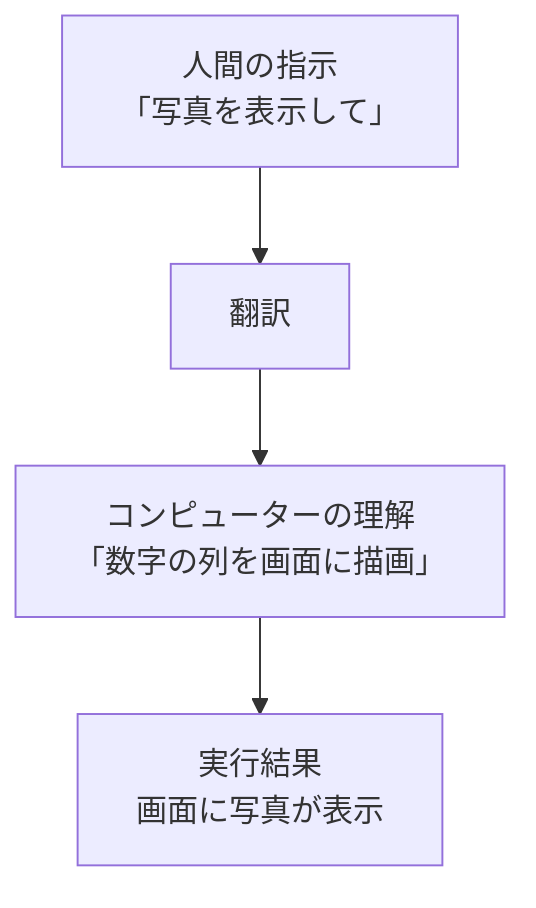
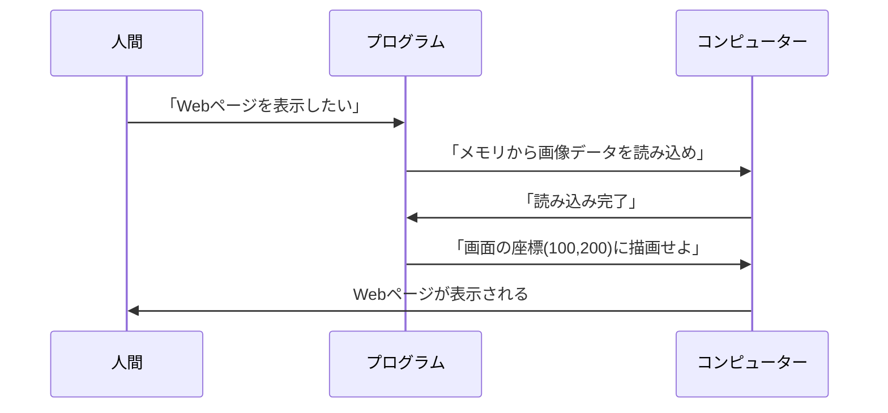

# コンピューターとプログラムの関係

## はじめに

コンピューターは私たちの指示を理解して実行してくれる便利な道具です。しかし、コンピューターは人間の言葉をそのまま理解することはできません。まるで外国の人と話すときに通訳が必要なように、コンピューターとの間には「翻訳者」が必要です。その翻訳者の役割を果たすのが**プログラム**です。

この章では、コンピューターがどのように私たちの指示を理解し、なぜプログラムが必要なのかを学びます。

## あなたがこれを知ると変わること

**会議での変化：**
- 開発者：「この機能は技術的に難しいです」
- あなた（修得前）：「...（よくわからない）」
- あなた（修得後）：「どの部分が難しいのですか？データの処理？画面の表示？」

**企画での変化：**
- 以前：「なんとなくこんな感じで...」という曖昧な要求
- 今後：「ユーザーがボタンを押したら○○の処理をして、△△を表示する」という具体的な要求

**問題発生時の変化：**
- 以前：「動かないので直してください」
- 今後：「フォーム送信後のメッセージ表示に問題があるようです」

## コンピューターの「頭の中」

### コンピューターは計算機

コンピューターという名前は「計算する人」という意味の英語から来ています。実際、コンピューターの中では全てが数字の計算として処理されています。

- 文字も数字に変換される（例：「A」は65番）
- 画像も小さな点の色情報を数字で表現
- 音楽も音の波を数字の列で記録



### バイナリ：コンピューターの母国語

コンピューターは電気で動いているため、「電気が流れている（1）」か「流れていない（0）」の2つの状態しか理解できません。この2つの数字だけを使った言語を**バイナリ**（二進法）と呼びます。

例えば、私たちが使う数字の「5」は、コンピューター内部では「101」として処理されています。

**Windowsでの実例：**
あなたがWindowsでWordファイルを開くとき、実際にはWordが「01010100101...」という長い数字の列を読み取り、それを文字や画像として画面に表示しています。拡張子「.docx」は、「この数字の列をWordの形式で解釈してください」という目印なのです。

## プログラムという翻訳者

### よくある勘違い：プログラムとアプリの違い

まず、多くの人が混同しやすい概念を整理しましょう：

- **アプリ**：私たちが使う完成品（LINE、Excel、Chrome など）
- **プログラム**：アプリを作るための設計図や指示書
- 1つのアプリには何千、何万ものプログラムが含まれています

例えば、LINEアプリの中には「メッセージを送信するプログラム」「写真を表示するプログラム」「通知音を鳴らすプログラム」など、数え切れないほどのプログラムが組み合わさっています。

### プログラムの役割

プログラムは、人間の「やりたいこと」をコンピューターが理解できる形に翻訳する役割を持っています。まるで料理のレシピのように、「何を」「どの順番で」「どのように」するかを詳しく書いた指示書です。



### なぜ詳細な指示が必要？

コンピューターは非常に正確ですが、逆に言えば「察する」ことができません。人間なら「コーヒーを入れて」と言えば理解してくれますが、コンピューターには以下のような詳細な指示が必要です：

1. コーヒー豆の場所を確認する
2. 必要な分量を測る
3. お湯を沸かす
4. フィルターにセットする
5. お湯を注ぐ
6. 抽出が完了するまで待つ

## Webディレクターにとってのプログラミング知識

### なぜ知識が必要？

Webディレクターとしてプログラミングを理解することで、以下のメリットがあります：

- **実現可能性の判断**：「この機能は技術的に可能？」「どれくらい時間がかかる？」
- **開発者との円滑なコミュニケーション**：専門用語を理解し、具体的な要求を伝えられる
- **問題解決能力の向上**：バグや問題が起きたときの原因を推測できる

### 完璧な理解は不要

重要なのは、プログラムを自分で書けることではありません。**プログラムがどのような考え方で作られているか**を理解することです。

これは、車の運転に例えるとわかりやすいでしょう：
- エンジンの詳細な仕組みを知らなくても運転はできる
- しかし、「エンジンをかける」「ギアを変える」という基本的な概念は必要
- 故障したときも、音や症状から大まかな原因を推測できる

## 身近な例：お問い合わせフォーム

あなたがWebサイトで「送信」ボタンを押すとき、裏ではこのような処理が行われています：

### 処理の流れ
1. **入力内容をチェック**（メールアドレスの形式は正しい？必須項目は入力済み？）
2. **サーバーにデータを送信**（WindowsのPCから会社のサーバーへ）
3. **結果をユーザーに表示**（「送信完了」または「エラー」メッセージ）

### 実際のプログラム例

以下は、お問い合わせフォームの送信処理を簡略化したプログラムです：

```javascript
// 送信ボタンがクリックされたときの処理
document.getElementById('submitButton').onclick = function() {
    // 1. メールアドレスの形式をチェック
    var email = document.getElementById('email').value;
    if (!email.includes('@')) {
        alert('正しいメールアドレスを入力してください');
        return;
    }
    
    // 2. サーバーにデータを送信
    // 3. 完了メッセージを表示
    alert('お問い合わせを受け付けました');
};
```

**解説：**
- 2行目：「submitButton」という名前の送信ボタンを探す
- 4-8行目：メールアドレスに「@」が含まれているかチェック
- 11-12行目：問題なければ完了メッセージを表示

このように、私たちが何気なく使っている機能の裏には、細かな処理を定義したプログラムが動いています。

## まとめ

- コンピューターは数字の計算しかできない計算機
- プログラムは人間の指示をコンピューターが理解できる形に翻訳する
- Webディレクターにとって、プログラミングの完璧な理解は不要
- 重要なのは「プログラムがどう考えているか」を理解すること
- この理解により、開発チームとの協業が円滑になる

次の章では、「ファイルとフォルダの世界」について学び、プログラムがどこに保存され、どのように整理されているかを理解していきます。 