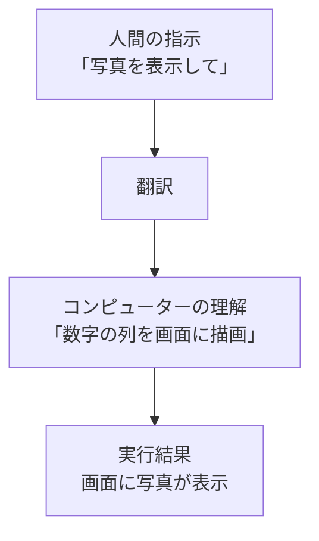
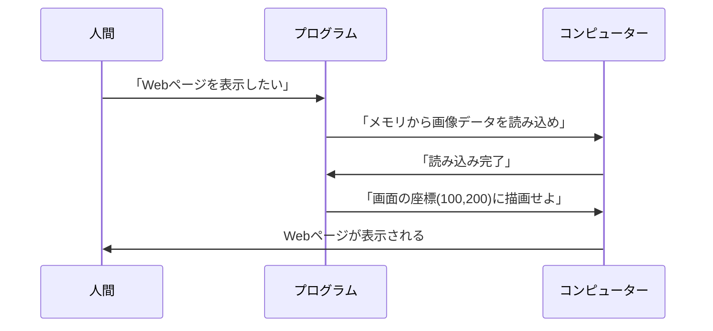

# コンピューターとプログラムの関係

## はじめに

コンピューターは私たちの指示を理解して実行してくれる便利な道具です。しかし、コンピューターは人間の言葉をそのまま理解することはできません。まるで外国の人と話すときに通訳が必要なように、コンピューターとの間には「翻訳者」が必要です。その翻訳者の役割を果たすのが**プログラム**です。

この章では、コンピューターがどのように私たちの指示を理解し、なぜプログラムが必要なのかを学びます。

## 📊 この章の重要度：🔴 必須

**Webディレクターにとって：**
- 開発者との会話で必ず出てくる基本概念
- プロジェクト進行に直接影響する知識
- 習得目安：業務開始前に必須

## あなたがこれを知ると変わること

**会議での変化：**
- 開発者：「この機能は技術的に難しいです」
- あなた（修得前）：「...（よくわからない）」
- あなた（修得後）：「どの部分が難しいのですか？データの処理？画面の表示？」

**企画での変化：**
- 以前：「なんとなくこんな感じで...」という曖昧な要求
- 今後：「ユーザーがボタンを押したら○○の処理をして、△△を表示する」という具体的な要求

**問題発生時の変化：**
- 以前：「動かないので直してください」
- 今後：「フォーム送信後のメッセージ表示に問題があるようです」

## タスク：コンピュータが実行する「お仕事」

### タスクの定義
**タスク**とは、コンピュータが実行する具体的な作業単位です。人間が「今日やること」をToDoリストに書くように、プログラムはコンピュータの「やることリスト」を詳細に定義します。

### 身近なタスクの例
- メールを送信する
- 画像のサイズを変更する
- データベースから情報を検索する
- Webページを表示する
- ユーザーの入力内容をチェックする

一つの機能（例：オンラインショッピング）も、実際は数百の小さなタスクの組み合わせです。

**Webサイトでの「商品購入」というタスクの分解例：**
1. 商品情報をデータベースから取得
2. 在庫数を確認
3. カート情報を更新
4. 送料を計算
5. 決済処理を実行
6. 確認メールを送信
7. 在庫を減算

Webディレクターとして、このような「タスクの分解」を理解することで、開発工数の見積もりや要求の具体化が可能になります。

## コンピューターの「頭の中」

### コンピューターは計算機

コンピューターという名前は「計算する人」という意味の英語から来ています。実際、コンピューターの中では全てが数字の計算として処理されています。

- 文字も数字に変換される（例：「A」は65番）
- 画像も小さな点の色情報を数字で表現
- 音楽も音の波を数字の列で記録



### バイナリ：コンピューターの母国語

コンピューターは電気で動いているため、「電気が流れている（1）」か「流れていない（0）」の2つの状態しか理解できません。この2つの数字だけを使った言語を**バイナリ**（二進法）と呼びます。

例えば、私たちが使う数字の「5」は、コンピューター内部では「101」として処理されています。

**Windowsでの実例：**
あなたがWindowsでWordファイルを開くとき、実際にはWordが「01010100101...」という長い数字の列を読み取り、それを文字や画像として画面に表示しています。拡張子「.docx」は、「この数字の列をWordの形式で解釈してください」という目印なのです。

## プログラムという翻訳者

### よくある勘違い：プログラムとアプリの違い

まず、多くの人が混同しやすい概念を整理しましょう：

- **アプリ**：私たちが使う完成品（LINE、Excel、Chrome など）
- **プログラム**：アプリを作るための設計図や指示書
- 1つのアプリには何千、何万ものプログラムが含まれています

例えば、LINEアプリの中には「メッセージを送信するプログラム」「写真を表示するプログラム」「通知音を鳴らすプログラム」など、数え切れないほどのプログラムが組み合わさっています。

### プログラムは詳細な作業指示書

プログラムとは、**コンピュータに対する詳細な作業指示書**です。人間の上司が部下に「資料を作成して」と指示するだけでは不十分なように、コンピュータには「どのファイルを」「どの順番で」「どのように処理するか」まで明確に指示する必要があります。

**人間の指示 vs プログラムの指示：**
- 人間（ディレクター）：「お問い合わせフォームで入力エラーがあったら分かりやすく表示して」
- プログラム：「入力内容をチェック → エラー箇所を特定 → エラーメッセージを作成 → 該当フィールドを赤色で強調 → メッセージを画面に表示」

プログラムは、人間の「やりたいこと」をコンピューターが理解できる形に翻訳する役割を持っています。まるで料理のレシピのように、「何を」「どの順番で」「どのように」するかを詳しく書いた指示書です。



### なぜ詳細な指示が必要？

コンピューターは非常に正確ですが、逆に言えば「察する」ことができません。人間なら「コーヒーを入れて」と言えば理解してくれますが、コンピューターには以下のような詳細な指示が必要です：

1. コーヒー豆の場所を確認する
2. 必要な分量を測る
3. お湯を沸かす
4. フィルターにセットする
5. お湯を注ぐ
6. 抽出が完了するまで待つ

## Webディレクターにとってのプログラミング知識

### なぜ知識が必要？

Webディレクターとしてプログラミングを理解することで、以下のメリットがあります：

- **実現可能性の判断**：「この機能は技術的に可能？」「どれくらい時間がかかる？」
- **開発者との円滑なコミュニケーション**：専門用語を理解し、具体的な要求を伝えられる
- **問題解決能力の向上**：バグや問題が起きたときの原因を推測できる

### 完璧な理解は不要

重要なのは、プログラムを自分で書けることではありません。**プログラムがどのような考え方で作られているか**を理解することです。

これは、車の運転に例えるとわかりやすいでしょう：
- エンジンの詳細な仕組みを知らなくても運転はできる
- しかし、「エンジンをかける」「ギアを変える」という基本的な概念は必要
- 故障したときも、音や症状から大まかな原因を推測できる

## コンピュータができること・できないこと

### コンピュータの得意分野：チューリング完全
現代のコンピュータは**チューリング完全**と呼ばれる特性を持っています。これは「理論的には、時間と記憶容量が無限にあれば、計算可能な問題は全て解決できる」という意味です。

**具体的な得意分野：**
- 大量のデータの高速処理
- 複雑な計算の正確な実行
- 24時間365日の継続作業
- 同じ作業の完璧な反復
- パターン認識（AI技術の進歩により）

### コンピュータが苦手・できないこと
しかし、コンピュータにも限界があります：

**技術的限界：**
- 曖昧な指示の理解（「いい感じに」「適当に」など）
- 完全にランダムな数の生成
- 停止問題（このプログラムは終了するか？）の解決
- 創造性や直感的判断

**現実的制約：**
- 物理的な記憶容量の限界
- 処理速度の限界
- 電力供給の必要性
- ハードウェアの故障

**Webディレクターへの示唆：**
これらの限界を理解することで、「技術的に不可能」と言われた時の背景を理解できるようになります。また、AIができることとできないことの境界線も見えてきます。

## 身近な例：お問い合わせフォーム

あなたがWebサイトで「送信」ボタンを押すとき、裏ではこのような処理が行われています：

### 処理の流れ
1. **入力内容をチェック**（メールアドレスの形式は正しい？必須項目は入力済み？）
2. **サーバーにデータを送信**（WindowsのPCから会社のサーバーへ）
3. **結果をユーザーに表示**（「送信完了」または「エラー」メッセージ）

### 実際のプログラム例

以下は、先ほどの例示「エラーがあったら分かりやすく表示」を実装した簡略版のプログラムです：

```javascript
// 送信ボタンがクリックされたときの処理
document.getElementById('submitButton').onclick = function() {
    // 1. メールアドレス欄と名前欄の入力内容を取得
    const email = document.getElementById('email').value;
    const name = document.getElementById('name').value;
    
    // 2. メールアドレスに@マークが含まれているか確認
    if (!email.includes('@')) {
        // 3. @マークが含まれていなかったらエラーメッセージをページに追加
        document.getElementById('email-error').textContent = 
            '正しいメールアドレスを入力してください';
        // 4. メールアドレス入力欄の枠を赤色に変更
        document.getElementById('email').style.borderColor = 'red';
        return; // エラーがあるため処理を停止
    }
    
    // 名前が未入力かどうか確認
    if (name.trim() === '') {
        // 名前が未入力の場合のエラーメッセージを表示
        document.getElementById('name-error').textContent = 
            'お名前を入力してください';
        // 名前入力欄の枠を赤色に変更
        document.getElementById('name').style.borderColor = 'red';
        return; // エラーがあるため処理を停止
    }
    
    // 5. 全ての入力が正しければ成功メッセージを表示
    document.getElementById('success-message').textContent = 
        'お問い合わせを受け付けました';
};
```

**解説：**
- 2行目：「submitButton」という名前の送信ボタンに「クリックされたら以下の処理を実行する」というルールを登録
- 4-5行目：（クリック時に実行）メールアドレスと名前の入力内容を取得
- 8-13行目：（クリック時に実行）メールアドレスのエラー処理（メッセージ表示＋赤色強調）
- 16-21行目：（クリック時に実行）お名前のエラー処理（同様の処理）
- 24-25行目：（クリック時に実行）エラーがなければ成功メッセージを表示

このように、私たちが何気なく使っている機能の裏には、細かな処理を定義したプログラムが動いています。

## まとめ

- **タスク**：コンピュータが実行する具体的な作業単位
- **プログラム**：コンピュータへの詳細な作業指示書
- コンピューターは数字の計算処理に特化した高性能な計算機
- **チューリング完全**：理論的にはあらゆる計算問題を解決可能
- しかし現実的・技術的限界も存在する
- Webディレクターにとって、プログラミングの完璧な理解は不要
- 重要なのは「プログラムがどう考えているか」を理解すること
- この理解により、開発チームとの協業が円滑になり、より具体的な要求定義が可能

次の章では、「ファイルとフォルダの世界」について学び、プログラムがどこに保存され、どのように整理されているかを理解していきます。 