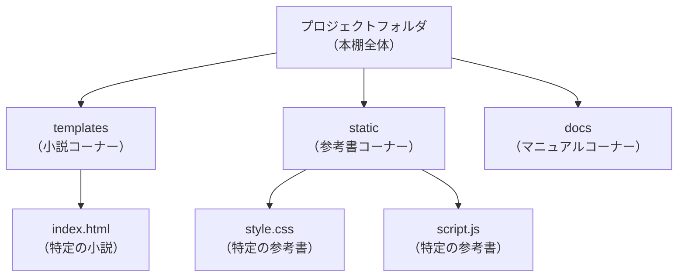
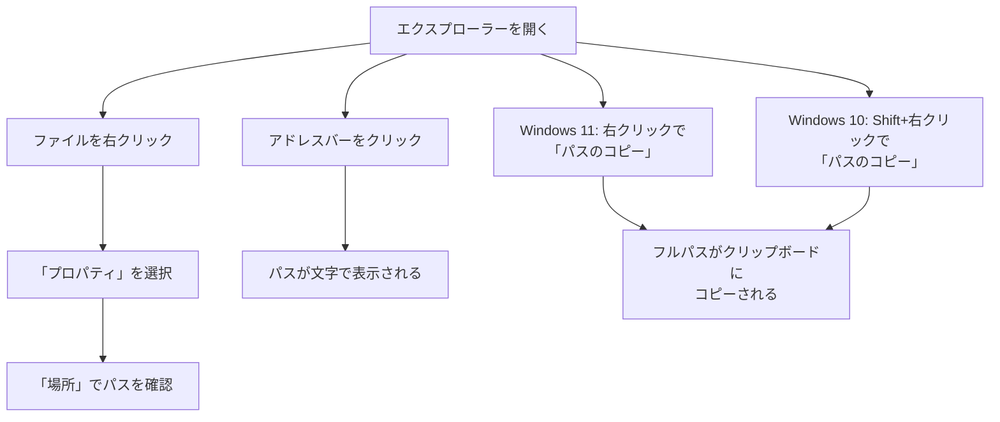

# ファイルとフォルダの世界

## はじめに

私たちは日常的にWindowsのエクスプローラーでファイルやフォルダを扱っています。しかし、プログラミングの世界では、ファイルとフォルダの見方が少し違います。この違いを理解することで、開発者との会話がスムーズになり、Web開発の仕組みをより深く理解できるようになります。

この章では、プログラミングにおけるファイルとフォルダの役割と、なぜ整理整頓が重要なのかを学びます。

## 📊 この章の重要度：🔴 必須

**Webディレクターにとって：**
- プロジェクト構造の理解に必須
- ファイルパス、拡張子の概念は日常的に使用
- 習得目安：業務開始前に必須

## あなたがこれを知ると変わること

**ファイルの場所に関する会話での変化：**
- 開発者：「仕様書はどこにありますか？」
- あなた（修得前）：「確か...デスクトップのどこかに...」
- あなた（修得後）：「C:\プロジェクト\2024年度\仕様書\機能仕様書.docx にあります」

**ファイル種類の理解での変化：**
- 開発者：「画像素材を.pngで用意してください」
- あなた（修得前）：「png？何ですか？」
- あなた（修得後）：「PNG形式の画像ファイルですね。透明背景が必要な画像用ですか？」

**フォルダ構造の理解での変化：**
- 開発者：「プロジェクトのフォルダ構成を説明します」
- あなた（修得前）：「ファイルがたくさんあって混乱します...」
- あなた（修得後）：「templates、static、docsフォルダに分けて整理されているのですね」

**パス指定での変化：**
- 開発者：「そのファイルのパスを教えてください」
- あなた（修得前）：「パス？どういう意味ですか？」
- あなた（修得後）：「絶対パスでお答えしますね。C:\Users\田中\Documents\プロジェクト\資料.docx です」

**ファイル管理での変化：**
- 以前：「新しいフォルダ」「コピー」「無題」などの適当な名前
- 今後：「2024年_会議資料」「企画書_v2.1」などの意味のあるファイル名

## 日常の整理とプログラミングの整理

### 本棚の整理との違い

日常生活での整理とプログラミングでの整理を本棚に例えて比較してみましょう：

**日常の本棚：**
- 「なんとなく」ジャンル別に分ける
- 時々、どこに置いたか忘れる
- 1人で使うので、多少散らかっても問題ない

**プログラミングの世界：**
- **厳密なルール**に従って分類
- **誰が見ても分かる**ように整理
- **チーム全員**が同じルールを守る



## 拡張子：ファイルの正体を示す名札

### 拡張子とは何か

**拡張子**とは、ファイル名の最後に付く「.html」「.css」「.js」のような部分です。これは、そのファイルがどんな種類なのかを示す「名札」のような役割を果たします。

Windowsの設定によっては拡張子が表示されていない場合があります。プログラミングでは拡張子が非常に重要なので、必ず表示するように設定しましょう。

### 主な拡張子の種類

Web開発でよく使われる拡張子とその役割：

| 拡張子 | 役割 | 例え |
|--------|------|------|
| **.html** | Webページの骨組み | 家の柱や壁 |
| **.css** | Webページの見た目 | 家の内装や外装 |
| **.js** | Webページの動作 | 家の電気や水道 |
| **.py** | Pythonプログラム | 設計図 |
| **.md** | 文書・説明書 | 取扱説明書 |

**重要：拡張子が違えば別のファイル**

`index.html`と`index.txt`は、同じ「index」という名前でも**全く別のファイル**として扱われます。たとえ中身のテキスト内容が全く同じであっても、拡張子が違うため：

- `index.html` → Webブラウザで開かれる（HTMLファイルとして解釈）
- `index.txt` → テキストエディタで開かれる（プレーンテキストとして解釈）

コンピューターは拡張子でファイルの種類を判断するため、**内容ではなく拡張子が重要**なのです。

<details>
<summary><strong>📋 Windows 拡張子、隠しファイル表示の設定方法</strong></summary>

### 拡張子を表示する設定手順

**Windows 10/11 共通：**
1. エクスプローラーを開く
2. 上部メニューの「表示」タブをクリック
3. 「ファイル名拡張子」にチェックを入れる

**Windows 11 の場合：**
1. エクスプローラーを開く
2. 上部の「表示」ボタンをクリック
3. 「表示」→「ファイル名拡張子」にチェック

### 隠しファイル・フォルダも表示する設定

**プログラミングでは隠しファイル（`.gitignore`、`.env`など）も重要です：**

**Windows 10/11 共通：**
1. エクスプローラーの「表示」タブ
2. 「隠しファイル」にチェックを入れる

**または詳細設定で：**
1. エクスプローラーの「表示」→「オプション」
2. 「フォルダーオプション」ダイアログで「表示」タブ
3. 「隠しファイル、隠しフォルダー、および隠しドライブを表示する」を選択
4. 「登録されている拡張子は表示しない」の**チェックを外す**

**設定後に表示される隠しファイル例：**
- `.gitignore` (Git用設定ファイル)
- `.env` (環境変数設定ファイル)
- `Thumbs.db` (Windowsのサムネイル情報)

</details>

## フォルダの階層構造

### 入れ子構造という考え方

フォルダは「入れ子」のように、大きな箱の中に小さな箱を入れて整理します。これは、書類を整理するときのファイリングと同じ考え方です：

**書類整理の例：**
```
書類ケース/
├── 仕事関係/
│   ├── 会議資料/
│   │   └── 2024年1月会議.pdf
│   └── 契約書/
└── 家庭関係/
    ├── 保険/
    └── 税金/
```

**コンピューターのフォルダ：**
```
ドキュメント/
├── 写真/
│   ├── 2024年/
│   │   └── 旅行.jpg
│   └── 2023年/
└── 仕事/
    ├── 資料/
    └── メモ.txt
```

## ファイル管理の重要性

### なぜ整理が重要？

コンピューターでファイルを整理することは、現実の書類整理と同じくらい重要です。適切な整理がされていないと：

- **必要なファイルが見つからない**：「あの資料はどこに保存したっけ？」
- **同じファイルを何度も作成**：「これ前にも作った気がする...」
- **チームでの共有が困難**：「みんなバラバラの場所に保存している」

### 基本的な整理のルール

**1. 意味のあるフォルダ名を付ける**
- ❌ 悪い例：「新しいフォルダ」「フォルダ1」
- ✅ 良い例：「2024年_会議資料」「プロジェクトA_企画書」

**2. ファイル名にも気を配る**
- ❌ 悪い例：「無題.docx」「コピー.xlsx」
- ✅ 良い例：「20240115_企画書_最終版.docx」「予算表_2024年度.xlsx」

**3. 定期的に整理する**
- 月に1回はフォルダを見直す
- 不要なファイルは削除またはアーカイブ

## ファイルパスという住所

### パスとは何か

**ファイルパス**とは、ファイルの「住所」のことです。これは、現実世界の住所システムと非常によく似ています。

**現実世界の住所：**
```
日本国 → 東京都 → 渋谷区 → 神南1丁目 → 19番8号
```

**コンピューターのファイルパス：**
```
Cドライブ → Users → 田中 → Documents → photo.jpg
```

### Windowsでのパス表記

Windowsでは、フォルダを区切るために「\」（バックスラッシュ）を使います：

```
C:\Users\田中\Documents\写真\2024年\旅行.jpg
```

これを日本語で読むと：
「Cドライブの、Usersフォルダの、田中フォルダの、Documentsフォルダの、写真フォルダの、2024年フォルダの、旅行.jpgファイル」

### エクスプローラーでパスを確認する方法

**手順1：プロパティで確認（全Windows共通）**
1. 任意のファイルを右クリック
2. 「プロパティ」を選択
3. 「場所」に表示されるのがそのファイルのパス

**手順2：アドレスバーで確認**
1. エクスプローラーの上部にあるアドレスバーをクリック
2. パスが文字として表示される

**手順3：パスのコピー**
**Windows 11の場合：**
1. ファイルまたはフォルダを右クリック
2. 「パスのコピー」を選択
3. フルパスがクリップボードにコピーされる

**Windows 10の場合：**
1. ファイルを選択した状態で`Shift`キーを押しながら右クリック
2. 「パスのコピー」が表示される
3. フルパスがクリップボードにコピーされる



**コピーされるパスの例：**
```
"C:\Users\田中\Documents\プロジェクト\index.html"
```
> [!NOTE]
> 「パスのコピー」機能でコピーすると、パスがダブルクォーテーション(`