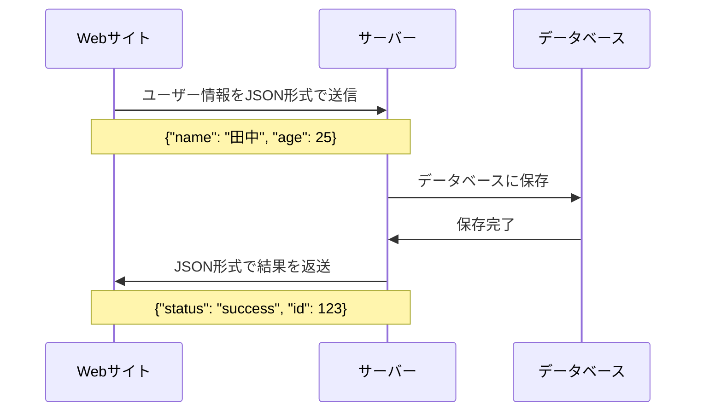

# ファイルの種類とアプリケーション

## はじめに

私たちは日常的にWord文書やExcelファイルを使っていますが、コンピューターにとって、全てのファイルが同じように見えるわけではありません。ファイルには大きく分けて2つの種類があり、それぞれ異なる特徴を持っています。この違いを理解することで、プログラミングの世界がより身近に感じられるようになります。

この章では、ファイルの基本的な分類と、プログラミングでよく扱われるファイル形式について学びます。

## 📊 この章の重要度：🔴 必須

**Webディレクターにとって：**
- データファイル（CSV、JSON）の理解は業務で必須
- 設定ファイルの概念は開発者との会話で頻出
- 習得目安：業務開始前に必須

## あなたがこれを知ると変わること

**データ確認での変化：**
- 開発者：「CSVファイルでデータを確認してください」
- あなた（修得前）：「CSVって何ですか？」
- あなた（修得後）：「Excelで開いて表として確認しますね」

**設定変更での変化：**
- 開発者：「設定ファイルのこの値を変更してください」
- あなた（修得前）：「どのアプリで開けばいいですか？」
- あなた（修得後）：「テキストエディタで開いて編集しますね」

**プロジェクト進行での変化：**
- 以前：「ファイルがたくさんあってよくわからない...」
- 今後：「JSONは設定、HTMLは画面、CSSは見た目を担当している」

**画像素材の指示での変化：**
- 開発者：「ロゴ画像を用意してください」
- あなた（修得前）：「どんな形式にすればいいですか？」
- あなた（修得後）：「透明背景が必要なのでPNG形式で用意します」

## コンピューターから見たファイルの2つの世界

### バイナリファイル vs テキストファイル

コンピューターのOS（Windowsなど）が**拡張子とアプリケーションの関連付け設定**に基づいて、どのアプリケーションでファイルを開くかを決定します。ただし、ファイルの内容では大きく2つの種類に分けられます：

**バイナリファイル：**
- コンピューター専用の言語（0と1の組み合わせ）で書かれたファイル
- 人間が直接読むことはできない
- 専用のアプリケーションが必要
- 例：画像、動画、音声、Officeファイル、実行ファイル（.exe）など

**テキストファイル：**
- 人間が読める文字で書かれたファイル
- メモ帳やテキストエディタで開ける
- 任意のテキストエディタ（VS Code、メモ帳等）で編集可能
- 例：HTML、CSS、JavaScript、設定ファイルなど


### 実際の例で確認

**バイナリファイルをテキストエディタで開くと：**
```
PK      ! ¿?ó"1   [Content_Types].xml ¢(     ¼T]oÛ0  ½#ú
```
→ 文字化けして読めません

**テキストファイルをテキストエディタで開くと：**
```html
<h1>見出しです</h1>
<p>これは段落の文章です</p>
```
→ 人間が読める形で表示されます

## プログラミングでよく使われるテキストファイル

### 構造化データファイル

**CSV**
- 正式名称：Comma-Separated Values
- 役割：**表形式のデータ**を保存
- 例え：Excelの表をシンプルにしたもの

```csv
名前,年齢,部署
田中,25,営業部
佐藤,30,開発部
鈴木,28,企画部
```

**JSON**
- 正式名称：JavaScript Object Notation
- 役割：**構造化された情報**を保存
- 例え：項目と値をセットにした住所録

```json
{
    "名前": "田中太郎",
    "年齢": 25,
    "住所": {
        "都道府県": "東京都",
        "市区町村": "渋谷区"
    }
}
```

**HTML**
- 正式名称：HyperText Markup Language
- 役割：**Webページの構造**を定義
- 例え：家の柱や壁（基本的な骨組み）

```html
<!DOCTYPE html>
<html>
<head>
    <title>ページのタイトル</title>
</head>
<body>
    <h1>大見出し</h1>
    <p>段落の文章です</p>
</body>
</html>
```

**YAML**
- 正式名称：YAML Ain't Markup Language
- 役割：**設定情報**を人間にやさしい形で保存
- 例え：箇条書きのような設定メモ

```yaml
データベース設定:
  ホスト: localhost
  ポート: 3306
  ユーザー名: admin
  
サイト設定:
  タイトル: "学習アプリ"
  言語: "日本語"
```

### Web開発でよく使われるメディアファイル

**画像ファイル形式**

Web開発では、用途に応じて異なる画像形式を使い分けます：

**JPG/JPEG（ジェイペグ）**
- 用途：**写真**や色数の多い画像
- 特徴：ファイルサイズが小さい、透明背景不可
- 使用例：商品写真、バナー画像

**PNG（ピング）**
- 用途：**ロゴ**やアイコン、透明背景が必要な画像
- 特徴：透明背景対応、高画質、ファイルサイズ大
- 使用例：企業ロゴ、UIアイコン

**GIF（ジフ）**
- 用途：**アニメーション**画像
- 特徴：動く画像を作成可能、色数制限あり
- 使用例：ローディングアニメーション、簡単な動き

**WebP**
- 用途：**次世代画像形式**（2025年現在普及拡大中）
- 特徴：JPG/PNGより小さいファイルサイズ、透明背景対応
- 使用例：Webサイトの表示速度向上

**SVG**
- 用途：**ベクター図形**（拡大縮小しても綺麗）
- 特徴：テキストファイルでありながら、ブラウザで画像として表示
- 使用例：アイコン、ロゴ、シンプルなイラスト

**SVGの特殊性：**
SVGは一般的な画像ファイルとは異なり、**XML形式のテキストファイル**です。テキストエディタで開いて編集できる一方、ブラウザでは画像として表示されます。

**動画ファイル形式**

**MP4（エムピーフォー）**
- 用途：**Web動画の標準形式**
- 特徴：多くのブラウザで再生可能、圧縮効率が良い
- 使用例：プロモーション動画、商品説明動画

```html
<!-- HTML内での画像・動画の使用例 -->

<video src="promotion.mp4" controls></video>
```

### Web開発の基本ファイル

**CSS**
- 正式名称：Cascading Style Sheets
- 役割：**Webページの見た目**を指定
- 例え：家の内装や外装（見た目の装飾）

```css
/* 見出しのスタイル */
h1 {
    color: blue;           /* 文字色を青に */
    font-size: 24px;       /* 文字サイズを24pxに */
    text-align: center;    /* 中央揃え */
}

/* ボタンのスタイル */
button {
    background-color: #007bff;  /* 背景色 */
    border-radius: 5px;         /* 角を丸く */
    padding: 10px 20px;         /* 内側の余白 */
}
```

**JavaScript**
- 正式名称：JavaScript
- 役割：**Webページの動作やインタラクション**を制御
- 例え：家の電気や水道（動作や機能を制御）

```javascript
// ボタンをクリックしたときの処理
function showMessage() {
    alert('ボタンがクリックされました！');
}

// フォームの入力値をチェック
function validateEmail(email) {
    return email.includes('@'); // @マークが含まれているかチェック
}
```

## OfficeファイルとWebファイルの違い

### 実際のプロジェクトで比較

私たちのプロジェクトファイルを例にして違いを見てみましょう：


### 特徴の比較

| 項目 | Officeファイル | Webファイル | メディアファイル |
|------|----------------|-------------|--------------|
| **ファイル形式** | バイナリ | テキスト | バイナリ |
| **人間の可読性** | アプリなしでは読めない | メモ帳でも読める | アプリなしでは読めない |
| **ファイルサイズ** | 比較的大きい | 軽量 | 種類により大きい |
| **エラー時の対処** | アプリが開けないと修復困難 | テキストエディタで直接修正可能 | 専用ツールが必要 |
| **プログラムでの扱い** | ライブラリやAPIが必要 | 直接読み書き可能 | 形式に応じた処理が必要 |

### 実際の業務での使い分け

**データ確認・分析作業：**
```
1. システムからCSVでデータを出力
2. Excelで開いて分析・グラフ作成
3. 結果をプレゼン資料に加工
```

**Web開発作業：**
```
1. HTMLでページ構造を作成
2. CSSで見た目を調整
3. JSONで設定やデータを管理
4. PNG/JPGで画像素材を配置
5. MP4で動画コンテンツを埋め込み
```

## プログラミングで扱いやすいファイル形式

### なぜテキストファイルが好まれるのか

**プログラムからの読み書きが簡単：**

テキストファイルはプログラムから直接読み書きできます：

```python
# CSVファイルを読み込む（Python例）
import csv
with open('data.csv', 'r') as file:
    reader = csv.reader(file)
    for row in reader:
        print(row)  # ['田中', '25', '営業部']
```

**一方、アプリケーション依存ファイルの制約：**

Word、Excel、Google Spreadsheetなどのファイルは、**基本的にそのアプリケーションでしか読み取ることができません**。外部のプログラムからの操作、変更は非常に困難です。

- **Wordファイル** (.docx)：Microsoft Wordが必要
- **Excelファイル** (.xlsx)：Microsoft Excelが必要
- **Google Spreadsheet**：Googleのオンラインサービスが必要

このため、システム間でデータをやり取りする場合は、CSVやJSONなどのテキストファイルが好まれます。

**複数人での作業がしやすい：**
- 変更履歴が追跡しやすい
- **マージ**（複数の変更を統合）が可能
- ファイル破損のリスクが低い

**システム間でのデータ交換：**



### 設定ファイルの役割

**アプリケーションの動作を制御：**

私たちのプロジェクトの `requirements.txt`：
```
Flask==2.3.3
Flask-SQLAlchemy==3.0.5
```
→ プログラムが必要とする部品（ライブラリ）のリスト

CSSファイル：
```css
body {
    font-family: "Helvetica, Arial, sans-serif";
    margin: 0;
    padding: 20px;
}
```
→ Webページの見た目を制御する設定

## まとめ

### この章で学んだこと

1. **ファイルの2つの分類**
   - バイナリファイル：専用アプリが必要
   - テキストファイル：テキストエディタで開ける

2. **構造化データファイル**
   - CSV：表形式データ
   - JSON：構造化された情報
   - HTML：Webページの構造
   - YAML：設定情報

3. **メディアファイルの使い分け**
   - JPG：写真（小さいファイルサイズ）
   - PNG：ロゴ・アイコン（透明背景対応）
   - SVG：ベクター図形（拡大縮小しても綺麗）
   - GIF：アニメーション画像
   - MP4：Web動画の標準形式
   - WebP：次世代画像形式（高効率）

4. **Web開発でのファイル活用**
   - テキストファイルはプログラムが読み書きしやすい
   - アプリ依存ファイルは外部からの操作が困難
   - チーム作業にはテキストファイルが適している
   - システム間でのデータ交換にはCSV、JSONが最適

### 次のステップ

次章では、「パスって何？どこにいるかを知る方法」について学び、現在地（カレントディレクトリ）の概念を理解していきます。

### 🎯 実践のヒント

**業務で役立つファイル形式の知識：**
- **CSV**：データのやり取りで頻繁に使用
- **JSON**：Web APIでの情報交換に必須
- **HTML/CSS/JavaScript**：Webサイトの基本ファイル
- **設定ファイル**：システムの動作を制御

**メディアファイルの実務での選択基準：**
- **写真・商品画像**：JPG（ファイルサイズ重視）
- **ロゴ・アイコン**：PNG（透明背景必要）またはSVG（ベクター図形）
- **簡単なアニメーション**：GIF
- **動画コンテンツ**：MP4（Web標準）
- **表示速度重視**：WebP（対応ブラウザ確認が必要）
- **シンプルなアイコン・ロゴ**：SVG（拡大縮小でも綺麗）

**ファイルを見つけたときの判断方法：**
- 拡張子で大まかな用途を判断
- テキストエディタで開いて内容を確認
- 読めれば設定やコード、読めなければバイナリファイル
- 画像・動画は専用ビューアーで内容確認