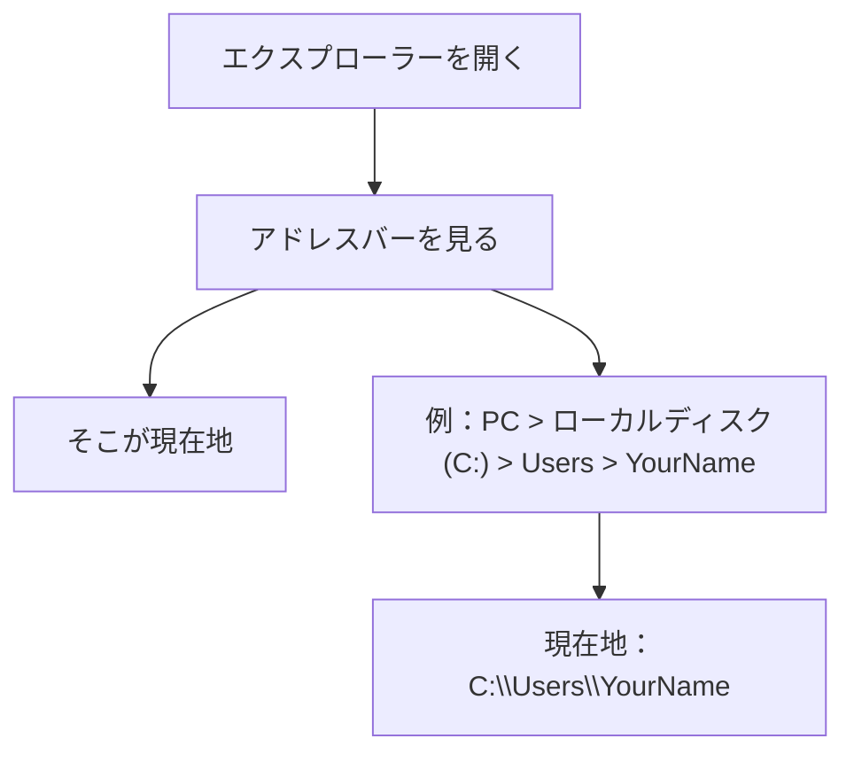
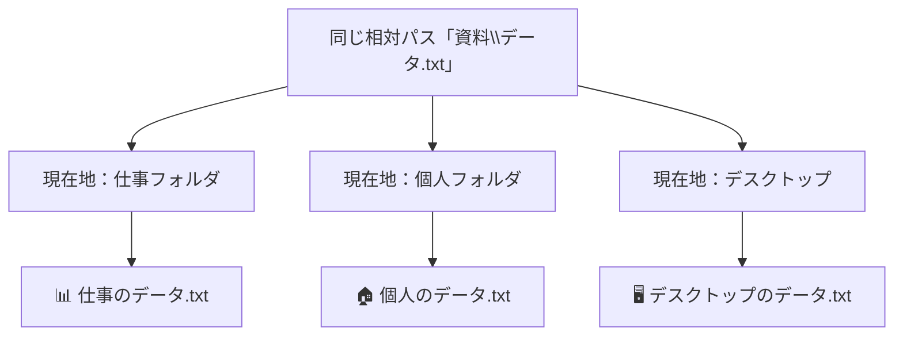
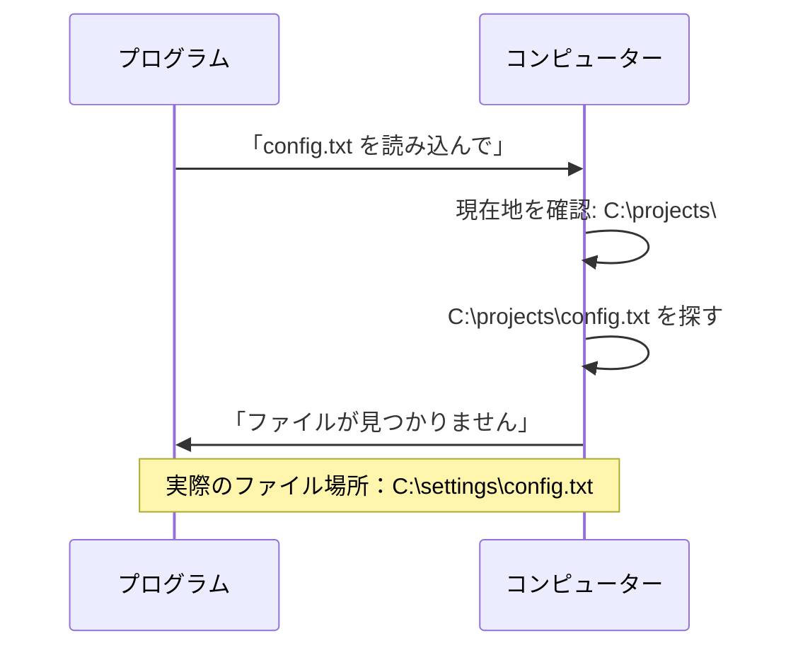

# パスって何？どこにいるかを知る方法

## はじめに

前の章でファイルの種類（バイナリファイルとテキストファイル）について学びましたが、今度は「現在地」という重要な概念を理解しましょう。コンピューターを使うとき、私たちは常に「どこかのフォルダにいる」状態にあります。この「現在地」を理解することで、相対パスの意味がより明確になり、後のターミナル操作にもつながります。

この章では、現在地（**カレントディレクトリ**）の概念と、それを確認・変更する方法を学びます。

## 📊 この章の重要度：🟡 推奨

**Webディレクターにとって：**
- エラー解決やファイル指定で役立つ
- 現在地の概念は効率的な作業に重要
- 習得目安：基礎知識習得後に学習

## あなたがこれを知ると変わること

**ファイル操作での変化：**
- 以前：「なぜ同じファイル名なのに見つからないの？」
- 今後：「現在地が違うから、相対パスの意味が変わったんだ」

**開発者との会話での変化：**
- 開発者：「カレントディレクトリを確認してください」
- あなた（修得前）：「カレント...？」
- あなた（修得後）：「今いる場所を確認するんですね」

**トラブル解決での変化：**
- 以前：「ファイルが見つからないエラーが出ました」
- 今後：「現在地はどこで、ファイルはどこにありますか？」

## 現在地（カレントディレクトリ）とは

### 現実世界での「現在地」

私たちは現実世界でも常に「どこかにいる」状態です：

- 家にいるとき → 家が現在地
- オフィスにいるとき → オフィスが現在地
- 駅にいるとき → 駅が現在地

コンピューターでも同じで、ファイル操作をするとき、必ずどこかのフォルダを「現在地」として操作しています。

### カレントディレクトリという用語

**カレントディレクトリ**（Current Directory）とは：
- **カレント**：「現在の」という意味の英語
- **ディレクトリ**：フォルダのこと
- つまり「現在いるフォルダ」のこと

現実世界で「今どこにいますか？」と聞かれるように、コンピューターでも「今どのフォルダにいますか？」という概念があります。

## Windowsエクスプローラーでの現在地

### エクスプローラーのアドレスバー

Windowsエクスプローラーを開くと、上部に「アドレスバー」があります。ここに表示されているのが、あなたの現在地です。



### 現在地の確認方法

**方法1：アドレスバーをクリック**
1. エクスプローラーのアドレスバーをクリック
2. パスが文字列として表示される
3. これがあなたの現在地の完全な住所

**方法2：プロパティで確認**
1. エクスプローラーの空白部分を右クリック
2. 「プロパティ」を選択
3. 「場所」に現在地が表示される

### 現在地の移動

エクスプローラーでフォルダをダブルクリックすると、現在地が移動します：

**移動前の現在地：** `C:\Users\YourName`
**「Documents」フォルダをダブルクリック**
**移動後の現在地：** `C:\Users\YourName\Documents`

これは現実世界で廊下から個別の部屋に入るのと同じです。

## 現在地と相対パスの関係

### なぜ現在地が重要？

前の章で学んだ相対パスは、現在地を基準として計算されます。🚨 **重要：同じ相対パスでも、現在地が違えば、全く違うファイルを指すことがあります。**

### 🔍 具体例で理解しよう

以下のフォルダ構造があるとします：

```
C:\Users\田中\
├── Documents\
│   ├── 仕事\
│   │   └── 資料\
│   │       └── データ.txt ← 仕事のデータ
│   └── 個人\
│       └── 資料\
│           └── データ.txt ← 個人のデータ
└── Desktop\
    └── 資料\
        └── データ.txt ← デスクトップのデータ
```

⚠️ **注目：全く同じ相対パス「資料\データ.txt」が、現在地によって異なるファイルを指します！**

**現在地が `C:\Users\田中\Documents\仕事` の場合：**
- 相対パス「資料\データ.txt」= `C:\Users\田中\Documents\仕事\資料\データ.txt` 
- → 📊 **仕事のデータが開かれる**

**現在地が `C:\Users\田中\Documents\個人` の場合：**
- 相対パス「資料\データ.txt」= `C:\Users\田中\Documents\個人\資料\データ.txt`
- → 🏠 **個人のデータが開かれる**

**現在地が `C:\Users\田中\Desktop` の場合：**
- 相対パス「資料\データ.txt」= `C:\Users\田中\Desktop\資料\データ.txt`
- → 🖥️ **デスクトップのデータが開かれる**



## ターミナルという「文字だけの世界」

### ターミナルとは何か

**ターミナル**（コマンドプロンプトやPowerShell）は、文字だけでコンピューターを操作する方法です。Windowsでは以下の方法で開けます：

**Windows 10/11での開き方：**
1. キーボードで「Windows キー + R」を押す
2. 「cmd」と入力してEnterキー
3. 黒い画面が開く（これがターミナル）

### なぜ文字だけの操作？

現代ではマウスとアイコンで操作するのが当たり前ですが、ターミナルには以下のメリットがあります：

- **高速操作**：慣れればマウスより早い
- **正確な指示**：曖昧さがない
- **自動化**：同じ操作を繰り返し実行できる
- **リモート操作**：遠隔地のコンピューターも操作可能

### ターミナルでの現在地

ターミナルにも「現在地」の概念があります。ターミナルを開くと、通常は以下のような表示が出ます：

```
C:\Users\YourName>
```

この `C:\Users\YourName` の部分が現在地を示しています。最後の `>` は「ここに命令を入力してください」という意味です。

## 現在地の確認コマンド

### Windowsでの現在地確認

ターミナルで現在地を確認するコマンドがあります：

**コマンド：** `cd`（Change Directoryの略、ただし何も付け加えずに実行）

```
C:\Users\YourName> cd
C:\Users\YourName
```

### 現在地の内容を確認

現在地にどんなファイルやフォルダがあるかを確認するコマンド：

**コマンド：** `dir`（Directoryの略）

```
C:\Users\YourName> dir
2024/01/15  10:30    <DIR>          Documents
2024/01/15  10:30    <DIR>          Desktop
2024/01/15  10:30    <DIR>          Downloads
```

**解説：**
- `<DIR>` はフォルダを意味
- 日付と時刻は最終更新日時
- 数字はファイルサイズ

## 実際の操作練習

### 基本的な操作の流れ

**準備：**
1. デスクトップに「練習フォルダ」を作成
2. その中に「サブフォルダ」を作成

**練習1：エクスプローラーで現在地確認**
1. 「練習フォルダ」をダブルクリックして開く
2. アドレスバーをクリックして現在地を確認
3. 「サブフォルダ」に移動して、再度現在地を確認

**練習2：ターミナルで現在地確認**
1. ターミナル（コマンドプロンプト）を開く
2. `cd` コマンドで現在地を確認
3. `dir` コマンドで現在地の内容を確認

### よくある間違いと対処法

**間違い1：現在地を意識せずにファイルを探す**
- 症状：「ファイルが見つからない」
- 対処：まず現在地を確認する

**間違い2：相対パスを絶対パスと混同**
- 症状：「同じパスなのに違うファイルが開く」
- 対処：現在地を確認してから相対パスを考える

**間違い3：ターミナルで迷子になる**
- 症状：「どこにいるかわからない」
- 対処：`cd` コマンドで現在地を確認

## プログラミングでの現在地の重要性

### 設定ファイルの場所

プログラムは特定の場所に設定ファイルがあることを前提として動作します。現在地が違うと、同じプログラムでも異なる設定ファイルを読み込む可能性があります。

### ファイルの読み書き

プログラムがファイルを読み書きするとき、相対パスで指定された場合は現在地を基準として探します：

```
プログラムの指示：「data.txt を読み込んでください」
現在地：C:\projects\projectA\
実際に探すファイル：C:\projects\projectA\data.txt
```

### エラーの原因

「ファイルが見つかりません」というエラーの多くは、現在地とファイルの場所が一致していないことが原因です。



## まとめ

- **現在地（カレントディレクトリ）**は「今いるフォルダ」のこと
- **エクスプローラーのアドレスバー**で現在地が確認できる
- **相対パス**は現在地を基準として計算される
- **ターミナル**では `cd` コマンドで現在地を確認
- **現在地の理解**はプログラミングでのエラー解決に重要

### 今日から意識すること

1. **ファイル操作前に現在地を確認**する習慣をつける
2. **「ファイルが見つからない」ときは現在地をチェック**
3. **相対パスを使うときは現在地を意識**する
4. **ターミナルを開いたら最初に現在地を確認**

次の章では、「黒い画面は怖くない：ターミナル入門」について学び、実際にターミナルを使ってファイル操作を行う方法を身につけていきます。 