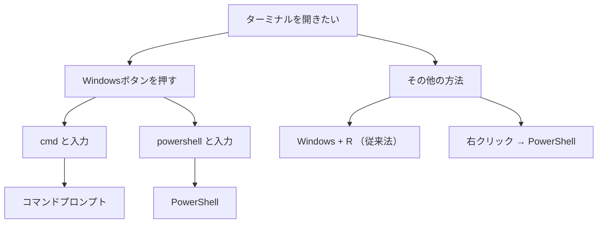
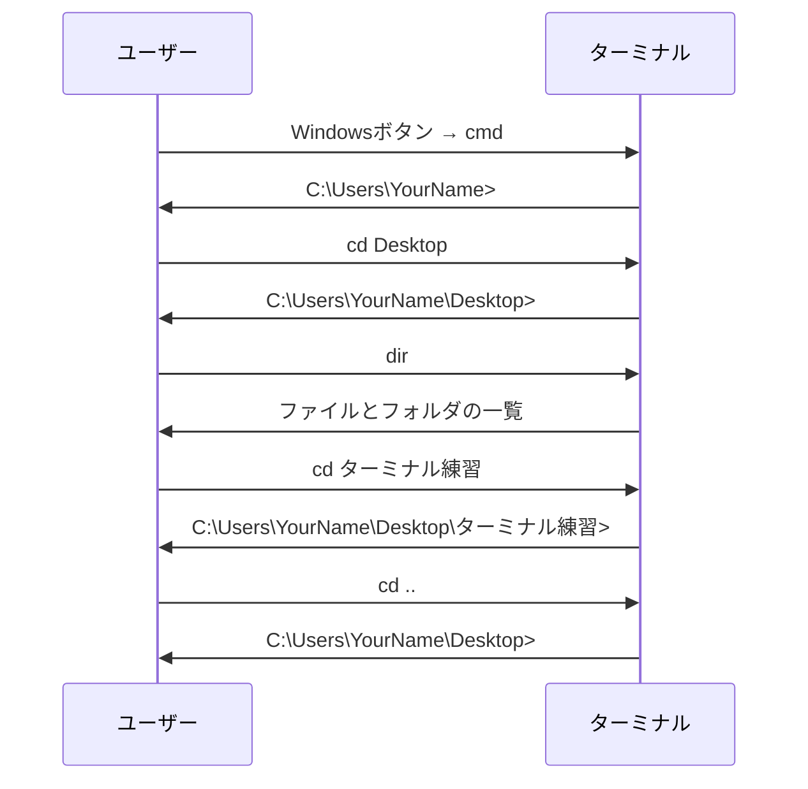

# 黒い画面は怖くない：ターミナル入門

## はじめに

ターミナル(黒い画面)と聞くと、多くの人が「難しそう」「プログラマーだけのもの」と感じるかもしれません。しかし、ターミナル（コマンドプロンプト）は思っているより身近で、慣れればマウス操作より早くて正確なツールです。

この章では、ターミナルへの恐怖心を取り除き、基本的な操作方法を身につけます。最終的には「あ、これならできる！」と感じてもらえることを目指します。

## 📊 この章の重要度：🟡 推奨

**Webディレクターにとって：**
- 開発者との協業で有効
- 基本的なコマンド操作で業務効率向上
- 習得目安：基礎知識習得後に学習

## あなたがこれを知ると変わること

**開発者との会話での変化：**
- 開発者：「ターミナルで確認してもらえますか？」
- あなた（修得前）：「ターミナルは無理です...」
- あなた（修得後）：「はい、やってみます！」

**トラブル解決での変化：**
- 以前：「エラーが出たけど、よくわからない」
- 今後：「ターミナルで状況を確認してみます」

**効率性の変化：**
- 以前：マウスでクリック、クリック、クリック...
- 今後：キーボードで「パパッ」と素早く操作

## ターミナルって何？なぜ使うの？

### ターミナルとは

**ターミナル**は、文字だけでコンピューターと会話する窓口です。まるで昔の電報のように、文字で指示を送ると、コンピューターが文字で返事をくれます。

### 身近な例：ATMの操作

ターミナルの操作は、ATMの操作と似ています：

**ATMでの操作：**
1. カードを入れる
2. 「残高照会」ボタンを押す
3. 暗証番号を入力
4. 残高が表示される

**ターミナルでの操作：**
1. ターミナルを開く
2. `dir` と入力
3. Enterキーを押す
4. ファイル一覧が表示される

どちらも「決まった手順で操作すると、決まった結果が返ってくる」という点で同じです。

### なぜ文字だけの操作が必要？

**1. 正確性**
- マウス：「このへん」という曖昧な指示
- ターミナル：「このファイル」という正確な指示

**2. 速度**
- マウス：フォルダをクリック → サブフォルダをクリック → ファイルを探す
- ターミナル：一回のコマンドで目的地へ直行

**3. 記録性**
- マウス：「どうやったか」の記録が残らない
- ターミナル：実行したコマンドの履歴が残る

## Windowsでターミナルを開く方法

### 最も簡単な方法：検索機能を使う

**Windows 11/10での推奨方法：**

1. **Windowsボタン**を押す（またはクリック）
2. 検索窓が表示されるので、以下のどちらかを入力：
   - `cmd` → コマンドプロンプト
   - `powershell` → PowerShell
3. **Enter**キーを押すか、表示された結果をクリック
4. ターミナルが開く

**💡 どちらを選ぶべき？**
- **初心者：** `cmd`（コマンドプロンプト）がおすすめ
- **慣れてきたら：** `powershell`（PowerShell）も試してみる
- **機能：** どちらも基本的な操作は同じ

<details>
<summary>💡 補足：Windows Terminal（Windows ターミナル）について</summary>

### Windows Terminalとは何？

**Windows Terminal**は、マイクロソフトが提供する現代的なターミナルアプリケーションです。従来のコマンドプロンプトやPowerShellとは異なり、**複数のシェルを一つのアプリで管理**できるツールです。

### 主な特徴

**1. 複数シェルの統合管理**
- **コマンドプロンプト（cmd）**
- **PowerShell**
- **Azure Cloud Shell**
- **WSL（Windows Subsystem for Linux）**

これらを同じアプリ内でタブ切り替えしながら使用できます。

**2. Windows 11での標準化**
- **Windows 11では標準**でWindows Terminalがインストール済み
- スタートメニューから「ターミナル」を選択すると、Windows Terminalが起動
- 従来のコマンドプロンプトやPowerShellも引き続き使用可能

**3. 使いやすい機能**
- **タブ機能**：複数のターミナルを同時に開ける
- **見やすい表示**：文字の見栄えが改善
- **テーマ変更**：背景色や文字色をカスタマイズ可能
- **分割表示**：一つの画面で複数のターミナルを並べて表示

### 開き方
```
Windowsボタン → "terminal" と入力 → Enter
```

### 初心者にとってのメリット
- **統一された操作感**：どのシェルでも同じアプリで操作
- **タブで整理**：複数の作業を並行して進められる
- **見た目がわかりやすい**：従来の黒い画面より親しみやすい

### どれを使うべき？
- **2025年現在のおすすめ**：Windows Terminal
- **理由**：最新の機能と使いやすさを兼ね備えている
- **注意**：この章の練習は、どのターミナルでも同じように動作します

</details>

### 他の開き方（参考）

**ファイル名を指定して実行：**
1. `Windows + R` キーを押す
2. `cmd` または `powershell` と入力してEnter

（注：上記方法より、Windowsボタンからの検索の方が簡単です）

**右クリックメニュー：**
1. スタートボタンを右クリック
2. 「Windows PowerShell」または「ターミナル」を選択



## ターミナルの画面の見方

### 初期画面の構成

ターミナルを開くと、以下のような画面が表示されます：

```
Microsoft Windows [Version 10.0.19045.4894]
(c) Microsoft Corporation. All rights reserved.

C:\Users\YourName>
```

**各部分の説明：**

**1行目：** Windowsのバージョン情報（無視してOK）
**2行目：** 著作権情報（無視してOK）
**3行目：** 空行
**4行目：** 重要！現在地とプロンプト

### プロンプトの読み方

```
C:\Users\YourName>
```

- **C:** → Cドライブにいることを示す
- **\Users\YourName** → 現在地のパス
- **>** → 「ここにコマンドを入力してください」という意味

このプロンプトが見えている状態が「コマンド入力待ち」の状態です。

<details>
<summary>💡 Tips：Cドライブとは？他のドライブもある？</summary>

**Cドライブ：**
WindowsでCドライブとは、メインのハードディスク（記憶装置）のことです。パソコンの中にある「一番大きな本棚」だと考えてください。ほとんどのファイルやプログラムはここに保存されています。

**Cドライブ以外もあります：**
- **D:、E:、F:** → 外部ハードディスクやUSBメモリ
- **G:** → Google Driveデスクトップ版（設定による）
- **V:、I:** → ネットワークドライブ（会社の共有フォルダなど）

プロンプトが `D:\>` や `G:\>` で始まっている場合は、それぞれの記憶装置にいることを示しています。
</details>


### カーソルの意味

プロンプトの後に点滅している線（｜）がカーソルです。これは「ここに文字が入力される」ことを示しています。Wordやメモ帳でも同じものを見たことがあるはずです。

## 最初に覚える4つのコマンド

### 1. `dir` - 現在地の中身を見る

**コマンド：** `dir`
**意味：** Directory（ディレクトリ）の略
**用途：** 現在地にどんなファイルやフォルダがあるかを確認

**使い方：**
```
C:\Users\YourName> dir
```

**結果例：**
```
2024/01/15  10:30    <DIR>          Documents
2024/01/15  10:30    <DIR>          Desktop
2024/01/15  11:45        1,234      memo.txt
```

**結果の読み方：**
- **日付・時刻**：最終更新日時
- **`<DIR>`**：フォルダであることを示す
- **数字**：ファイルサイズ（バイト単位）
- **名前**：ファイルまたはフォルダの名前

### 2. `cd` - 場所を移動する

**コマンド：** `cd フォルダ名`
**意味：** Change Directory（チェンジ ディレクトリ）の略
**用途：** 別のフォルダに移動する

**使い方例：**
```
C:\Users\YourName> cd Documents
C:\Users\YourName\Documents>
```

**特殊な移動：**
- `cd ..` → 1つ上のフォルダに移動
- `cd \` → Cドライブの最上位に移動
- `cd` （引数なし） → 現在地を表示

### 3. 現在地を確認する

**用途：** 今どこにいるかを確認

**重要：使用するターミナルによってコマンドが異なります**

**コマンドプロンプト（cmd）の場合：**
```
C:\Users\YourName\Documents> cd
C:\Users\YourName\Documents
```
- `cd` （引数なし）で現在地を表示

**PowerShell・Windows Terminalの場合：**
```
PS C:\Users\YourName\Documents> pwd
C:\Users\YourName\Documents
```
- `pwd` （Present Working Directory）も使用可能
- `cd` （引数なし）でも同じ結果

**💡 どちらを覚えるべき？**
- **初心者：** `cd` から始める（どのターミナルでも使える）
- **慣れてきたら：** `pwd` も覚える（よりわかりやすい名前）

### 4. `mkdir` - 新しいフォルダを作成する

**コマンド：** `mkdir フォルダ名`
**意味：** Make Directory（メイク ディレクトリ）の略
**用途：** 新しいフォルダを作成する

**使い方例：**
```
C:\Users\YourName\Desktop> mkdir 新しいフォルダ
C:\Users\YourName\Desktop>
```

**確認方法：**
作成後、`dir` コマンドで新しいフォルダが作られていることを確認できます：

```
C:\Users\YourName\Desktop> dir
2024/01/15  12:00    <DIR>          新しいフォルダ
```

**注意点：**
- フォルダ名にスペースが含まれる場合は「"」（ダブルクォート）で囲む
- 例：`mkdir "マイ ドキュメント"`

## 実際にやってみよう：ステップバイステップ

### 準備：基本的な確認

まず、ターミナルと普段のエクスプローラーが同じものを見ていることを確認しましょう：

1. ターミナルで現在地を確認
2. エクスプローラーで同じ場所を開いて比較
3. ターミナルでフォルダを作成
4. エクスプローラーで実際に作成されたことを確認

### 練習1：ターミナルとエクスプローラーで現在地確認

**手順：**
1. **Windowsボタン**を押して `cmd` と入力 → Enter
2. ターミナルが開いたら、現在地を確認：

```
C:\Users\YourName> pwd
C:\Users\YourName
```

3. **エクスプローラーでも同じ場所を確認**：
   - `Windows + E` でエクスプローラーを開く
   - アドレスバーに `C:\Users\YourName` と入力してEnter
   - ターミナルとエクスプローラーで同じ場所が表示されることを確認

**💡 重要：**
ターミナルとエクスプローラーは同じコンピューターの同じフォルダを見ています。表示方法が違うだけです。

### 練習2：デスクトップへ移動と確認

**手順：**
1. デスクトップへ移動：

```
C:\Users\YourName> cd Desktop
C:\Users\YourName\Desktop>
```

2. デスクトップの中身を確認：

```
C:\Users\YourName\Desktop> dir
（デスクトップのファイルやフォルダが一覧表示される）
```

3. **エクスプローラーでも確認**：
   - すでに開いているエクスプローラーで「Desktop」をクリック
   - または新しく `Windows + E` でエクスプローラーを開いて、左側の「デスクトップ」をクリック
   - ターミナルの `dir` 結果と同じファイル・フォルダが表示されることを確認

### 練習3：フォルダを作成してエクスプローラーで確認

**手順：**
1. 「ターミナル練習」フォルダを作成：

```
C:\Users\YourName\Desktop> mkdir ターミナル練習
C:\Users\YourName\Desktop>
```

2. **エクスプローラーですぐに確認**：
   - エクスプローラーのデスクトップ画面を見る
   - 「ターミナル練習」フォルダが新しく作られていることを確認
   - 必要に応じて F5 キーでエクスプローラーを更新

3. ターミナルでも確認：

```
C:\Users\YourName\Desktop> dir
（「ターミナル練習」フォルダが表示される）
```

4. 作成したフォルダに移動：

```
C:\Users\YourName\Desktop> cd ターミナル練習
C:\Users\YourName\Desktop\ターミナル練習>
```

5. フォルダの中にさらにフォルダを作成：

```
C:\Users\YourName\Desktop\ターミナル練習> mkdir 写真
C:\Users\YourName\Desktop\ターミナル練習>
```

6. **再びエクスプローラーで確認**：
   - エクスプローラーで「ターミナル練習」フォルダをダブルクリック
   - 「写真」フォルダが作られていることを確認

### 練習4：上のフォルダに戻る

**手順：**
1. 1つ上のフォルダに戻る：

```
C:\Users\YourName\Desktop\ターミナル練習\写真> cd ..
C:\Users\YourName\Desktop\ターミナル練習>
```

2. さらに上に戻る：

```
C:\Users\YourName\Desktop\ターミナル練習> cd ..
C:\Users\YourName\Desktop>
```



## よくある間違いとその解決法

### 間違い1：コマンドが見つからない

**症状：**
```
C:\Users\YourName> ls
'ls' は、内部コマンドまたは外部コマンド、
操作可能なプログラムまたはバッチ ファイルとして認識されていません。
```

**原因：** `ls` はLinuxのコマンド。Windowsでは `dir` を使う
**解決：** `dir` と入力する

### 間違い2：フォルダが見つからない

**症状：**
```
C:\Users\YourName> cd Documents
指定されたパスが見つかりません。
```

**原因：** 
- タイプミス（大文字小文字も確認）
- そのフォルダが存在しない

**解決：** 
1. `dir` で現在地の内容を確認
2. 正確なフォルダ名を確認してから移動

### 間違い3：日本語フォルダ名の問題

**症状：** 日本語のフォルダ名がうまく認識されない

**解決：** 
- フォルダ名を「"」（ダブルクォート）で囲む
- 例：`cd "ターミナル練習"`

### 間違い4：どこにいるかわからなくなった

**症状：** 移動しすぎて現在地がわからない

**解決：**
- `pwd` または `cd` で現在地を確認
- `cd \` でCドライブの最上位に戻る
- `cd %USERPROFILE%` でユーザーフォルダに戻る

## コマンドのショートカット

### 履歴機能

ターミナルは過去に入力したコマンドを覚えています：

- **↑キー**：前のコマンドを呼び出す
- **↓キー**：次のコマンドを呼び出す

### タブ補完

フォルダ名の最初の数文字を入力して「Tab」キーを押すと、自動的に補完されます：

```
C:\Users\YourName> cd Doc[Tab]
↓
C:\Users\YourName> cd Documents
```

### コピー＆ペースト

- **コピー**：右クリック → 「コピー」
- **ペースト**：右クリック → 「貼り付け」

## ターミナルを使う理由（復習）

### 1. 正確性

**マウス操作：**
- 間違ったフォルダをクリックしてしまう
- ファイルをドラッグ中に落としてしまう

**ターミナル操作：**
- コマンドは正確に実行される
- タイプミスはエラーで教えてくれる

### 2. 効率性

**マウス操作：**
```
Documents フォルダをクリック
→ プロジェクト フォルダをクリック
→ 2024年 フォルダをクリック
→ 1月 フォルダをクリック
```

**ターミナル操作：**
```
cd Documents\プロジェクト\2024年\1月
```

### 3. 再現性

**マウス操作：** 同じ操作を説明するのが困難

**ターミナル操作：** コマンドをそのまま伝えられる
```
「cd Desktop」と入力してください
```

## 💡 Tips：PowerShellでのエイリアス

PowerShellでは、LinuxやMacで使われるコマンドも使用できます。これらは**エイリアス**（別名）と呼ばれる機能です：

### 主なエイリアス一覧

| Windows（cmd） | PowerShell | Linux/Mac | 用途 |
|----------------|------------|-----------|------|
| `dir` | `dir` / `ls` | `ls` | フォルダの中身を表示 |
| `cd` | `cd` / `chdir` | `cd` | フォルダを移動 |
| `pwd` | `pwd` / `gl` | `pwd` | 現在地を表示 |
| `mkdir` | `mkdir` / `md` | `mkdir` | フォルダを作成 |
| `del` | `del` / `rm` | `rm` | ファイルを削除 |
| `copy` | `copy` / `cp` | `cp` | ファイルをコピー |
| `move` | `move` / `mv` | `mv` | ファイルを移動 |
| `type` | `type` / `cat` | `cat` | ファイルの中身を表示 |

### 使用例

PowerShellでは以下のどちらも同じ結果になります：

```powershell
# Windows式
PS C:\Users\YourName> dir

# Linux/Mac式
PS C:\Users\YourName> ls
```

### どちらを使うべき？

- **初心者**：Windows式（`dir`、`cd`など）から始めるのがおすすめ
- **将来性**：Linux/Mac式も覚えておくと、他の環境でも応用が利く
- **チーム作業**：周りの人が使っている方式に合わせる

## まとめ

- **ターミナルは文字でコンピューターと会話する窓口**
- **基本は4つのコマンド**：`dir`（見る）、`cd`（移動）、`pwd`（現在地確認）、`mkdir`（フォルダ作成）
- **Windowsボタン → cmd** で簡単に開ける
- **↑キーで履歴、Tabキーで補完**が便利
- **慣れればマウスより早くて正確**

### 今日から使ってみよう

1. **毎日1回はターミナルを開く**習慣をつける
2. **エクスプローラーで移動する代わりに**ターミナルを使ってみる
3. **わからなくなったら**`pwd`で現在地確認
4. **間違いを恐れずに**色々なコマンドを試してみる

### 次のステップ

慣れてきたら以下のコマンドも覚えてみましょう：
- `type ファイル名` - ファイルの中身を表示
- `del ファイル名` - ファイルを削除
- `copy 元ファイル 先ファイル` - ファイルをコピー

次の章では、「ターミナルでファイル操作」について学び、より実践的な操作方法を身につけていきます。