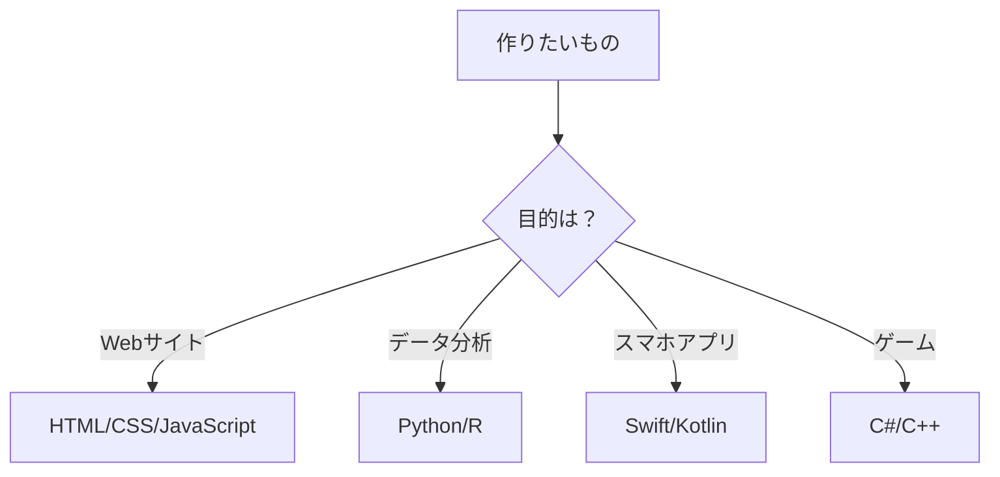
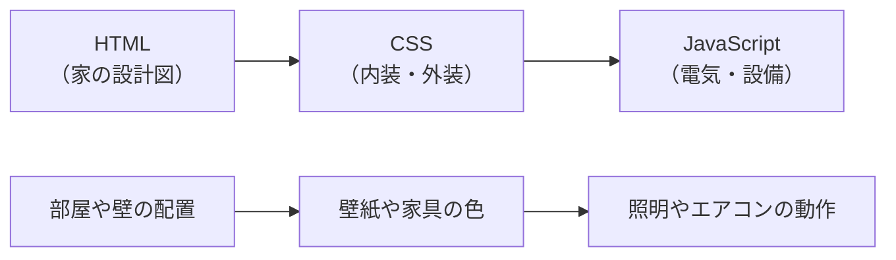
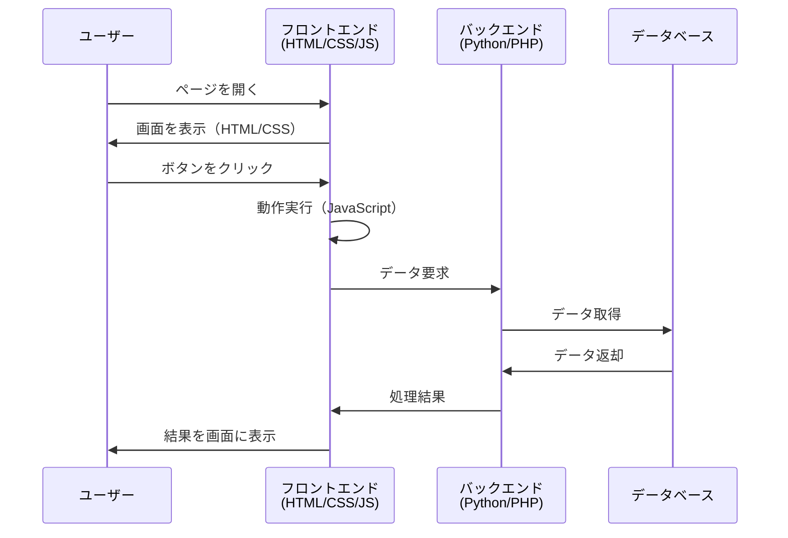

# プログラミング言語という道具箱

## はじめに

大工さんが家を建てるとき、のこぎり、かなづち、ドライバーなど、目的に応じて適切な道具を選びます。Web開発の世界でも同じように、作りたいものや解決したい問題に応じて、最適な**プログラミング言語**や**マークアップ言語**という道具を選択します。

この章では、なぜたくさんのプログラミング言語が存在するのか、Web開発でよく使われる技術（言語・マークアップ・スタイルシート）の特徴と役割分担について学びます。

## 📊 この章の重要度：🟡 推奨

**Webディレクターにとって：**
- 開発言語の選択理由を理解できる
- 技術的な会話でよく出る言語名を覚えられる
- 習得目安：プロジェクト開始前までに

## あなたがこれを知ると変わること

**技術選択の会話での変化：**
- 開発者：「この機能はPythonで実装します」
- あなた（修得前）：「Pythonって何ですか？」
- あなた（修得後）：「データ処理が得意だからですね」

**プロジェクト企画での変化：**
- 以前：「とにかく動けばいいです」
- 今後：「スマホ対応が重要なので、JavaScript重視でお願いします」

**問題発生時の変化：**
- 以前：「動きません」
- 今後：「JavaScriptのエラーが出ているようです」

## なぜたくさんの言語があるの？

### 道具箱の比喩で理解する

大工道具で考えてみましょう：

**大工の道具箱：**
- **のこぎり**：木を切る専門道具
- **かなづち**：釘を打つ専門道具
- **ドライバー**：ネジを回す専門道具

**Web開発の道具箱：**
- **Python**：データ分析や**AI**（人工知能）の専門道具（プログラミング言語）
- **JavaScript**：Webサイトに動きをつける専門道具（プログラミング言語）
- **HTML/CSS**：Webページの構造と見た目を作る専門道具（マークアップ言語・スタイルシート言語）



### 言語が生まれる背景

新しいプログラミング言語が生まれる理由：

1. **特定の用途を簡単にするため**
   - **PHP**：動的なWebサイトを簡単に作れるように設計
   - **Swift**：iOSアプリ開発を効率化するためにAppleが開発
   - **TypeScript**：JavaScriptに型の安全性を追加

2. **特定の問題を解決するため**
   - **Rust**：メモリ安全性とスピードの両立（システムの安定性）
   - **Go**：大規模システムでの並行処理を簡単に
   - **Kotlin**：Javaの冗長性を解消し、より安全に

3. **開発者の体験を改善するため**
   - 「もっと簡潔に書けるように」（Python）
   - 「もっとエラーを防げるように」（TypeScript）
   - 「もっと高速に動作するように」（Rust、Go）

## Web開発でよく使われる技術（言語・マークアップ・スタイルシート）

### フロントエンド（ユーザーが見る部分）

> **💡 技術的な補足**  
> 厳密に言うと、HTMLとCSSは「プログラミング言語」ではなく、それぞれ「マークアップ言語」「スタイルシート言語」と呼ばれます。ただし、Web開発において重要な技術であることに変わりはありません。

**HTML（エイチティーエムエル）**
- 正式名称：HyperText Markup Language
- 分類：マークアップ言語
- 役割：Webページの**骨組み**を作る
- 例え：家の柱や壁の構造

```html
<h1>見出し</h1>
<p>段落の文章です</p>
<button>クリックしてください</button>
```

**CSS（シーエスエス）**
- 正式名称：Cascading Style Sheets
- 分類：スタイルシート言語
- 役割：Webページの**見た目**を装飾
- 例え：家の壁紙や塗装

```css
h1 {
    color: blue;          /* 文字を青色に */
    font-size: 24px;      /* 文字サイズを24pxに */
}
```

**JavaScript（ジャバスクリプト）**
- 分類：プログラミング言語
- 役割：Webページに**動き**や**機能**を追加
- 例え：家の電気やエアコンなどの設備

```javascript
// ボタンがクリックされたときの動作
button.onclick = function() {
    alert("ボタンが押されました！");
}
```

### バックエンド（裏で動く部分）

**Python（パイソン）**
- 特徴：**初心者にやさしい**、データ処理が得意
- 使用例：ログイン機能、データベース操作

**PHP（ピーエイチピー）**
- 特徴：Web開発に特化、多くのサイトで使用
- 使用例：WordPressなどの**CMS**（コンテンツ管理システム）

**Java（ジャバ）**
- 特徴：大規模システムに強い、企業システムでよく使用
- 使用例：銀行システム、ECサイトの基盤

## HTML・CSS・JavaScriptの役割分担

### 家づくりの比喩で理解

Webサイトを家づくりに例えてみましょう：



**HTML：家の骨組み（構造）**
- 部屋の配置、壁、ドア、窓の位置
- 「何がどこにあるか」を決める
- 例：リビング、キッチン、寝室の配置

**CSS：内装・外装（見た目）**
- 壁の色、床材、カーテンのデザイン
- 「どう見えるか」を決める
- 例：白い壁、フローリングの床、青いカーテン

**JavaScript：電気・設備（機能）**
- 照明のスイッチ、エアコンの温度調整、インターホン
- 「どう動くか」を決める
- 例：ボタンを押すと照明が点く、センサーで自動ドアが開く


## 言語選択の考え方

### プロジェクトに応じた選択

**シンプルなコーポレートサイト：**
- HTML + CSS + 少しのJavaScript
- WordPressなどの**CMS**を活用

**ECサイト：**
- フロント：HTML + CSS + JavaScript
- バック：PHP や Python でショッピングカート機能

**データドリブンなサイト：**
- フロント：JavaScript（**React**、**Vue.js**、**Next.js**などの**フレームワーク**）
- バック：Python でデータ分析・AI機能



### チーム体制への影響

**言語選択がチームに与える影響：**

1. **学習コスト**
   - 新しい言語 → 学習時間が必要
   - 慣れた言語 → すぐに開発開始

2. **採用・人材確保**
   - 人気言語 → エンジニアが見つかりやすい
   - 専門言語 → 特定スキルを持つ人材が必要

3. **保守・運用**
   - 将来の機能追加やバグ修正
   - チーム内での知識共有

## まとめ

### この章で学んだこと

1. **プログラミング言語は専門道具**
   - 目的に応じて最適な言語を選択
   - 万能な言語は存在しない

2. **Web開発の基本3技術**
   - HTML：構造（骨組み）- マークアップ言語
   - CSS：見た目（装飾）- スタイルシート言語  
   - JavaScript：動作（機能）- プログラミング言語

3. **言語選択の重要性**
   - プロジェクトの性質
   - チームのスキル
   - 将来の拡張性

### 次のステップ

次章では、これらの技術を使った開発がどのように**ライブラリ**や**パッケージ**という仕組みで効率的に行われるかを学びます。車輪の再発明をしない、現代的な開発手法の基本概念を理解していきましょう。

### 🎯 実践のヒント

**開発者との会話で使える知識：**
- 「フロントエンドの修正」→ HTML/CSS/JavaScript の変更
- 「バックエンドの処理」→ サーバー側の言語（Python/PHP等）での処理
- 「レスポンシブ対応」→ CSS でのスマホ表示対応

**企画時の考慮点：**
- 複雑な機能 → JavaScript やバックエンド言語が必要
- シンプルな情報サイト → HTML/CSS 中心で十分
- データ活用 → Python などデータ処理言語が有効