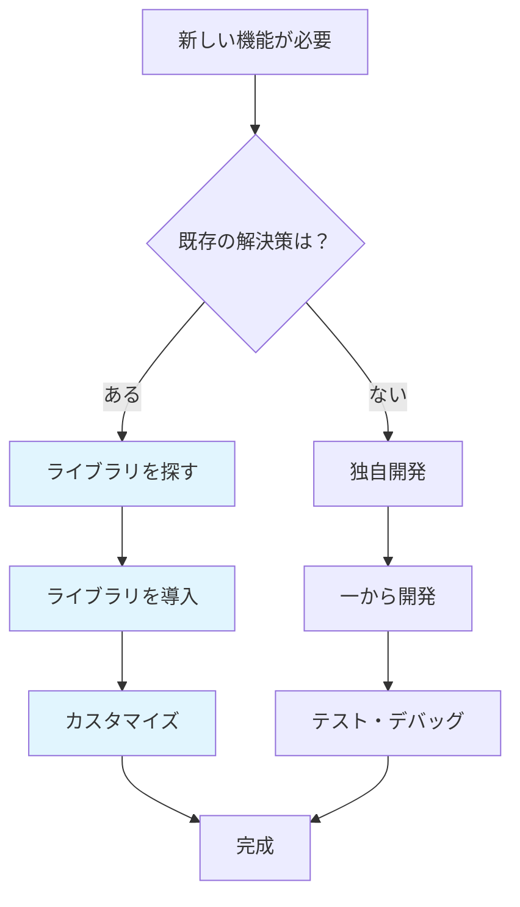
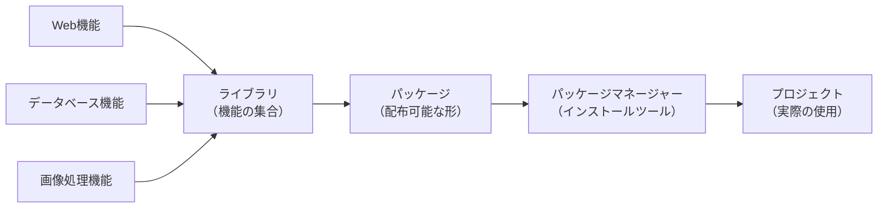
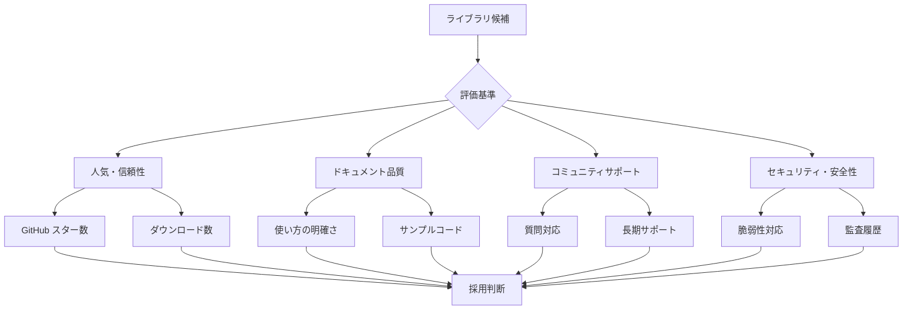

# ライブラリとパッケージの基本概念

## はじめに

料理をするとき、醤油や味噌などの調味料を毎回手作りする人はいません。既に作られた調味料を買ってきて、それを組み合わせて料理を作ります。プログラミングの世界でも同じように、**ライブラリ**や**パッケージ**という「既に作られた部品」を活用して、効率的に開発を行います。

この章では、なぜ車輪の再発明をしないのか、ライブラリとパッケージの基本概念、そして実際のプロジェクトでの活用例について学びます。

## 📊 この章の重要度：🟡 推奨

**Webディレクターにとって：**
- 開発効率に直結する重要な概念
- 技術選定やリスク評価で必要な知識
- 習得目安：プロジェクト企画段階までに

## あなたがこれを知ると変わること

**開発期間の相談での変化：**
- 開発者：「認証機能の実装に2週間かかります」
- あなた（修得前）：「なぜそんなにかかるのですか？」
- あなた（修得後）：「既存のライブラリを使えば短縮できませんか？」

**技術選定の会話での変化：**
- 開発者：「この機能にはFlaskというライブラリを使います」
- あなた（修得前）：「Flask...?」
- あなた（修得後）：「Web開発が効率的になりますね」

**リスク管理での変化：**
- 以前：「ライブラリって何がリスクなの？」
- 今後：「そのライブラリは継続的にメンテナンスされていますか？」

**セキュリティの会話での変化：**
- 開発者：「この古いライブラリは脆弱性があります」
- あなた（修得前）：「脆弱性って何ですか？」
- あなた（修得後）：「最新版に更新するか、代替ライブラリを検討しましょう」

## 車輪の再発明をしない考え方

### 日常生活での例

**料理での例：**
- ❌ **車輪の再発明**：醤油を使うために大豆から育てる
- ✅ **効率的な方法**：醤油を買ってきて料理に使う

**引っ越しでの例：**
- ❌ **車輪の再発明**：段ボール箱を自分で作る
- ✅ **効率的な方法**：段ボール箱を買ってきて使う

**プログラミングでの例：**
- ❌ **車輪の再発明**：ログイン機能を一から作る
- ✅ **効率的な方法**：認証ライブラリを使ってログイン機能を実装



### 車輪の再発明をしない理由

**1. 開発時間の短縮**
- 既存のライブラリ：数時間〜数日で導入
- 独自開発：数週間〜数ヶ月

**2. 品質の向上**
- 多くの人が使ってテスト済み
- バグが発見されて修正済み
- セキュリティ対策が施されている

**3. メンテナンスの軽減**
- ライブラリの更新で機能改善
- セキュリティパッチの自動適用
- コミュニティによるサポート

## ライブラリとパッケージの基本概念

### ライブラリとは

**ライブラリ**：特定の機能をまとめた**プログラムの部品集**

**図書館（Library）の例え：**
- 図書館：さまざまな本を集めた場所
- プログラムのライブラリ：さまざまな機能を集めた場所

> **💡 ライブラリとフレームワークの違い**  
> - **ライブラリ**：あなたがライブラリの機能を呼び出して使う（道具を使う感覚）
> - **フレームワーク**：フレームワークがあなたのコードを呼び出す（枠組みに従う感覚）
> - Flask：**フレームワーク**（Web開発の枠組みを提供）
> - requests：**ライブラリ**（HTTP通信の機能を提供）

**私たちのプロジェクトでの例：**

```python
# app.py より
from flask import Flask, render_template, request
```

**Flask**というライブラリから：
- `Flask`：Webアプリケーションの基本機能
- `render_template`：HTMLファイルを表示する機能
- `request`：ユーザーからの情報を受け取る機能

### パッケージとは

**パッケージ**：ライブラリを**配布・管理しやすくまとめたもの**

**宅配便の例え：**
- 商品：ライブラリ（プログラムの機能）
- 宅配便のパッケージ：配送しやすくまとめた形
- プログラムのパッケージ：インストールしやすくまとめたライブラリ



## 組み込みライブラリ vs 外部ライブラリ

### 組み込みライブラリ（標準ライブラリ）

**特徴：**
- プログラミング言語に**最初から含まれている**
- 追加インストール不要
- 基本的な機能を提供

**Pythonの組み込みライブラリ例：**
```python
import os        # ファイル・フォルダ操作
import csv       # CSVファイル読み書き
import json      # JSONデータ処理
import datetime  # 日付・時刻処理
```

### 外部ライブラリ（サードパーティ・ライブラリ）

**特徴：**
- 個人や企業が作成・公開
- 別途インストールが必要
- 専門的・高度な機能を提供

**私たちのプロジェクトの外部ライブラリ例：**

```python
# requirements.txt より
Flask==2.3.3              # Webアプリケーション作成
Flask-SQLAlchemy==3.0.5    # データベース操作
```

**現代的な人気外部ライブラリ例（2025年）：**

```python
# AI・機械学習
import openai              # ChatGPT API
import requests            # HTTP通信
import pandas              # データ分析

# Web開発
import fastapi             # 高速Web API
import streamlit           # データアプリ作成
import django              # 大規模Web開発

# ユーティリティ
import python-dotenv       # 環境変数管理
import pytest              # テスト自動化
```

### 比較表

| 項目 | 組み込みライブラリ | 外部ライブラリ |
|------|-------------------|----------------|
| **インストール** | 不要 | 必要 |
| **機能範囲** | 基本的 | 専門的・高度 |
| **安定性** | 高い | ライブラリによる |
| **更新頻度** | 言語と同期 | 独立 |
| **学習コスト** | 低い | 高い場合がある |


## ライブラリ活用の実例

### 私たちのプロジェクトでの活用

**1. Flaskライブラリ（Webアプリケーション）**

```python
# 独自開発した場合（簡略版）
def handle_web_request():
    # HTTPリクエスト解析
    # ルーティング処理
    # レスポンス生成
    # エラーハンドリング
    pass  # 数百行のコードが必要

# Flaskライブラリを使った場合
from flask import Flask
app = Flask(__name__)

@app.route('/')
def index():
    return "Hello World!"  # たった数行で完成
```

**2. SQLAlchemyライブラリ（データベース）**

```python
# 独自開発した場合
def save_to_database(data):
    # SQL文作成
    # データベース接続
    # エラーハンドリング
    # 接続クローズ
    pass  # 複雑な処理が必要

# SQLAlchemyライブラリを使った場合
job = Job(title="エンジニア", company="ABC会社")
db.session.add(job)
db.session.commit()  # シンプルに保存完了
```

### ライブラリ選択の基準

**1. 人気・信頼性**
- GitHub スター数
- ダウンロード数
- 更新頻度

**2. ドキュメント品質**
- 使い方が明確
- サンプルコードが豊富
- 日本語情報の有無
- チュートリアルの充実度

**3. コミュニティサポート**
- 質問サイトでの回答数
- バグレポートの対応速度
- 長期メンテナンス方針

**4. セキュリティ・安全性**
- 脆弱性の報告・修正履歴
- セキュリティ監査の有無
- 依存関係の安全性



## 現代開発でのライブラリ活用

### 専門ライブラリの組み合わせ

**従来の考え方：**
- 1つの大きなツールですべてを解決

**現代の考え方：**
- 小さな専門ライブラリを組み合わせ

**私たちのプロジェクトの例：**
```python
Flask           # Webフレームワーク（専門：HTTP処理）
+ SQLAlchemy    # データベース（専門：DB操作）
+ Jinja2        # テンプレート（専門：HTML生成）
= 完全なWebアプリ
```

**現代的なWeb開発の例（2025年）：**
```python
FastAPI         # 高速API（専門：REST API）
+ SQLAlchemy    # データベース（専門：DB操作）
+ OpenAI        # AI機能（専門：自然言語処理）
+ Streamlit     # フロントエンド（専門：データ可視化）
= AI搭載Webアプリ
```

### ライブラリ選択時の注意点

**Webディレクターとして知っておくべきこと：**

1. **人気・信頼性の確認**
   - 多くの人が使っているか
   - 継続的に更新されているか

2. **学習コストの考慮**
   - チームが習得しやすいか
   - ドキュメントが充実しているか

3. **セキュリティリスクの評価**
   - 脆弱性の報告と対応履歴
   - 定期的なセキュリティアップデート
   - 依存関係の安全性確認

4. **将来性の検討**
   - 長期的にサポートされるか
   - 代替手段があるか
   - ライセンスの商用利用可否

## まとめ

### この章で学んだこと

1. **車輪の再発明をしない理由**
   - 開発時間の短縮
   - 品質の向上
   - メンテナンスの軽減

2. **ライブラリとパッケージの概念**
   - ライブラリ：機能の部品集
   - パッケージ：配布可能な形にまとめたもの
   - 組み込み vs 外部ライブラリ

3. **ライブラリ活用の実践**
   - 適切なライブラリ選択の基準
   - セキュリティリスクの評価方法
   - 専門ライブラリの組み合わせ方
   - Webディレクターとしての選択判断

### 次のステップ

次章では、ライブラリを実際に管理する**パッケージ管理**の概念について学びます。パッケージマネージャーやバージョン管理など、チーム開発で重要な仕組みを理解していきましょう。

### 🎯 実践のヒント

**開発者との会話で使える知識：**
- 「そのライブラリは人気がありますか？」
- 「習得しやすいライブラリですか？」
- 「セキュリティ面で問題ありませんか？」
- 「代替ライブラリの選択肢はありますか？」
- 「AI関連のライブラリも検討できますか？」

**プロジェクト企画時の考慮点：**
- ライブラリ選定・評価時間を開発期間に含める
- チームの学習コストを予算・スケジュールに組み込む
- セキュリティ監査とアップデート計画の策定
- 長期保守とライセンス費用の検討

**ライブラリ選択のチェックポイント（2025年版）：**
- 多くの人が使っている（GitHub スター・ダウンロード数）
- ドキュメントが充実している（チュートリアル・日本語情報）
- 継続的に更新されている（最終更新・リリース頻度）
- セキュリティが確保されている（脆弱性対応・監査履歴）
- AI・機械学習対応（必要に応じて）