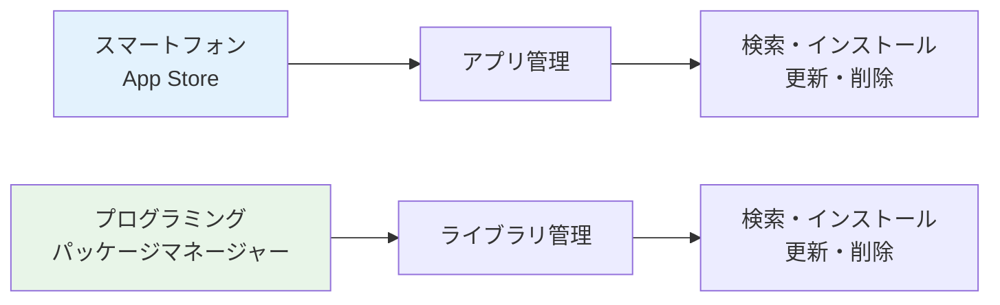
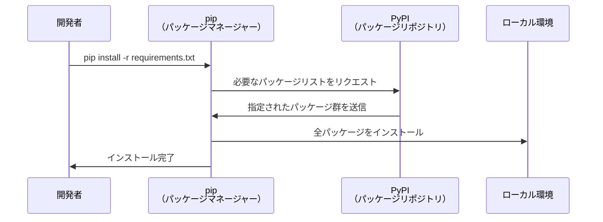
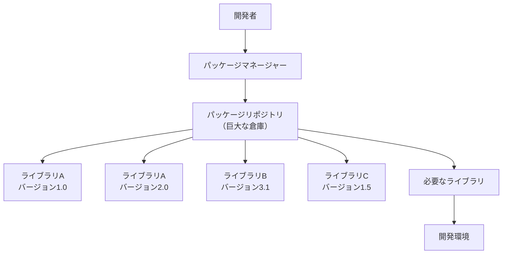
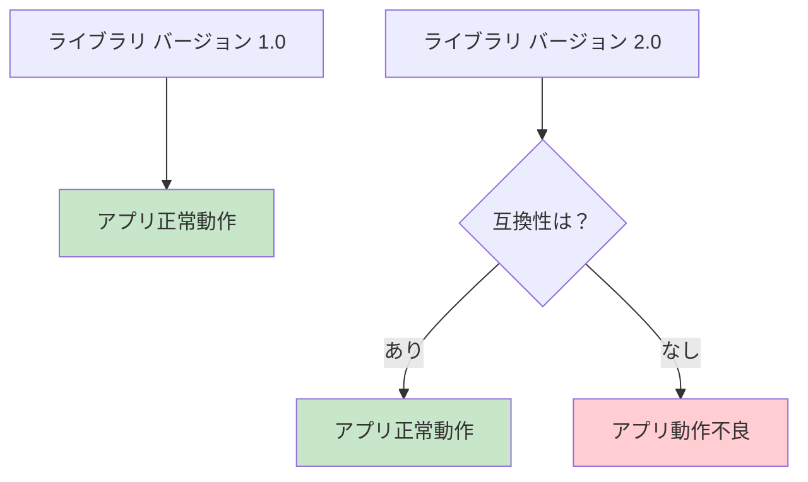
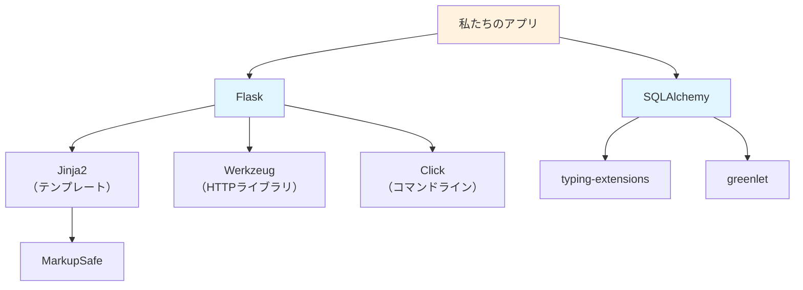
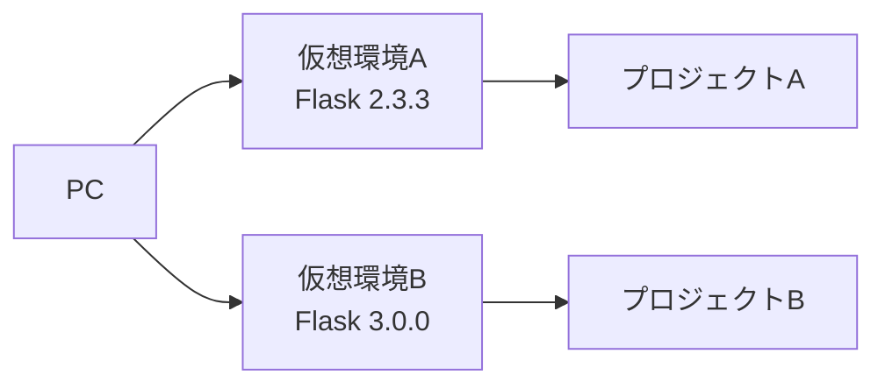
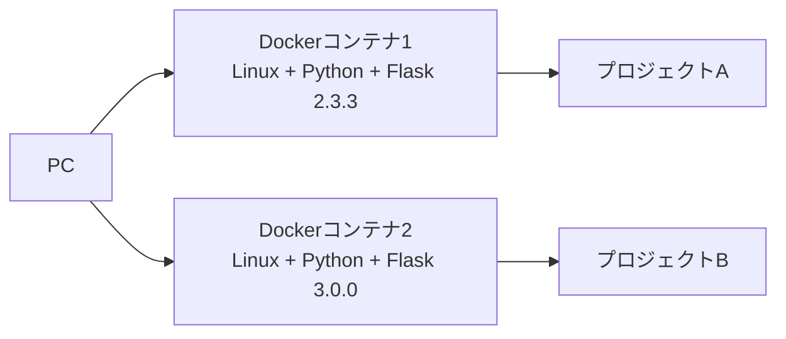
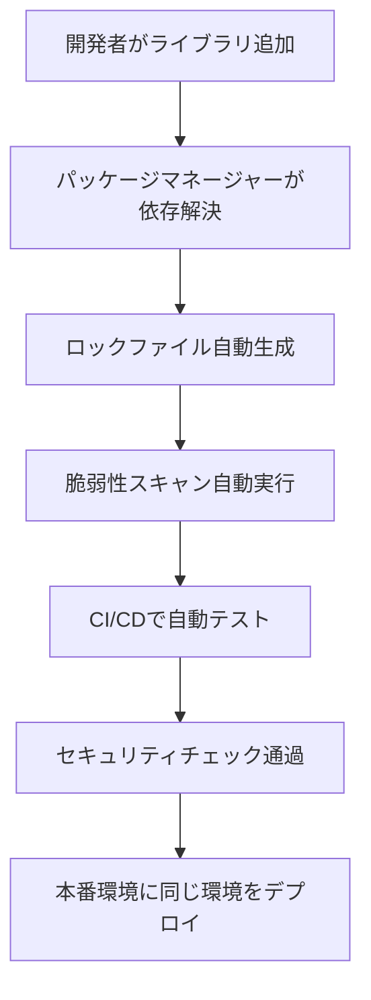

# パッケージ管理の概念

## はじめに

前章でライブラリとパッケージの基本概念を学びました。しかし、実際の開発現場では、数十から数百のライブラリを組み合わせてプロジェクトを構築します。これらを手動で管理するのは非現実的です。そこで重要になるのが**パッケージ管理**という仕組みです。

この章では、パッケージマネージャーの役割、バージョン管理の重要性、そして実際のプロジェクトでの管理手法について学びます。

## 📊 この章の重要度：🟢 応用

**Webディレクターにとって：**
- チーム開発での環境統一に関わる重要な概念
- 技術的リスク管理で必要な知識
- 習得目安：プロジェクト運用段階で

## あなたがこれを知ると変わること

**開発環境の問題発生時の変化：**
- 開発者：「私の環境では動くのですが...」
- あなた（修得前）：「え、なぜ？」
- あなた（修得後）：「パッケージのバージョンが違うのでは？」

**プロジェクト計画での変化：**
- 以前：「ライブラリの更新は考えていませんでした」
- 今後：「セキュリティアップデートの時間も確保しましょう」

**リスク管理での変化：**
- 以前：「ライブラリって何がリスクなの？」
- 今後：「依存関係の複雑化やセキュリティパッチを考慮しましょう」

**AI/MLプロジェクトでの変化：**
- 開発者：「AI機能にはtensorflowとpytorchが必要です」
- あなた（修得前）：「両方必要なのですか？」
- あなた（修得後）：「用途を分けて必要最小限に絞りましょう」

## パッケージマネージャーとは

### 基本概念

**パッケージマネージャー**：ライブラリの**インストール・更新・削除を自動化するツール**

**スマートフォンアプリストアとの比較：**

| 機能 | スマートフォン | プログラミング |
|------|---------------|----------------|
| **アプリ探索** | App Store検索 | パッケージリポジトリ検索 |
| **インストール** | タップでインストール | コマンド一発でインストール |
| **アップデート** | 自動/手動更新 | バージョン指定更新 |
| **削除** | 長押しで削除 | アンインストールコマンド |
| **依存関係** | 自動解決 | 自動解決 |



### 主要なパッケージマネージャー

**言語別の代表的なツール（2025年現在）：**

- **Python**：pip、conda、poetry（現代的な選択肢）、uv（Rust製の超高速ツール）
- **JavaScript**：npm、yarn、pnpm（pnpmが高速で人気上昇中）
- **PHP**：Composer
- **Ruby**：RubyGems、Bundler
- **Java**：Maven、Gradle
- **Go**：go mod（モジュール管理）
- **Rust**：Cargo（高速・安全性重視）

**なぜ言語ごとに違うの？**
- 各言語の特性に合わせた最適化
- 開発コミュニティの文化の違い
- 技術的な要件の違い

## 実際のパッケージ管理

### 私たちのプロジェクトでの例

**requirements.txt（依存関係ファイル）**
```
Flask==2.3.3
Flask-SQLAlchemy==3.0.5
```

**このファイルの役割：**
- プロジェクトが必要とするライブラリのリスト
- チーム全員が同じ環境を構築するための設計図
- 本番環境と開発環境の統一

**実際の管理フロー：**



### パッケージリポジトリの概念

**パッケージリポジトリ**：ライブラリを保管・配布する**巨大な倉庫**

**主要なリポジトリ（2025年現在）：**
- **PyPI**（Python）：50万以上のパッケージ
- **npm**（JavaScript）：250万以上のパッケージ
- **Packagist**（PHP）：35万以上のパッケージ
- **Crates.io**（Rust）：15万以上のパッケージ
- **Go Modules**（Go）：100万以上のモジュール

**倉庫の例え：**


## バージョン管理の重要性

### バージョン指定の方法

**さまざまな指定方法：**
```
Flask==2.3.3     # 完全一致（推奨）
Flask>=2.3.0     # 2.3.0以上（危険な場合あり）
Flask~=2.3.0     # 2.3.x系列（安全な範囲で更新）
Flask<3.0.0      # 3.0.0未満（メジャー更新を避ける）
```

### なぜバージョン管理が重要？

**1. 互換性の確保**



**実例：**
- 古いバージョン：動作するが新機能が使えない
- 新しいバージョン：新機能追加だが互換性の問題がある場合も

**2. セキュリティ対策**

```
CVE-2023-XXXX: Flask 2.2.0以下にセキュリティ脆弱性発見
→ Flask 2.3.3で修正済み
→ 緊急アップデートが必要
```

**3. チーム開発での統一**

**問題のあるケース：**
```
開発者A：Flask 2.3.3 → 正常動作
開発者B：Flask 2.4.0 → エラー発生
開発者C：Flask 2.2.5 → 一部機能が動かない
```

**解決方法：**
```
requirements.txt で Flask==2.3.3 と固定
→ 全員が同じ環境で開発
```

## 依存関係の複雑さ

### 依存関係とは

**依存関係**：ライブラリが他のライブラリを必要とする関係

**日常の例え：**
```
カレーを作る場合：
カレールー → 必要な材料 → 肉、野菜、米
      ↓
Flask → 必要なライブラリ → Jinja2、Werkzeug、Click
```

### 依存関係の連鎖



**実際のカウント：**
- 直接使用：Flask、SQLAlchemy（2個）
- 間接的に必要：Jinja2、Werkzeug、Click、greenlet等（10個以上）

### 依存関係地獄（Dependency Hell）

**問題のパターン：**

1. **バージョン競合**
   ```
   ライブラリA：Pythonライブラリ X >=2.0が必要
   ライブラリB：Pythonライブラリ X <2.0が必要
   → 解決不可能
   ```

2. **循環依存**
   ```
   ライブラリA → ライブラリB が必要
   ライブラリB → ライブラリA が必要
   → 無限ループ
   ```

**対策：**
- パッケージマネージャーによる自動解決
- ライブラリの慎重な選択
- 定期的な依存関係の見直し

## 現代的なパッケージ管理戦略

### 環境分離の手法

**環境分離**：プロジェクトごとに**独立したライブラリ環境**を作る仕組み

**1. 仮想環境（従来手法）**

**なぜ必要？**
```
プロジェクトA：Flask 2.3.3 が必要
プロジェクトB：Flask 3.0.0 が必要
→ 同じPCで両方を動かしたい
```

**解決方法：**


**2. コンテナ技術（現代的手法）**

**Docker**：アプリケーションと環境を**完全に分離**する仕組み



**コンテナの利点：**
- 開発環境と本番環境の完全一致
- OS レベルでの分離によるより強固な独立性
- クラウド環境への容易なデプロイメント

### ロックファイルの概念

**ロックファイル**：実際にインストールされた**正確なバージョンを記録**するファイル

**requirements.txt（指定）vs requirements.lock（実際）**
```
requirements.txt:    # 開発者の指定
Flask>=2.3.0

requirements.lock:    # 実際にインストールされたもの
Flask==2.3.3
Jinja2==3.1.2
Werkzeug==2.3.7
...（全ての依存関係を含む）
```

### 自動化ツールの活用

**現代的なワークフロー（2025年版）：**



**セキュリティ強化の要素：**
- **依存関係スキャン**：脆弱性の自動検出
- **ライセンス監査**：商用利用可否の自動確認
- **アップデート通知**：セキュリティパッチの即座な通知

**Webディレクターが知っておくべきポイント：**
- 自動化により人的ミスを削減
- 環境の一貫性が品質向上に直結
- セキュリティアップデートの重要性
- AI/MLライブラリの管理複雑性

## プロジェクトでのリスク管理

### 主なリスク

**1. メンテナンス停止**
- **リスク**：ライブラリの開発が止まる
- **対策**：人気で活発なプロジェクトを選ぶ
- **判断材料**：GitHubスター数、最終更新日、コミット頻度

**2. セキュリティ脆弱性**
- **リスク**：セキュリティホールの発見
- **対策**：定期的なセキュリティアップデート
- **判断材料**：セキュリティ情報の監視

**3. ライセンス問題**
- **リスク**：商用利用に制限があるライセンス
- **対策**：ライセンス条件の事前確認
- **判断材料**：MIT、Apache、BSD等の確認

**4. サプライチェーン攻撃（2025年の新しい脅威）**
- **リスク**：悪意のあるコードが混入したライブラリ
- **対策**：信頼できるソースからのみインストール
- **判断材料**：パッケージの発行者確認、ダウンロード数

**5. AI/MLライブラリの特殊リスク**
- **リスク**：巨大なライブラリサイズ、GPU依存性
- **対策**：必要最小限のライブラリ選択
- **判断材料**：ライブラリサイズ、ハードウェア要件

### Webディレクターとしての対応

**技術選定時のチェックポイント（2025年版）：**
1. そのライブラリは継続的にメンテナンスされているか？
2. セキュリティアップデートの仕組みはあるか？
3. ライセンス条件は商用利用に問題ないか？
4. サプライチェーン攻撃対策は十分か？
5. AI/MLライブラリの場合、ハードウェア要件は適切か？

**プロジェクト計画での考慮点：**
- ライブラリアップデートの時間を開発計画に含める
- セキュリティ情報の定期監視体制を整える
- 代替ライブラリの調査も並行して行う
- 脆弱性スキャンの自動化を導入する
- AI/MLプロジェクトではインフラコストも考慮する

## まとめ

### この章で学んだこと

1. **パッケージマネージャーの役割**
   - ライブラリの自動インストール・管理
   - 依存関係の自動解決
   - チーム開発での環境統一

2. **バージョン管理の重要性**
   - 互換性の確保
   - セキュリティ対策
   - 再現可能な環境構築

3. **現代的な管理手法**
   - 仮想環境・コンテナによる環境分離
   - ロックファイルによる正確な記録
   - セキュリティスキャンの自動化
   - CI/CDパイプラインとの統合

### 次のステップ

次章では、開発中に必ず遭遇する**エラーメッセージ**との上手な付き合い方を学びます。エラーは敵ではなく、問題解決のヒントを教えてくれる友達であることを理解していきましょう。

### 🎯 実践のヒント

    **開発者との会話で使える知識（2025年版）：**
- 「パッケージのバージョンは固定していますか？」
- 「セキュリティスキャンは自動化されていますか？」
- 「コンテナ技術を使った環境分離は検討しましたか？」
- 「AI/MLライブラリのインフラコストは算出されていますか？」
- 「サプライチェーン攻撃対策はありますか？」

**プロジェクト管理での活用：**
- セキュリティアップデート・スキャン時間を開発計画に含める
- ライブラリ選定時の評価基準を設ける（セキュリティ重視）
- 環境構築の自動化でトラブル削減
- AI/MLプロジェクトではインフラコストも予算に組み込む

**リスク管理のポイント（2025年版）：**
- 人気で活発なライブラリを選択
- ライセンス条件とサプライチェーンの確認
- セキュリティ情報の自動監視体制
- 脆弱性スキャンの定期実行
- AI/MLライブラリの依存関係最適化