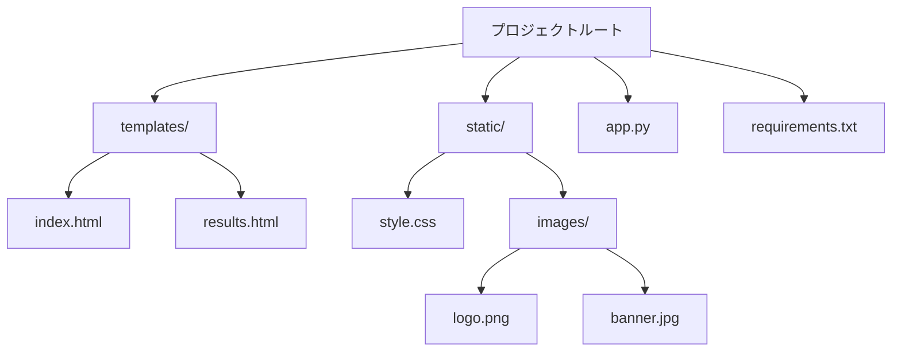
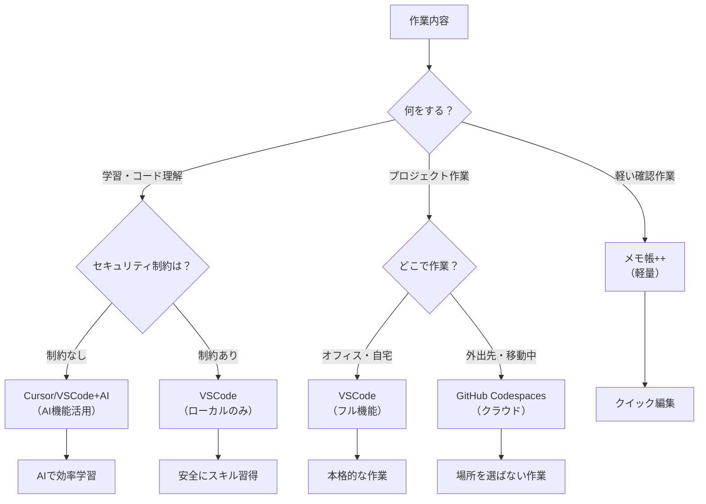

# テキストエディタとIDE

## はじめに

これまでプログラミングの概念について学んできました。今度は、実際にコードを見たり、設定ファイルを編集したりするためのツールについて学びましょう。普段私たちが使っているメモ帳とプログラミング用のエディタには、大きな違いがあります。

この章では、メモ帳とプログラミング用エディタの違い、初心者におすすめのツール、そして基本的な設定方法について学びます。

## 📊 この章の重要度：🟡 推奨

**Webディレクターにとって：**
- 開発者とのコミュニケーションで必要
- 設定ファイルの確認・編集で使用
- 習得目安：実際の業務開始時までに

## あなたがこれを知ると変わること

**ファイル確認での変化：**
- 開発者：「このHTMLファイルを確認してください」
- あなた（修得前）：「メモ帳で開きますね」
- あなた（修得後）：「VSCodeで開いて構造を確認しますね」

**設定変更での変化：**
- 開発者：「設定ファイルのこの値を変更してください」
- あなた（修得前）：「どこを変更すればいいかわかりません」
- あなた（修得後）：「ハイライトがあるので変更箇所がすぐわかります」

**プロジェクト理解での変化：**
- 以前：「ファイルがたくさんあってよくわからない...」
- 今後：「フォルダ構造がツリー表示で一目瞭然です」

## メモ帳とプログラミング用エディタの違い

### 基本的な違い

**文書作成 vs コード編集**

メモ帳は**文章を書く**ためのツール、プログラミング用エディタは**コードを書く・読む**ためのツールです。


### 実際の表示例

**同じHTMLファイルをそれぞれで開いた場合：**

**メモ帳での表示：**
```
<!DOCTYPE html>
<html>
<head>
<title>ページのタイトル</title>
</head>
<body>
<h1>見出し</h1>
<p>段落の文章です</p>
</body>
</html>
```
→ 全て同じ色、構造がわかりにくい

**プログラミングエディタでの表示：**
```html
<!DOCTYPE html>                    <!-- 宣言：灰色 -->
<html>                             <!-- タグ：青色 -->
<head>                             <!-- タグ：青色 -->
    <title>ページのタイトル</title>    <!-- 内容：黒色 -->
</head>                            <!-- タグ：青色 -->
<body>                             <!-- タグ：青色 -->
    <h1>見出し</h1>                 <!-- 見出し：紫色 -->
    <p>段落の文章です</p>           <!-- 段落：黒色 -->
</body>                            <!-- タグ：青色 -->
</html>                            <!-- タグ：青色 -->
```
→ 色分け・インデントで構造が一目瞭然

## プログラミング用エディタの主な機能

### 1. シンタックスハイライト

**シンタックスハイライト**：コードの種類によって**色分け**する機能

**効果：**
- タグ、属性、内容が色で区別される
- エラーを見つけやすくなる
- 全体の構造が理解しやすくなる

**例：CSSファイル**
```css
/* コメント：緑色 */
h1 {                    /* セレクタ：茶色 */
    color: blue;        /* プロパティ：青色、値：赤色 */
    font-size: 24px;    /* プロパティ：青色、値：赤色 */
}
```

### 2. オートインデント

**オートインデント**：自動的に**段落**を揃える機能

**手動の場合：**
```html
<div>
<h1>見出し</h1>
<p>段落です</p>
</div>
```

**オートインデントの場合：**
```html
<div>
    <h1>見出し</h1>        <!-- 自動的に空白が追加 -->
    <p>段落です</p>         <!-- 構造がわかりやすい -->
</div>
```

### 3. ファイルツリー表示

**ファイルツリー**：プロジェクトの**フォルダ構造**を左側に表示



### 4. 検索・置換機能

**高度な検索機能：**
- **ファイル内検索**：現在のファイル内で文字列を探す
- **プロジェクト横断検索**：全ファイルから文字列を探す
- **正規表現対応**：パターンマッチング検索

**実用例：**
```
検索：<h1>
結果：プロジェクト内の全ての見出しタグを表示
```

## 初心者におすすめのツール

### 1. Visual Studio Code（VSCode）

**特徴：**
- **無料**で高機能
- **マイクロソフト製**で安心
- 豊富な拡張機能

**おすすめする理由：**
- 学習コストが低い
- 日本語対応
- Web開発に最適化

**活用場面：**
- HTMLファイルの確認
- CSSファイルの簡単な修正
- JSONファイルの設定変更

### 2. AI搭載エディタ（2025年の新潮流）

**Cursor（専用AIエディタ）**
- **特徴：**AI機能に特化したVSCodeベースエディタ
- **メリット：**コード理解・質問が非常に自然
- **適用場面：**学習・コード解析に最適

**VSCode + AI拡張機能**
- **GitHub Copilot**：コード補完・生成
- **Claude for VSCode**：コード説明・質問対応
- **ChatGPT Extension**：幅広いAI支援

**Webディレクターにとってのメリット：**
- コードの意味をAIに質問できる
- 複雑なファイルの内容理解が簡単
- 学習効率が大幅に向上
- 企業ポリシーに応じてAIツールを選択可能

**実用例：**
```
あなた：「このJavaScriptのコードは何をしていますか？」
AI：「ユーザーがボタンをクリックした時に、
     フォームの内容をチェックして、空欄があれば
     エラーメッセージを表示する処理です」
```

### 3. メモ帳++（Notepad++）

**特徴：**
- **軽量**で高速
- メモ帳の高機能版
- インストール不要版あり

**適用場面：**
- 簡単な設定ファイル編集
- ログファイルの確認
- 軽い作業向け

### 4. クラウドベース エディタ（2025年の選択肢）

**GitHub Codespaces**
- **特徴：**ブラウザ上でVSCode環境
- **メリット：**インストール不要、どこからでもアクセス
- **適用場面：**リモートワーク、外出先での確認作業

**GitPod**
- **特徴：**GitHubプロジェクトを直接開ける
- **メリット：**環境構築不要、チーム共有が簡単
- **適用場面：**プロジェクト確認、一時的な作業

### セキュリティ考慮事項（企業使用時）

**AI機能使用時の注意点：**
- 企業の機密情報をAIに送信する前に社内ポリシーを確認
- ローカルAI（企業内AI）の利用を検討
- 個人情報・顧客情報は含めない

**推奨運用：**
- 学習目的：AIエディタを積極活用
- 実務作業：企業ポリシーに従った選択
- 機密プロジェクト：ローカルツールのみ使用

## ツール選択の指針



### 場面別の使い分け（2025年版）

**コード学習・理解：**
- **Cursor/VSCode+AI** → AIに質問しながら効率学習
- **企業環境では** → 社内ポリシーに従ったAI使用

**プロジェクト作業：**
- **オフィス・自宅：**VSCode → フォルダ構造を把握しながら作業
- **外出先・移動中：**GitHub Codespaces → ブラウザで本格作業

**緊急時の簡単編集：**
- **ローカル：**メモ帳++ → 素早く開いて修正
- **クラウド：**GitHub.dev → ブラウザで即座に編集

**セキュリティが重要な作業：**
- **ローカルツール**のみ使用 → 機密情報の流出防止

## 基本的な設定方法

### AI機能の基本活用（2025年版）

**1. Cursor でのAI活用**
```
基本操作：
1. Ctrl + L でチャット開始
2. コードを選択してから質問
3. 「このコードの説明をお願いします」
```

**2. AIへの質問例（共通）**
```
学習・理解向け：
- 「このHTMLの構造を教えてください」
- 「この設定の意味は何ですか？」
- 「エラーが出ている原因を教えてください」

実務向け：
- 「このコードの動作を日本語で要約してください」
- 「セキュリティ上の問題はありますか？」
- 「このファイルの目的は何ですか？」
```

**3. 企業利用時の注意**
```
安全な質問例：
- 一般的なHTMLタグの説明
- CSSプロパティの機能
- JavaScriptの基本文法

避けるべき質問：
- 実際の顧客データを含むコード
- 企業固有のAPIキーや設定
- 機密プロジェクトの詳細
```

## Webディレクターとしての活用方法

### 日常業務での活用

**1. 設定ファイルの確認**
```
- 色分けでJSON構造が理解しやすい
- インデントで階層関係が明確
- 検索機能で目的の設定をすぐ発見
```

**2. HTMLファイルの内容確認**
```
- タグ構造が視覚的に分かる
- 画像パスやリンク先の確認が容易
- ページ全体の構成把握が可能
```

**3. エラーログの確認**
```
- ログファイルの検索が高速
- エラーメッセージの行番号ジャンプ
- パターン検索で類似エラー発見
```

### チーム連携での効果

**開発者とのコミュニケーション向上：**
```
開発者：「line 25 の class 属性を確認してください」
あなた：「Ctrl + G で25行目にジャンプしました。
        highlight-box クラスですね」
```

**レビュー作業の効率化：**
```
- ファイル間の移動が簡単
- 変更箇所のハイライト表示
- コメント機能でフィードバック記録
```

## まとめ

### この章で学んだこと

1. **エディタの重要性**
   - メモ帳 vs プログラミングエディタの違い
   - シンタックスハイライトの効果
   - 作業効率の大幅な向上

2. **おすすめツール（2025年版）**
   - VSCode：高機能で安定、AI拡張機能豊富
   - Cursor：AI特化で学習効率向上
   - GitHub Codespaces：クラウドで場所を選ばない
   - メモ帳++：軽量で緊急時に便利

3. **実践的な活用方法（2025年版）**
   - 基本設定の調整
   - AI機能を活用した効率的な学習
   - セキュリティを考慮した企業での運用
   - クラウドエディタでの柔軟な作業環境
   - Webディレクター業務での具体的な使い方

### 次のステップ

次章では、実際にエディタを使った作業中に必ず遭遇する**エラーメッセージ**との上手な付き合い方を学びます。エラーは敵ではなく、問題解決のヒントを教えてくれる友達であることを理解していきましょう。

### 🎯 実践のヒント

**今日から始められること（2025年版）：**
- VSCodeまたはCursorをインストール
- 企業環境の場合は、AI使用ポリシーを確認
- 既存のHTMLファイルを開いて色分け効果を体験
- GitHub Codespacesで外出先での作業を試してみる

**Webディレクター業務での活用：**
- 設定ファイル確認時はプログラミングエディタを使用
- エラーレポート確認時は検索機能を活用
- 開発者との会話で行番号・ファイル名を正確に共有
- AI機能で不明なコードの理解を効率化
- クラウドエディタで場所を選ばない確認作業

**学習効率を上げるコツ（2025年版）：**
- AI機能で不明なコードを積極的に質問（企業ポリシー内で）
- 拡張機能は基本→AI→セキュリティの順で段階的に追加
- ショートカットキーを少しずつ覚える
- クラウドエディタとローカルエディタの使い分けをマスター

**セキュリティを意識した使い方：**
- 機密情報はAIに送信しない
- 企業プロジェクトでは承認されたツールのみ使用
- 個人学習とビジネス利用でツールを使い分ける