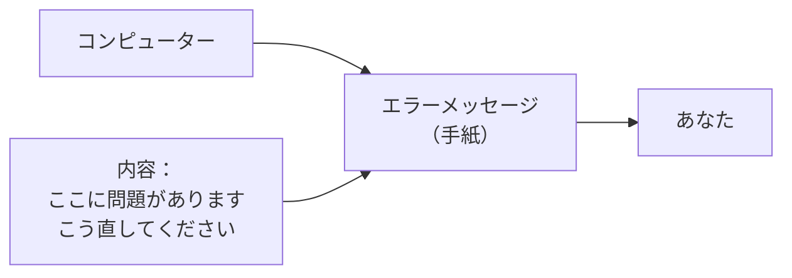
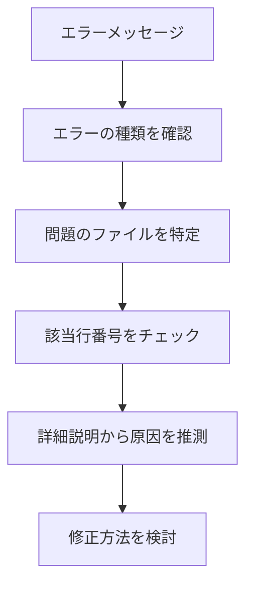
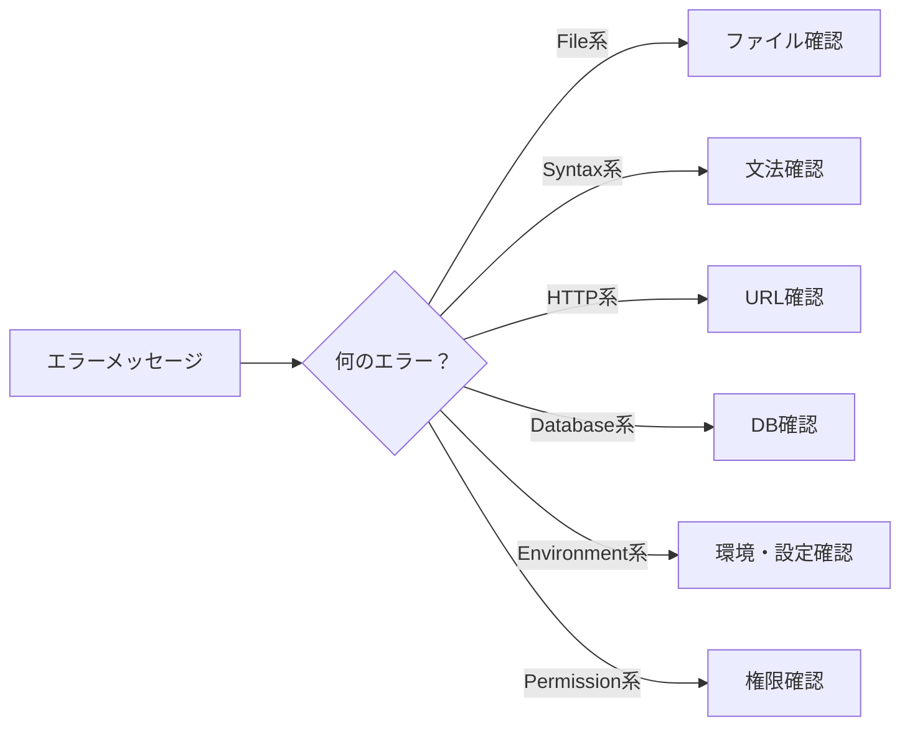
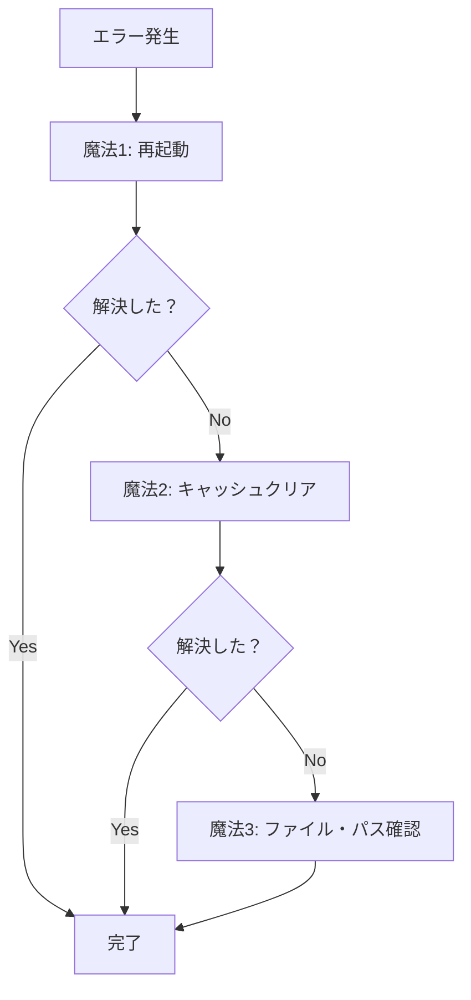

# エラーは友達：エラーメッセージの読み方

## はじめに

「エラー」と聞くと、多くの人が「何かが壊れた」「失敗した」と思いがちです。しかし、プログラミングの世界では、エラーは**問題を教えてくれる親切な友達**です。エラーメッセージは、何が問題なのか、どこを直せばいいのかを具体的に教えてくれる貴重な情報源なのです。

この章では、エラーが出ても慌てない心構え、よくあるエラーパターン、そしてエラー解決の基本的なアプローチについて学びます。

## 📊 この章の重要度：🟡 推奨

**Webディレクターにとって：**
- 開発者とのコミュニケーション向上に必須
- 問題の迅速な報告・解決に直結
- 習得目安：実際の業務で問題に遭遇する前に

## あなたがこれを知ると変わること

**エラー発生時の変化：**
- 以前：「エラーが出ました！どうしよう...」
- 今後：「404エラーですね。ファイルパスを確認しましょう」

**開発者とのやり取りの変化：**
- 以前：「なんか動きません」
- 今後：「line 15でSyntax Errorが出ています。セミコロンが抜けているようです」

**問題解決への姿勢の変化：**
- 以前：エラーを見ただけで諦める
- 今後：エラーメッセージから原因を推測して対策を考える

## エラーは友達という考え方

### エラーの本当の意味

**エラー = 失敗？ NO！**
**エラー = 改善のヒント！ YES！**

エラーメッセージを手紙に例えてみましょう：



**エラーメッセージが教えてくれること：**
1. **何が**問題なのか（問題の種類）
2. **どこで**問題が起きているのか（ファイル名・行番号）
3. **なぜ**問題が起きているのか（原因の説明）
4. **どうすれば**解決できるのか（修正のヒント）

### 日常生活でのエラー例

**料理でのエラー：**
```
エラー：「お米が硬いです」
→ 原因：水が少なかった
→ 解決：次回は水を多めに入れる
```

**プログラミングでのエラー：**
```
エラー：「FileNotFoundError: index.html not found」
→ 原因：ファイルが見つからない
→ 解決：ファイルパスを確認する
```

## よくあるエラーパターン

### 1. ファイル関連エラー

**FileNotFoundError（ファイルが見つからない）**

```
エラーメッセージ例：
FileNotFoundError: [Errno 2] No such file or directory: 'index.html'
```

**意味：**
- `index.html` というファイルが見つからない
- ファイル名の間違いかパスの間違い

**よくある原因と解決法：**
```
原因1：ファイル名の間違い
誤：index.html → 正：Index.html

原因2：フォルダの間違い
誤：index.html → 正：templates/index.html

原因3：ファイルが存在しない
解決：ファイルを作成するか、正しいパスを確認
```

### 2. 構文エラー（Syntax Error）

**SyntaxError（文法間違い）**

```
エラーメッセージ例：
SyntaxError: invalid syntax (line 15)
```

**意味：**
- 15行目で文法に間違いがある
- プログラムの書き方が正しくない

**よくある原因：**

**HTMLの場合：**
```html
<!-- 間違い -->
<h1>見出し<h1>  ← 閉じタグが間違い

<!-- 正しい -->
<h1>見出し</h1>
```

**CSSの場合：**
```css
/* 間違い */
h1 {
    color: blue  ← セミコロンが抜けている
}

/* 正しい */
h1 {
    color: blue;
}
```

### 3. HTTP エラー

**404 Not Found（ページが見つからない）**

```
エラーメッセージ例：
404 Not Found: The requested URL was not found on this server.
```

**意味：**
- 要求されたページ・ファイルが存在しない
- URLが間違っているか、ファイルが削除された

**500 Internal Server Error（サーバー内部エラー）**

```
エラーメッセージ例：
500 Internal Server Error
```

**意味：**
- サーバー側で何らかの問題が発生
- プログラムのバグやサーバー設定の問題

### 4. データベースエラー

**Connection Error（接続エラー）**

```
エラーメッセージ例：
OperationalError: (2003, "Can't connect to MySQL server")
```

**意味：**
- データベースに接続できない
- サーバーが起動していないか設定が間違っている

### 5. 環境・設定関連エラー（初心者によくあるパターン）

**環境変数が反映されない**

```
エラーメッセージ例：
KeyError: 'DATABASE_URL'
または
'DATABASE_URL' is not set
```

**よくある原因と解決法：**
```
原因1：環境変数設定後にターミナルを再起動していない
解決：ターミナルを閉じて再度開く

原因2：.envファイルの設定が反映されていない
解決：アプリケーションを再起動する

原因3：設定ファイルの場所が間違っている
解決：プロジェクトルートに.envファイルがあるか確認
```

**Permission Denied（権限エラー）**

```
エラーメッセージ例：
PermissionError: [Errno 13] Permission denied
```

**よくある原因と解決法：**
```
原因1：管理者権限が必要
解決：管理者として実行する

原因2：ファイルが他のプログラムで開かれている
解決：該当ファイルを閉じてから再実行

原因3：ファイルの読み取り専用設定
解決：ファイルのプロパティで書き込み許可に変更
```

**ポート占有エラー**

```
エラーメッセージ例：
OSError: [Errno 48] Address already in use
または
Port 5000 is already in use
```

**解決法：**
```
方法1：別のポートを使用
→ アプリの設定で別のポート番号に変更

方法2：占有しているプロセスを停止
→ 前回のアプリが終了していない可能性

方法3：PCを再起動
→ 確実にすべてのプロセスをリセット
```

## エラーメッセージの読み方

### エラーメッセージの構造

典型的なエラーメッセージは以下の構造になっています：

```
[エラーの種類]: [詳細な説明] (file "ファイル名", line 行番号)
```

**実例分析：**
```
SyntaxError: invalid syntax (file "app.py", line 15)
```

1. **SyntaxError** → エラーの種類（文法エラー）
2. **invalid syntax** → 詳細（不正な文法）
3. **app.py** → 問題のファイル
4. **line 15** → 問題の行番号



### スタックトレースの読み方

**スタックトレース**：エラーが発生するまでの**処理の流れ**を示す情報

```
Traceback (most recent call last):
  File "app.py", line 10, in <module>
    result = calculate_total(items)
  File "utils.py", line 5, in calculate_total
    return sum(item.price for item in items)
AttributeError: 'str' object has no attribute 'price'
```

**読み方：**
1. **一番下**がエラーの原因（`AttributeError`）
2. **上から下**に処理の流れを追跡
3. **最後の行**で実際に何が起きたかを確認

## エラー解決の基本的なアプローチ

### Step 1: 落ち着いて情報収集

**✅ やること：**
- エラーメッセージ全体をコピー
- ファイル名と行番号をメモ
- どの操作で発生したかを記録

**❌ やってはいけないこと：**
- エラーを見ただけで諦める
- 適当にファイルを変更する
- エラーメッセージを無視する

### Step 2: エラーメッセージを分析

**チェックポイント：**



### Step 2.5: 初歩的なトラブルシューティング（まず試すべきこと）

**「困ったときの3つの魔法」：**



**具体的な手順：**

**1. 再起動系の解決（成功率：約30%）**
```
環境変数エラー → ターミナル再起動
設定変更後 → アプリケーション再起動
謎の動作不良 → PC再起動
```

**2. キャッシュ・一時ファイルクリア（成功率：約25%）**
```
ブラウザキャッシュクリア：
- Windows: Ctrl + Shift + Delete
- Mac: Cmd + Shift + Delete

VSCodeキャッシュクリア：
- コマンドパレット > "Developer: Reload Window"

アプリキャッシュクリア：
- プロジェクトフォルダの __pycache__ 削除
- node_modules 削除後 npm install
```

**3. ファイル・パス確認（成功率：約20%）**
```
ファイル存在確認：
- エクスプローラーで直接確認
- ls コマンドで確認

パス確認：
- 絶対パス vs 相対パス
- フォルダ区切り文字（/ vs \）
- 大文字・小文字の違い
```

### Step 3: 基本的な確認事項

**1. ファイルの存在確認**
```
- ファイルは正しい場所にある？
- ファイル名のスペルは正しい？
- 大文字・小文字は合っている？
```

**2. パスの確認**
```
- 相対パスは正しい？
- 絶対パスは正しい？
- フォルダ構造は合っている？
```

**3. 文法の確認**
```
- 閉じタグは正しい？
- 括弧の対応は取れている？
- セミコロンは抜けていない？
```

### Step 4: 段階的な問題解決

**分割統治法**：大きな問題を小さく分けて解決

```
大きな問題：「ページが表示されない」

小さな問題に分割：
1. HTMLファイルは存在する？
2. CSSファイルは読み込まれている？
3. 画像ファイルは正しいパスにある？
4. サーバーは起動している？
```

### Step 5: 現代的なエラー解決手法（2025年版）

**AI活用による効率的な解決：**


**AIツールでの質問例：**
```
良い質問：
「このエラーメッセージの意味と解決方法を教えてください：
『FileNotFoundError: [Errno 2] No such file or directory: 'config.py'』」

具体的な質問：
「Pythonで環境変数 DATABASE_URL が読み込めません。
.envファイルはプロジェクトルートにあります。
考えられる原因を教えてください」
```

**利用できるAIツール：**
```
- ChatGPT/Claude：一般的なプログラミング質問
- GitHub Copilot Chat：コード内でのエラー解説
- Cursor Chat：エディタ内での直接質問
- Stack Overflow + AI：コミュニティ + AI の組み合わせ
```

### Step 6: 解決策の実施と確認

**変更は一つずつ：**
```
❌ 悪い例：複数の修正を同時に実行
✅ 良い例：一つ修正 → 確認 → 次の修正
```

**変更履歴の記録：**
```
- 何を変更したか
- なぜ変更したか
- 結果はどうだったか
- AIからのアドバイスがあった場合はそれも記録
```

## 開発者との効果的なコミュニケーション

### エラー報告のベストプラクティス

**❌ 悪い報告例：**
```
「動きません」
「エラーが出ています」
「何か変です」
```

**✅ 良い報告例：**
```
「app.pyの15行目でSyntaxErrorが発生しています。
エラーメッセージは『invalid syntax』です。
新しい機能を追加した後から発生するようになりました。」
```

**報告テンプレート（2025年版）：**
```
【発生状況】：いつ、何をしたときに発生したか
【エラーメッセージ】：完全なエラーメッセージ
【ファイル・行番号】：エラーが発生している場所
【試したこと】：すでに確認・試行した内容（3つの魔法含む）
【環境情報】：ブラウザ、OS等の情報
【AIの提案】：AIツールからの提案があれば記載
【スクリーンショット】：可能であればエラー画面のキャプチャ
```

### 現代的なエラー確認ツール（2025年版）

**ブラウザ開発者ツールの活用：**

```
Chrome/Edge の場合：
1. F12 キーで開発者ツールを開く
2. Console タブでJavaScriptエラーを確認
3. Network タブで404エラーなどを確認
4. Sources タブでファイルの存在確認

よく見るエラーの場所：
- 赤いエラーメッセージ（Console）
- 赤い×マーク（Network）
- 黄色い警告マーク（Console）
```

**VSCode統合ターミナルでの確認：**
```
利点：
- エディタとターミナルが一体化
- エラーメッセージからファイルに直接ジャンプ
- AI機能でエラーの意味をその場で確認

使い方：
1. Ctrl + ` でターミナル表示
2. エラーが出たファイル名をクリック
3. 該当行に自動ジャンプ
```

### 開発者への質問の仕方

**効果的な質問：**
```
「このエラーメッセージの意味を教えてください：
『ModuleNotFoundError: No module named 'flask'』
requirements.txtには記載されているのですが...」
```

**学習につながる質問：**
```
「今回のエラーを防ぐために、
普段から気をつけることはありますか？」
```

## 実際のプロジェクトでのエラー例

### ケーススタディ1：画像が表示されない

**症状：**
```
Webページで画像が表示されない
（代替テキストのみ表示）
```

**エラー確認：**
```
ブラウザの開発者ツールで確認：
404 Not Found: /static/images/logo.png
```

**解決プロセス：**
```
1. ファイルの存在確認 → ファイルはあった
2. パスの確認 → HTMLに記載されたパスをチェック
3. 発見：HTML: /static/images/logo.png
         実際：/static/img/logo.png
4. 解決：HTMLのパスを修正
```

### ケーススタディ2：フォーム送信エラー

**症状：**
```
フォーム送信ボタンを押しても何も起こらない
```

**エラー確認：**
```
ブラウザコンソールで確認：
Uncaught ReferenceError: submitForm is not defined
```

**解決プロセス：**
```
1. JavaScriptの読み込み確認
2. 関数名の確認 → スペルミス発見
3. 解決：関数名を正しく修正
```

### ケーススタディ3：環境変数エラー（初心者パターン）

**症状：**
```
ローカルでアプリを起動しようとすると
KeyError: 'SECRET_KEY' エラーが発生
```

**3つの魔法を実行：**
```
魔法1（再起動）：
- ターミナルを再起動 → エラー継続

魔法2（キャッシュクリア）：
- __pycache__ フォルダ削除 → エラー継続  

魔法3（ファイル・パス確認）：
- .env ファイルの確認 → 発見：ファイルが存在しない！
```

**解決プロセス：**
```
1. .env.example をコピーして .env を作成
2. 必要な環境変数を設定
3. ターミナル再起動
4. アプリ起動成功！
```

### ケーススタディ4：ポート占有エラー（よくあるパターン）

**症状：**
```
flask run を実行すると
OSError: [Errno 48] Address already in use
```

**AI活用による解決：**
```
AI への質問：
「Flask アプリで Port 5000 is already in use エラーが出ます。
解決方法を教えてください」

AI の回答：
「以下の方法を試してください：
1. 他のFlaskアプリが起動していないか確認
2. 別のポートを使用（flask run --port 5001）
3. プロセスを終了（lsof -ti:5000 | xargs kill）」
```

**実際の解決：**
```
1. 前回のアプリが終了していないことを発見
2. タスクマネージャーでPythonプロセスを終了
3. 再度 flask run → 成功！
```

## まとめ

### この章で学んだこと

1. **エラーは友達という考え方**
   - エラーは問題解決のヒント
   - 恐れずに情報として活用
   - 学習と改善の機会

2. **よくあるエラーパターン（2025年版）**
   - ファイル関連エラー（FileNotFound）
   - 構文エラー（SyntaxError）
   - HTTPエラー（404, 500）
   - データベースエラー
   - **環境・設定関連エラー（初心者によくある）**
   - **権限・ポート占有エラー**

3. **現代的なエラー解決アプローチ**
   - **3つの魔法（再起動・キャッシュクリア・ファイル確認）**
   - **AI活用による効率的な解決**
   - **現代的なツール（ブラウザ開発者ツール、VSCode統合環境）**
   - 段階的な問題解決
   - 一つずつ変更して確認

### 次のステップ

次章では、これまで学んだターミナルの知識を活用して、実際に**ファイル操作**を行う方法を学びます。エディタとターミナルを組み合わせた効率的な作業方法を理解していきましょう。

### 🎯 実践のヒント

**エラーと遭遇したときの行動指針（2025年版）：**
1. **深呼吸** → パニックにならない
2. **3つの魔法** → まず再起動・キャッシュクリア・ファイル確認
3. **読む** → エラーメッセージをしっかり読む
4. **記録** → エラー内容をコピー・スクリーンショット
5. **AI活用** → AIツールに質問して解決候補を取得
6. **試行** → 一つずつ解決策を試す

**日常業務での活用（2025年版）：**
- ブラウザの開発者ツール（F12）でエラー確認
- VSCode統合ターミナルでエラー確認
- AIツールを使った即座のエラー解説
- 開発者への報告時は詳細情報 + AI提案を添付

**学習を深めるために：**
- 遭遇したエラーの解決過程を記録（AI提案含む）
- 同じエラーの再発防止策を考える
- AIツールでのエラー質問スキルを向上
- 「3つの魔法」を習慣化する

**初心者が陥りがちな罠を避けるために：**
- 環境変数変更後は必ずターミナル再起動
- ファイル名・パスの大文字小文字を注意深く確認
- ブラウザキャッシュが原因の場合があることを覚えておく
- 権限エラーは管理者として実行で解決することが多い