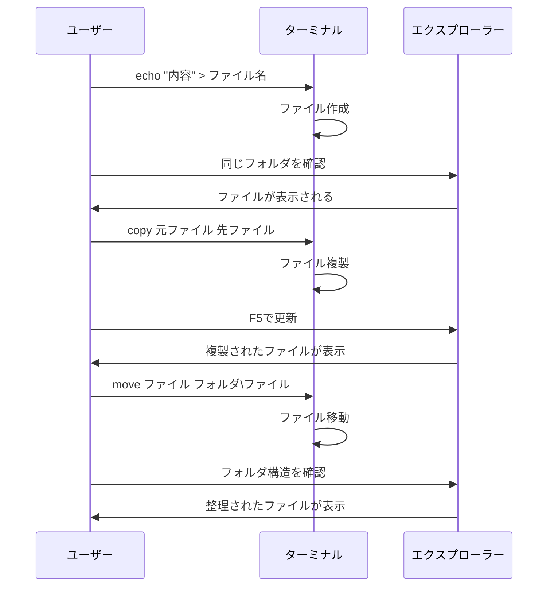

# ターミナルでファイル操作

## はじめに

前章でエラーメッセージの読み方と解決手法を学びました。特に「3つの魔法」の一つである**ファイル・パス確認**は、エラー解決の重要な手段でした。今度は、その確認作業を効率的に行うためのファイル操作スキルを身につけましょう。

ターミナルでファイルを作成・表示・コピー・削除できるようになると、エラー対処だけでなく、普段の業務でも「あ、これならターミナルの方が早い！」と感じる場面が出てくるはずです。

この章では、エラー解決で重要なファイル確認作業を中心に、日常的なファイル操作をターミナルで行う方法を、エクスプローラーでの確認と組み合わせながら学びます。

## 📊 この章の重要度：🟢 応用

**Webディレクターにとって：**
- より効率的なファイル操作方法
- 開発現場でよく使われるパターンを学習
- 習得目安：時間に余裕があるときに

## あなたがこれを知ると変わること

**エラー解決での変化：**
- 以前：「FileNotFoundError？ファイルがあるかどうかわからない...」
- 今後：「`dir`コマンドでファイル存在を瞬時に確認」

**ファイル確認での変化：**
- 以前：「このファイルの中身を確認するためにダブルクリック...」
- 今後：「ターミナルで`type ファイル名`で瞬間確認」

**ファイル整理での変化：**
- 以前：「フォルダ間でファイルをドラッグ&ドロップ...」
- 今後：「`copy`や`move`コマンドで正確に操作」

**開発者との会話での変化：**
- 開発者：「そのフォルダの設定ファイルを確認してください」
- あなた（修得前）：「設定ファイル？どれですか？」
- あなた（修得後）：「`dir *.txt`で確認してみますね」

## エラー解決で重要な基本コマンドの復習

### ファイル・パス確認で使う4つのコマンド

前章で学んだ「3つの魔法」のファイル・パス確認を効率的に行うため、基本コマンドをおさらいしましょう：

| コマンド | 用途 | 例 |
|----------|------|-----|
| `dir` | フォルダの中身を表示 | `dir` |
| `cd` | フォルダを移動 | `cd Documents` |
| `pwd` | 現在地を確認 | `pwd` |
| `mkdir` | フォルダを作成 | `mkdir 新フォルダ` |

## 🚨 重要：ファイルパスの指定について

### ファイル操作の落とし穴

**初学者がよく混乱するポイント：**
前章で学んだ「FileNotFoundError」の原因の多くは、**パスの指定ミス**でした。ターミナルでファイルを操作する際も同じで、**現在地（`dir`で表示される場所）にあるファイルだけが操作対象ではありません**。実際には、パスを指定することで**どこにあるファイルでも操作可能**です。

### 相対パスと絶対パスの違い

**相対パス（現在地からの道筋）：**
```
# 現在地が C:\Users\YourName の場合
C:\Users\YourName> type Desktop\memo.txt
# → C:\Users\YourName\Desktop\memo.txt を表示

C:\Users\YourName> copy Documents\report.txt Desktop\report_backup.txt
# → Documents フォルダから Desktop フォルダにコピー
```

**絶対パス（完全な住所）：**
```
# どこにいても、完全なパスで指定可能
C:\Users\YourName> type C:\project\web-app\config.json
# → C:\project\web-app\config.json を表示（現在地に関係なく）

C:\Users\YourName\Desktop> copy C:\temp\data.txt C:\backup\data.txt
# → 完全パスでの指定により、現在地に関係なく操作
```

### 実際の混乱例

**❌ よくある誤解：**
「`dir` で見えるファイルしか操作できない」

**✅ 正しい理解：**
「`dir` は現在地の内容確認。ファイル操作は**パス指定により**どこのファイルでも可能」

```
# 例：現在地が Desktop でも、Documents のファイルを操作可能
C:\Users\YourName\Desktop> type ..\Documents\memo.txt
# → 1つ上のフォルダの Documents\memo.txt を表示

C:\Users\YourName\Desktop> copy ..\Documents\*.txt .\
# → Documents の全txtファイルを現在地（Desktop）にコピー
```

**パス指定の記号：**
- `.` → 現在のフォルダ
- `..` → 1つ上のフォルダ  
- `\` → フォルダの区切り
- `C:\` → C ドライブのルート（最上位）

<details>
<summary>💡 Tips：パス指定の安全な確認方法（エラー解決の応用）</summary>

**前章の「3つの魔法」を応用した操作前確認習慣：**
1. **現在地確認：** `pwd` または `cd`（魔法3：ファイル・パス確認）
2. **対象ファイル確認：** `dir パス` で存在確認（FileNotFoundError予防）
3. **操作実行：** 確認後にファイル操作

**例：**
```
C:\Users\YourName> pwd
C:\Users\YourName

C:\Users\YourName> dir Documents\*.txt
# Documents フォルダの .txt ファイル一覧確認

C:\Users\YourName> type Documents\important.txt
# 確認後に操作実行
```

**この習慣により：**
- 意図しないファイルを操作するリスクを軽減
- パスの概念が自然に身につく
- エラーの原因を特定しやすくなる

</details>

### 今日学ぶ新しいコマンド

今回は以下のファイル操作コマンドを学びます：

| コマンド | 用途 | 例 |
|----------|------|-----|
| `type` / `cat` | ファイルの中身を表示 | `type memo.txt` |
| `echo` | テキストファイルを作成 | `echo "hello" > test.txt` |
| `copy` / `cp` | ファイルをコピー | `copy file1.txt file2.txt` |
| `move` / `mv` | ファイルを移動/名前変更 | `move old.txt new.txt` |
| `del` / `rm` | ファイルを削除 | `del unnecessary.txt` |

<details>
<summary>💡 補足：コマンドプロンプトとPowerShell/Windows Terminalでの違い</summary>

**使用するターミナルによってコマンドが選択できます：**

| 操作 | コマンドプロンプト（cmd） | PowerShell/Windows Terminal |
|------|--------------------------|----------------------------|
| ファイル内容表示 | `type ファイル名` | `type ファイル名` または `cat ファイル名` |
| ファイルコピー | `copy 元 先` | `copy 元 先` または `cp 元 先` |
| ファイル移動 | `move 元 先` | `move 元 先` または `mv 元 先` |
| ファイル削除 | `del ファイル名` | `del ファイル名` または `rm ファイル名` |

**この章の表記について：**
- 基本的にはWindows式（`type`、`copy`など）で説明
- PowerShell/Windows Terminalでも同じコマンドが動作
- 慣れてきたらLinux/Mac式も使えるようになります

</details>

## ファイルの内容を確認する：`type`コマンド

### `type`コマンドとは

**コマンド：** `type ファイル名`
**用途：** テキストファイルの中身をターミナルに表示する
**メリット：** ファイルを開かずに瞬時に内容確認

### 基本的な使い方

```
C:\Users\YourName\Desktop> type memo.txt
今日の予定
- 会議 10:00-11:00
- 資料作成 13:00-15:00
- レビュー 16:00-17:00
```

### ワイルドカード検索

特定の種類のファイルだけを確認したい場合：

```
C:\Users\YourName\Desktop> dir *.txt
2024/01/15  10:30        123      memo.txt
2024/01/15  11:00        456      report.txt

C:\Users\YourName\Desktop> type *.txt
==> memo.txt <==
今日の予定
- 会議 10:00-11:00

==> report.txt <==
週次レポート
売上：150万円
```

**解説：**
- `*.txt` → 「.txt」で終わるすべてのファイル
- `*` はワイルドカード（何でも当てはまる記号）

<details>
<summary>💡 Tips：ワイルドカードとは？</summary>

**ワイルドカード**とは「何でも当てはまる」記号です。トランプゲームの「ジョーカー」のようなものです。

**よく使うパターン：**
- `*.txt` → .txtファイルすべて
- `*.docx` → Wordファイルすべて
- `memo*` → memoで始まるファイルすべて
- `*2024*` → 2024が含まれるファイルすべて
</details>

## 簡単なテキストファイルを作成する：`echo`コマンド

### `echo`コマンドとは

**コマンド：** `echo "文字列" > ファイル名`
**用途：** 簡単なテキストファイルを作成する
**注意：** 既存ファイルは上書きされます

### 基本的な使い方

```
C:\Users\YourName\Desktop> echo "Hello, World!" > hello.txt

C:\Users\YourName\Desktop> type hello.txt
Hello, World!
```

### 複数行のファイル作成

```
C:\Users\YourName\Desktop> echo "1行目" > sample.txt
C:\Users\YourName\Desktop> echo "2行目" >> sample.txt
C:\Users\YourName\Desktop> echo "3行目" >> sample.txt

C:\Users\YourName\Desktop> type sample.txt
1行目
2行目
3行目
```

**重要な違い：**
- `>` → ファイルを新規作成（既存内容は削除）
- `>>` → ファイルに追記（既存内容は保持）

## ファイルをコピーする：`copy`コマンド

### `copy`コマンドとは

**コマンド：** `copy 元ファイル 先ファイル`
**用途：** ファイルを複製する
**特徴：** 元ファイルはそのまま残る

### 基本的な使い方

```
C:\Users\YourName\Desktop> copy memo.txt memo_backup.txt
        1 個のファイルをコピーしました。

C:\Users\YourName\Desktop> dir memo*
2024/01/15  10:30        123      memo.txt
2024/01/15  12:00        123      memo_backup.txt
```

### 別フォルダにコピー

```
C:\Users\YourName\Desktop> mkdir backup
C:\Users\YourName\Desktop> copy memo.txt backup\memo.txt
        1 個のファイルをコピーしました。

C:\Users\YourName\Desktop> dir backup
2024/01/15  12:05        123      memo.txt
```

## ファイルを移動・名前変更する：`move`コマンド

### `move`コマンドとは

**コマンド：** `move 元ファイル 先ファイル`
**用途：** ファイルを移動または名前変更する
**特徴：** 元ファイルは移動先に移るか、名前が変わる

### 名前変更の例

```
C:\Users\YourName\Desktop> move old_memo.txt new_memo.txt
        1 個のファイルを移動しました。

C:\Users\YourName\Desktop> dir *memo*
2024/01/15  12:10        123      new_memo.txt
```

### 別フォルダに移動

```
C:\Users\YourName\Desktop> move important.txt Documents\important.txt
        1 個のファイルを移動しました。
```

## ファイルを削除する：`del`コマンド

### `del`コマンドとは

**コマンド：** `del ファイル名`
**用途：** ファイルを削除する
**注意：** 削除したファイルはゴミ箱に入らず、完全に削除される

### 基本的な使い方

```
C:\Users\YourName\Desktop> del temporary.txt

C:\Users\YourName\Desktop> dir temporary.txt
ファイルが見つかりません
```

### 確認付き削除

安全のため、削除前に確認する習慣をつけましょう：

```
C:\Users\YourName\Desktop> dir test.txt
2024/01/15  12:15         50      test.txt

C:\Users\YourName\Desktop> del test.txt

C:\Users\YourName\Desktop> dir test.txt
ファイルが見つかりません
```

**⚠️ 重要な注意：**
- ターミナルで削除したファイルはゴミ箱に入りません
- 削除前に必ず `dir` で確認する習慣をつけましょう
- 重要なファイルは事前にバックアップを取りましょう

## 実践練習：総合演習

### 練習用環境の準備

まず、練習用のフォルダとファイルを作成しましょう：

```
C:\Users\YourName\Desktop> mkdir ファイル操作練習
C:\Users\YourName\Desktop> cd ファイル操作練習
C:\Users\YourName\Desktop\ファイル操作練習>
```

### 演習1：ファイル作成と確認

**手順：**
1. メモファイルを作成：
```
C:\Users\YourName\Desktop\ファイル操作練習> echo "今日の学習内容：ターミナルでファイル操作" > 学習メモ.txt
```

2. ファイルが作成されたことを確認：
```
C:\Users\YourName\Desktop\ファイル操作練習> dir
2024/01/15  13:00         48      学習メモ.txt
```

3. **エクスプローラーでも確認**：
   - `Windows + E` でエクスプローラーを開く
   - 「Desktop\ファイル操作練習」フォルダに移動
   - 「学習メモ.txt」が作成されていることを確認

4. ファイルの中身を確認：
```
C:\Users\YourName\Desktop\ファイル操作練習> type 学習メモ.txt
今日の学習内容：ターミナルでファイル操作
```

### 演習2：ファイルのコピーと編集

**手順：**
1. バックアップを作成：
```
C:\Users\YourName\Desktop\ファイル操作練習> copy 学習メモ.txt 学習メモ_バックアップ.txt
        1 個のファイルをコピーしました。
```

2. 元ファイルに内容を追記：
```
C:\Users\YourName\Desktop\ファイル操作練習> echo "- typeコマンドでファイル確認" >> 学習メモ.txt
C:\Users\YourName\Desktop\ファイル操作練習> echo "- copyコマンドでバックアップ作成" >> 学習メモ.txt
```

3. 変更を確認：
```
C:\Users\YourName\Desktop\ファイル操作練習> type 学習メモ.txt
今日の学習内容：ターミナルでファイル操作
- typeコマンドでファイル確認
- copyコマンドでバックアップ作成
```

4. **エクスプローラーで確認**：
   - ファイルが2つあることを確認
   - ダブルクリックして内容の違いを確認

### 演習3：フォルダ整理

**手順：**
1. 整理用フォルダを作成：
```
C:\Users\YourName\Desktop\ファイル操作練習> mkdir 完了ファイル
```

2. バックアップファイルを移動：
```
C:\Users\YourName\Desktop\ファイル操作練習> move 学習メモ_バックアップ.txt 完了ファイル\学習メモ_バックアップ.txt
        1 個のファイルを移動しました。
```

3. 結果を確認：
```
C:\Users\YourName\Desktop\ファイル操作練習> dir
2024/01/15  13:05    <DIR>          完了ファイル
2024/01/15  13:03        125      学習メモ.txt

C:\Users\YourName\Desktop\ファイル操作練習> dir 完了ファイル
2024/01/15  13:00         48      学習メモ_バックアップ.txt
```



## よくある間違いとその解決法（エラー解決の実践）

### 間違い1：ファイル名の指定ミス（FileNotFoundError の実践例）

**症状：**
```
C:\Users\YourName> type memo.tx
指定されたファイルが見つかりません。
```

**原因：** 拡張子のタイプミス（.txt を .tx と間違えた）
**解決：** `dir memo*` で正確なファイル名を確認（前章で学んだファイル確認の実践）

### 間違い2：上書きの事故

**症状：** 重要なファイルを `echo` で上書きしてしまった

**予防策：**
- 重要なファイルは先にバックアップ
- 新規ファイル作成時は既存ファイル名を避ける
- `dir` で事前にファイル存在を確認

### 間違い3：削除の取り消しができない

**症状：** `del` で削除したファイルが復旧できない

**予防策：**
- 削除前に必ず内容確認：`type ファイル名`
- 重要なファイルは `move` でバックアップフォルダに移動
- 複数ファイル削除時は一つずつ確認

### 間違い4：日本語ファイル名の問題

**症状：** 日本語を含むファイル名でコマンドが正しく動作しない

**原因と解決：**
```
# 問題の例
C:\project> type 要件 定義.txt
指定されたファイルが見つかりません。

# 解決法：ダブルクォートで囲む
C:\project> type "要件 定義.txt"
サイトリニューアル 要件定義
...
```

**日本語ファイル名を使う時の注意：**
- **スペースが含まれる場合**：必ず「"」（ダブルクォート）で囲む
- **推奨命名規則**：できるだけ英数字とアンダースコア（_）を使用
  - 良い例：`requirements_v1.txt`、`design_memo.txt`
  - 注意が必要な例：`要件 定義.txt`、`デザイン案（最新）.txt`

### 間違い5：権限エラー（Permission Denied の実践例）

**症状：** 「アクセスが拒否されました」というエラー（前章で学んだ Permission Denied エラー）

**原因：**
- ファイルが他のアプリケーションで開かれている
- システムファイルを操作しようとしている
- 読み取り専用ファイルを変更しようとしている

**解決法（前章の「3つの魔法」を適用）：**
- **魔法1（再起動）：** ファイルを開いているアプリケーションを閉じる・再起動
- **魔法3（ファイル確認）：** システムファイルには触らない・ファイルの属性を確認する

## Webディレクターの実践的なターミナル活用

### ファイル・フォルダ操作の業務活用

**重要な理解：**
ターミナルで学んだファイル操作は、**プログラミングによって自動化可能**な作業の基礎です。手動で行うファイル整理や資料作成は、将来的にスクリプトで自動化できる可能性があります。

さらに、これらのファイル操作スキルは、次章で学ぶ**バージョン管理システム**を理解する上での基礎知識となります。ファイルの作成・コピー・移動・削除を理解していることで、バージョン管理の概念がより身近に感じられるでしょう。

### パターン1：プロジェクト資料の管理と整理

**場面：** プロジェクトドキュメントの効率的な管理

```
C:\projects\website-renewal> mkdir 01_要件定義
C:\projects\website-renewal> mkdir 02_設計書
C:\projects\website-renewal> mkdir 03_進捗管理
C:\projects\website-renewal> mkdir 04_完了資料

C:\projects\website-renewal> echo "サイトリニューアルプロジェクト" > README.txt
C:\projects\website-renewal> echo "開始日：2024/01/15" >> README.txt
C:\projects\website-renewal> echo "予定完了日：2024/03/15" >> README.txt

# このような作業は将来的にスクリプトで自動化可能
```

**自動化の可能性：**
- プロジェクト開始時のフォルダ構造自動生成
- テンプレートファイルの自動配置
- プロジェクト情報の自動更新

### パターン2：定期的な会議資料準備

**場面：** 週次ミーティングや進捗報告の資料作成

```
C:\meetings\weekly-progress> echo "週次進捗報告 2024/01/15" > progress_report.txt
C:\meetings\weekly-progress> echo "" >> progress_report.txt
C:\meetings\weekly-progress> echo "【完了タスク】" >> progress_report.txt
C:\meetings\weekly-progress> echo "- ワイヤーフレーム確認" >> progress_report.txt
C:\meetings\weekly-progress> echo "- デザインカンプ承認" >> progress_report.txt
C:\meetings\weekly-progress> echo "" >> progress_report.txt
C:\meetings\weekly-progress> echo "【今週予定】" >> progress_report.txt
C:\meetings\weekly-progress> echo "- コーディング開始" >> progress_report.txt

C:\meetings\weekly-progress> copy progress_report.txt archive\progress_20240115.txt
# アーカイブとして保存
```

**自動化の可能性：**
- 定期レポートのテンプレート自動生成
- プロジェクト管理ツールからの進捗情報自動取得
- メール送信の自動化

### パターン3：クライアント資料の一括管理

**場面：** クライアント向け資料の整理と送付準備

```
C:\client-materials\abc-company> mkdir 提案書
C:\client-materials\abc-company> mkdir 見積書
C:\client-materials\abc-company> mkdir 契約書
C:\client-materials\abc-company> mkdir 完了報告

# 最新資料をまとめてコピー
C:\client-materials\abc-company> copy C:\proposals\*.pdf 提案書\
C:\client-materials\abc-company> copy C:\estimates\abc_estimate.xlsx 見積書\

# 送付用フォルダに整理
C:\client-materials\abc-company> mkdir 20240115_送付用
C:\client-materials\abc-company> copy 提案書\* 20240115_送付用\
C:\client-materials\abc-company> copy 見積書\* 20240115_送付用\
```

**自動化の可能性：**
- クライアント別フォルダの自動生成
- 資料の自動分類・整理
- 送付用パッケージの自動作成

### なぜターミナル操作を覚えるべきか

**1. 自動化への理解**
- 手動操作 → プログラムによる自動実行
- 繰り返し作業の効率化可能性の理解
- 開発チームとの自動化相談時の共通言語

**2. 効率性の体感**
- フォルダ作成、ファイル整理の高速化
- 定型作業の時間短縮
- 手作業エラーの削減

**3. 開発プロセスの理解**
- ファイル操作 = プログラムの基本動作
- 自動化スクリプトの動作イメージ
- システム化可能な業務の識別

## まとめ

- **`type`**：ファイルの中身を瞬時に確認
- **`echo`**：簡単なテキストファイルを作成（`>` は新規、`>>` は追記）
- **`copy`**：ファイルを複製（元ファイルは残る）
- **`move`**：ファイルを移動/名前変更（元ファイルは移動）
- **`del`**：ファイルを削除（ゴミ箱に入らず完全削除）
- **ワイルドカード**：`*` を使って複数ファイルを一括操作

### Webディレクターとして今日から実践できること

1. **プロジェクト資料の効率管理**：`echo` と `>>` でドキュメント作成・更新
2. **定期バックアップの習慣化**：`copy *.txt backups\` で重要資料の一括保護
3. **会議準備の高速化**：ターミナルでの素早いメモ作成と整理
4. **フォルダ構造の標準化**：`mkdir` でプロジェクト用フォルダの統一作成
5. **ファイル整理の効率化**：`move` と `copy` による資料の体系的管理

### 自動化への理解とスキル向上

**手動作業の理解 → 自動化の可能性発見**

**現在の手動作業：**
- プロジェクト開始時のフォルダ作成
- 定期的な進捗レポート作成
- 資料のバックアップとアーカイブ
- クライアント向け資料の整理

**将来の自動化可能性：**
- スクリプトによるプロジェクト環境自動構築
- 定期レポートの自動生成
- バックアップスケジュールの自動実行
- **バージョン管理システムによる履歴自動記録**（次章で学習）

### バージョン管理への準備完了

この章で学んだファイル操作スキルにより、次章の**バージョン管理システム**の理解に必要な基礎知識が整いました：

- **ファイルの作成・編集・削除** → コミット（変更記録）の概念理解
- **ファイルのコピー・移動** → ブランチ（作業枝分かれ）の概念理解  
- **フォルダ構造の理解** → リポジトリ（保管庫）の概念理解
- **パス指定の習得** → リモート・ローカルの概念理解

### 開発チームとのコミュニケーション向上

**Before（ターミナルスキル習得前）：**
- 「ファイル整理を手伝ってもらえますか？」
- 「この作業を自動化できるか判断してもらえますか？」

**After（ターミナルスキル習得後）：**
- 「ファイル操作は理解しているので、これをスクリプト化できるか相談があります」
- 「この手順を自動化したいのですが、技術的に可能でしょうか？」

**ターミナル操作の習得により：**
- 自動化対象業務の明確な説明が可能
- 開発チームとの技術的な議論への参加
- 業務効率化提案の具体性向上

### 次のステップ

慣れてきたら以下も覚えてみましょう：
- `findstr` - ファイル内の文字列検索
- `attrib` - ファイル属性の変更
- `robocopy` - 高機能なコピー

次章では、「バージョン管理って何？」について学び、ファイルの変更履歴を自動で管理する仕組みを理解していきます。この章で学んだファイル操作の知識が、バージョン管理システムの理解に大いに役立つでしょう。