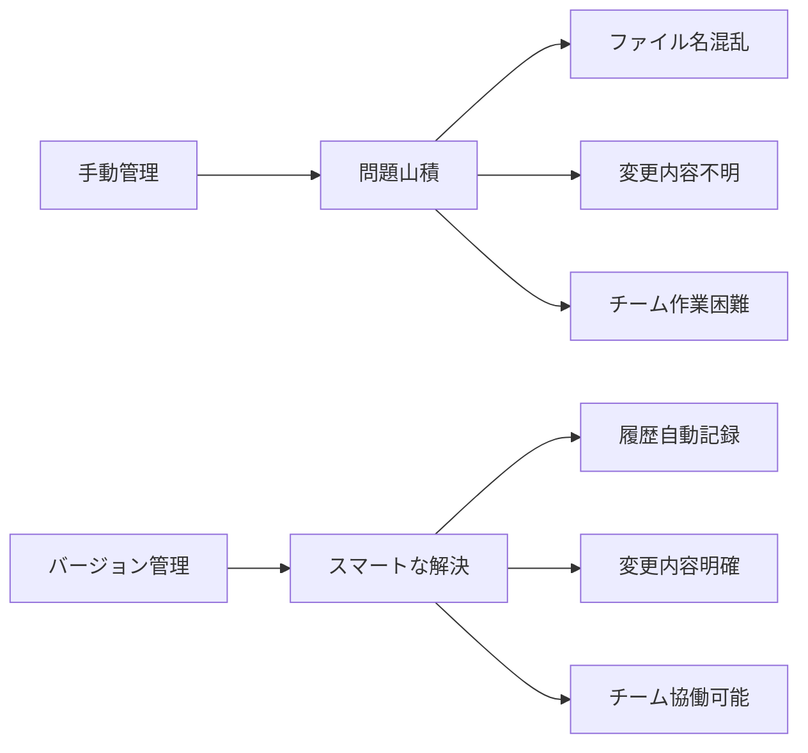
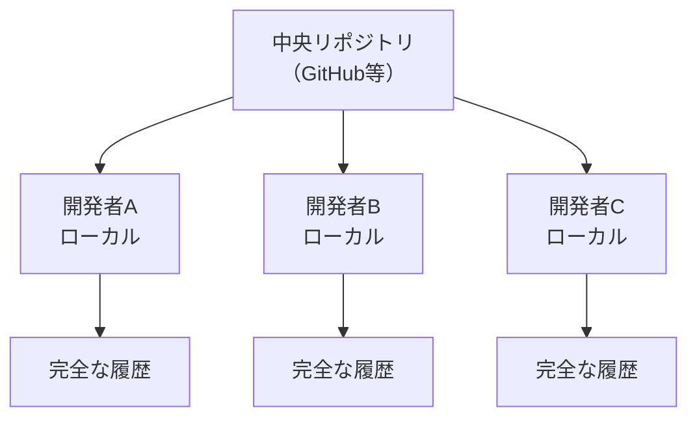
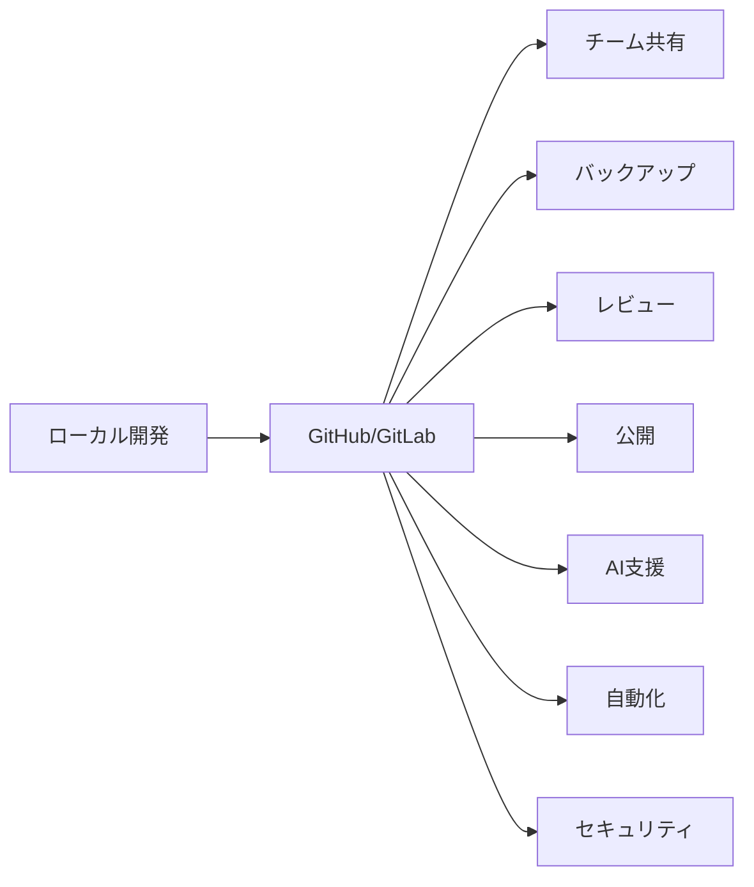
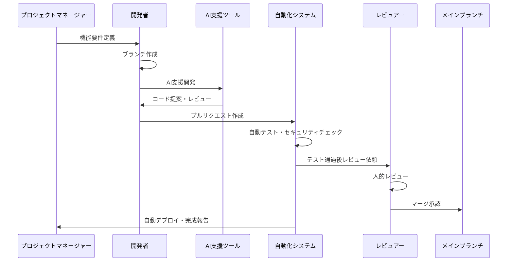
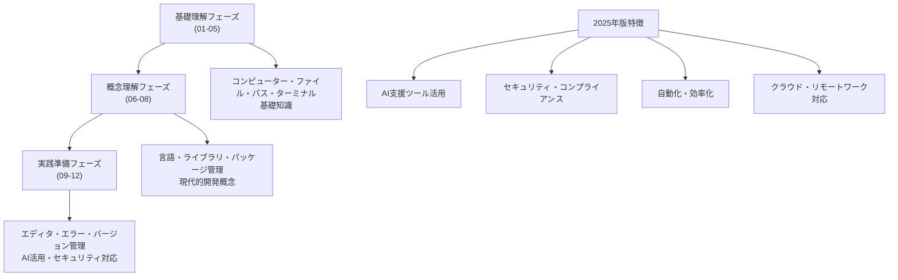

# バージョン管理って何？

## はじめに

仕事でWordやExcelファイルを編集するとき、「最終版.docx」「最終版_修正.docx」「最終版_修正_確定版.docx」のようにファイル名を変えて保存した経験はありませんか？これは手動での**バージョン管理**です。プログラミングの世界では、もっと賢い方法でファイルの変更履歴を管理する仕組みがあります。

この章では、なぜファイルの履歴管理が必要なのか、**Git**という代表的なバージョン管理システムの基本概念、そしてチーム開発での重要性について学びます。

## 📊 この章の重要度：🟡 推奨

**Webディレクターにとって：**
- チーム開発の基本的な仕組み理解に必要
- プロジェクト管理・品質管理に直結
- 習得目安：チームプロジェクト参加前に

## あなたがこれを知ると変わること

**ファイル管理での変化：**
- 以前：「最新版がどれかわからない...」
- 今後：「最新版は必ずmainブランチにあります」

**変更履歴の確認での変化：**
- 開発者：「昨日の変更で問題が起きているようです」
- あなた（修得前）：「昨日何を変更したかわかりません」
- あなた（修得後）：「コミット履歴で確認しましょう」

**チーム作業での変化：**
- 以前：「誰がどのファイルを編集しているかわからない」
- 今後：「GitHubで誰がどの機能を担当しているか把握できます」

## なぜファイルの履歴管理が必要か

### 手動管理の限界

**典型的な手動バージョン管理：**

```
プロジェクトフォルダ/
├── index.html
├── index_修正版.html
├── index_最終版.html
├── index_最終版_確定.html
├── index_最終版_確定_再修正.html
└── index_本当の最終版.html
```

**問題点：**
1. **どれが最新かわからない**
2. **何を変更したかわからない**
3. **元に戻せない**
4. **複数人で作業できない**
5. **ファイルサイズが膨大になる**

### バージョン管理システムの利点



## バージョン管理の基本概念

### 時間軸での管理

バージョン管理システムは、ファイルの変更を**時間軸**で管理します：

```mermaid
gitgraph
    commit id: "初期バージョン"
    commit id: "機能A追加"
    commit id: "デザイン修正"
    commit id: "バグ修正"
    commit id: "最新版"
```

**各ポイント（コミット）で記録される情報：**
- **いつ**変更したか（日時）
- **誰が**変更したか（作成者）
- **何を**変更したか（変更内容）
- **なぜ**変更したか（コメント）

### スナップショット方式

**従来の手動管理：**
```
ファイル全体をコピー
→ 容量大、管理困難
```

**バージョン管理システム：**
```
変更差分のみを記録
→ 容量小、履歴明確
```

**例：HTMLファイルの変更**
```html
<!-- 変更前 -->
<h1>ようこそ</h1>

<!-- 変更後 -->
<h1>ようこそ、我が社のサイトへ</h1>
```

**記録される内容：**
```
- h1タグの内容を変更
- 「ようこそ」→「ようこそ、我が社のサイトへ」
- 変更理由：「より具体的な表現に修正」
```

## Gitの基本概念（非技術者向け）

### Gitとは

**Git**：世界で最も使われている**分散型バージョン管理システム**

**分散型の意味：**
- 各開発者が完全な履歴を持つ
- 中央サーバーが落ちても作業継続可能
- オフラインでも履歴管理可能



### 基本用語の理解

**リポジトリ（Repository）**
- プロジェクトの**保管庫**
- ファイルと変更履歴の全てを含む
- 例え：プロジェクトの**図書館**

**コミット（Commit）**
- 変更内容の**記録**
- スナップショットを作成する行為
- 例え：**セーブポイント**を作る

**ブランチ（Branch）**
- 開発の**枝分かれ**
- 機能ごとに分けて開発
- 例え：**並行世界**での作業

```mermaid
gitgraph
    commit id: "main: 初期版"
    branch feature-login
    checkout feature-login
    commit id: "ログイン画面作成"
    commit id: "認証機能追加"
    checkout main
    commit id: "main: デザイン調整"
    merge feature-login
    commit id: "main: ログイン機能完成"
```

**マージ（Merge）**
- 分かれた枝を**統合**する
- 完成した機能を本体に反映
- 例え：**合流**させる

### GitHub・GitLabの役割

**GitHub/GitLab**：Gitリポジトリを**クラウド**で管理するサービス

**主な機能（2025年版）：**
1. **リモートリポジトリ**：チーム共有の保管庫
2. **Issue管理**：バグ報告・機能要求の管理
3. **プルリクエスト**：変更内容のレビュー機能
4. **プロジェクト管理**：進捗・タスク管理
5. **GitHub Actions**：自動化・CI/CD
6. **GitHub Copilot**：AI支援開発
7. **Codespaces**：クラウド開発環境
8. **Security機能**：脆弱性スキャン・依存関係監視



### 現代的なGit活用（2025年版）

**AIとの連携：**
```
GitHub Copilot との統合：
- コミットメッセージの自動生成
- プルリクエストの説明文自動作成
- コードレビューのAI支援

利点：
- より良いコミットメッセージ
- レビュー品質向上
- ドキュメント作成効率化
```

**セキュリティ強化：**
```
自動脆弱性検出：
- 依存関係の脆弱性スキャン
- 秘密情報（APIキー等）の誤コミット検出
- コードの静的解析

Webディレクターへの影響：
- セキュリティ問題の早期発見
- コンプライアンス要件への対応
- リスク管理の強化
```

**リモートワーク対応：**
```
GitHub Codespaces：
- ブラウザ上で完全な開発環境
- チーム間での環境統一
- 場所を選ばない協働作業

利点：
- セットアップ時間ゼロ
- 強力なマシンをクラウドで利用
- セキュリティ確保（ローカルにコード保存不要）
```

## チーム開発での意味

### 協働作業の課題解決

**従来の問題：**
```
問題1：同時編集の競合
A君がindex.htmlを編集中
B君も同じファイルを編集
→ どちらの変更を採用する？

問題2：変更の把握困難
誰がいつ何を変更したか不明
→ 問題の原因がわからない

問題3：巻き戻し困難
「昨日の状態に戻したい」
→ どれが昨日の状態？
```

**Gitによる解決：**
```
解決1：ブランチによる分離
A君→feature-loginブランチ
B君→feature-designブランチ
→ 競合なし、後でマージ

解決2：コミット履歴で透明性
全ての変更が記録される
→ 誰がいつ何を変更したか一目瞭然

解決3：任意のポイントに巻き戻し
コミット履歴から選択
→ 「昨日の夕方の状態に戻す」が可能
```

### 実際のワークフロー

**現代的なチーム開発の流れ（2025年版）：**



**2025年版の改善点：**
```
AI支援による効率化：
- GitHub Copilot によるコード生成支援
- 自動的なコミットメッセージ生成
- AI による初期コードレビュー

自動化による品質向上：
- 自動テスト実行
- セキュリティスキャンの自動化
- 自動デプロイメント

リアルタイムコラボレーション：
- GitHub Codespaces での同期開発
- リアルタイムコメント・フィードバック
- 統合されたコミュニケーション
```

**Webディレクターの関わり方（2025年版）：**

1. **要件定義段階**
   - GitHubのIssueで要件を記録
   - AI支援による要件の明確化・具体化
   - 優先度・期限の設定
   - セキュリティ要件の事前定義

2. **開発中**
   - プルリクエストで進捗確認
   - 自動化システムの結果監視
   - AI レビュー結果の確認
   - セキュリティアラートの対応指示

3. **リリース後**
   - 自動デプロイメントの結果確認
   - 問題発生時の原因調査（コミット履歴 + AI分析）
   - 変更履歴の確認
   - コンプライアンス報告の自動化

4. **継続的な改善**
   - AI提案による開発プロセス最適化
   - セキュリティ監査結果の定期レビュー
   - チーム生産性の分析・改善

### ブランチ戦略の例

**Git Flow（代表的な戦略）：**

```mermaid
gitgraph
    commit id: "main"
    branch develop
    checkout develop
    commit id: "dev: 基本機能"
    
    branch feature-login
    checkout feature-login
    commit id: "ログイン機能"
    checkout develop
    merge feature-login
    
    branch feature-payment
    checkout feature-payment
    commit id: "決済機能"
    checkout develop
    merge feature-payment
    
    checkout main
    merge develop
    commit id: "v1.0 リリース"
```

**ブランチの役割：**
- **main**: 本番環境用（常に安定）
- **develop**: 開発用統合ブランチ
- **feature**: 機能別開発ブランチ
- **hotfix**: 緊急修正用ブランチ

## Webディレクターとしての活用方法

### プロジェクト管理での活用（2025年版）

**1. AI支援による進捗管理**
```
GitHub Projects + AI分析:
- ToDo: 未着手のIssue（優先度AI自動算出）
- In Progress: 開発中のブランチ（完成予想日AI算出）
- Review: プルリクエスト段階（AI事前レビュー完了）
- Done: マージ完了（自動品質チェック済み）

AI による分析:
- 開発速度の予測
- ボトルネックの自動特定
- リソース配分の最適化提案
```

**2. 自動化品質管理**
```
多層品質チェック:
- AI による初期コードレビュー
- 自動テスト（Unit, Integration, E2E）
- セキュリティ脆弱性スキャン
- パフォーマンス自動測定
- 人的レビュー（最終確認）
- 自動デプロイメント

リアルタイム品質監視:
- コード品質メトリクス
- セキュリティスコア
- パフォーマンス指標
```

**3. インテリジェントリリース管理**
```
セマンティックバージョニング + AI:
- v1.0.0: 初回リリース
- v1.1.0: 機能追加（AI影響度分析済み）
- v1.1.1: バグ修正（自動回帰テスト完了）

自動化リリースパイプライン:
- ステージング環境での自動テスト
- セキュリティスキャン完了後の本番リリース
- ロールバック計画の自動生成
- リリースノートの自動作成
```

**4. セキュリティ・コンプライアンス管理**
```
継続的セキュリティ監視:
- 依存関係の脆弱性自動スキャン
- 秘密情報の誤コミット検出
- コンプライアンス要件の自動チェック
- セキュリティポリシー違反の即座通知

監査対応:
- 変更履歴の完全な追跡可能性
- セキュリティイベントの自動ログ
- コンプライアンスレポートの自動生成
```

### コミュニケーション改善

**開発者との会話例：**

**以前：**
```
あなた：「この機能はいつ完成しますか？」
開発者：「もう少しです」
```

**Git活用後：**
```
あなた：「feature-loginブランチの進捗はいかがですか？」
開発者：「コミット履歴を見ていただくと、
        認証機能は完成していて、
        今はUI調整の段階です」
```

### 問題解決での活用

**バグ発生時：**
```
1. いつから問題が起きているか特定
2. その期間のコミット履歴を確認
3. 怪しいコミットを特定
4. 該当コミットを取り消すか修正
```

**仕様変更時：**
```
1. 変更が必要な範囲を特定
2. 関連するファイルの履歴を確認
3. 影響範囲を把握
4. 計画的な変更実施
```

## 実際のプロジェクトでの例

### ケーススタディ：ECサイトのリニューアル

**プロジェクト構成：**
```
main ブランチ（本番環境）
├── develop ブランチ（開発統合）
├── feature-product-page（商品ページ）
├── feature-cart（カート機能）
├── feature-payment（決済機能）
└── feature-admin（管理画面）
```

**Webディレクターの視点：**

**週次進捗確認：**
```
- feature-product-page: 80%完成
- feature-cart: プルリクエスト待ち
- feature-payment: 開発中
- feature-admin: 未着手
```

**リリース判断：**
```
カート機能でバグ発見
→ feature-cartブランチで修正
→ 修正完了後にリリース
→ 他の機能には影響なし
```

## まとめ

### この章で学んだこと（2025年版）

1. **バージョン管理の必要性**
   - 手動管理の限界と問題点
   - 自動履歴管理の利点
   - チーム協働の基盤
   - **AI時代のセキュリティ・コンプライアンス要件**

2. **現代的なGit・GitHubの概念**
   - リポジトリ、コミット、ブランチ
   - 分散型管理の仕組み
   - **AI支援機能（GitHub Copilot、自動化）**
   - **セキュリティ機能（脆弱性スキャン、依存関係監視）**
   - **クラウド開発環境（Codespaces）**

3. **AI時代のチーム開発**
   - 協働作業の課題解決
   - **AI支援による効率化**
   - **自動化品質管理**
   - **リアルタイムコラボレーション**

4. **現代的なWebディレクター活用法**
   - **AI分析による進捗管理**
   - **自動化システムとの連携**
   - **セキュリティ・コンプライアンス管理**
   - **データドリブンな意思決定**

### 学習ドキュメント全体の完成

この章をもって、**非エンジニア向けプログラミング基礎学習ドキュメント**が完成しました。基礎概念から実践的な知識まで、Webディレクターとして必要な知識を体系的に学習できる構成となっています。



### 🎯 実践のヒント（2025年版）

**今日から始められること：**
- GitHubアカウントの作成（GitHub Pro でAI機能活用）
- 開発チームのリポジトリ閲覧（Codespaces での体験）
- コミット履歴の確認習慣（AI分析結果も含めて）
- セキュリティアラートの理解

**Webディレクター業務での活用：**
- GitHub Projects + AI分析でスマートな進捗管理
- 問題発生時はコミット履歴 + AI分析で原因調査
- 自動化リリースパイプラインの監視・管理
- セキュリティ・コンプライアンス状況の定期確認

**チーム連携を深めるために：**
- AI支援によるコミット履歴の効率的レビュー
- 自動化品質チェック結果の確認
- Issue管理による要件・バグ追跡（AI優先度付け）
- セキュリティアラートの迅速な対応体制構築

**AI時代のバージョン管理活用：**
- GitHub Copilot を使った効率的な作業指示
- AI分析による開発プロセス最適化
- セキュリティ脅威への自動対応設定
- コンプライアンス要件の自動監視

### 継続学習のために（2025年版）

このドキュメントはプログラミング学習の**入り口**です。AI時代の実際の業務では：

1. **AI支援による実践経験**：学んだ概念をAIツールと組み合わせて実際のプロジェクトで活用
2. **セキュリティ意識の向上**：サイバーセキュリティ、コンプライアンス要件の継続学習
3. **自動化システムとの協働**：AI・自動化ツールを効果的に活用した業務プロセス構築
4. **最新技術トレンドの追跡**：AI、クラウド、セキュリティ技術の定期的な情報更新

**推奨する継続学習リソース（2025年版）：**

```
AI活用学習：
- GitHub Copilot の効果的な使い方
- ChatGPT/Claude を使った技術理解の深化
- AI ツールを使ったプロジェクト管理

セキュリティ・コンプライアンス：
- GitHub Security features の活用
- 脆弱性管理の基本知識
- データ保護・プライバシー規制の理解

現代的なツール習得：
- GitHub Codespaces でのクラウド開発
- GitHub Actions による自動化
- プロジェクト管理ツールの高度活用
```

**Webディレクターとしての進化（2025年版）：**

技術への理解を深めることで：
- **AI時代の効率的なプロジェクト管理**
- **セキュリティリスクを考慮した意思決定**
- **自動化を活用したチーム生産性向上**
- **データドリブンな判断による品質向上**

これらが実現し、より価値の高いWebディレクターとしての役割を果たせるでしょう。