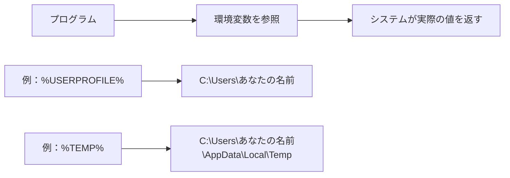
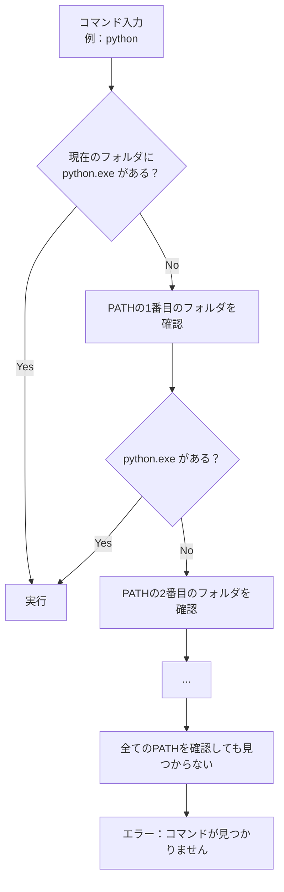
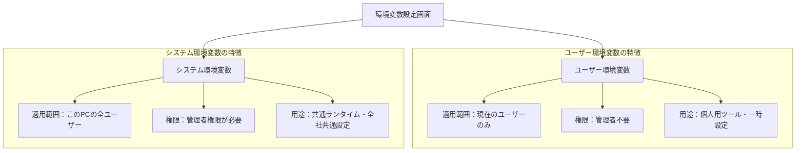
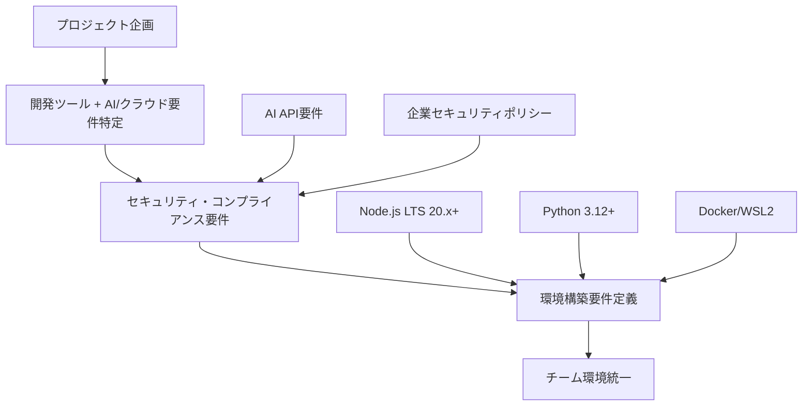
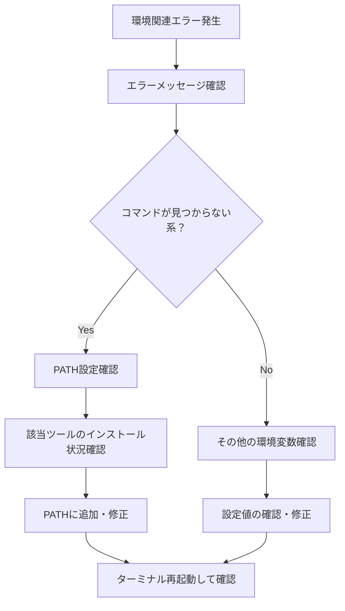

# Windowsのシステム環境変数とPATH設定

## はじめに

これまでファイルパスやターミナルの基本操作を学んできましたが、なぜ一部のコマンドは「どこからでも」実行できるのでしょうか？なぜ新しいプログラミング言語をインストールした後に「PATHを通してください」と言われるのでしょうか？その答えが**システム環境変数**と**PATH設定**にあります。

この章では、Windowsにおける環境変数の概念、PATHの役割と仕組み、実際の設定方法、そしてWebディレクターとして知っておくべきトラブルシューティングについて学びます。

## 📊 この章の重要度：🟢 応用

**Webディレクターにとって：**
- 開発環境構築の理解に必要
- AI・クラウド開発ツールの環境設定に必須
- Windows 11 + WSL環境での運用理解
- 技術的なトラブルシューティング能力向上
- 習得目安：開発ツール導入時までに

## あなたがこれを知ると変わること

**開発環境構築での変化：**
- 以前：「PATHを通してください」「よくわかりません...」
- 今後：「システム環境変数にPATHを追加するということですね」

**エラー対応での変化：**
- エラー：「'python' は、内部コマンドまたは外部コマンドとして認識されていません」
- あなた（修得前）：「Pythonはインストールしたのに...」
- あなた（修得後）：「PATHにPythonのパスが追加されていないようです」

**開発者とのやり取りの変化：**
- 以前：「環境構築でエラーが出ています」
- 今後：「環境変数の設定を確認して、PATHにツールのパスを追加しました」

## 環境変数とは何か

### 基本概念

**環境変数**：Windowsシステム全体で使用できる**設定情報を保存する仕組み**

**日常生活での例え：**
```
スマートフォンの連絡先のようなもの
- 「お母さん」と入力 → 自動で電話番号に変換
- 「会社」と入力 → 自動で住所に変換
```

**環境変数の場合：**
```
- 「USERPROFILE」と入力 → 自動でユーザーフォルダのパスに変換
- 「TEMP」と入力 → 自動で一時フォルダのパスに変換
```

### 環境変数の役割



**なぜ環境変数が必要？**

1. **ユーザーごとの違いに対応**
   ```
   ユーザーAのフォルダ：C:\Users\tanaka
   ユーザーBのフォルダ：C:\Users\sato
   
   環境変数：%USERPROFILE%
   → どちらのユーザーでも正しいフォルダを指す
   ```

2. **設定の一元管理**
   ```
   Javaのインストール場所が変わった場合：
   - 環境変数を1箇所変更するだけ
   - 全てのプログラムが新しい場所を参照
   ```

3. **セキュリティ向上**
   ```
   プログラムに直接パスを書かない
   → ユーザー情報の漏洩防止
   ```

### 主要な環境変数

**Windowsの標準環境変数：**

| 環境変数 | 意味 | 例 |
|----------|------|-----|
| `%USERPROFILE%` | ユーザーのホームフォルダ | `C:\Users\tanaka` |
| `%APPDATA%` | アプリケーションデータフォルダ | `C:\Users\tanaka\AppData\Roaming` |
| `%LOCALAPPDATA%` | ローカルアプリケーションデータ | `C:\Users\tanaka\AppData\Local` |
| `%TEMP%` | 一時ファイルフォルダ | `C:\Users\tanaka\AppData\Local\Temp` |
| `%PROGRAMFILES%` | プログラムファイルフォルダ | `C:\Program Files` |
| `%WINDIR%` | Windowsシステムフォルダ | `C:\Windows` |

**開発ツール関連の環境変数：**

| 環境変数 | 用途 | 設定例 |
|----------|------|--------|
| `PYTHON_PATH` | Pythonモジュール検索パス | `C:\Python312\Lib\site-packages` |
| `NODE_PATH` | Node.jsモジュール検索パス | `C:\Users\tanaka\AppData\Roaming\npm\node_modules` |
| `OPENAI_API_KEY` | AI開発用APIキー | `sk-...（秘密情報）` |
| `ANTHROPIC_API_KEY` | Claude API用キー | `sk-ant-...（秘密情報）` |
| `DOCKER_HOST` | Docker接続先 | `npipe://./pipe/docker_engine` |
| `WSL_DISTRO_NAME` | WSL既定ディストリビューション | `Ubuntu-22.04` |

**環境変数の確認方法：**
```
ターミナルで確認：
echo %USERPROFILE%
→ C:\Users\あなたの名前

echo %PATH%
→ 長いパスのリストが表示される
```

## PATHの役割と仕組み

### PATHとは

**PATH**：Windowsが**実行可能ファイルを探す場所のリスト**を記録した特別な環境変数

**第4章で学んだパス概念の応用：**
- 絶対パス：`C:\Python39\python.exe`
- 相対パス：`python.exe`（PATHから自動検索）

### PATHの動作メカニズム

**コマンド実行時の検索順序：**



**実際の例：**
```
PATH設定：
C:\Windows\System32;C:\Python39;C:\Program Files\Git\cmd

コマンド実行：python

検索順序：
1. 現在のフォルダ → python.exe なし
2. C:\Windows\System32 → python.exe なし  
3. C:\Python39 → python.exe 発見！実行
```

### PATHの中身を理解する

**PATHの確認：**
```
echo %PATH%

結果例：
C:\Windows\system32;C:\Windows;C:\Windows\System32\Wbem;
C:\Windows\System32\WindowsPowerShell\v1.0\;
C:\Program Files\Git\cmd;C:\Python39\;C:\Python39\Scripts\;
C:\Users\tanaka\AppData\Local\Microsoft\WindowsApps
```

**セミコロン（;）で区切られた複数のパス：**
```
分解すると：
1. C:\Windows\system32
2. C:\Windows  
3. C:\Windows\System32\Wbem
4. C:\Windows\System32\WindowsPowerShell\v1.0\
5. C:\Program Files\Git\cmd
6. C:\Python39\
7. C:\Python39\Scripts\
8. C:\Users\tanaka\AppData\Local\Microsoft\WindowsApps
```

## 設定方法と実践例

### Windows環境変数設定のアクセス方法

**方法1：設定アプリから**
```
1. Windowsキー + I で設定を開く
2. 「システム」をクリック
3. 「詳細情報」をクリック
4. 「システムの詳細設定」をクリック
5. 「環境変数」ボタンをクリック
```

**方法2：検索から**
```
1. Windowsキーを押す
2. 「環境変数」と入力
3. 「システム環境変数の編集」をクリック
4. 「環境変数」ボタンをクリック
```

**方法3：実行から（上級者向け）**
```
1. Windowsキー + R
2. 「sysdm.cpl」と入力してEnter
3. 「詳細設定」タブ
4. 「環境変数」ボタンをクリック
```

### 環境変数設定画面の理解



**どちらを使うべき？**
- **個人的な開発環境**：ユーザー環境変数
- **チーム共通の設定**：システム環境変数

### 実践例1：Python環境の構築

**問題の状況：**
```
Pythonをインストールしたが、ターミナルで「python」コマンドが使えない

エラー：
'python' は、内部コマンドまたは外部コマンド、
操作可能なプログラムまたはバッチ ファイルとして認識されていません。
```

**現代的な解決手順：**

**Step 1: Pythonのインストール場所確認**
```
推奨：Python 3.12以上の最新版
通常のインストール場所：
C:\Python312\python.exe
または
C:\Users\あなたの名前\AppData\Local\Programs\Python\Python312\python.exe

Microsoft Store版の場合：
C:\Users\あなたの名前\AppData\Local\Microsoft\WindowsApps\python.exe
```

**Step 2: PATHに追加**
```
1. 環境変数設定画面を開く
2. ユーザー環境変数の「Path」を選択
3. 「編集」をクリック
4. 「新規」をクリック
5. Pythonのフォルダパスを追加：
   C:\Python312
   C:\Python312\Scripts  ← pipとuvのため重要
6. 「OK」をクリックして保存
```

**Step 3: 設定反映確認**
```
新しいターミナルを開いて：
python --version
→ Python 3.12.x と表示されれば成功

pip --version
→ pip 23.x.x と表示されれば成功

uv --version
→ uv 0.x.x と表示されれば成功（uvがインストールされている場合）
```

**Step 4: 現代的な追加設定**
```
仮想環境管理のための環境変数：
PYTHONPATH - Pythonモジュール検索パス
UV_CACHE_DIR - uvキャッシュディレクトリ
VIRTUAL_ENV - アクティブな仮想環境パス
```

### 実践例2：Node.js環境の構築

**Node.js LTS + 現代的パッケージマネージャーの設定：**

**Step 1: インストール確認**
```
推奨：Node.js 20.x LTS 以上
ターミナルで確認：
node --version
→ v20.11.x 以上が推奨

npm --version
→ 10.x.x 以上

# 現代的なパッケージマネージャーも確認
pnpm --version
→ 8.x.x 以上（インストールされている場合）

yarn --version
→ 4.x.x 以上（インストールされている場合）
```

**Step 2: グローバルパッケージの場所確認**
```
npm config get prefix
→ C:\Users\あなたの名前\AppData\Roaming\npm

# pnpmの場合
pnpm config get global-bin-dir
→ C:\Users\あなたの名前\AppData\Local\pnpm

# Yarnの場合  
yarn config get prefix
→ C:\Users\あなたの名前\AppData\Local\Yarn\bin
```

**Step 3: パッケージマネージャーのPATH追加**
```
環境変数に追加するパス：

npm の場合：
C:\Users\あなたの名前\AppData\Roaming\npm

pnpm の場合（推奨）：
C:\Users\あなたの名前\AppData\Local\pnpm

Yarn の場合：
C:\Users\あなたの名前\AppData\Local\Yarn\bin
```

**Step 4: 現代的な開発環境設定**
```
corepack を有効化（Node.js 16.9+）:
corepack enable

これにより pnpm, yarn の最新版が自動管理される

確認：
corepack prepare pnpm@latest --activate
corepack prepare yarn@stable --activate
```

### 実践例3：現代的な開発ツール環境

**Git + WSL + Docker + AI開発ツールの統合設定：**

**Git for Windowsの設定：**
```
推奨：Git 2.40以上
通常は自動設定されるが、手動の場合：
C:\Program Files\Git\cmd
C:\Program Files\Git\mingw64\bin
C:\Program Files\Git\usr\bin

設定確認：
git --version
→ git version 2.40.x 以上が推奨
```

**WSL (Windows Subsystem for Linux) 環境変数：**
```
WSL_DISTRO_NAME=Ubuntu-22.04
WSL_INTEROP=/run/WSL/xxx_interop

WSL確認：
wsl --list --verbose
→ インストールされているディストリビューション一覧

wsl --version
→ WSL 2.0以上が推奨
```

**Docker Desktop 環境変数：**
```
DOCKER_HOST=npipe://./pipe/docker_engine
DOCKER_BUILDKIT=1
COMPOSE_DOCKER_CLI_BUILD=1

Docker確認：
docker --version
→ Docker version 24.x.x 以上

docker compose version
→ Docker Compose version v2.x.x 以上
```

**AI開発環境変数（注意：秘密情報）：**
```
⚠️ セキュリティ警告：
これらの環境変数には秘密情報が含まれるため、
システム環境変数ではなく、プロジェクト固有の
.env ファイルでの管理を推奨

例（実際の値は設定しない）：
OPENAI_API_KEY=sk-...
ANTHROPIC_API_KEY=sk-ant-...
AZURE_OPENAI_ENDPOINT=https://...
AZURE_OPENAI_API_KEY=...

確認方法：
echo $OPENAI_API_KEY (PowerShell: $env:OPENAI_API_KEY)
→ 値は表示されるが、履歴に残るため注意
```

## よくある問題と解決法

### 問題1：コマンドが見つからない

**エラー例：**
```
'python' は、内部コマンドまたは外部コマンド、
操作可能なプログラムまたはバッチ ファイルとして認識されていません。

'uv' は認識されていません。
'pnpm' は認識されていません。
'docker' は認識されていません。
```

**現代的な診断手順：**
```
1. プログラムがインストールされているか確認
   → Microsoft Store、winget、チョコレートなど複数の方法を確認

2. 実行ファイルの場所を特定（複数の場所を確認）
   → System32, Program Files, AppData\Local, Microsoft Store Apps

3. PowerShell/コマンドプロンプト両方でPATH確認
   → PowerShell: $env:PATH
   → コマンドプロンプト: echo %PATH%

4. where コマンドで実際の検索を確認
   → where python （どのpython.exeが見つかるか）

5. 仮想環境・コンテナの影響確認
   → WSL、Docker内での実行状況確認
```

### 問題2：設定したのに反映されない

**原因と対策：**

**原因1：ターミナルの再起動が必要**
```
対策：
1. 現在のターミナルを閉じる
2. 新しいターミナルを開く
3. 再度コマンドを実行
```

**原因2：システム全体の再起動が必要（稀）**
```
対策：
1. コンピューターを再起動
2. 再度コマンドを実行
```

**原因3：設定場所の間違い**
```
対策：
1. ユーザー環境変数とシステム環境変数を確認
2. 正しい場所に設定されているか確認
```

### 問題3：重複や競合

**症状：**
```
古いバージョンが実行される
例：Python 2.7がインストールされているのに3.9を実行したい
```

**原因：**
```
PATHの順序問題
古いバージョンのパスが先に検索される
```

**解決方法：**
```
1. 環境変数設定でPATHを確認
2. 不要な古いパスを削除
3. 必要なパスの順序を調整
   （上にあるものが優先される）
```

### 問題4：スペースを含むパス

**問題のあるパス：**
```
C:\Program Files\Python 3.12\python.exe
```

**解決方法：**
```
環境変数設定では自動的に処理されるが、
手動でパスを指定する場合は引用符で囲む：
"C:\Program Files\Python 3.12"
```

### 問題5：WSL環境との混在問題（2025年新出）

**症状：**
```
Windows側でpythonコマンドを実行したつもりが、
WSL側のpythonが実行される、または逆の現象
```

**原因と対策：**
```
原因：
- Windows PATH に WSL のパスが含まれている
- WSL interop 機能による自動パス変換

対策：
1. wsl.exe --exec を使った明示的実行
   wsl.exe --exec python3 script.py

2. .wslconfig での interop 無効化
   [interop]
   enabled=false

3. Windows側のPATHの優先順位調整
```

### 問題6：APIキー等の秘密情報漏洩（2025年セキュリティ重要）

**リスク：**
```
環境変数にAPIキーを設定した結果：
- GitHubに.envファイルをコミット
- ログファイルに環境変数が記録
- プロセス一覧で閲覧可能
```

**セキュアな対策：**
```
1. .env ファイル + .gitignore 管理
   .env ファイルに秘密情報を記録
   .gitignore に .env を追加

2. Azure Key Vault、AWS Secrets Manager活用
   クラウドサービスでの秘密情報管理

3. Windows Credential Manager 活用
   Windows標準の資格情報ストア

4. 開発環境での一時的設定
   $env:API_KEY="sk-..." (PowerShell)
   set API_KEY=sk-... (コマンドプロンプト)
```

### 問題7：権限・セキュリティポリシー問題（2025年企業環境）

**症状：**
```
「このPowerShellスクリプトの実行はセキュリティポリシーにより禁止されています」
「管理者権限が必要です」
```

**企業環境での対策：**
```
1. 実行ポリシーの確認・調整
   Get-ExecutionPolicy
   Set-ExecutionPolicy -ExecutionPolicy RemoteSigned -Scope CurrentUser

2. ユーザー環境変数の優先使用
   管理者権限なしで設定可能

3. ポータブル版ツールの活用
   インストール不要のツール使用

4. IT部門との協議
   企業ポリシーの範囲内での設定方法確認
```

## Webディレクターとしての活用方法

### 現代的な開発環境構築支援

**AI・クラウド時代のチーム環境構築サポート：**

**1. 2025年版標準環境構築手順書**
```
新メンバー向けセットアップガイド：

必須ツール：
1. Windows 11 + WSL2 設定
   - WSL --install Ubuntu-22.04
   - Windows Terminal インストール

2. 現代的パッケージマネージャー
   - winget (Windows Package Manager)
   - chocolatey（企業環境）

3. Node.js LTS + 現代的ツール
   - Node.js 20.x LTS (winget install OpenJS.NodeJS.LTS)
   - corepack enable
   - pnpm --version で確認

4. Python 現代版 + 高速ツール
   - Python 3.12+ (winget install Python.Python.3.12)
   - uv インストール (pip install uv)
   - PATH確認（python, pip, uv）

5. Git + GitHub CLI
   - Git (winget install Git.Git)
   - GitHub CLI (winget install GitHub.CLI)

6. 開発エディタ + AI支援
   - VS Code + Extensions
   - GitHub Copilot / Claude for VSCode

7. コンテナ環境
   - Docker Desktop (winget install Docker.DockerDesktop)
   - 企業環境ではPodman検討

AI開発環境（プロジェクト依存）：
- OpenAI/Anthropic APIキー設定（.envファイル管理）
- Azure OpenAI Service 設定
- 各種AI SDK環境変数
```

**2. 現代的トラブルシューティングガイド**
```
よくある問題と解決法：

Q: 「'uv' は認識されていません」
A: Python Scripts フォルダのPATH設定確認

Q: 「'pnpm' コマンドが使えません」
A: corepack enable 実行確認、Node.js 16.9+必要

Q: 「WSLとWindows両方でpythonが衝突します」
A: where python で検索順序確認、PATH優先度調整

Q: 「Docker commands が認識されません」
A: Docker Desktop起動状況、PATH設定、WSL統合確認

Q: 「APIキーがGitにコミットされました」
A: git-secrets導入、.env + .gitignore設定、履歴クリーンアップ

Q: 「企業ポリシーでPowerShellが実行できません」
A: IT部門確認、ユーザー環境変数活用、ポータブル版検討
```

### プロジェクト要件定義

**AI・クラウド時代の技術要件明確化：**



**2025年版環境要件ドキュメント例：**
```
開発環境要件（Windows 11 + 2025年版）

OS・基盤：
- Windows 11 22H2以上
- WSL2 + Ubuntu 22.04 LTS
- Windows Terminal

必須開発ツール：
- Node.js LTS 20.11.x以上 + corepack
- Python 3.12.x以上 + uv
- Git 2.40.x以上 + GitHub CLI
- Docker Desktop 24.x以上（企業ポリシー次第）

現代的エディタ・AI支援：
- Visual Studio Code + AI Extensions
- GitHub Copilot または Claude for VSCode
- Cursor（AI特化エディタ、プロジェクト次第）

環境変数・セキュリティ要件：
- システム環境変数：開発ツールPATH設定のみ
- 秘密情報：.envファイル + .gitignore で管理
- APIキー：Azure Key Vault等クラウドサービス推奨

AI開発要件（プロジェクト依存）：
- OpenAI API（GPT-4, GPT-3.5）
- Anthropic Claude API
- Azure OpenAI Service（企業環境）
- ローカルLLM環境（Ollama等）

確認コマンド：
- node --version && npm --version && pnpm --version
- python --version && pip --version && uv --version
- git --version && gh --version
- docker --version && wsl --version
- code --version
```

**セキュリティ・コンプライアンス考慮事項：**
```
企業環境での特別要件：

1. セキュリティポリシー準拠
   - PowerShell実行ポリシー制限対応
   - ウイルス対策ソフトとの共存
   - 企業プロキシ環境での動作

2. 秘密情報管理
   - APIキーの適切な管理方法
   - .envファイルの誤コミット防止
   - 監査ログ要件への対応

3. ライセンス管理
   - 商用ツール使用許諾確認
   - オープンソースライセンス把握
   - AI サービス利用規約の企業ポリシー適合性
```

### 問題解決フロー

**環境関連トラブルの体系的解決：**



### コミュニケーション改善

**開発者との効果的なやり取り：**

**環境に関する質問例：**
```
✅ 良い質問：
「PythonのPATH設定で、
C:\Python39とC:\Python39\Scriptsの
両方を追加する必要がありますか？」

❌ 曖昧な質問：
「Pythonが動きません」
```

**問題報告例：**
```
✅ 具体的な報告：
「npm installを実行すると
'npm' は認識されていませんというエラーが出ます。
PATH設定を確認したところ、
C:\Program Files\nodejsはありますが、
npmのパスが見当たりません。」

❌ 不十分な報告：
「npm が使えません」
```

## まとめ

### この章で学んだこと

1. **現代的な環境変数管理**
   - システム全体で使える設定情報の仕組み
   - AI・クラウド開発に必要な環境変数理解
   - セキュリティ重視の秘密情報管理手法
   - WSL・Docker等の混在環境での管理

2. **2025年版PATHの役割と仕組み**
   - 実行可能ファイルの検索メカニズム
   - Windows 11 + WSL + Docker での検索順序
   - 現代的ツール（uv、pnpm、winget）のPATH管理
   - 企業セキュリティポリシーとの両立

3. **現代的な設定方法**
   - Windows 11環境変数設定の手順
   - Python 3.12+、Node.js 20+、現代的ツールの実例
   - .envファイル + .gitignore によるセキュアな管理
   - クラウドサービス（Azure Key Vault等）活用

4. **AI時代のトラブルシューティング**
   - WSL・Docker・AI開発ツール特有の問題
   - セキュリティポリシー制約下での解決手法
   - 企業環境でのコンプライアンス対応
   - 秘密情報漏洩リスクへの予防策

### Webディレクターとしての価値

**AI時代の技術理解向上：**
- 現代的開発環境（WSL・Docker・AI）の仕組み理解
- セキュリティ・コンプライアンス要件への対応能力
- AI開発ツール導入時の技術要件把握
- 企業ポリシー制約下での問題解決判断

**現代的チームサポート能力：**
- Windows 11 + AI時代の環境構築支援
- セキュアな開発環境の標準化推進
- 秘密情報管理の重要性理解と指導
- 技術的コミュニケーションの高度化

**2025年版プロジェクト管理：**
- AI・クラウド要件を含む環境要件定義
- セキュリティリスクの事前特定・対策
- コンプライアンス要件への体系的対応
- 現代的ツールチェーンでの効率化実現

### 🎯 実践のヒント

**今日から始められること：**
- Windows 11環境変数の現状確認
- WSL + Docker環境の理解
- セキュリティポリシーの企業内確認
- AI開発ツールの動作環境調査

**AI・クラウド時代のチーム環境改善：**
- 2025年版環境構築手順書の作成
- セキュリティベストプラクティス文書化
- .env管理・APIキー保護の標準化
- 企業ポリシー適合チェックリスト作成

**継続的学習とセキュリティ対応：**
- 新AI開発ツール導入時の環境変数影響確認
- セキュリティアップデート・脆弱性情報の定期確認
- 企業コンプライアンス要件の変化への対応
- 開発者との技術・セキュリティ会話への積極参加

**現代的なWebディレクターとしての進化：**
この知識により、AI・クラウド・セキュリティが重要な2025年において、技術的課題に効果的に対応し、安全で効率的な開発環境を構築・維持できるWebディレクターとして、チームに大きな価値を提供できるでしょう。