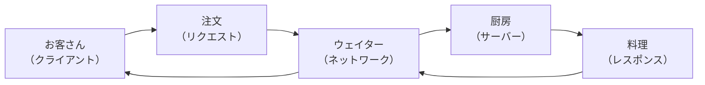
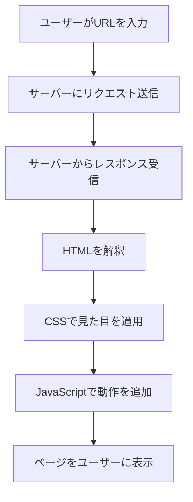
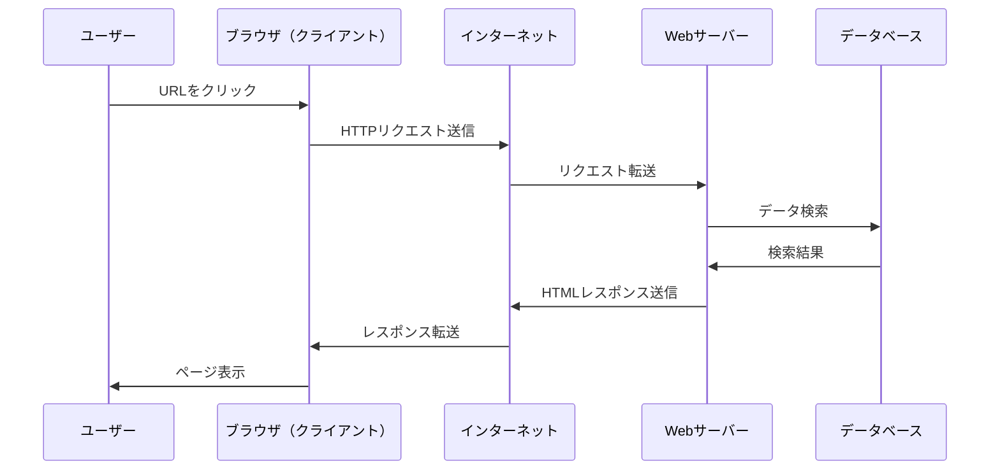
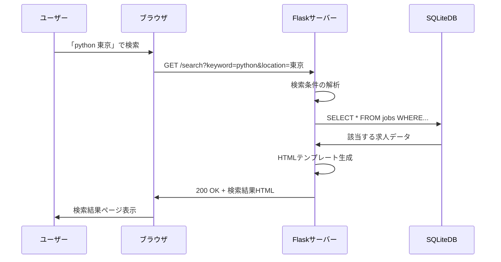
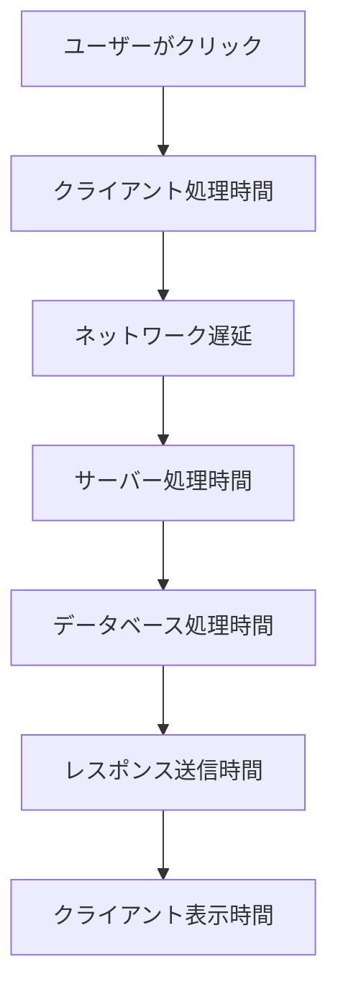
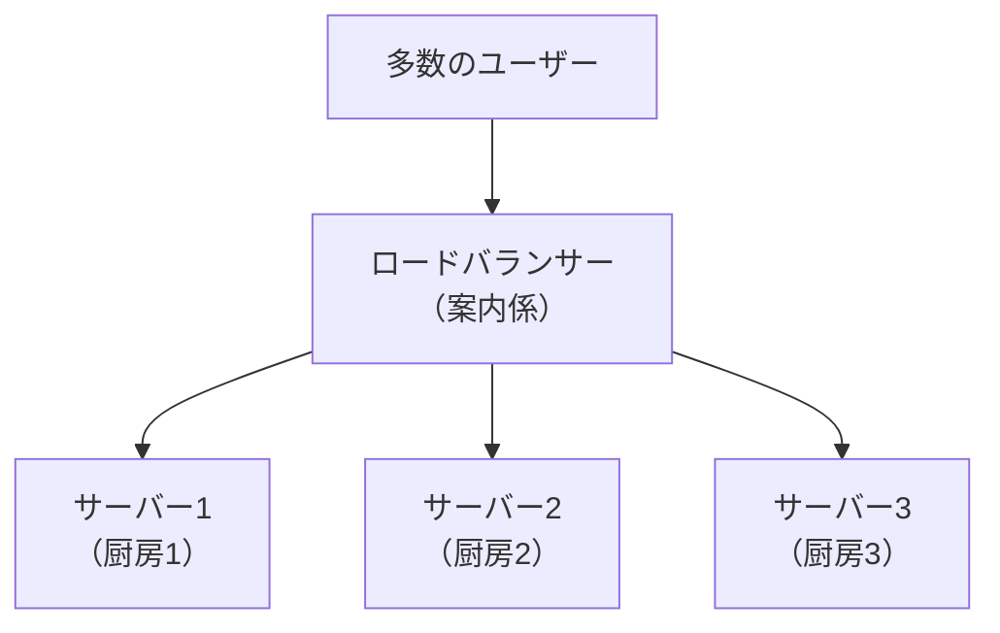

# クライアント・サーバーモデル

## はじめに

前章でインターネットとWebの世界について学びました。今度は、その世界でブラウザとサーバーがどのように会話しているかを理解しましょう。これは**クライアント・サーバーモデル**と呼ばれる仕組みで、Webの最も基本的な動作原理です。

この仕組みを理解することで、「サイトが重い」「エラーが出る」といった問題が、どこで・なぜ起きているのかを技術的に把握できるようになります。

この章では、Webの基本的な通信の仕組み、リクエスト・レスポンスの概念、サーバーとクライアントの役割分担について学びます。

## 📊 この章の重要度：🔴 必須

**Webディレクターにとって：**
- Web開発の根本的な動作原理
- パフォーマンス問題の原因分析に必須
- サーバー・ネットワーク関連の議論に必要

## あなたがこれを知ると変わること

**パフォーマンス問題での会話の変化：**
- 開発者：「サーバーのレスポンスが遅いです」
- あなた（修得前）：「サーバーって何？どう対処すればいいの？」
- あなた（修得後）：「データベース処理が重いのか、ネットワークの問題なのか切り分けましょう」

**エラー発生時の会話の変化：**
- 以前：「サイトが動きません」
- 今後：「クライアント側のJavaScriptエラーなのか、サーバー側の処理エラーなのか確認します」

**新機能検討時の変化：**
- 以前：「この機能は実現できますか？」
- 今後：「この処理はクライアント側で行うのか、サーバー側で行うのかどちらが適切でしょうか？」

## レストランでの注文システム：クライアント・サーバーの身近な例

### レストランとWebサイトの共通点

Webの仕組みは、レストランでの注文システムとよく似ています：



| レストラン | Webシステム | 役割 |
|------------|-------------|------|
| お客さん | ブラウザ（クライアント） | 要求を出す側 |
| 注文 | HTTPリクエスト | 何が欲しいかを伝える |
| ウェイター | インターネット | 注文と料理を運ぶ |
| 厨房 | Webサーバー | 要求に応じて作業する |
| 料理 | HTTPレスポンス | 要求された結果 |

**注意書き：** この例えは理解を助けるためのものです。実際のWebシステムでは、一瞬で数千の「注文」を同時に処理できる点が大きく異なります。

## クライアント：要求を出す側

### クライアントとは

**クライアント**とは、サービスを要求する側のことです。Web開発では主にブラウザ（Chrome、Safari、Edge等）がクライアントの役割を果たします。

**主なクライアントの種類：**
- **Webブラウザ**: Chrome、Safari、Edge、Firefox
- **モバイルアプリ**: iOS・Androidアプリ
- **API呼び出し**: 他のシステムからの自動アクセス

### クライアントの役割

クライアント（ブラウザ）は以下のような作業を行います：



1. **リクエスト送信**: ユーザーの操作に基づいてサーバーに要求を送る
2. **レスポンス処理**: サーバーから受け取った情報を解釈
3. **表示・実行**: HTML、CSS、JavaScriptを組み合わせてページを表示

## サーバー：要求に応じて仕事をする側

### サーバーとは

**サーバー**とは、クライアントからの要求に応じて情報やサービスを提供するコンピューターです。

**レストランの厨房の例で理解する：**
- 注文票を受け取る（リクエスト受信）
- 材料を確認する（データベース照会）
- 料理を作る（処理実行）
- 完成品を返す（レスポンス送信）

### サーバーの種類

Web開発でよく出てくるサーバーの種類：

| サーバー種類 | 役割 | 例 |
|--------------|------|-----|
| **Webサーバー** | HTTPリクエストを処理 | Apache、Nginx |
| **アプリケーションサーバー** | プログラムを実行 | Python Flask、Node.js |
| **データベースサーバー** | データを保存・検索 | MySQL、PostgreSQL |
| **ファイルサーバー** | 画像・動画を配信 | CDN、静的ファイルサーバー |

### 実際のサーバー処理例

私たちの求人検索アプリケーションを例に見てみましょう：

```python
# app.py より抜粋
@app.route('/search')
def search():
    # 1. クライアントからの要求を受け取る
    keyword = request.args.get('keyword', '').strip()
    location = request.args.get('location', '').strip()
    
    # 2. データベースに問い合わせる
    query = Job.query
    if keyword:
        search_term = f'%{keyword}%'
        query = query.filter(Job.title.like(search_term))
    
    # 3. 検索を実行
    jobs = query.order_by(Job.created_at.desc()).all()
    
    # 4. 結果をクライアントに返す
    return render_template('results.html', jobs=jobs)
```

**処理の流れ：**
1. クライアント（ブラウザ）から検索要求を受信
2. 検索キーワードを取得・処理
3. データベースから該当する求人情報を検索
4. 検索結果をHTMLとしてクライアントに送信

## リクエスト：「これが欲しい」の詳細な伝達

### HTTPリクエストの構造

クライアントがサーバーに送る**HTTPリクエスト**は、以下の情報を含みます：

```
GET /search?keyword=python&location=東京 HTTP/2
Host: jobsearch.example.com
User-Agent: Mozilla/5.0 (Windows NT 10.0; Win64; x64) Chrome/120.0
Accept: text/html,application/xhtml+xml
```

**各行の意味：**
- **1行目**: 何をしたいか（GET）、どのページか（/search）、検索条件
- **Host**: どのサイトに対する要求か
- **User-Agent**: どのブラウザからの要求か
- **Accept**: どんな形式のデータが欲しいか

### よく使われるHTTPメソッド

| メソッド | 意味 | 使用場面 | レストランの例 |
|----------|------|----------|----------------|
| **GET** | 情報を取得 | ページ表示、検索 | 「メニューを見せて」 |
| **POST** | 情報を送信 | フォーム送信、データ登録 | 「注文します」 |
| **PUT** | 情報を更新 | データ編集 | 「注文を変更」 |
| **DELETE** | 情報を削除 | データ削除 | 「注文をキャンセル」 |

**実際のWebサイトでの例：**
```
検索ページを見る: GET /search
検索を実行する: GET /search?keyword=python
お問い合わせ送信: POST /contact
プロフィール更新: PUT /profile
アカウント削除: DELETE /account
```

## レスポンス：「これが答えです」の詳細な返答

### HTTPレスポンスの構造

サーバーがクライアントに送る**HTTPレスポンス**は、以下の情報を含みます：

```
HTTP/2 200 OK
Content-Type: text/html; charset=utf-8
Content-Length: 1234
Set-Cookie: session_id=abc123

<!DOCTYPE html>
<html>
<head>
    <title>検索結果</title>
</head>
<body>
    <h1>検索結果：5件見つかりました</h1>
    ...
</body>
</html>
```

**HTTP/2の利点（2025年現在の標準）：**
- **多重化**: 複数のリクエストを同時並行処理
- **ヘッダー圧縮**: 通信量削減によるページ読み込み高速化
- **サーバープッシュ**: 必要なファイルを事前送信（現在は使用頻度低下）

**各部分の意味：**
- **1行目**: 処理結果（200 OK = 成功）
- **Content-Type**: どんな種類のデータか
- **Content-Length**: データのサイズ
- **Set-Cookie**: 次回のアクセス用の情報
- **本文**: 実際のHTML内容

### ステータスコード：処理結果の報告

**ステータスコード**は、サーバーからの「処理結果報告」です：

| コード | 意味 | レストランの例 | Webサイトの例 |
|--------|------|----------------|---------------|
| **200** | 成功 | 「料理をお持ちしました」 | ページ正常表示 |
| **404** | 見つからない | 「そのメニューはありません」 | ページが存在しない |
| **500** | サーバーエラー | 「厨房で問題が発生」 | プログラムのバグ |
| **403** | アクセス禁止 | 「お客様はご利用いただけません」 | 権限不足 |

## 通信の実際の流れ：シーケンス図で理解

### 基本的な通信パターン



### 実際の求人検索の流れ

私たちのアプリケーションでの具体例：



## ネットワーク遅延：距離と時間の関係

### 遅延が発生する場所

Webサイトが「重い」と感じる原因は複数あります：



**各段階での遅延要因：**

| 段階 | 遅延要因 | Webディレクターの対策 |
|------|----------|--------------------|
| **1. クライアント処理** | JavaScriptの重い処理 | コード最適化、軽量化 |
| **2. ネットワーク転送** | 距離、回線品質 | CDN導入、画像最適化 |
| **3. サーバー処理** | CPU、メモリ不足 | サーバー増強、負荷分散 |
| **4. データベース処理** | 大量データ、複雑な検索 | インデックス設定、クエリ最適化 |
| **5. レスポンス送信** | データサイズ、圧縮 | ファイル最適化、gzip圧縮 |
| **6. クライアント表示** | DOM操作、レンダリング | HTML構造最適化 |

### 距離による遅延の実例

**東京のユーザーが異なる場所のサーバーにアクセスする場合：**
- 東京のサーバー: 約10ms
- 大阪のサーバー: 約20ms
- アメリカのサーバー: 約150ms
- ヨーロッパのサーバー: 約300ms

**光の速度の制約：** 
どんなに技術が進歩しても、物理的な距離による遅延は避けられません。これが**CDN**（コンテンツ配信ネットワーク）が重要な理由です。

## 負荷分散：複数の厨房で効率アップ

### 負荷分散とは

人気のレストランでは、注文が殺到したときに複数の厨房で料理を作ります。Webサイトでも同じ考え方で、複数のサーバーで処理を分散させます。



**負荷分散の効果：**
- **高可用性**: 1台が故障しても他が継続
- **高性能**: 複数台で同時処理
- **スケーラビリティ**: アクセス増加時にサーバー追加可能

## WebディレクターとしてのNETWORK知識活用

### パフォーマンス要件の定義

**技術要件書での記載例（2025年標準）：**
```
ページ読み込み時間要件：
- 初回アクセス: 2.5秒以内（LCP: Largest Contentful Paint）
- 2回目以降: 1秒以内（キャッシュ効果）
- API レスポンス: 300ms以内
- データベース クエリ: 100ms以内
- CLS（Cumulative Layout Shift）: 0.1以下
- FID（First Input Delay）: 100ms以内

セキュリティ要件：
- HTTPS通信必須（HTTP/2以上）
- CSP（Content Security Policy）設定
- HSTS（HTTP Strict Transport Security）有効化
```

### 問題の切り分け方法

**「サイトが重い」という報告があった場合：**

1. **クライアント側チェック**
   - ブラウザの開発者ツールでネットワークタブ確認
     - Chrome: F12キー → Networkタブ → ページ再読み込み
     - 各リクエストの応答時間とサイズを確認
   - JavaScript エラーの有無
     - Consoleタブで赤いエラーメッセージを確認

2. **ネットワーク チェック**
   - ping コマンドでサーバーまでの遅延測定
   - 他のサイトの表示速度と比較

3. **サーバー側チェック**
   - サーバーのCPU・メモリ使用率
   - データベースの応答時間

### 技術選択への参画

**技術選択の判断基準（2025年版）：**

| 要素 | 静的サイト（JAMstack） | SPA（Single Page App） | 従来型動的サイト |
|------|------------|------------|------------|
| **応答速度** | 最高速（CDN+SSG） | 高速（初回ロード後） | サーバー処理により変動 |
| **サーバー負荷** | 最低 | 低（API のみ） | 高い |
| **SEO対応** | 優秀 | 要対策（SSR等） | 良好 |
| **開発・保守性** | シンプル | 複雑（フレームワーク必須） | 中程度 |
| **リアルタイム性** | 制限あり | 優秀 | 良好 |
| **セキュリティ** | 高（攻撃面小） | 中（クライアント処理） | 要注意（サーバー処理） |

**2025年のトレンド：**
- **エッジコンピューティング**: CDNレベルでの動的処理
- **サーバーレス**: 従量課金・自動スケーリング
- **ヘッドレスCMS**: コンテンツ管理と表示の分離

## 実際のアプリケーションでの通信例

私たちの求人検索アプリケーションでの健康チェック機能：

```python
# app.py より
@app.route('/health')
def health_check():
    """
    アプリケーションの動作確認用エンドポイント
    """
    return {'status': 'OK', 'message': 'Flask求人検索アプリケーションが正常に動作しています'}
```

**この機能の活用場面：**
- **監視システム**: 定期的にアクセスしてサーバーの生存確認
- **ロードバランサー**: 故障したサーバーを自動で切り離し
- **デプロイ確認**: 新バージョンの稼働確認

## まとめ

- **クライアント・サーバーモデル**は、要求を出す側（クライアント）と応答する側（サーバー）の役割分担システム
- **HTTPリクエスト**でクライアントがサーバーに要求を送り、**HTTPレスポンス**でサーバーが結果を返す
- **ステータスコード**により処理結果が報告される（200=成功、404=未発見、500=エラー等）
- **ネットワーク遅延**は物理的距離、サーバー処理時間、データベース応答時間など複数要因により発生
- **負荷分散**により高可用性・高性能・拡張性を実現
- Webディレクターはパフォーマンス要件定義、問題切り分け、技術選択の場面でこの知識を活用

次の章では、「HTTP通信の基本」について詳しく学び、今回学んだリクエスト・レスポンスの仕組みをより具体的に理解していきます。HTTPメソッドやステータスコードの詳細、そしてWebディレクターとして知っておくべきHTTP通信の特徴を深掘りします。