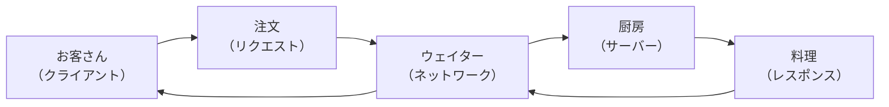
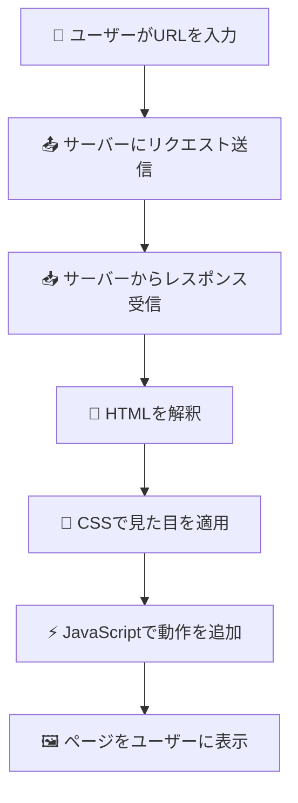

# クライアント・サーバーモデル

## はじめに

前章でインターネットとWebの世界について学びました。今度は、その世界でブラウザとサーバーがどのように会話しているかを理解しましょう。これは**クライアント・サーバーモデル**と呼ばれる仕組みで、Webの最も基本的な動作原理です。

この仕組みを理解することで、「サイトが重い」「エラーが出る」といった問題が、どこで・なぜ起きているのかを技術的に把握できるようになります。

この章では、Webの基本的な通信の仕組み、リクエスト・レスポンスの概念、サーバーとクライアントの役割分担について学びます。

## 📊 この章の重要度：🔴 必須

**Webディレクターにとって：**
- Web開発の根本的な動作原理
- パフォーマンス問題の原因分析に必須
- サーバー・ネットワーク関連の議論に必要

## あなたがこれを知ると変わること

**パフォーマンス問題での会話の変化：**
- 開発者：「サーバーのレスポンスが遅いです」
- あなた（修得前）：「サーバーって何？どう対処すればいいの？」
- あなた（修得後）：「データベース処理が重いのか、ネットワークの問題なのか切り分けましょう」

**エラー発生時の会話の変化：**
- 以前：「サイトが動きません」
- 今後：「クライアント側のJavaScriptエラーなのか、サーバー側の処理エラーなのか確認します」

**新機能検討時の変化：**
- 以前：「この機能は実現できますか？」
- 今後：「この処理はクライアント側で行うのか、サーバー側で行うのかどちらが適切でしょうか？」

## レストランでの注文システム：クライアント・サーバーの身近な例

### レストランとWebサイトの共通点

Webの仕組みは、レストランでの注文システムとよく似ています：



| レストラン | Webシステム | 役割 |
|------------|-------------|------|
| お客さん | ブラウザ（クライアント） | 要求を出す側 |
| 注文 | HTTPリクエスト | 何が欲しいかを伝える |
| ウェイター | インターネット | 注文と料理を運ぶ |
| 厨房 | Webサーバー | 要求に応じて作業する |
| 料理 | HTTPレスポンス | 要求された結果 |

**注意書き：** この例えは理解を助けるためのものです。実際のWebシステムでは、一瞬で数千の「注文」を同時に処理できる点が大きく異なります。

## 💻 クライアント：要求を出す側

### クライアントとは

**クライアント**とは、サービスを要求する側のことです。Web開発では主にブラウザ（Chrome、Safari、Edge等）がクライアントの役割を果たします。

**主なクライアントの種類：**
- **Webブラウザ**: Chrome、Safari、Edge、Firefox
- **モバイルアプリ**: iOS・Androidアプリ
- **API呼び出し**: 他のシステムからの自動アクセス

### クライアントの役割

クライアント（ブラウザ）は以下のような作業を行います：



1. **リクエスト送信**: ユーザーの操作に基づいてサーバーに要求を送る
2. **レスポンス処理**: サーバーから受け取った情報を解釈
3. **表示・実行**: HTML、CSS、JavaScriptを組み合わせてページを表示

## 🖥️ サーバー：要求に応じて仕事をする側

### サーバーとは

**サーバー**とは、クライアントからの要求に応じて情報やサービスを提供するコンピューターです。

<details>
<summary><strong>🖥️ サーバーの種類について</strong></summary>

### Web開発で使用される主要なサーバー

**フロントエンド向けサーバー：**
| サーバー種類 | 役割 | 例 |
|--------------|------|-----|
| **Webサーバー** | HTTPリクエストを処理 | Apache、Nginx |
| **アプリケーションサーバー** | プログラムを実行 | Python Flask、Node.js |
| **ファイルサーバー** | 画像・動画を配信 | CDN、静的ファイルサーバー |

**データ処理サーバー：**
| サーバー種類 | 役割 | 例 |
|--------------|------|-----|
| **データベースサーバー** | データを保存・検索 | MySQL、PostgreSQL |
| **バッチサーバー** | 定期処理・重い処理を実行 | Celery、Jenkins |
| **キューサーバー** | タスクの順番待ち管理 | Redis、RabbitMQ |

### バッチサーバーの重要性

**バッチサーバーとは：**
ユーザーが直接アクセスしない「裏方」のサーバーで、重い処理や定期処理を担当します。

**具体的な処理例：**
```
夜中の処理（バッチ処理）：
- 売上レポートの自動生成
- データベースのバックアップ
- メール配信（ニュースレター等）
- 画像の最適化処理
- 検索インデックスの更新

リアルタイム処理：
- 動画のエンコード（アップロード後）
- 大量データの分析
- ファイルの変換処理
```

**レストランの例で理解する：**
```
Webサーバー = ホール（お客様対応）
バッチサーバー = 裏方（仕込み・清掃）

裏方の仕事：
- 夜中に翌日の仕込み
- 閉店後の清掃・メンテナンス  
- 食材の発注処理
- 売上集計・レポート作成
```

**Webディレクターとしてのポイント：**
- **処理時間の分散**: 重い処理をバッチで夜間実行
- **ユーザー体験の向上**: リアルタイム処理は軽くして応答速度を保つ
- **システム安定性**: 定期メンテナンスやバックアップの自動化
- **コスト最適化**: 処理能力の効率的な活用

</details>


## 📤 リクエスト：クライアントがサーバーに要求する指示

### HTTPリクエストとは

クライアント（ブラウザ）がサーバーに送る「お願い」のことです。レストランで例えると「注文」に相当します。

**レストランでの注文と同じように：**
- 「メニューを見せて」→ ページを表示してください
- 「ラーメンを注文します」→ フォームを送信します
- 「注文を変更してください」→ データを更新してください
- 「注文をキャンセル」→ データを削除してください

このように、何をしたいかを明確に伝えることで、サーバーが適切に対応できます。

### サーバー処理の具体的な流れ：レストランの厨房で理解する

**レストランの厨房の例で理解する：**
- 注文票を受け取る（リクエスト受信）
- 材料を確認する（データベース照会）
- 料理を作る（処理実行）
- 完成品を返す（レスポンス送信）

**レストランの厨房＝Webサーバーの処理**

**例：ユーザーが「🍜ラーメン」を注文する場合**

```
URL: https://restaurant.com/order/shio-ramen
```

**1. 注文票を受け取る（リクエスト受信）**
```
厨房スタッフ: 「塩ラーメンの注文が入りました」
Webサーバー: 「/order/shio-ramen へのリクエストを受信」
```

**2. 料理の情報を確認する（URL解析・データ取得）**
```
厨房スタッフ: 「塩ラーメンのレシピを確認」
- 材料: 豚骨スープ、塩タレ、チャーシュー、メンマ...
- 調理時間: 3分
- 価格: 780円
Webサーバー: 「shio-ramen の商品情報をデータベースから取得」
- 商品名: 塩ラーメン
- 価格: 780円
- 画像: shio-ramen.jpg
- 説明文: あっさりとした豚骨ベースの塩味ラーメン
```

**3. 処理を実行する（料理作成・HTML生成）**
```
厨房スタッフ: 「塩ラーメンを調理開始」
- スープを温める
- 麺を茹でる
- トッピングを準備
- 盛り付けて完成
Webサーバー: 「塩ラーメンのページを生成」
- HTMLに商品情報を埋め込み
- 画像・価格・説明文を配置
- 注文ボタンを設置
```

**4. 完成した料理を提供（HTMLレスポンス返却）**
```
厨房スタッフ: 「塩ラーメン、お待たせしました！」
Webサーバー: 「塩ラーメンのHTMLページを返却」

生成されるページ例：
<h1>塩ラーメン</h1>

<p>価格: ¥780</p>
<p>あっさりとした豚骨ベースの塩味ラーメン</p>
```

**他の簡潔な例：**

| URL例 | 処理内容 |
|-------|----------|
| `/menu/today` | 本日のメニューを表示 |
| `/order/miso-ramen` | 味噌ラーメンの詳細ページを表示 |
| `/search?q=辛い` | 「辛い」で検索した結果を表示 |
| `/user/login` | ログインページを表示 |

## 📥 レスポンス：サーバーがクライアントに返す答え

### HTTPレスポンスとは

サーバーがクライアント（ブラウザ）に送る「返事」のことです。レストランで例えると「注文した料理」に相当します。

**レストランでの料理提供と同じように：**
- 「料理をお持ちしました」→ ページが正常に表示されます（成功）
- 「そのメニューはありません」→ ページが見つかりません（404エラー）
- 「厨房で問題が発生しました」→ サーバーで問題が起きています（500エラー）
- 「お客様はご利用いただけません」→ アクセス権限がありません（403エラー）

このように、サーバーは処理の結果を分かりやすく報告してくれます。

## 通信の流れ：レストランでの注文と同じ

### 基本的な流れ

Webサイトでページを見る流れは、レストランで注文するのと同じです：

**1. 注文する（リクエスト）**
- お客さんがメニューを選んで注文
- ユーザーがリンクをクリック

**2. 厨房で料理を作る（サーバー処理）**
- シェフが注文に応じて料理を準備
- サーバーが要求に応じてページを準備

**3. 料理を提供する（レスポンス）**
- ウェイターが完成した料理をお客さんに提供
- ブラウザが完成したページをユーザーに表示

## サイトが重い理由：配達の遅れと同じ

### なぜサイトが重くなるのか

Webサイトが「重い」と感じるのは、レストランの料理が遅いのと同じような理由があります：

**レストランが遅い理由：**
- 注文が多すぎて厨房がパンク → サーバーの処理能力不足
- 材料を取りに行く時間がかかる → データベースの検索に時間がかかる
- 料理が複雑で時間がかかる → プログラムの処理が重い
- 配達先が遠い → サーバーが物理的に遠い場所にある

**Webサイトでも同じことが起こります：**
- アクセスが集中するとサーバーが重くなる
- 大量のデータを扱うと時間がかかる
- 複雑な処理をすると遅くなる
- 海外のサーバーにアクセスすると距離の分だけ遅くなる

## 人気サイトの工夫：複数の厨房で効率アップ

### 負荷分散とは

人気のレストランでは、注文が殺到したときに複数の厨房で料理を作ります。Webサイトでも同じ考え方で、複数のサーバーで処理を分散させます。

**レストランの工夫：**
- 厨房を複数に分けて、それぞれで料理を作る
- 案内係が空いている厨房に注文を振り分ける
- 1つの厨房が故障しても、他の厨房で営業継続

**Webサイトでも同じ：**
- サーバーを複数台用意して、それぞれで処理を行う
- 案内役（ロードバランサー）が空いているサーバーに処理を振り分ける
- 1台のサーバーが故障しても、他のサーバーでサービス継続

## まとめ

この章では、Webの基本的な仕組みをレストランに例えて学びました：

- **クライアント・サーバーモデル**は、お客さん（ブラウザ）と厨房（サーバー）の関係と同じ
- **リクエスト**は注文、**レスポンス**は料理の提供に相当
- サイトが重い理由は、レストランが遅いのと同じような原因がある
- 人気サイトは複数の厨房（サーバー）で効率的に処理している

この基本的な仕組みを理解することで、「サイトが重い」「エラーが出る」といった問題が、どこで起きているのかを把握できるようになります。

次の章では、「HTTP通信の基本」について詳しく学び、今回学んだリクエスト・レスポンスの仕組みをより具体的に理解していきます。