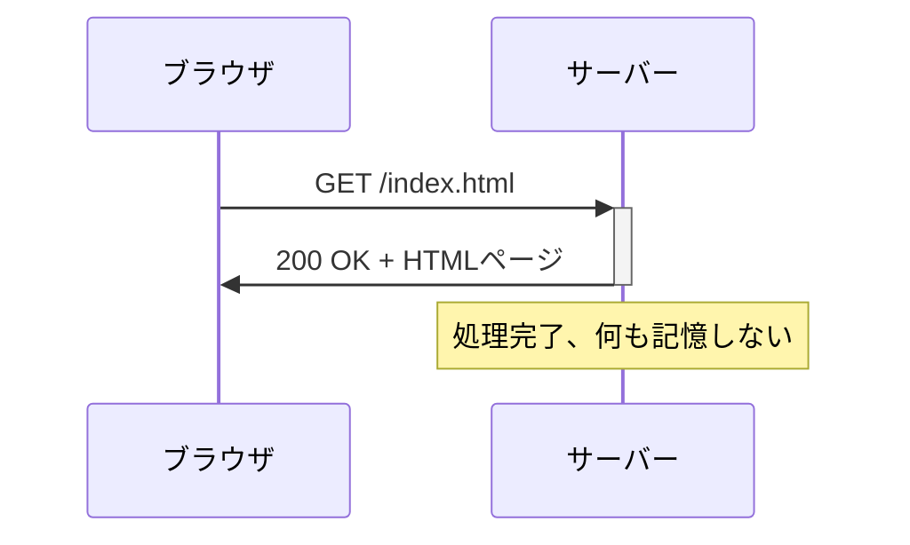
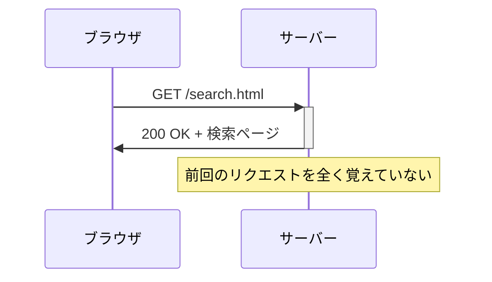
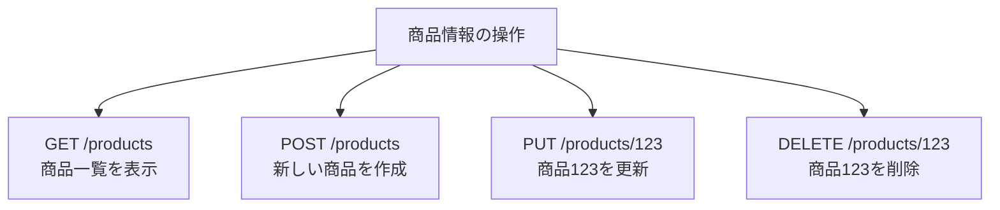
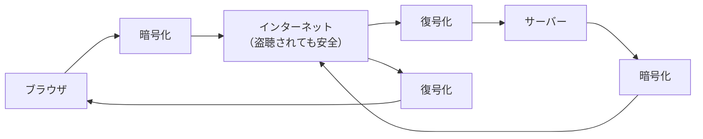

# HTTP通信の基本

## はじめに

前章でクライアント・サーバーモデルの基本を学びました。今度は、ブラウザとサーバーが実際にどのような「言葉」で会話しているかを詳しく見てみましょう。この言葉が**HTTP**（HyperText Transfer Protocol）です。

HTTPを理解することで、Webサイトで発生する様々な問題を技術的に把握し、開発者と具体的な会話ができるようになります。また、セキュリティやパフォーマンスの要件を適切に定義できるようになります。

この章では、HTTPプロトコルの仕組み、HTTPメソッドの使い分け、ステータスコードの意味、そしてHTTPSによるセキュリティについて学びます。

## 📊 この章の重要度：🔴 必須

**Webディレクターにとって：**
- Web開発の最も基本的な通信プロトコル
- エラー対応・セキュリティ要件に直結
- API設計・フォーム処理の理解に必須

## あなたがこれを知ると変わること

**エラー発生時の会話の変化：**
- 開発者：「404エラーが出ています」
- あなた（修得前）：「404って何ですか？」
- あなた（修得後）：「ページが見つからないということですね。URLの設定を確認しましょう」

**セキュリティ検討時の変化：**
- 以前：「セキュリティを強化してください」
- 今後：「個人情報を扱うページはHTTPS必須で、POSTメソッドでデータ送信してください」

**API連携時の変化：**
- 開発者：「APIがGETで設計されています」
- あなた（修得前）：「GETって何？問題ありますか？」
- あなた（修得後）：「データ取得なのでGETは適切ですね。更新処理があればPUTも必要になりますか？」

## HTTP：Web世界の共通言語

### HTTPとは

**HTTP**（HyperText Transfer Protocol）とは、WebブラウザとWebサーバーが情報をやり取りするための「共通言語」です。まるで世界中の人々が英語で会話するように、世界中のWebシステムがHTTPで会話しています。

**郵便システムとの比較：**
- HTTP = 郵便のルール（住所の書き方、料金の支払い方法等）
- HTTPリクエスト = 送る手紙（依頼内容を記載）
- HTTPレスポンス = 返事の手紙（結果を記載）

### HTTPの特徴

**ステートレス**：HTTPは「記憶しない」プロトコルです。

**1回目のリクエスト（完全に独立）:**


**2回目のリクエスト（完全に独立）:**


**ステートレスの意味：**
サーバーは前回の会話を覚えていません。毎回「初対面」として扱います。これにより、サーバーは大量のユーザーを効率的に処理できます。

**ユーザー情報の記憶方法：**
前回の会話を覚えていないのに、なぜWebサイトはログイン状態を覚えているのでしょうか？これは**Cookie**という仕組みを使っているからです。

## HTTPメソッド：やりたいことの種類を伝える

### 主要なHTTPメソッド

HTTPリクエストには「何をしたいか」を表す**HTTPメソッド**があります。図書館での行動に例えて理解してみましょう：

| HTTPメソッド | 図書館での行動 | Webサイトでの用途 | 実例 |
|--------------|----------------|-------------------|------|
| **GET** | 本を読む | 情報を見る | ページ表示、検索 |
| **POST** | 申込書を提出する | 新しい情報を送る | フォーム送信、新規登録 |
| **PUT** | 借りた本を返して新しい本を借りる | 情報を更新する | プロフィール編集 |
| **DELETE** | 予約をキャンセルする | 情報を削除する | アカウント削除 |

### GETメソッド：情報を取得する

**GET**は最も基本的なメソッドで、「情報をください」という意味です。

**GETの特徴：**
- データは**URL**に含まれる
- ブラウザの履歴に残る
- ブックマーク可能
- 同じリクエストを何度実行しても安全

**実際の例：**
```
検索リクエスト:
GET /search?keyword=python&location=東京 HTTP/1.1
Host: shop.example.com
```

一般的なWebアプリケーションの例：
```python
# app.py より
@app.route('/search')
def search():
    # GETパラメータを取得
    keyword = request.args.get('keyword', '').strip()
    location = request.args.get('location', '').strip()
    # 検索実行して結果を返す
```

### POSTメソッド：情報を送信する

**POST**は「この情報を処理してください」という意味です。

**POSTの特徴：**
- データは**リクエストボディ**に含まれる（URLに表示されない）
- ブラウザの履歴に詳細が残らない
- より大量のデータを送信可能
- セキュリティが高い

**フォーム送信の例：**
```html
<!-- お問い合わせフォーム -->
<form method="POST" action="/contact">
    <input type="text" name="name" placeholder="お名前">
    <input type="email" name="email" placeholder="メールアドレス">
    <textarea name="message" placeholder="お問い合わせ内容"></textarea>
    <button type="submit">送信</button>
</form>
```

**POSTリクエストの内容：**
```
POST /contact HTTP/2
Host: example.com
Content-Type: application/x-www-form-urlencoded

name=田中太郎&email=tanaka@example.com&message=お問い合わせです
```

**POSTの主な用途：**
- フォーム送信（お問い合わせ、会員登録）
- ファイルアップロード
- API経由でのデータ送信

> **詳細な実装例**: より詳しいPOSTリクエストの使い分けや実装例については、「06_応用_POSTリクエストの詳細例」を参照してください。

### PUTメソッド：情報を更新する

**PUT**は「この情報で上書きしてください」という意味です。

**使用例：**
```
プロフィール更新:
PUT /profile HTTP/1.1
Content-Type: application/json

{
    "name": "田中太郎",
    "email": "tanaka@example.com",
    "bio": "Web開発に興味があります"
}
```

### DELETEメソッド：情報を削除する

**DELETE**は「この情報を削除してください」という意味です。

**使用例：**
```
アカウント削除:
DELETE /account/123 HTTP/1.1
```

### メソッドの使い分けルール

**RESTful設計**という設計思想では、以下のように使い分けます：




<details>
<summary><strong>実務での疑問：なぜGET/POSTばかり使われるのか？</strong></summary>

**よくある疑問：**
「理論上はPUT/DELETEもあるのに、実際の開発現場ではGET/POSTばかり使われているのはなぜ？」

**答え：歴史的なブラウザ制約と運用上の都合**

#### GET/POST中心になる理由

**1. HTMLフォームの制約（歴史的経緯）**
- Webブラウザの`<form>`タグは、今でもGETとPOSTしかサポートしていません
- そのため、Webサイトでのユーザー操作（フォーム送信）は必然的にGET/POSTになります

**2. ブラウザとネットワーク機器の対応**
- 企業のネットワーク機器（プロキシ、セキュリティ機器等）がGET/POST以外を制限することがあります
- 「とりあえずGET/POSTにしておけば動く」という安全策をとる現場が多い

**3. 運用の複雑さ**
- PUT/DELETEを正しく使うには、より詳細なルール設計が必要
- チーム全体での理解統一に時間がかかるため、「更新はすべてPOST」で統一する現場も多い

#### PUT/DELETEが活用される場面

**API設計（システム間通信）**
- スマートフォンアプリとサーバー間の通信
- SPA（Single Page Application）での画面更新
- 他のシステムとの連携

```
例：商品管理システムのAPI
- GET /api/products → 商品一覧取得
- POST /api/products → 新商品作成
- PUT /api/products/123 → 商品123の更新
- DELETE /api/products/123 → 商品123の削除
```

#### Webディレクターとしての判断ポイント

**プロジェクトの性質による使い分け：**

**従来型Webサイト（フォーム中心）**
- GET：ページ表示、検索
- POST：フォーム送信、データ更新

**モダンWebアプリ（SPA、API活用）**
- 4つのメソッドをフル活用
- より直感的で保守性の高いAPI設計が可能

**開発チームとの会話で押さえるポイント：**
- 「このプロジェクトはAPI中心？フォーム中心？」
- 「セキュリティやネットワーク要件でメソッド制限はある？」
- 「開発チームの経験レベルとメンテナンス方針は？」

> **重要**: PUT/DELETEが「使われない」のではなく、プロジェクトの性質と運用要件によって使い分けが決まる、ということを理解しておきましょう。

</details>

## HTTPステータスコード：結果報告の数字

### ステータスコードの分類

サーバーからの返事には必ず**ステータスコード**という3桁の数字が付きます。

| 範囲 | 意味 | 例 | 日常生活の例 |
|------|------|----|----|
| **2xx** | 成功 | 200 OK | 「注文を承りました」 |
| **3xx** | リダイレクト | 301 Moved | 「引っ越しました、新住所はこちら」 |
| **4xx** | クライアントエラー | 404 Not Found | 「そのメニューはありません」 |
| **5xx** | サーバーエラー | 500 Internal Server Error | 「厨房で問題が発生しました」 |

### よく遭遇するステータスコード

**成功系（2xx）:**
- **200 OK**: 正常に処理完了
- **201 Created**: 新しいデータを作成完了
- **204 No Content**: 削除など、返すデータがない処理完了

**リダイレクト系（3xx）:**
- **301 Moved Permanently**: ページが恒久的に移転
- **302 Found**: ページが一時的に移転
- **304 Not Modified**: キャッシュされたページが最新

**クライアントエラー系（4xx）:**
- **400 Bad Request**: リクエストの形式が間違い
- **401 Unauthorized**: 認証が必要
- **403 Forbidden**: アクセス権限なし
- **404 Not Found**: ページが見つからない

**サーバーエラー系（5xx）:**
- **500 Internal Server Error**: サーバー内部でエラー
- **502 Bad Gateway**: サーバー間の通信エラー
- **503 Service Unavailable**: サーバーが一時的に利用不可

### 実際のWebアプリケーションでの例

一般的なWebアプリケーションでの健康チェック：

```python
# app.py より
@app.route('/health')
def health_check():
    return {'status': 'OK', 'message': 'Webアプリケーションが正常に動作しています'}
```

**正常時のレスポンス：**
```
HTTP/1.1 200 OK
Content-Type: application/json

{"status": "OK", "message": "Webアプリケーションが正常に動作しています"}
```

**エラー時の例：**
```
HTTP/1.1 404 Not Found
Content-Type: text/html

<!DOCTYPE html>
<html>
<head><title>404 Not Found</title></head>
<body><h1>ページが見つかりません</h1></body>
</html>
```

## HTTPヘッダー：手紙の封筒に書く情報

### HTTPヘッダーとは

**HTTPヘッダー**は、リクエストやレスポンスに含まれる「メタ情報」です。手紙でいうところの封筒に書く情報（送り主、宛先、配達方法等）に相当します。

### 重要なリクエストヘッダー

**よく使われるリクエストヘッダー：**

| ヘッダー名 | 意味 | 例 |
|------------|------|----|
| **Host** | アクセス先のサーバー | `example.com` |
| **User-Agent** | ブラウザの種類とバージョン | `Chrome/91.0` |
| **Accept** | 受け入れ可能なデータ形式 | `text/html, application/json` |
| **Authorization** | 認証情報 | `Bearer abc123...` |
| **Cookie** | 前回のアクセス情報 | `session_id=xyz789` |

**実際のリクエストヘッダー例：**
```
GET /search?keyword=python HTTP/1.1
Host: shop.example.com
User-Agent: Mozilla/5.0 (Windows NT 10.0; Win64; x64) AppleWebKit/537.36
Accept: text/html,application/xhtml+xml,application/xml;q=0.9,*/*;q=0.8
Accept-Language: ja,en;q=0.5
Accept-Encoding: gzip, deflate
Cookie: session_id=abc123; user_pref=dark_mode
```

### 重要なレスポンスヘッダー

**よく使われるレスポンスヘッダー：**

| ヘッダー名 | 意味 | 例 |
|------------|------|----|
| **Content-Type** | 返すデータの種類 | `text/html; charset=utf-8` |
| **Content-Length** | データのサイズ | `1234` |
| **Content-Encoding** | 圧縮形式 | `gzip` |
| **Set-Cookie** | ブラウザに保存する情報 | `session_id=xyz789; Secure; HttpOnly` |
| **Cache-Control** | キャッシュの制御 | `max-age=3600` |
| **Location** | リダイレクト先 | `/login` |
| **X-Frame-Options** | フレーム埋め込み制御 | `DENY` |
| **Content-Security-Policy** | コンテンツセキュリティ | `default-src 'self'` |
| **Strict-Transport-Security** | HTTPS強制 | `max-age=31536000; includeSubDomains` |

## HTTPS：暗号化による安全な通信

### HTTPSとは

**HTTPS**（HTTP Secure）とは、HTTPに**SSL/TLS**という暗号化技術を組み合わせた安全な通信方式です。

**手紙の例で理解：**
- **HTTP**: 普通の手紙（内容が丸見え）
- **HTTPS**: 暗号化された手紙（特殊な方法でないと読めない）



### SSL/TLS証明書：身元証明書

**SSL証明書**は、Webサイトの「身元証明書」です。

**証明書の役割：**
1. **身元確認**: 本当にそのWebサイトかを証明
2. **暗号化**: 通信内容を暗号化する鍵を提供
3. **改ざん防止**: データが途中で変更されていないことを保証

**ブラウザでの確認方法：**
- 🔒マーク: HTTPS接続が有効
- 証明書の詳細: サイト名をクリックして確認可能
- ⚠️警告: 証明書に問題がある場合

### HTTPSが必要な場面

**必須の場面：**
- ログインページ
- 個人情報入力フォーム
- 決済ページ
- 管理画面
- **すべてのページ**（現代の標準）

**現代のHTTPS要件：**
- **最新のTLSバージョン**の使用
- **信頼できる認証局**発行の証明書
- **混在コンテンツ**（HTTP リソース）の排除

**ブラウザでの確認方法：**
```
Chrome開発者ツールでの確認手順：
1. F12キーで開発者ツールを開く
2. Securityタブをクリック
3. 証明書の詳細情報を確認
4. TLSバージョンとセキュリティ状態をチェック
```

**セキュリティ警告の意味：**
- 🔒緑：完全に安全
- ⚠️黄：混在コンテンツあり
- ❌赤：証明書に問題あり、危険

## Cookie：Webサイトの記憶装置

### Cookieとは

**Cookie**とは、Webサイトがブラウザに保存してもらう小さな情報です。HTTPはステートレス（記憶しない）なので、Cookieで状態を記憶します。

**図書館の例：**
- 図書館カード = Cookie
- 毎回身分証明書を見せる代わりに、カードで本人確認
- カードには利用履歴や設定情報を記録

### Cookieの設定と送信

**サーバーからブラウザへのCookie設定：**
```
HTTP/1.1 200 OK
Set-Cookie: session_id=abc123; HttpOnly; Secure
Set-Cookie: user_pref=dark_mode; Max-Age=86400
Content-Type: text/html

<!DOCTYPE html>...
```

**ブラウザからサーバーへのCookie送信：**
```
GET /search HTTP/1.1
Host: example.com
Cookie: session_id=abc123; user_pref=dark_mode
```

### Cookieのセキュリティ

**セキュリティ属性：**
- **HttpOnly**: JavaScriptからアクセス不可（XSS攻撃対策）
- **Secure**: HTTPS接続でのみ送信
- **SameSite**: 他サイトからのリクエストでは送信制限

## ローカルストレージとセッションストレージ：ブラウザ内データ保存

### ブラウザでのデータ保存方法

HTTPがステートレス（記憶しない）であることは学びましたが、Webアプリケーションでは「状態を記憶する」必要があります。ブラウザには複数のデータ保存方法があります：

**主要な保存方法：**
- **Cookie**: サーバーとブラウザ間で自動送受信
- **Local Storage**: ブラウザ内でのみ永続保存
- **Session Storage**: ブラウザ内でのタブ限定保存

### ローカルストレージ（Local Storage）

**ローカルストレージ**とは、ブラウザ内にデータを永続的に保存する仕組みです。

**特徴：**
- データはユーザーが削除するまで保持
- サーバーには自動送信されない
- 同じドメインの全てのタブ・ウィンドウで共有
- 最大5-10MB程度の容量

**使用例：**
```javascript
// データの保存
localStorage.setItem('userPreference', 'dark-mode');
localStorage.setItem('language', 'ja');

// データの取得
const theme = localStorage.getItem('userPreference');
const lang = localStorage.getItem('language');
```

**実際の活用場面：**
- ユーザー設定（テーマ、言語設定）
- 入力途中のフォームデータ保存
- ショッピングカートの内容
- ゲームの進行状況

### セッションストレージ（Session Storage）

**セッションストレージ**とは、ブラウザのタブが開いている間だけデータを保存する仕組みです。

**特徴：**
- タブを閉じると自動的にデータが削除
- サーバーには自動送信されない
- 同じサイトでも他のタブとは共有しない
- セキュリティが高い

**使用例：**
```javascript
// データの保存
sessionStorage.setItem('currentPage', '3');
sessionStorage.setItem('searchKeyword', 'python');

// データの取得
const page = sessionStorage.getItem('currentPage');
const keyword = sessionStorage.getItem('searchKeyword');
```

**実際の活用場面：**
- 複数ページにわたるフォーム入力
- 検索結果の一時保存
- ウィザード形式の入力進行状況
- 一時的な認証トークン

### Cookie vs Local Storage vs Session Storage

| 特徴 | Cookie | Local Storage | Session Storage |
|------|--------|---------------|-----------------|
| **送信** | 自動でサーバーに送信 | 送信されない | 送信されない |
| **容量** | 4KB程度 | 5-10MB | 5-10MB |
| **有効期限** | 設定可能 | 永続（手動削除まで） | タブを閉じるまで |
| **共有範囲** | 同じドメイン全体 | 同じドメイン全体 | 同じタブのみ |
| **セキュリティ** | HTTPSで制御可能 | JavaScriptアクセス | JavaScriptアクセス |

### Webディレクターとしての活用ポイント

**設計時の選択基準：**
```
Cookie を使う場面：
✅ サーバーが知る必要がある情報（ログイン状態等）
✅ セキュリティが重要（HttpOnly、Secure属性）

Local Storage を使う場面：
✅ ユーザー設定の永続保存
✅ オフライン機能での データキャッシュ
✅ 大量のデータ保存

Session Storage を使う場面：
✅ 一時的なデータ保存
✅ セキュリティが重要な情報
✅ タブ間で分離したいデータ
```

**プライバシー・セキュリティ考慮：**
- **GDPR対応**: ユーザー同意とデータ削除権の実装
- **個人情報**: 機密情報はLocal/Session Storageに保存しない
- **XSS対策**: JavaScriptからアクセス可能なため、適切な入力値検証が必要

## WebディレクターとしてのHTTP知識活用

### 基本的な活用場面

**エラー対応：**
- 404エラー：ページが見つからない → URLやリンク切れを確認
- 500エラー：サーバー内部エラー → サーバーやプログラムの問題

**セキュリティ要件：**
- HTTPS必須（特に個人情報を扱うページ）
- POSTメソッドで機密データ送信
- Cookieにセキュリティ属性設定

**パフォーマンス管理：**
- ブラウザ開発者ツール（F12 → Network）でHTTP通信を確認
- 応答時間やファイルサイズをチェック

## 実際のWebアプリケーションでのHTTP通信

一般的なWebアプリケーションでの通信例：

**検索処理の完全なHTTP通信：**
```
1. リクエスト:
GET /search?keyword=python&location=東京 HTTP/1.1
Host: localhost:5000
Accept: text/html

2. サーバー処理:
- データベースから検索
- HTMLテンプレート生成

3. レスポンス:
HTTP/1.1 200 OK
Content-Type: text/html; charset=utf-8
Content-Length: 2048

<!DOCTYPE html>
<html>
<head><title>検索結果</title></head>
<body>
    <h1>検索結果：5件見つかりました</h1>
    ...
</body>
</html>
```

## まとめ

- **HTTP**はWebブラウザとサーバーの共通言語で、ステートレス（記憶しない）特徴がある
- **HTTPメソッド**（GET/POST/PUT/DELETE）により、やりたいことの種類を指定
- **ステータスコード**（2xx成功、3xx転送、4xxクライアントエラー、5xxサーバーエラー）で処理結果を報告
- **HTTPヘッダー**により、リクエスト・レスポンスのメタ情報を伝達
- **HTTPS**は現代のWebサイトでは必須、SSL/TLS暗号化により安全な通信を実現
- **Cookie**により、ステートレスなHTTPで状態管理を実現
- **Local Storage**（永続保存）、**Session Storage**（タブ限定）により、ブラウザ内でのデータ保存が可能
- Webディレクターはエラー対応、セキュリティ要件定義、パフォーマンス管理でHTTP知識を活用

次の章では、「ブラウザの役割と処理の流れ」について学び、クライアント側（ブラウザ）が受け取ったHTTPレスポンスをどのようにWebページとして表示するかを理解していきます。HTML、CSS、JavaScriptの処理順序や、レンダリングエンジンの動作、そしてWebディレクターとして知っておくべきブラウザの特性について深掘りします。