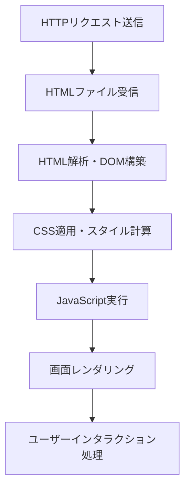
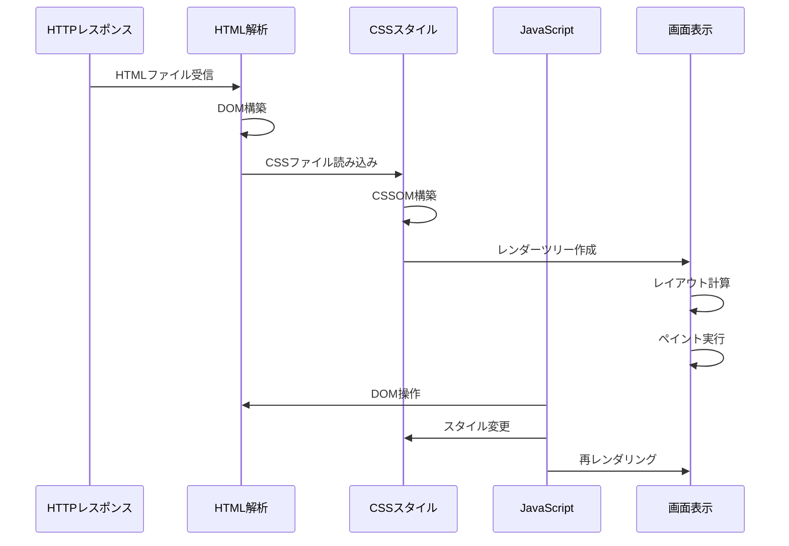
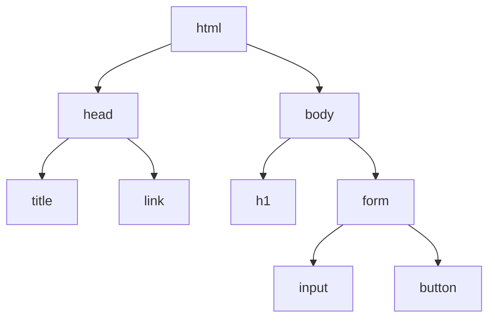
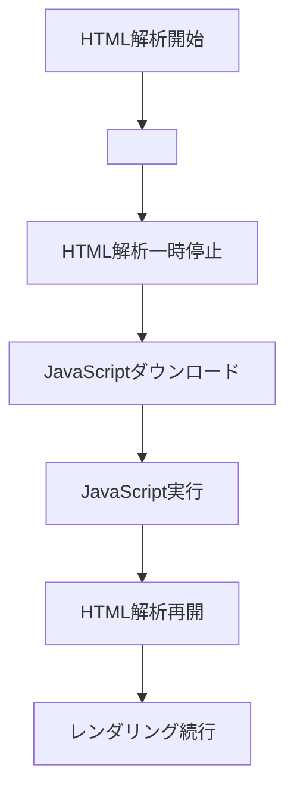
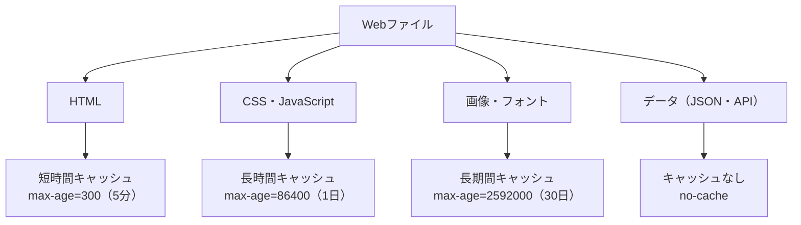
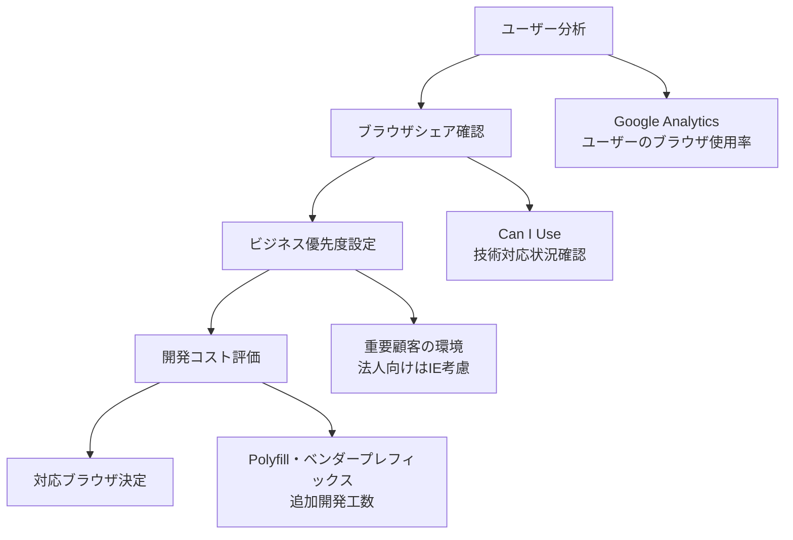
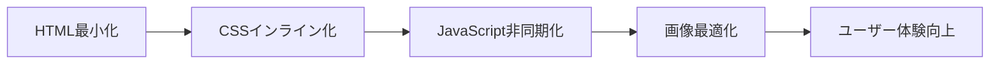
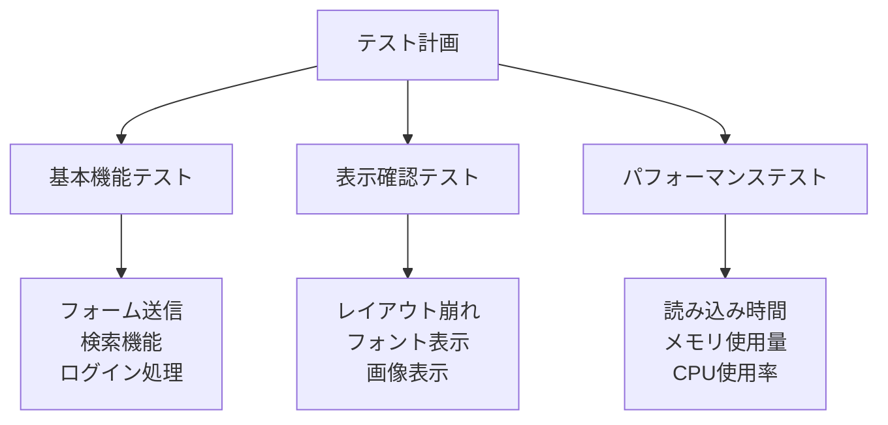

# ブラウザの役割と処理の流れ

## はじめに

前章でHTTP通信の仕組みを学びました。サーバーがHTTPレスポンスを返すところまでは理解できましたが、ブラウザはその後、HTMLファイルをどのようにして私たちが見ているWebページに変換しているのでしょうか。

この章では、ブラウザが果たしている重要な役割と、HTMLファイルが美しいWebページに生まれ変わるまでの処理の流れを学びます。また、ブラウザのキャッシュ機能やパフォーマンス最適化、そして複数ブラウザ対応の必要性についても理解していきます。

これらの知識により、Webディレクターとして、サイトのパフォーマンス改善や、ブラウザ対応範囲の適切な決定ができるようになります。

## 📊 この章の重要度：🟡 推奨

**Webディレクターにとって：**
- パフォーマンス最適化の基礎知識
- ブラウザ対応範囲の決定に必須
- ユーザー体験向上の技術的背景理解

## あなたがこれを知ると変わること

**パフォーマンス改善の会話の変化：**
- 開発者：「ページの読み込みが遅いです」
- あなた（修得前）：「何とかして速くしてください」
- あなた（修得後）：「レンダリングブロッキングの解消と、キャッシュ設定の見直しを検討しましょう」

**ブラウザ対応の判断変化：**
- 以前：「すべてのブラウザで同じに見せてください」
- 今後：「主要ブラウザでの**レンダリングエンジン**の違いを考慮して、優先度を付けて対応しましょう」

**エラー対応の変化：**
- 開発者：「Chromeでは正常ですがIEで崩れます」
- あなた（修得前）：「なぜ違うのでしょうか？」
- あなた（修得後）：「**レンダリングエンジン**の違いですね。対象ブラウザの優先度と工数を確認しましょう」

## ブラウザ：Web世界の翻訳者

### ブラウザとは

**ブラウザ**（Webブラウザ）とは、HTTPで受信したHTMLファイルや関連ファイルを、私たちが見て理解できるWebページに変換する「翻訳ソフトウェア」です。

**翻訳者との比較：**
- **原文**: HTMLファイル（コンピューターの言葉）
- **翻訳者**: ブラウザ
- **翻訳結果**: Webページ（人間が理解できる見た目）

**主要なブラウザ：**
- **Google Chrome**: 世界シェア約65%、Blinkエンジン
- **Safari**: macOS/iOS標準、WebKitエンジン
- **Microsoft Edge**: Windows標準、Blinkエンジン
- **Firefox**: Mozilla製、Geckoエンジン

### ブラウザの主要機能

**ブラウザが行う5つの主要な仕事：**



## レンダリングエンジン：Webページの製造機械

### レンダリングエンジンとは

**レンダリングエンジン**とは、HTMLファイルをWebページに変換する「製造機械」です。まるで工場の製造ラインのように、決められた手順でHTMLをWebページに組み立てていきます。

**主要なレンダリングエンジン：**

| エンジン名 | 使用ブラウザ | 特徴 |
|------------|--------------|------|
| **Blink** | Chrome、Edge | 高速・標準準拠 |
| **WebKit** | Safari | Apple製、モバイル最適化 |
| **Gecko** | Firefox | オープンソース、セキュリティ重視 |

### レンダリングの詳細プロセス

実際のWebページ生成は、以下の5つのステップで行われます：



### ステップ1：HTML解析とDOM構築

**DOM**（Document Object Model）とは、HTMLファイルをブラウザが理解できる「木構造」に変換したものです。

**一般的なWebアプリケーションのHTML例：**
```html
<!-- templates/index.html より -->
<!DOCTYPE html>
<html>
<head>
    <title>商品検索アプリ</title>
    <link rel="stylesheet" href="/static/style.css">
</head>
<body>
    <h1>商品を検索</h1>
    <form method="GET" action="/search">
        <input type="text" name="keyword" placeholder="キーワードを入力">
        <button type="submit">検索</button>
    </form>
</body>
</html>
```

**DOM構造への変換：**


### ステップ2：CSS解析とCSOM構築

**CSSOM**（CSS Object Model）とは、CSSファイルをブラウザが理解できる形に変換したものです。

**私たちのアプリケーションのCSS例：**
```css
/* static/style.css より */
body {
    font-family: Arial, sans-serif;
    margin: 0;
    padding: 20px;
    background-color: #f5f5f5;
}

h1 {
    color: #333;
    text-align: center;
}

form {
    max-width: 600px;
    margin: 0 auto;
    background: white;
    padding: 20px;
    border-radius: 8px;
}
```

### ステップ3：レンダーツリー作成

**レンダーツリー**とは、DOMとCSSOMを組み合わせて、「実際に画面に表示される要素」だけを抽出した構造です。

**レンダーツリーに含まれないもの：**
- `display: none` で非表示の要素
- `<head>` タグ内の要素
- CSSで `visibility: hidden` の要素

### ステップ4：レイアウト計算

**レイアウト**（リフロー）とは、各要素の位置とサイズを計算する処理です。

**計算される要素：**
- **位置**: 要素がどこに配置されるか
- **サイズ**: 要素の幅と高さ
- **マージン・パディング**: 要素間の余白
- **フォントサイズ**: 文字の大きさ

### ステップ5：ペイント実行

**ペイント**とは、計算されたレイアウト情報を元に、実際にピクセルを画面に描画する処理です。

**ペイントされる要素：**
- 背景色・背景画像
- 文字の色・フォント
- ボーダー・シャドウ
- 画像・アイコン

## JavaScriptの実行とレンダリングへの影響

### JavaScriptの処理タイミング

**JavaScript**は、HTMLの解析を**一時停止**させる特徴があります。これを**レンダリングブロッキング**と呼びます。



**JavaScriptの配置による影響：**

**❌ 悪い例（ヘッダーにJavaScript）：**
```html
<head>
    <script src="heavy-script.js"></script>  <!-- ページ表示を遅らせる -->
</head>
<body>
    <h1>ようこそ</h1>  <!-- スクリプト読み込み完了まで表示されない -->
</body>
```

**✅ 良い例（ボディ最下部にJavaScript）：**
```html
<body>
    <h1>ようこそ</h1>  <!-- すぐに表示される -->
    <script src="heavy-script.js"></script>  <!-- ページ表示後に読み込み -->
</body>
```

### 非同期読み込みの活用

**async属性とdefer属性：**

```html
<!-- 並行してダウンロード、ダウンロード完了次第すぐ実行 -->
<script src="analytics.js" async></script>

<!-- 並行してダウンロード、HTML解析完了後に実行 -->
<script src="main.js" defer></script>
```

## ブラウザキャッシュ：賢い記憶システム

### キャッシュとは

**ブラウザキャッシュ**とは、一度ダウンロードしたファイルをブラウザが保存しておく「記憶システム」です。図書館で一度借りた本を手元に置いておくようなものです。

**キャッシュのメリット：**
- **高速化**: 同じファイルを再ダウンロードする必要がない
- **データ量削減**: 通信量を減らせる
- **サーバー負荷軽減**: サーバーへのリクエストが減る

### キャッシュの種類

**ブラウザキャッシュの分類：**

| キャッシュ種類 | 対象 | 有効期間 | 用途 |
|----------------|------|----------|------|
| **メモリキャッシュ** | HTML・CSS・JS | ブラウザを閉じるまで | 同一セッション内での高速化 |
| **ディスクキャッシュ** | 画像・動画・フォント | 設定された期間 | 長期間の高速化 |
| **Service Worker** | 任意のリソース | プログラムで制御 | オフライン対応・PWA |

### キャッシュ制御のHTTPヘッダー

**Cache-Control ヘッダーの活用：**

```html
<!-- 1時間キャッシュする設定 -->
Cache-Control: max-age=3600

<!-- 毎回サーバーに確認する設定 -->
Cache-Control: no-cache

<!-- キャッシュしない設定 -->
Cache-Control: no-store
```

**私たちのFlaskアプリケーションでの例：**
```python
from flask import Flask, make_response

@app.route('/static/style.css')
def css_file():
    response = make_response(open('static/style.css').read())
    response.headers['Cache-Control'] = 'max-age=86400'  # 24時間キャッシュ
    response.headers['Content-Type'] = 'text/css'
    return response
```

### キャッシュ戦略の設計

**ファイル種類別のキャッシュ戦略：**



## ブラウザ間の違いと対応戦略

### レンダリングエンジンの違い

**同じHTMLでも表示が異なる理由：**

各ブラウザのレンダリングエンジンは、HTMLとCSSの解釈に微細な違いがあります。まるで同じ小説を異なる翻訳者が翻訳すると、ニュアンスが変わるのと似ています。

**主な違いの例：**
- **フォントレンダリング**: 文字の太さや間隔
- **CSS解釈**: 新しいCSS機能の対応度
- **JavaScript API**: 利用可能な機能の違い
- **パフォーマンス**: 処理速度の差

### ブラウザ対応の優先順位決定

**対応ブラウザの決定手順：**



**実際の対応例（2025年現在）：**

| 優先度 | ブラウザ | 対応レベル | 理由 |
|--------|----------|------------|------|
| **最高** | Chrome | 完全対応 | シェア1位、最新機能対応 |
| **高** | Safari | 完全対応 | iOS・macOSユーザー |
| **高** | Edge | 完全対応 | Windows標準、Chrome同等 |
| **中** | Firefox | 基本対応 | セキュリティ重視ユーザー |
| **低** | IE11 | 基本機能のみ | レガシーシステム対応 |

### クロスブラウザ対応の技術

**CSS ベンダープレフィックス：**
```css
/* クロスブラウザ対応のCSS */
.rounded-box {
    -webkit-border-radius: 8px;  /* Safari・旧Chrome */
    -moz-border-radius: 8px;     /* Firefox */
    border-radius: 8px;          /* 標準 */
}
```

**JavaScript Polyfill：**
```html
<!-- IE11でもモダンJavaScript機能を使用可能にする -->
<script src="https://polyfill.io/v3/polyfill.min.js"></script>
```

## パフォーマンス最適化：速度向上の戦略

### Critical Rendering Path（重要レンダリングパス）

**重要レンダリングパス**とは、ブラウザがHTMLを受信してから、ユーザーが見ることのできるコンテンツを表示するまでの最短経路です。

**最適化のポイント：**



### 具体的な最適化手法

**1. リソースの最小化：**
```html
<!-- 最小化前 -->
<link rel="stylesheet" href="style.css">
<link rel="stylesheet" href="responsive.css">
<link rel="stylesheet" href="animations.css">

<!-- 最小化後（ファイル統合・圧縮） -->
<link rel="stylesheet" href="app.min.css">
```

**2. 重要なCSSのインライン化：**
```html
<head>
    <style>
        /* Above-the-fold（初回表示）に必要なCSSのみ */
        body { font-family: Arial; margin: 0; }
        h1 { color: #333; text-align: center; }
    </style>
    <!-- その他のCSSは非同期読み込み -->
    <link rel="preload" href="other-styles.css" as="style" onload="this.onload=null;this.rel='stylesheet'">
</head>
```

**3. 画像の最適化：**
```html
<!-- レスポンシブ画像 -->


<!-- 遅延読み込み -->

```

### パフォーマンス測定ツール

**ブラウザ開発者ツールの活用：**

**Chrome DevTools でのパフォーマンス計測：**
1. **Network タブ**: リソースの読み込み時間確認
2. **Performance タブ**: レンダリング処理の詳細分析
3. **Lighthouse**: 総合的なパフォーマンススコア
4. **Elements タブ**: DOM構造とスタイル確認

**重要な指標：**
- **FCP** (First Contentful Paint): 最初のコンテンツ表示時間
- **LCP** (Largest Contentful Paint): 最大要素の表示時間
- **CLS** (Cumulative Layout Shift): レイアウトのずれ量
- **FID** (First Input Delay): 最初の操作に対する応答時間

## Webディレクターとしてのブラウザ知識活用

### プロジェクト要件定義での活用

**パフォーマンス要件の設定：**
```
✅ ページ読み込み時間：3秒以内（4G回線）
✅ First Contentful Paint：1.5秒以内
✅ 画像最適化：WebP対応、遅延読み込み実装
✅ キャッシュ戦略：静的リソース24時間、HTML5分
```

**ブラウザ対応要件の設定：**
```
✅ Chrome・Safari・Edge：完全対応
✅ Firefox：基本機能対応
✅ モバイルブラウザ：レスポンシブ対応必須
✅ IE11：管理画面のみ基本対応
```

### 品質管理での活用

**クロスブラウザテストの設計：**



### トラブルシューティング

**よくある問題と対応：**

**問題1: 特定のブラウザで表示が崩れる**
```
原因調査：
1. 使用している CSS 機能のブラウザ対応確認
2. ベンダープレフィックスの必要性確認
3. Polyfill の適用検討

解決策：
- Can I Use でブラウザ対応状況確認
- Autoprefixer で自動プレフィックス追加
- 段階的機能強化（Progressive Enhancement）
```

**問題2: ページの読み込みが遅い**
```
原因調査：
1. ネットワークタブでボトルネック特定
2. 大きなファイルや多数のリクエスト確認
3. レンダリングブロッキングリソース確認

解決策：
- 画像圧縮・最適化
- CSS・JavaScript の最小化
- CDN の活用
- 遅延読み込みの実装
```

### ユーザー体験向上への貢献

**Core Web Vitals を考慮した設計：**

**LCP（Largest Contentful Paint）改善：**
- メインコンテンツの軽量化
- 重要な画像の優先読み込み
- サーバーレスポンス時間の最適化

**FID（First Input Delay）改善：**
- JavaScript の実行時間短縮
- 重い処理の分割・非同期化
- サードパーティスクリプトの最適化

**CLS（Cumulative Layout Shift）改善：**
- 画像・動画にサイズ属性を設定
- フォント読み込み時のレイアウトシフト防止
- 動的コンテンツ挿入時の安定化

## まとめ

- **ブラウザ**はHTTPレスポンスをWebページに変換する翻訳者の役割を果たす
- **レンダリングエンジン**がHTML解析→CSS適用→JavaScript実行→画面描画の順で処理
- **レンダリングブロッキング**を避けるため、JavaScriptは適切な位置に配置が重要
- **ブラウザキャッシュ**により高速化が可能、Cache-Controlヘッダーで制御
- **ブラウザ間の違い**を理解し、対応優先度とコストを考慮した戦略的対応が必要
- **パフォーマンス最適化**はCore Web Vitalsを指標とし、ユーザー体験向上に直結
- Webディレクターはブラウザ知識を活用して要件定義・品質管理・トラブルシューティングを実行

次の章では、「WebサイトとWebアプリケーション」について学び、静的サイトと動的サイトの違い、CMS選択の基準、ホスティング・サーバー選択の考慮点について理解していきます。これまで学んだHTTP通信とブラウザ処理の知識を基に、Webサイト全体のアーキテクチャ選択の判断ができるようになります。