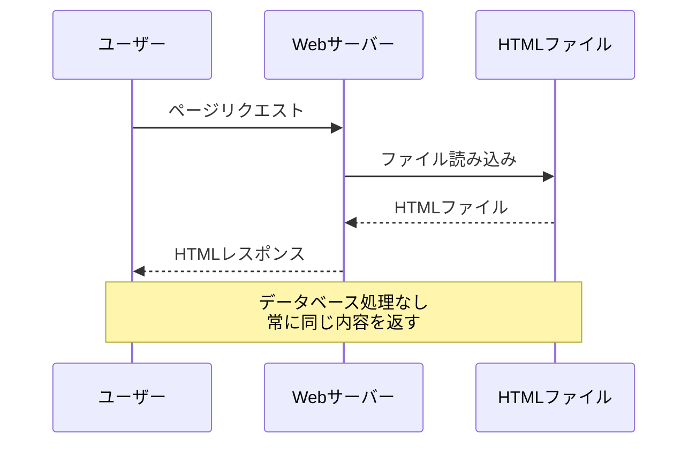
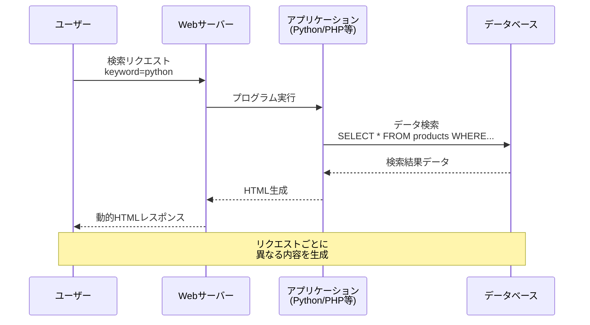
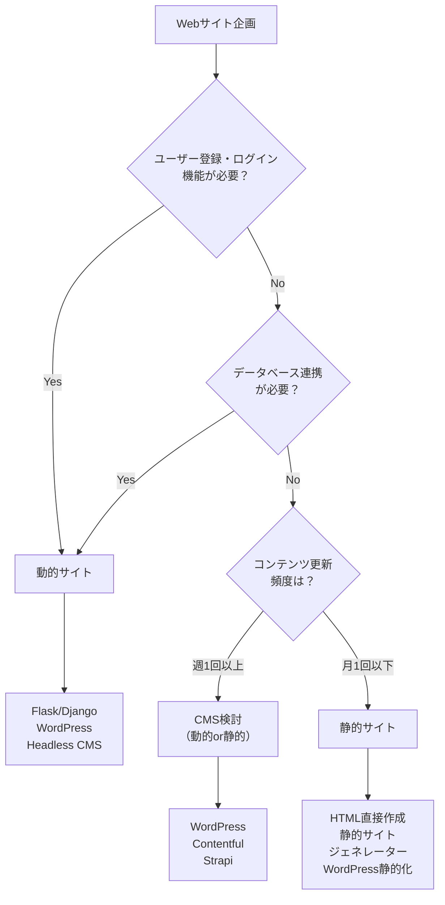
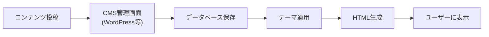
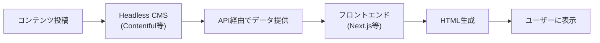
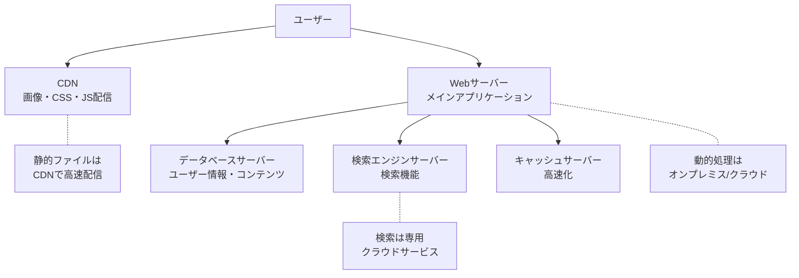
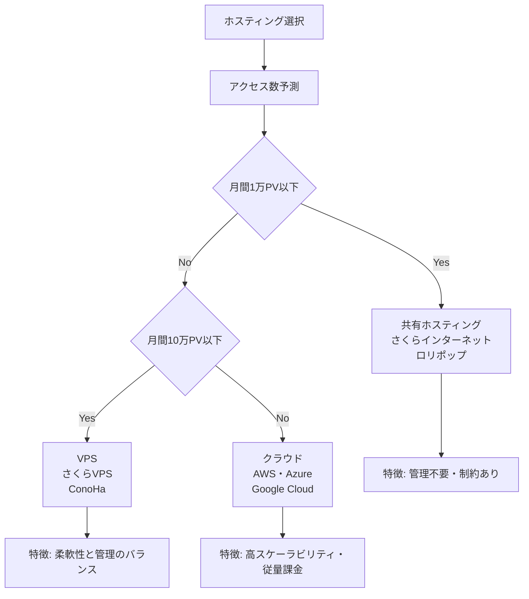
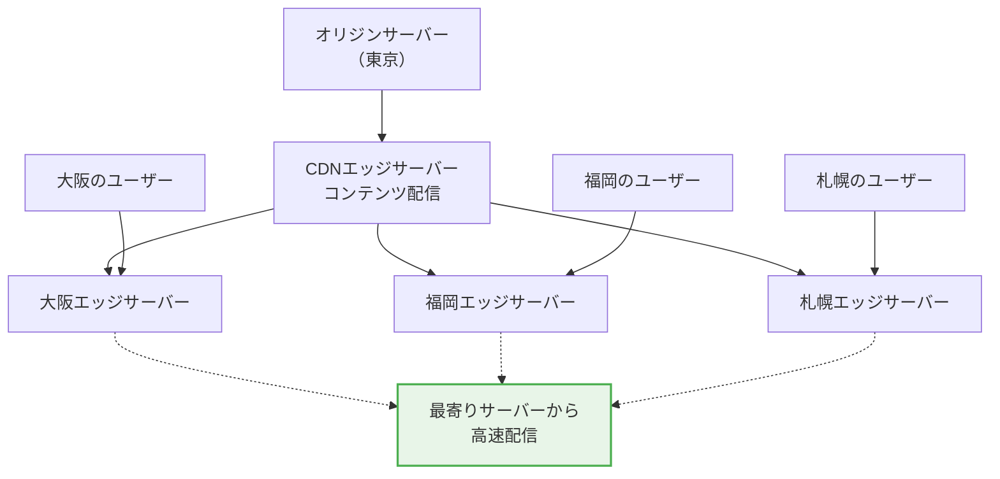

# WebサイトとWebアプリケーション

## はじめに

前章でブラウザの役割と処理の流れを学びました。HTMLファイルがどのようにWebページとして表示されるかを理解できたところで、今度は実際のWebサイト構築における重要な選択について理解していきましょう。

Webディレクターにとって最も重要な判断の一つが「どのようなタイプのWebサイトを構築するか」です。静的サイトにするか、動的サイトにするか、CMSを使うか、どこにホスティングするか。これらの選択は、プロジェクトの成功を大きく左右します。

この章では、静的サイトと動的サイトの違い、CMSの活用方法、ホスティング選択の基準について学び、技術選択を適切に行えるようになります。

## 📊 この章の重要度：🟡 推奨

**Webディレクターにとって：**
- プロジェクトの技術選択に直結
- 予算・期間・機能要件の最適化に必須
- 長期運用の成功可否を決定

## あなたがこれを知ると変わること

**プロジェクト企画時の会話の変化：**
- 開発者：「どのような構成にしましょうか？」
- あなた（修得前）：「よくわからないので、お任せします」
- あなた（修得後）：「更新頻度が低くSEOを重視するので、**静的サイト**で。CMSは管理コストを考慮してHeadless CMSを検討しましょう」

**技術選択の判断変化：**
- 以前：「とりあえずWordPressで」
- 今後：「コンテンツ管理の頻度、セキュリティ要件、パフォーマンス要件を整理して、最適な**CMS**を選択しましょう」

**運用フェーズでの変化：**
- 開発者：「サーバーの負荷が高いです」
- あなた（修得前）：「サーバーを強化してください」
- あなた（修得後）：「**静的コンテンツのCDN配信**と**データベースクエリの最適化**を検討しましょう」

## 静的サイト vs 動的サイト：基本的な違い

### 静的サイトとは

**静的サイト**とは、あらかじめ作成されたHTMLファイルをそのまま配信するWebサイトです。まるで印刷された本のように、内容が固定されています。

**静的サイトの特徴：**
- **高速**: HTMLファイルをそのまま配信
- **安全**: サーバーサイドプログラムがないためセキュリティリスクが低い
- **安価**: シンプルなホスティングで十分
- **安定**: システム障害が起きにくい

**静的サイトの仕組み：**


**静的サイトの実例：**
```html
<!-- index.html - 固定されたコンテンツ -->
<!DOCTYPE html>
<html>
<head>
    <title>株式会社ABC - 企業サイト</title>
</head>
<body>
    <h1>会社概要</h1>
    <p>設立年：2020年</p>
    <p>従業員数：50名</p>
    <p>事業内容：Web制作・システム開発</p>
</body>
</html>
```

### 動的サイトとは

**動的サイト**とは、ユーザーのリクエストに応じて、その場でHTMLを生成するWebサイトです。まるで注文を受けてから料理を作るレストランのようなものです。

**動的サイトの特徴：**
- **柔軟**: ユーザーごとに異なるコンテンツを表示
- **インタラクティブ**: ユーザーの操作に反応
- **データ駆動**: データベースの内容に基づいて表示
- **複雑**: サーバーサイドプログラムが必要

**動的サイトの仕組み：**


**動的サイトの実例（商品検索システム）：**
```python
# ECサイトの動的な商品検索機能の例
def search_products():
    # 1. ユーザーがWebページで入力した検索条件を取得
    user_keyword = "ノートパソコン"  # ユーザーが検索窓に入力
    user_category = "電子機器"      # ユーザーが選択したカテゴリ
    
    # 2. データベースに保存されている商品データ（例）
    all_products = [
        {"name": "MacBook Pro", "category": "電子機器", "price": 200000},
        {"name": "Surface Laptop", "category": "電子機器", "price": 150000},
        {"name": "ThinkPad X1", "category": "電子機器", "price": 180000},
        {"name": "iPad Air", "category": "電子機器", "price": 80000},
        {"name": "デスクチェア", "category": "家具", "price": 30000}
    ]
    
    # 3. 検索条件に合う商品だけを抽出
    search_results = []
    for product in all_products:
        # キーワードが商品名に含まれているかチェック
        if user_keyword in product["name"]:
            # さらにカテゴリも一致するかチェック
            if product["category"] == user_category:
                search_results.append(product)
    
    # 4. 検索結果をHTMLページとして生成
    html_content = f"""
    <h1>検索結果：{user_keyword}</h1>
    <p>見つかった商品：{len(search_results)}件</p>
    """
    
    for product in search_results:
        html_content += f"""
        <div class="product">
            <h3>{product["name"]}</h3>
            <p>価格: {product["price"]:,}円</p>
        </div>
        """
    
    return html_content

# このように、ユーザーの検索内容に応じて
# 毎回異なるHTMLページが動的に生成される
```

### 静的 vs 動的：選択の基準

**プロジェクト要件による選択基準：**

| 要件 | 静的サイト | 動的サイト |
|------|------------|------------|
| **コンテンツ更新頻度** | 月1回以下 | 日次・リアルタイム |
| **ユーザー固有機能** | 不要 | ログイン・マイページ |
| **データ量** | 少ない（～100ページ） | 大量（データベース管理） |
| **開発・運用工数** | 少ない | 多い |
| **セキュリティ要件** | 高（機密情報なし） | 要考慮（個人情報等） |
| **パフォーマンス** | 高速必須 | 機能性重視 |

**選択フローチャート：**


## CMS：コンテンツ管理システムの活用

### CMSとは

**CMS**（Content Management System）とは、Webサイトのコンテンツを簡単に管理できるシステムです。プログラミング知識がなくても、ブログを書くような感覚でWebサイトを更新できます。

**CMSの比喩：**
- **従来の方法**: 手作業で本を印刷・製本（HTML直接編集）
- **CMS**: 出版システム（記事を書けば自動で本になる）

### CMSの種類と特徴

**「Headless」とは？**
**Headless**とは「頭がない」という意味で、従来のCMSがもつ「頭」（フロントエンド・表示部分）を切り離したシステムを指します。

- **従来型CMS**: 管理画面（バックエンド）+ 表示画面（フロントエンド）が一体
- **Headless CMS**: 管理画面（バックエンド）のみ提供、表示画面は別途開発

**従来型CMS vs Headless CMS：**

| 特徴 | 従来型CMS | Headless CMS |
|------|-----------|--------------|
| **管理画面** | 組み込み | 別途開発 |
| **フロントエンド** | テーマで制御 | 自由に開発 |
| **パフォーマンス** | やや重い | 高速 |
| **カスタマイズ性** | 制限あり | 高い |
| **セキュリティ** | 要注意 | 高い |
| **学習コスト** | 低い | 高い |

**従来型CMSの仕組み：**


**Headless CMSの仕組み：**


### 主要CMSの比較

**WordPress（従来型CMS）：**
```php
// WordPress テーマファイルの例
<?php
// ブログ記事の表示
while (have_posts()) : the_post(); ?>
    <h2><?php the_title(); ?></h2>
    <div><?php the_content(); ?></div>
<?php endwhile; ?>
```

**特徴：**
- 世界最大シェア
- 豊富なテーマ・プラグイン
- 簡単な管理画面
- セキュリティ対策が必要

**Contentful（Headless CMS）：**
```javascript
// Next.js でContentfulからデータ取得
export async function getStaticProps() {
  const entries = await client.getEntries({
    content_type: 'blogPost'
  });
  
  return {
    props: {
      posts: entries.items
    }
  };
}
```

**特徴：**
- API経由でコンテンツ配信
- 高いパフォーマンス
- セキュリティが高い
- 開発コストが高い

### CMS選択の基準

**プロジェクト要件別のCMS選択：**

**企業サイト（小規模）：**
```
要件: シンプル・運用容易・SEO重視
推奨: WordPress + 高速化対策
理由: テーマ豊富・プラグイン充実・運用が簡単
```

**メディアサイト（大規模）：**
```
要件: 高速・大量コンテンツ・編集者多数
推奨: Headless CMS + Next.js
理由: パフォーマンス・セキュリティ・スケーラビリティ
```

**ECサイト：**
```
要件: 決済・在庫管理・セキュリティ
推奨: Shopify・EC-CUBE・WooCommerce
理由: EC専用機能・決済連携・セキュリティ対策
```

## ホスティング・サーバー選択の基準

### 現代的なWebサービスの構成

現代のWebサービスは、単一のサーバーですべてを処理するのではなく、**複数のサーバーを適材適所で組み合わせて**構成されます。

**典型的なWebサービスの構成例：**


**役割分担の例：**
- **CDN**: 画像、CSS、JavaScriptなどの静的ファイル配信
- **Webサーバー**: メインのアプリケーション処理（オンプレミス/クラウド）
- **データベースサーバー**: ユーザー情報、商品情報の管理
- **検索エンジン**: 全文検索機能（Elasticsearch等のクラウドサービス）
- **キャッシュサーバー**: よくアクセスされるデータの高速配信

### ホスティングの種類

**ホスティング**とは、Webサイトを公開するためのサーバーを借りるサービスです。住む場所を決めるのと同じように、適切な「住所」を選ぶ必要があります。

**ホスティング種類の比較：**

| 種類 | 管理レベル | 適用例 |
|------|------------|--------|
| **共有ホスティング** | 低 | 小規模サイト |
| **VPS** | 中 | 中規模サイト |
| **専用サーバー** | 高 | 大規模サイト |
| **クラウド** | 柔軟 | スケーラブルサイト |

### 共有ホスティング：アパートのような環境

**共有ホスティング**は、一つのサーバーを複数のユーザーで共有するサービスです。アパートのように、建物（サーバー）を複数の住人（Webサイト）で共有します。

**共有ホスティングの特徴：**
- **簡単管理**: サーバー管理不要
- **機能制限**: リソース・ソフトウェア制限
- **影響共有**: 他サイトの影響を受ける可能性
- **コスト効率**: 初期投資を抑えられる

**適用例：**
```
✅ 企業の紹介サイト
✅ 個人ブログ
✅ 小規模ECサイト
❌ 大量アクセスが予想されるサイト
❌ 特殊なソフトウェアが必要なサイト
```

### VPS・クラウド：マンションと一軒家

**VPS**（Virtual Private Server）は、物理サーバー内に仮想的な専用サーバーを構築するサービスです。

**クラウドホスティング**は、必要に応じてリソースを増減できる柔軟なサービスです。



### CDN：コンテンツ配信の最適化

**CDN**（Content Delivery Network）とは、世界中に配置されたサーバーから、ユーザーに最も近い場所でコンテンツを配信するサービスです。

**CDNの仕組み：**


**CDNのメリット：**
- **高速化**: 物理的に近いサーバーから配信
- **負荷分散**: オリジンサーバーの負荷軽減
- **可用性向上**: 一部サーバー障害時の継続配信
- **グローバル対応**: 世界中からの高速アクセス


## なぜ技術選択が重要なのか：成功と失敗を分ける判断

### 適切な技術選択がもたらす劇的な違い

想像してください。あなたが地方の老舗和菓子店の公式サイトを担当することになりました。

**シナリオA：技術選択を軽視した場合**
```
判断: "とりあえずWordPressで作ってください"
結果: 
❌ 毎月3万円のサーバー代（オーバースペック）
❌ セキュリティ対策に月1回の緊急対応
❌ ページの読み込みが遅く、お客様が離脱
❌ 店主が更新方法を覚えられず、情報が古いまま
```

**シナリオB：適切な技術選択をした場合**
```
判断: "更新頻度が低く予算重視なので、静的サイト+簡単CMS"
結果:
✅ 月500円のホスティング代
✅ セキュリティリスクがほぼゼロ
✅ 高速で美しいサイト
✅ 店主でも簡単に新商品情報を更新
✅ SEOで「地域名 和菓子」で上位表示
```

**両者の違い**：年間約35万円のコスト差と、売上への大きな影響。

### 技術選択で考慮すべき「3つの軸」

Webディレクターとして重要なのは、**ビジネス視点での判断軸**を持つことです。

**軸1：お金の軸（予算・運用コスト）**
```
質問: "このサイトにいくらまでかけられますか？"
→ 初期予算だけでなく、月々の運用費用も含めて考える

例：
・月5千円以下 → 静的サイト + 共有ホスティング
・月3万円まで → WordPress + VPS
・月10万円以上 → 本格的なシステム開発
```

**軸2：時間の軸（開発・運用・更新）**
```
質問: "いつまでに公開が必要で、どのくらい更新しますか？"
→ 急ぎなら既存ツール、長期運用なら独自開発も検討

例：
・2週間で公開 → 既存テーマカスタマイズ
・3ヶ月で公開 → オリジナルデザイン開発
・毎日更新 → 管理しやすいCMS必須
・年1回更新 → 静的サイトで十分
```

**軸3：人の軸（誰が管理・運用するか）**
```
質問: "サイトの更新は誰がやりますか？どのくらい慣れていますか？"
→ 使う人のスキルレベルに合わせた選択

例：
・ITに詳しくない社長 → 直感的なWix・Squarespace
・ブログを書ける担当者 → WordPress
・HTMLが分かる担当者 → 静的サイトジェネレーター
・エンジニアがいる → 自由度の高いフレームワーク
```

### 実際のプロジェクトでの判断事例

**事例1：地域の工務店サイト（失敗→成功への転換）**

**最初の失敗案：**
```
クライアント: "おしゃれなサイトにしたいです"
制作会社: "最新技術で作りましょう！"
→ 予算300万円、制作期間6ヶ月、月額保守費5万円

問題:
❌ 予算オーバーで途中で開発中断
❌ 社長がサイト更新できない（専門知識必要）
❌ 地域の検索で全然上位に来ない
```

**見直し後の成功案：**
```
ディレクター判断: "3つの軸で再検討してみましょう"

お金の軸: 初期50万円、月額1万円以内
時間の軸: 1ヶ月で公開、月2回の施工事例更新
人の軸: 社長（60代、スマホは使える）が自分で更新したい

→ WordPress + シンプルテーマ + 地域SEO対策

結果:
✅ 予算内で完成
✅ 社長が自分でブログ更新
✅ 「地域名 注文住宅」で3位表示
✅ 月5件の問い合わせ増加
```

**事例2：スタートアップのサービスサイト（スケール戦略）**

**段階的な成長戦略：**
```
フェーズ1（検証段階）: 
判断: "まずは仮説検証を最優先"
→ 無料テンプレート + Wix
→ 1週間で公開、週単位でA/Bテスト

フェーズ2（成長段階）:
判断: "お客様が増えてきたので本格化"
→ WordPress + カスタムデザイン
→ 決済機能追加、SEO本格対応

フェーズ3（スケール段階）:
判断: "システム負荷が高くなってきた"
→ 独自システム開発
→ API連携、高速化、セキュリティ強化
```

### 「よくある判断ミス」と対策

**ミス1：「最新技術信仰」**
```
× "最新のフレームワークを使いましょう"
○ "要件に最適な技術を選びましょう"

なぜ起こる: 技術者の提案をそのまま受け入れてしまう
対策: 「なぜその技術が必要か」を必ず確認
```

**ミス2：「とりあえずWordPress」**
```
× "みんな使ってるからWordPress"
○ "更新頻度と管理者スキルを確認してから判断"

なぜ起こる: 一番有名だから安心と思ってしまう
対策: 静的サイトという選択肢も必ず検討
```

**ミス3：「安さ重視の落とし穴」**
```
× "一番安いプランで"
○ "将来の成長も考慮した選択を"

なぜ起こる: 初期コストだけで判断してしまう
対策: 1年後、3年後の運用コストも計算
```

### サイト公開後の「3つの定期チェック」

Webディレクターとして、サイト公開後も継続的にチェックすべきポイントがあります。

**月次チェック：ユーザー視点**
```
📱 スマホで実際にサイトを見てみる
⏰ ページの読み込み速度を体感
📞 問い合わせフォームが正常に動作するか
🔍 Googleで会社名検索して何位に表示されるか
```

**半年チェック：ビジネス視点**
```
💰 運用コストは予算内に収まっているか
📈 アクセス数は期待通りか
🎯 問い合わせ・売上への貢献度は？
👥 サイト更新の負担は適切か
```

**年次チェック：将来性視点**
```
🔒 セキュリティは大丈夫か
📱 新しいデバイス・ブラウザに対応できているか
🚀 ビジネスの成長にサイトがついていけているか
💡 新しい機能追加の必要性はないか
```

## まとめ

この章で学んだ最も重要なことは、「技術選択がビジネスの成功を大きく左右する」ということです。

**技術選択の基本原則：**
- **静的サイト**：更新頻度が低く、高速・安全・低コストを重視する場合
- **動的サイト**：ユーザー個別機能やリアルタイム情報更新が必要な場合
- **CMS活用**：更新作業の頻度と担当者のスキルレベルで判断
- **ホスティング**：予算とアクセス数、将来の成長を考慮して選択
- **CDN**：サイト高速化の強力な武器、グローバル展開時は必須

**Webディレクターとしての判断軸：**
1. **お金の軸**：予算と継続的な運用コスト
2. **時間の軸**：開発期間と更新頻度・作業時間
3. **人の軸**：誰が管理するか、スキルレベルはどうか

**成功への重要なポイント：**
- 「最新技術」や「人気の技術」ではなく「最適な技術」を選ぶ
- 初期コストだけでなく、長期的な運用コストも必ず計算
- 公開後も定期的にサイトをチェックし、ビジネス成長に合わせて改善

適切な技術選択により、年間数十万円のコスト削減や、売上向上に大きく貢献できるWebディレクターになりましょう。

次の章では、「ブラウザでのデータ保存と状態管理」について学び、CookieやLocal Storageなど、ユーザーの状態を記憶する仕組みを理解していきます。静的・動的サイトの選択と密接に関わる重要な技術です。