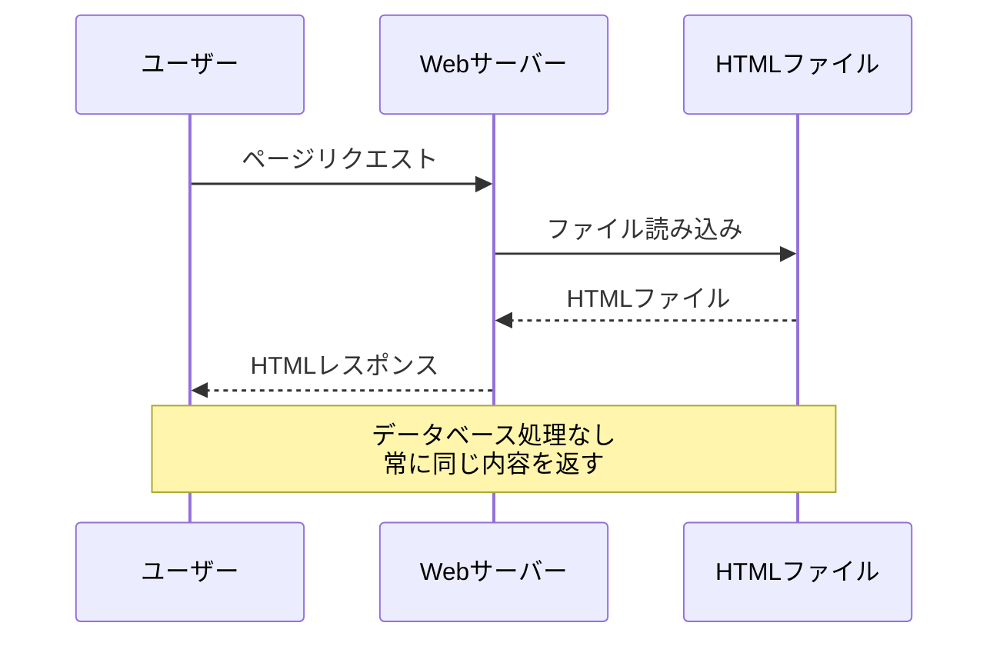
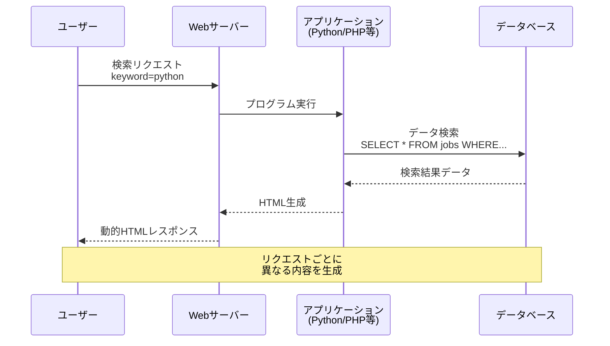
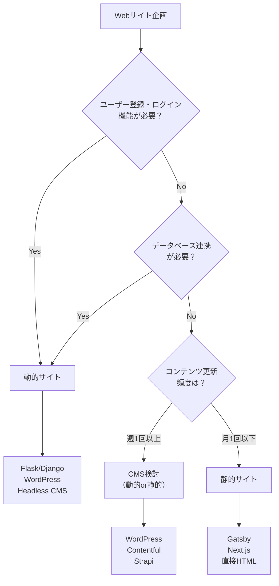
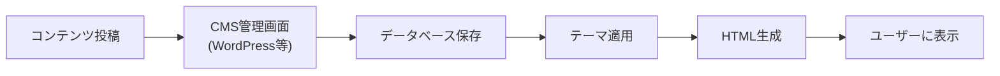
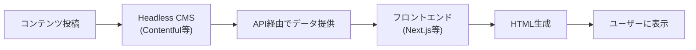
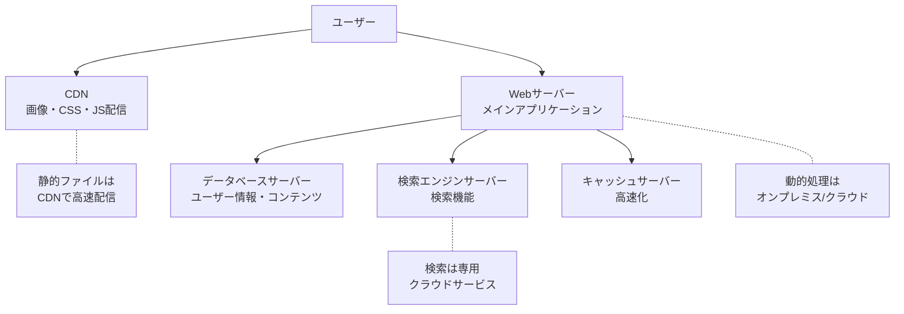
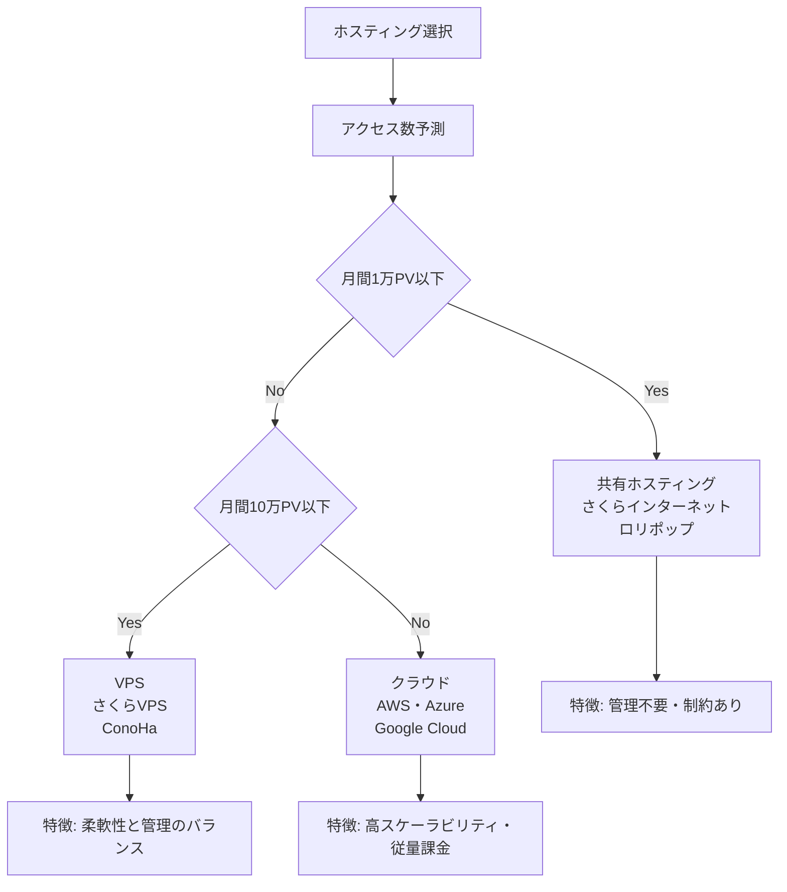
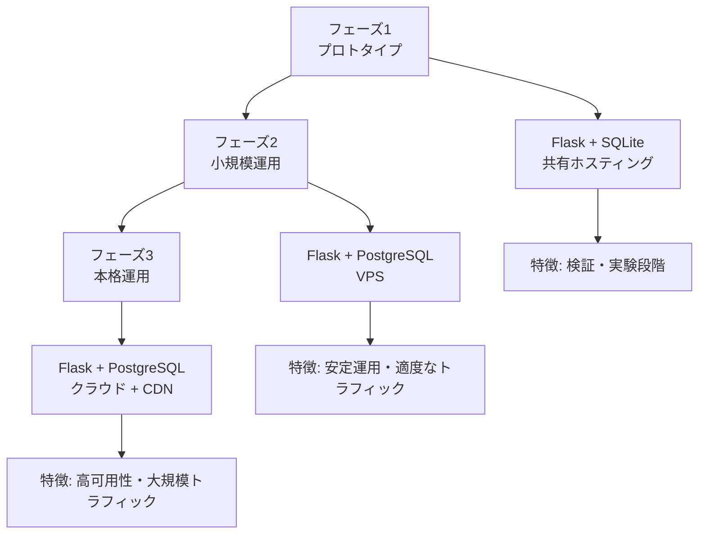

# WebサイトとWebアプリケーション

## はじめに

これまでインターネット・HTTP・ブラウザの仕組みを学んできました。これらの知識を基に、今度は実際のWebサイト構築における重要な選択について理解していきましょう。

Webディレクターにとって最も重要な判断の一つが「どのようなタイプのWebサイトを構築するか」です。静的サイトにするか、動的サイトにするか、CMSを使うか、どこにホスティングするか。これらの選択は、プロジェクトの成功を大きく左右します。

この章では、静的サイトと動的サイトの違い、CMSの活用方法、ホスティング選択の基準について学び、技術選択を適切に行えるようになります。

## 📊 この章の重要度：🟡 推奨

**Webディレクターにとって：**
- プロジェクトの技術選択に直結
- 予算・期間・機能要件の最適化に必須
- 長期運用の成功可否を決定

## あなたがこれを知ると変わること

**プロジェクト企画時の会話の変化：**
- 開発者：「どのような構成にしましょうか？」
- あなた（修得前）：「よくわからないので、お任せします」
- あなた（修得後）：「更新頻度が低くSEOを重視するので、**静的サイト**で。CMSは管理コストを考慮してHeadless CMSを検討しましょう」

**技術選択の判断変化：**
- 以前：「とりあえずWordPressで」
- 今後：「コンテンツ管理の頻度、セキュリティ要件、パフォーマンス要件を整理して、最適な**CMS**を選択しましょう」

**運用フェーズでの変化：**
- 開発者：「サーバーの負荷が高いです」
- あなた（修得前）：「サーバーを強化してください」
- あなた（修得後）：「**静的コンテンツのCDN配信**と**データベースクエリの最適化**を検討しましょう」

## 静的サイト vs 動的サイト：基本的な違い

### 静的サイトとは

**静的サイト**とは、あらかじめ作成されたHTMLファイルをそのまま配信するWebサイトです。まるで印刷された本のように、内容が固定されています。

**静的サイトの特徴：**
- **高速**: HTMLファイルをそのまま配信
- **安全**: サーバーサイドプログラムがないためセキュリティリスクが低い
- **安価**: シンプルなホスティングで十分
- **安定**: システム障害が起きにくい

**静的サイトの仕組み：**


**静的サイトの実例：**
```html
<!-- index.html - 固定されたコンテンツ -->
<!DOCTYPE html>
<html>
<head>
    <title>株式会社ABC - 企業サイト</title>
</head>
<body>
    <h1>会社概要</h1>
    <p>設立年：2020年</p>
    <p>従業員数：50名</p>
    <p>事業内容：Web制作・システム開発</p>
</body>
</html>
```

### 動的サイトとは

**動的サイト**とは、ユーザーのリクエストに応じて、その場でHTMLを生成するWebサイトです。まるで注文を受けてから料理を作るレストランのようなものです。

**動的サイトの特徴：**
- **柔軟**: ユーザーごとに異なるコンテンツを表示
- **インタラクティブ**: ユーザーの操作に反応
- **データ駆動**: データベースの内容に基づいて表示
- **複雑**: サーバーサイドプログラムが必要

**動的サイトの仕組み：**


**動的サイトの実例（私たちのFlaskアプリケーション）：**
```python
# app.py より - 動的なコンテンツ生成
@app.route('/search')
def search():
    # ユーザーの入力を取得
    keyword = request.args.get('keyword', '').strip()
    location = request.args.get('location', '').strip()
    
    # データベースから動的に検索
    jobs = Job.query
    if keyword:
        jobs = jobs.filter(Job.title.contains(keyword) | 
                          Job.description.contains(keyword))
    if location:
        jobs = jobs.filter(Job.location.contains(location))
    
    # 結果をHTMLテンプレートに埋め込み
    return render_template('results.html', jobs=jobs.all(), 
                         keyword=keyword, location=location)
```

### 静的 vs 動的：選択の基準

**プロジェクト要件による選択基準：**

| 要件 | 静的サイト | 動的サイト |
|------|------------|------------|
| **コンテンツ更新頻度** | 月1回以下 | 日次・リアルタイム |
| **ユーザー固有機能** | 不要 | ログイン・マイページ |
| **データ量** | 少ない（～100ページ） | 大量（データベース管理） |
| **開発・運用工数** | 少ない | 多い |
| **セキュリティ要件** | 高（機密情報なし） | 要考慮（個人情報等） |
| **パフォーマンス** | 高速必須 | 機能性重視 |

**選択フローチャート：**


## CMS：コンテンツ管理システムの活用

### CMSとは

**CMS**（Content Management System）とは、Webサイトのコンテンツを簡単に管理できるシステムです。プログラミング知識がなくても、ブログを書くような感覚でWebサイトを更新できます。

**CMSの比喩：**
- **従来の方法**: 手作業で本を印刷・製本（HTML直接編集）
- **CMS**: 出版システム（記事を書けば自動で本になる）

### CMSの種類と特徴

**「Headless」とは？**
**Headless**とは「頭がない」という意味で、従来のCMSがもつ「頭」（フロントエンド・表示部分）を切り離したシステムを指します。

- **従来型CMS**: 管理画面（バックエンド）+ 表示画面（フロントエンド）が一体
- **Headless CMS**: 管理画面（バックエンド）のみ提供、表示画面は別途開発

**従来型CMS vs Headless CMS：**

| 特徴 | 従来型CMS | Headless CMS |
|------|-----------|--------------|
| **管理画面** | 組み込み | 別途開発 |
| **フロントエンド** | テーマで制御 | 自由に開発 |
| **パフォーマンス** | やや重い | 高速 |
| **カスタマイズ性** | 制限あり | 高い |
| **セキュリティ** | 要注意 | 高い |
| **学習コスト** | 低い | 高い |

**従来型CMSの仕組み：**


**Headless CMSの仕組み：**


### 主要CMSの比較

**WordPress（従来型CMS）：**
```php
// WordPress テーマファイルの例
<?php
// ブログ記事の表示
while (have_posts()) : the_post(); ?>
    <h2><?php the_title(); ?></h2>
    <div><?php the_content(); ?></div>
<?php endwhile; ?>
```

**特徴：**
- 世界最大シェア
- 豊富なテーマ・プラグイン
- 簡単な管理画面
- セキュリティ対策が必要

**Contentful（Headless CMS）：**
```javascript
// Next.js でContentfulからデータ取得
export async function getStaticProps() {
  const entries = await client.getEntries({
    content_type: 'blogPost'
  });
  
  return {
    props: {
      posts: entries.items
    }
  };
}
```

**特徴：**
- API経由でコンテンツ配信
- 高いパフォーマンス
- セキュリティが高い
- 開発コストが高い

### CMS選択の基準

**プロジェクト要件別のCMS選択：**

**企業サイト（小規模）：**
```
要件: シンプル・運用容易・SEO重視
推奨: WordPress + 高速化対策
理由: テーマ豊富・プラグイン充実・運用が簡単
```

**メディアサイト（大規模）：**
```
要件: 高速・大量コンテンツ・編集者多数
推奨: Headless CMS + Next.js
理由: パフォーマンス・セキュリティ・スケーラビリティ
```

**ECサイト：**
```
要件: 決済・在庫管理・セキュリティ
推奨: Shopify・EC-CUBE・WooCommerce
理由: EC専用機能・決済連携・セキュリティ対策
```

## ホスティング・サーバー選択の基準

### 現代的なWebサービスの構成

現代のWebサービスは、単一のサーバーですべてを処理するのではなく、**複数のサーバーを適材適所で組み合わせて**構成されます。

**典型的なWebサービスの構成例：**


**役割分担の例：**
- **CDN**: 画像、CSS、JavaScriptなどの静的ファイル配信
- **Webサーバー**: メインのアプリケーション処理（オンプレミス/クラウド）
- **データベースサーバー**: ユーザー情報、商品情報の管理
- **検索エンジン**: 全文検索機能（Elasticsearch等のクラウドサービス）
- **キャッシュサーバー**: よくアクセスされるデータの高速配信

### ホスティングの種類

**ホスティング**とは、Webサイトを公開するためのサーバーを借りるサービスです。住む場所を決めるのと同じように、適切な「住所」を選ぶ必要があります。

**ホスティング種類の比較：**

| 種類 | 管理レベル | 適用例 |
|------|------------|--------|
| **共有ホスティング** | 低 | 小規模サイト |
| **VPS** | 中 | 中規模サイト |
| **専用サーバー** | 高 | 大規模サイト |
| **クラウド** | 柔軟 | スケーラブルサイト |

### 共有ホスティング：アパートのような環境

**共有ホスティング**は、一つのサーバーを複数のユーザーで共有するサービスです。アパートのように、建物（サーバー）を複数の住人（Webサイト）で共有します。

**共有ホスティングの特徴：**
- **簡単管理**: サーバー管理不要
- **機能制限**: リソース・ソフトウェア制限
- **影響共有**: 他サイトの影響を受ける可能性
- **コスト効率**: 初期投資を抑えられる

**適用例：**
```
✅ 企業の紹介サイト
✅ 個人ブログ
✅ 小規模ECサイト
❌ 大量アクセスが予想されるサイト
❌ 特殊なソフトウェアが必要なサイト
```

### VPS・クラウド：マンションと一軒家

**VPS**（Virtual Private Server）は、物理サーバー内に仮想的な専用サーバーを構築するサービスです。

**クラウドホスティング**は、必要に応じてリソースを増減できる柔軟なサービスです。



### CDN：コンテンツ配信の最適化

**CDN**（Content Delivery Network）とは、世界中に配置されたサーバーから、ユーザーに最も近い場所でコンテンツを配信するサービスです。

**CDNの仕組み：**
```mermaid
flowchart TD
    A["オリジンサーバー<br/>（東京）"] --> B["CDNエッジサーバー"]
    B --> C["大阪エッジ"]
    B --> D["福岡エッジ"]
    B --> E["札幌エッジ"]
    
    F["大阪のユーザー"] --> C
    G["福岡のユーザー"] --> D
    H["札幌のユーザー"] --> E
    
    Note over F,H: 最も近いサーバーから<br/>高速配信
```

**CDNのメリット：**
- **高速化**: 物理的に近いサーバーから配信
- **負荷分散**: オリジンサーバーの負荷軽減
- **可用性向上**: 一部サーバー障害時の継続配信
- **グローバル対応**: 世界中からの高速アクセス

## 実際のWebアプリケーション開発例

### 私たちの求人検索アプリケーション

**技術スタック：**
```python
# app.py - Flask動的Webアプリケーション
from flask import Flask, render_template, request
from models import db, Job

app = Flask(__name__)

# 静的ファイル（CSS・画像）
@app.route('/static/<path:filename>')
def static_files(filename):
    # CDNやキャッシュ設定が可能
    return send_from_directory('static', filename)

# 動的コンテンツ（検索結果）
@app.route('/search')
def search():
    # データベースからリアルタイム検索
    keyword = request.args.get('keyword', '')
    jobs = Job.query.filter(Job.title.contains(keyword)).all()
    
    # テンプレートで動的HTML生成
    return render_template('results.html', jobs=jobs)
```

**ハイブリッド構成の採用：**
```
🏠 基本構成: Flask動的アプリケーション
📁 静的リソース: CSS・画像はCDN配信
💾 データベース: SQLiteから本格DBへ移行可能
🔍 検索機能: リアルタイムデータベース検索
📱 レスポンシブ: 静的CSS + 動的コンテンツ
```

### スケーラビリティの考慮

**成長に応じた構成変更：**



## Webディレクターとしての技術選択戦略

### プロジェクト初期の判断フレームワーク

**要件分析シート：**

```
プロジェクト基本情報:
□ 公開希望日: ____年__月
□ 想定月間PV: _____PV
□ 更新頻度: 日次/週次/月次/年次

機能要件:
□ ユーザー登録・ログイン
□ 検索・フィルタリング
□ 決済機能
□ 多言語対応
□ スマートフォン対応

非機能要件:
□ ページ読み込み速度: ___秒以内
□ 同時接続ユーザー数: ___人
□ セキュリティレベル: 高/中/低
□ SEO重要度: 高/中/低
```

### 技術選択の意思決定プロセス

**ステップ1: 要件分析**


**ステップ2: 比較検討**
```
技術選択肢の評価軸:
✅ 開発期間・工数
✅ 運用・保守性
✅ パフォーマンス
✅ セキュリティ
✅ 拡張性・将来性
✅ チームのスキル
```

**ステップ3: リスク評価**
```
リスク要因の検討:
⚠️ 技術的リスク: 新技術採用の影響
⚠️ 運用リスク: 保守・アップデート体制
⚠️ ビジネスリスク: 要件変更への対応力
⚠️ セキュリティリスク: 脆弱性・攻撃への対応
```

### 実際の選択例

**企業サイトリニューアル（中規模プロジェクト）：**
```
要件:
- コーポレートサイト + 採用サイト
- 月間2万PV
- 月1-2回更新
- SEO重視
- レスポンシブ対応

選択結果:
✅ WordPress + カスタムテーマ
✅ 共有ホスティング（さくらインターネット）
✅ CDN（CloudFlare）
✅ SSL証明書

理由:
- CMSで非エンジニアでも更新可能
- SEOプラグインが充実
- コストパフォーマンスが高い
```

**ECサイト構築（大規模プロジェクト）：**
```
要件:
- 商品数1000点
- 決済・在庫管理
- 月間10万PV
- セキュリティ重視
- モバイルファースト

選択結果:
✅ Shopify（ECプラットフォーム）
✅ クラウドホスティング（AWS）
✅ カスタムアプリ開発
✅ 外部API連携

理由:
- EC専用機能が標準搭載
- PCI DSS準拠のセキュリティ
- スケーラビリティが高い
```

### 運用フェーズでの最適化

**パフォーマンス監視・改善：**
```
定期チェック項目:
📊 Google Analytics: PV・UU・直帰率
📊 PageSpeed Insights: Core Web Vitals
📊 サーバー監視: CPU・メモリ・ディスク使用率
📊 エラーログ: 404・500エラーの発生状況
```

**技術的負債の管理：**
```
年次レビュー項目:
🔄 CMS・フレームワークのアップデート
🔄 SSL証明書の更新
🔄 サーバーOSのセキュリティアップデート
🔄 プラグイン・ライブラリの脆弱性確認
```

## まとめ

- **静的サイト**は高速・安全・低コストで、更新頻度が低いサイトに適している
- **動的サイト**はインタラクティブ・データ駆動で、ユーザー固有機能が必要なサイトに必須
- **CMS選択**は更新頻度・カスタマイズ性・セキュリティ要件で判断、従来型とHeadlessそれぞれに利点
- **ホスティング選択**はアクセス数・予算・管理工数で判断、共有・VPS・クラウドから適切に選択
- **CDN活用**により全世界への高速配信が可能、パフォーマンス向上に大きく貢献
- Webディレクターは要件分析→技術選択→リスク評価の体系的プロセスで最適解を導出
- 運用フェーズでは継続的なパフォーマンス監視と技術的負債管理が成功の鍵

これで**02_Web基礎理解フェーズ**が完了しました。次の**03_Web構成要素フェーズ**では、HTML・CSS・JavaScriptの詳細を学び、実際のWebページ構成要素を深く理解していきます。ここまでで学んだインターネット・HTTP・ブラウザ・サイト構成の知識を基に、より具体的なWeb技術を習得していきましょう。