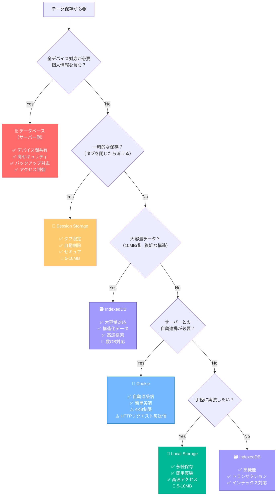
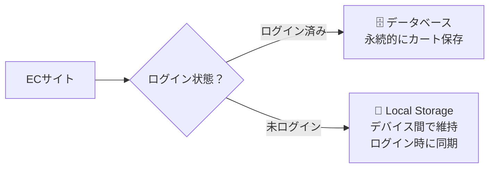
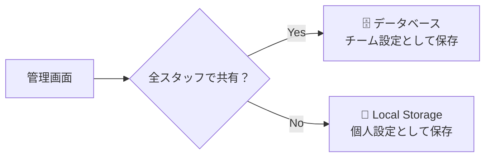
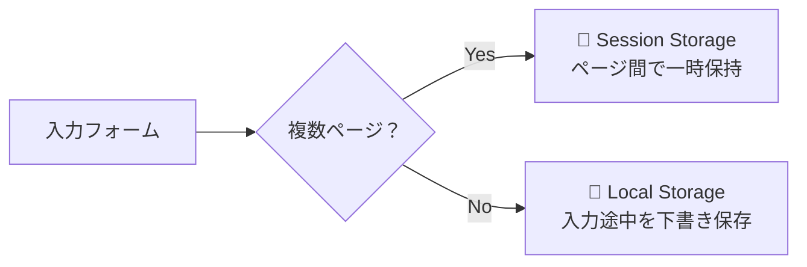

# ブラウザでのデータ保存と状態管理

## はじめに

前章でWebサイトとWebアプリケーションの違い、そして静的・動的サイトの選択基準について学びました。動的サイトでは特に重要になるのが「状態の管理」です。HTTPはステートレス（記憶しない）プロトコルですが、実際のWebアプリケーションでは「状態を記憶する」必要があります。

この章では、ブラウザがどのようにデータを保存し、状態を管理するかを理解します。Cookie、Local Storage、Session Storage、そしてサーバー側のデータベースの使い分けを学ぶことで、適切なデータ保存戦略を立てられるようになります。

## 📊 この章の重要度：🟡 推奨

**Webディレクターにとって：**
- ユーザー体験設計の技術的基盤
- プライバシー・セキュリティ要件の理解に必要
- オフライン機能・パフォーマンス要件の判断材料

## あなたがこれを知ると変わること

**ユーザー体験設計時の変化：**
- 開発者：「ユーザー設定はどこに保存しましょうか？」
- あなた（修得前）：「よくわからないので、適当に決めてください」
- あなた（修得後）：「テーマ設定はLocal Storageで永続保存、作業途中の内容はSession Storageで一時保存してください」

**プライバシー要件での変化：**
- 以前：「Cookieを使わないでください」
- 今後：「認証情報はHttpOnly Cookieで、ユーザー設定はLocal Storageで。GDPR対応のためCookie同意機能も実装しましょう」

## Cookie：Webサイトの記憶装置

### Cookieとは

**Cookie**とは、Webサイトがブラウザに保存してもらう小さな情報です。HTTPはステートレス（記憶しない）なので、Cookieで状態を記憶します。

**図書館の例：**
- 図書館カード = Cookie
- 毎回身分証明書を見せる代わりに、カードで本人確認
- カードには利用履歴や設定情報を記録

### Cookieの設定と送信

**サーバーからブラウザへのCookie設定：**
```
HTTP/1.1 200 OK
Set-Cookie: session_id=abc123; HttpOnly; Secure
Set-Cookie: user_pref=dark_mode; Max-Age=86400
Content-Type: text/html

<!DOCTYPE html>...
```

**ブラウザからサーバーへのCookie送信：**
```
GET /search HTTP/1.1
Host: example.com
Cookie: session_id=abc123; user_pref=dark_mode
```

### Cookieのセキュリティ

**セキュリティ属性：**
- **HttpOnly**: JavaScriptからアクセス不可（XSS攻撃対策）
- **Secure**: HTTPS接続でのみ送信
- **SameSite**: 他サイトからのリクエストでは送信制限

## ローカルストレージとセッションストレージ：ブラウザ内データ保存

### ブラウザでのデータ保存方法

HTTPがステートレス（記憶しない）であることは学びましたが、Webアプリケーションでは「状態を記憶する」必要があります。ブラウザには複数のデータ保存方法があります：

**主要な保存方法：**
- **Cookie**: サーバーとブラウザ間で自動送受信（4KB制限）
- **Local Storage**: ブラウザ内での永続保存（5-10MB制限）
- **Session Storage**: ブラウザ内でのタブ限定保存（5-10MB制限）
- **IndexedDB**: ブラウザ内の高機能データベース（数GB対応）
- **データベース**: サーバー側での永続保存（容量無制限）

### ローカルストレージ（Local Storage）

**ローカルストレージ**とは、ブラウザ内にデータを永続的に保存する仕組みです。

**特徴：**
- データはユーザーが削除するまで保持
- サーバーには自動送信されない
- 同じドメインの全てのタブ・ウィンドウで共有
- 最大5-10MB程度の容量

**使用例：**
```javascript
// データの保存
localStorage.setItem('userPreference', 'dark-mode');
localStorage.setItem('language', 'ja');

// データの取得
const theme = localStorage.getItem('userPreference');
const lang = localStorage.getItem('language');
```

**実際の活用場面：**
- ユーザー設定（テーマ、言語設定）
- 入力途中のフォームデータ保存
- ショッピングカートの内容
- ゲームの進行状況

### セッションストレージ（Session Storage）

**セッションストレージ**とは、ブラウザのタブが開いている間だけデータを保存する仕組みです。

**特徴：**
- タブを閉じると自動的にデータが削除
- サーバーには自動送信されない
- 同じサイトでも他のタブとは共有しない
- セキュリティが高い

**使用例：**
```javascript
// データの保存
sessionStorage.setItem('currentPage', '3');
sessionStorage.setItem('searchKeyword', 'python');

// データの取得
const page = sessionStorage.getItem('currentPage');
const keyword = sessionStorage.getItem('searchKeyword');
```

**実際の活用場面：**
- 複数ページにわたるフォーム入力
- 検索結果の一時保存
- ウィザード形式の入力進行状況
- 一時的な認証トークン

### IndexedDB：大容量・高機能なブラウザ内データベース

**IndexedDB**とは、ブラウザ内で大容量のデータを効率的に管理できる、NoSQLデータベースです。

**特徴：**
- 数GB規模のデータを保存可能
- 構造化データ（オブジェクト）を直接保存
- インデックスによる高速検索
- トランザクション対応で安全な操作

**使用例：**
```javascript
// データベースのオープン
const request = indexedDB.open('MyDatabase', 1);

request.onsuccess = function(event) {
    const db = event.target.result;
    
    // データの保存
    const transaction = db.transaction(['users'], 'readwrite');
    const store = transaction.objectStore('users');
    store.add({
        id: 1,
        name: '田中太郎',
        email: 'tanaka@example.com',
        settings: { theme: 'dark', language: 'ja' }
    });
};
```

**実際の活用場面：**
- オフライン対応アプリのデータキャッシュ
- 画像・動画ファイルの一時保存
- 複雑な検索機能を持つアプリのデータ管理
- ゲームの進行データやセーブファイル

## ブラウザ側保存 vs サーバー側保存の基本理解

Webアプリケーションでデータを保存する場所は大きく2つに分かれます：

### ブラウザ側保存（クライアント側）
**特徴：**
- ユーザーのデバイス（PC、スマートフォン等）に保存
- オフラインでもアクセス可能
- ユーザーが削除可能
- デバイスの容量に依存

**メリット：**
- サーバーへの通信が不要で高速
- サーバーの負荷軽減
- オフライン機能の実現

**デメリット：**
- ユーザーが削除する可能性
- デバイス間での共有不可
- セキュリティリスク（機密情報には不適切）

### サーバー側保存（データベース）
**特徴：**
- サーバーのデータベースに保存
- 通信が必要
- 管理者が完全制御
- 事実上無制限の容量

**メリット：**
- 永続性が高い
- 複数デバイス間で共有可能
- セキュリティが高い
- バックアップ・復旧が容易

**デメリット：**
- 通信が必要（オフライン不可）
- サーバー負荷とコスト
- 通信エラーのリスク

## データ保存方法の比較表

| 特徴 | Cookie | Local Storage | Session Storage | IndexedDB | データベース |
|------|--------|---------------|-----------------|-----------|-------------|
| **保存場所** | ブラウザ | ブラウザ | ブラウザ | ブラウザ | サーバー |
| **送信** | 自動でサーバーに送信 | 送信されない | 送信されない | 送信されない | リクエスト時に取得 |
| **容量** | 4KB程度 | 5-10MB | 5-10MB | 数GB | 事実上無制限 |
| **有効期限** | 設定可能 | 永続（手動削除まで） | タブを閉じるまで | 永続（手動削除まで） | サーバー側で管理 |
| **共有範囲** | 同じドメイン全体 | 同じドメイン全体 | 同じタブのみ | 同じドメイン全体 | 全ユーザー・全デバイス |
| **セキュリティ** | HTTPSで制御可能 | JavaScriptアクセス | JavaScriptアクセス | JavaScriptアクセス | サーバー側で完全制御 |
| **オフライン** | 利用可能 | 利用可能 | 利用可能 | 利用可能 | 利用不可 |
| **データ形式** | 文字列のみ | 文字列のみ | 文字列のみ | オブジェクト対応 | 任意の形式 |
| **検索機能** | なし | なし | なし | インデックス対応 | SQL等で高機能 |
| **実装難易度** | 簡単 | 簡単 | 簡単 | やや複雑 | 複雑 |

## Webディレクターとしての活用ポイント

### データ保存方法の判断フローチャート

実際のプロジェクトでは、以下のフローチャートを参考に適切な保存方法を選択できます：



### 実際のプロジェクト例での判断

**例1: ECサイトのカート機能**


**例2: 管理画面のフィルター設定**


**例3: お問い合わせフォーム**


### 設計時の選択基準：
```
Cookie を使う場面：
✅ サーバーが知る必要がある情報（ログイン状態等）
✅ セキュリティが重要（HttpOnly、Secure属性）
✅ 小容量の認証・設定情報（4KB以下）

Local Storage を使う場面：
✅ ユーザー設定の永続保存（テーマ、言語設定等）
✅ 小～中容量のキャッシュデータ（5-10MB以下）
✅ 簡単な実装で永続保存したい

Session Storage を使う場面：
✅ 一時的なデータ保存（入力途中のフォーム等）
✅ タブ限定の作業状態管理
✅ セキュリティが重要な一時情報

IndexedDB を使う場面：
✅ 大容量データの保存（10MB超）
✅ 複雑な検索機能が必要
✅ オフライン対応アプリのデータキャッシュ
✅ 構造化データ（オブジェクト）の保存

データベース（サーバー側）を使う場面：
✅ マルチプラットフォーム対応（PC/SP/アプリ）
✅ 個人情報・機密情報の保存
✅ ユーザー間で共有するデータ
✅ バックアップ・復旧が必要なデータ
✅ アクセス制御が必要
```

### 実務での判断例：
- **ユーザー設定**: テーマ → Local Storage / 重要な設定 → データベース
- **ログイン情報**: 認証トークン → Cookie / ユーザープロフィール → データベース
- **作業状態**: 入力途中 → Session Storage / 下書き保存 → データベース
- **キャッシュ**: 小容量 → Local Storage / 大容量 → IndexedDB / 最新データ → データベース
- **オフライン機能**: 軽量データ → Local Storage / 重要データ → IndexedDB + データベース同期
- **マルチプラットフォーム対応**: 常にデータベース（PC/SP/アプリ間で同期）

### プライバシー・セキュリティ考慮：
- **GDPR対応**: ユーザー同意とデータ削除権の実装
- **個人情報**: 機密情報はLocal/Session Storageに保存しない
- **XSS対策**: JavaScriptからアクセス可能なため、適切な入力値検証が必要

## まとめ

- **Cookie**（4KB）はサーバーとの自動送受信が可能、認証やセッション管理に適している
- **Local Storage**（5-10MB）はブラウザ内に永続保存、ユーザー設定や軽量キャッシュに適している
- **Session Storage**（5-10MB）はタブ限定の一時保存、作業状態管理に適している
- **IndexedDB**（数GB）は大容量・高機能なブラウザ内データベース、オフライン対応や複雑なデータ管理に適している
- **データベース**（無制限）はサーバー側管理で、マルチプラットフォーム対応・機密情報の保存に必須
- **マルチプラットフォーム対応**や**個人情報・機密情報**を扱う場合は必ずデータベース（サーバー側）を選択
- ブラウザ側保存は高速・オフライン対応、サーバー側保存は永続性・セキュリティ・デバイス間共有が特徴
- Webディレクターは各保存方法の特性と制限を理解し、要件に応じた適切な技術選択を行う必要がある

> **関連学習**: より詳しいCookieの技術仕様やプライバシー規制については、「07_応用_Cookieの詳細機能と実装」を参照してください。

次の章では、より具体的なHTTP通信の実装例として「POSTリクエストの詳細例」について学び、フォーム処理やファイルアップロードの技術的な仕組みを理解していきます。
