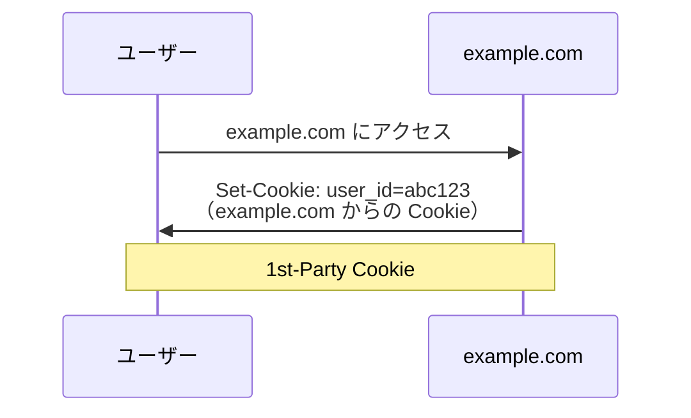
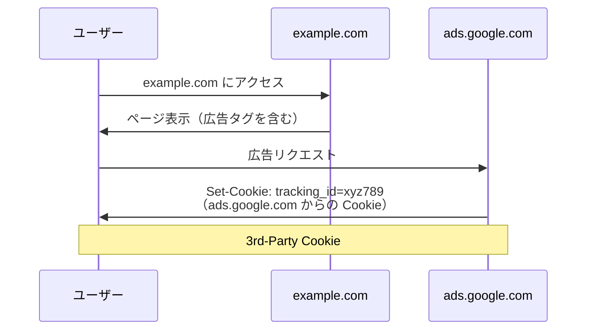
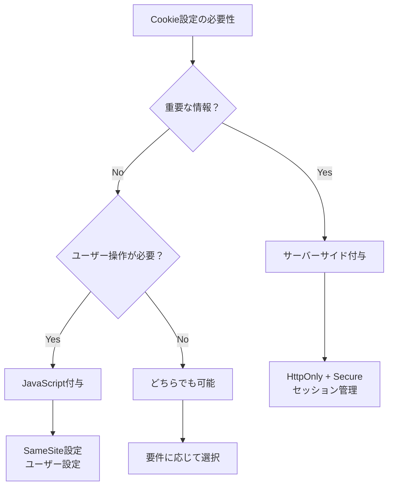
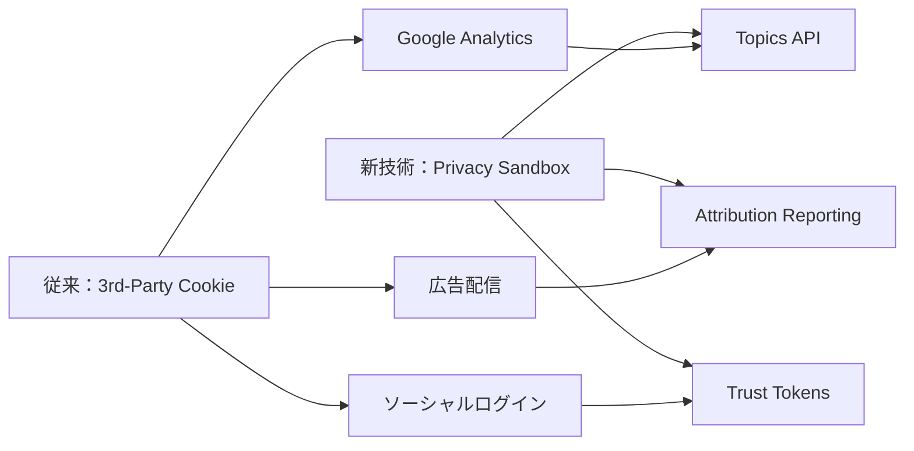

# Cookieの詳細機能と実装

## はじめに

前章でPOSTリクエストの詳細について学びました。データの送信方法を理解したところで、今度はより実践的で詳細なCookieの仕組みについて学びましょう。特に**1st-Party Cookie**と**3rd-Party Cookie**の違い、そして**サーバーサイド**と**JavaScript**でのCookie付与の違いを理解することで、プライバシー規制やセキュリティ要件を適切に判断できるようになります。

この知識は、GDPR対応、広告配信、ユーザートラッキング、セキュリティ設計において、Webディレクターとして重要な判断材料となります。

## 📊 この章の重要度：🟡 応用

**Webディレクターにとって：**
- プライバシー規制（GDPR、CCPA）対応の要件定義に必要
- 広告・解析ツール導入時の技術的理解に有用
- セキュリティ要件の詳細設計に必要

## あなたがこれを知ると変わること

**プライバシー対応での会話の変化：**
- 開発者：「3rd-Party Cookieが廃止されます」
- あなた（修得前）：「どういう影響がありますか？」
- あなた（修得後）：「広告配信とGoogle Analytics のトラッキングに影響しますね。代替手段を検討しましょう」

**セキュリティ要件での変化：**
- 以前：「Cookieのセキュリティを強化してください」
- 今後：「認証CookieはHttpOnlyでサーバーサイド付与、分析用はJavaScriptでSameSite設定してください」

## 1st-Party Cookie vs 3rd-Party Cookie：誰が発行したかの違い

### Cookie発行者による分類

**Cookie**は「誰が発行したか」によって2つに分類されます。これは郵便の差出人のようなもので、同じ住所（ドメイン）から送られてきたか、別の住所から送られてきたかの違いです。

### 1st-Party Cookie：同じサイトからの Cookie

**1st-Party Cookie**とは、現在見ているWebサイトと同じドメインから発行されるCookieです。

**例：example.com を見ている場合**


**具体例：**
```
現在のサイト: https://example.com
Cookie発行者: example.com
種類: 1st-Party Cookie

Cookie の内容:
user_id=abc123; Domain=example.com; Path=/
```

**使用場面：**
- ログイン状態の保持
- サイト内でのユーザー設定
- ショッピングカートの内容
- セッション管理

### 3rd-Party Cookie：外部サイトからの Cookie

**3rd-Party Cookie**とは、現在見ているWebサイトとは**異なるドメイン**から発行されるCookieです。

**例：example.com を見ているが、広告から Cookie が設定される場合**


**具体例：**
```
現在のサイト: https://example.com
Cookie発行者: ads.google.com
種類: 3rd-Party Cookie

Cookie の内容:
tracking_id=xyz789; Domain=ads.google.com; Path=/
```

**使用場面：**
- 広告のターゲティング
- ユーザーの行動追跡
- ソーシャルメディアボタン
- 外部解析ツール（Google Analytics等）

### 見分け方と実践的確認方法

**Chrome開発者ツールでの確認：**
```
手順：
1. F12キー → Application タブ
2. Storage → Cookies
3. 各ドメインごとにCookieが分類表示
4. 現在のサイトドメイン = 1st-Party
5. 異なるドメイン = 3rd-Party
```

**実際の比較表：**

| 特徴 | 1st-Party Cookie | 3rd-Party Cookie |
|------|------------------|------------------|
| **発行者** | 現在のサイトと同じドメイン | 外部の異なるドメイン |
| **用途** | サイト機能、ユーザー体験 | 広告、トラッキング、解析 |
| **プライバシー** | 比較的安全 | プライバシー懸念が高い |
| **ブラウザ対応** | 標準でサポート | 段階的に制限・廃止 |
| **規制対象** | GDPR対象（軽微） | GDPR対象（重要） |

## サーバーサイド付与 vs JavaScript付与：どこで設定するかの違い

### Cookie付与の2つの方法

Cookieを設定する方法は大きく2つあります。これは「手紙を誰が投函するか」のような違いです。

### サーバーサイド付与：サーバーからブラウザへ

**サーバーサイド付与**とは、WebサーバーがHTTPレスポンスヘッダーでCookieを設定する方法です。

**実際のHTTPレスポンス例：**
```
HTTP/2 200 OK
Content-Type: text/html
Set-Cookie: session_id=abc123; HttpOnly; Secure; SameSite=Strict
Set-Cookie: user_pref=dark_mode; Max-Age=86400

<!DOCTYPE html>
<html>...
```

**サーバーサイドコード例（Python Flask）：**
```python
from flask import Flask, make_response

@app.route('/login')
def login():
    response = make_response('ログイン成功')
    # セキュアなセッションCookie
    response.set_cookie(
        'session_id', 
        'abc123',
        httponly=True,    # JavaScriptからアクセス不可
        secure=True,      # HTTPS必須
        samesite='Strict' # 他サイトからの送信禁止
    )
    return response
```

**特徴：**
- **セキュリティが高い**: HttpOnly属性でJavaScriptからアクセス不可
- **サーバー制御**: サーバーが完全に制御
- **初回アクセス時**: ページ読み込み時に即座に設定
- **認証向け**: ログイン状態などの重要な情報に適している

### JavaScript付与：ブラウザ内で動的設定

**JavaScript付与**とは、ブラウザ内で実行されるJavaScriptコードがCookieを設定する方法です。

**JavaScriptコード例：**
```javascript
// 基本的なCookie設定
document.cookie = "user_theme=dark; max-age=86400; path=/";

// より詳細なCookie設定
function setCookie(name, value, options = {}) {
    let cookieString = `${name}=${value}`;
    
    if (options.maxAge) {
        cookieString += `; max-age=${options.maxAge}`;
    }
    if (options.path) {
        cookieString += `; path=${options.path}`;
    }
    if (options.secure) {
        cookieString += `; secure`;
    }
    if (options.sameSite) {
        cookieString += `; samesite=${options.sameSite}`;
    }
    
    document.cookie = cookieString;
}

// 実際の使用例
setCookie('analytics_consent', 'accepted', {
    maxAge: 365 * 24 * 60 * 60, // 1年
    path: '/',
    secure: true,
    sameSite: 'Lax'
});
```

**特徴：**
- **動的制御**: ユーザーの操作に応じて設定可能
- **条件付き設定**: ユーザーの同意後など、条件に応じて設定
- **制限あり**: HttpOnly属性は設定不可
- **分析・設定向け**: ユーザー設定や分析用途に適している

### 設定方法による比較



| 特徴 | サーバーサイド付与 | JavaScript付与 |
|------|-------------------|----------------|
| **設定タイミング** | ページ読み込み時 | ユーザー操作時・動的 |
| **セキュリティ** | 高（HttpOnly可能） | 中（JavaScriptアクセス可能） |
| **制御方法** | サーバー制御 | クライアント制御 |
| **適用場面** | ログイン、セッション管理 | ユーザー設定、同意管理 |
| **GDPR対応** | 事前設定可能 | ユーザー同意後設定 |

## 実務での活用ポイント

### プライバシー規制対応（GDPR・CCPA）

**Cookie使用の判断基準：**

```
必須Cookie（同意不要）:
✅ ログイン状態（1st-Party、サーバーサイド）
✅ ショッピングカート（1st-Party、JavaScript）
✅ セキュリティ設定（1st-Party、サーバーサイド）

同意必要Cookie:
⚠️ Google Analytics（3rd-Party、JavaScript）
⚠️ 広告配信（3rd-Party、JavaScript）
⚠️ ソーシャルメディア連携（3rd-Party、JavaScript）
```

**実装時の設計指針：**
```javascript
// GDPR対応のCookie同意管理例
class CookieConsent {
    constructor() {
        this.consentStatus = this.getConsentStatus();
    }
    
    // 必須Cookieは即座に設定
    setEssentialCookies() {
        setCookie('session_id', generateSessionId(), {
            httpOnly: true,  // サーバーサイドで設定
            secure: true,
            sameSite: 'Strict'
        });
    }
    
    // 分析Cookieは同意後に設定
    setAnalyticsCookies() {
        if (this.consentStatus.analytics) {
            // Google Analytics 初期化
            gtag('config', 'GA_MEASUREMENT_ID');
        }
    }
    
    // 広告Cookieは同意後に設定
    setMarketingCookies() {
        if (this.consentStatus.marketing) {
            // 広告タグ初期化
        }
    }
}
```

### セキュリティ設計での考慮事項

**認証Cookieの設計例：**
```python
# サーバーサイド（Flask）
@app.route('/secure-login')
def secure_login():
    response = make_response('認証成功')
    
    # 最高レベルのセキュリティ設定
    response.set_cookie(
        'auth_token',
        generate_secure_token(),
        httponly=True,        # XSS攻撃対策
        secure=True,          # HTTPS必須
        samesite='Strict',    # CSRF攻撃対策
        max_age=3600,         # 1時間で有効期限
        path='/admin'         # 管理画面のみ
    )
    return response
```

**ユーザー設定Cookieの設計例：**
```javascript
// JavaScript
class UserPreferences {
    // ユーザー設定の保存
    saveTheme(theme) {
        setCookie('user_theme', theme, {
            maxAge: 365 * 24 * 60 * 60, // 1年間保持
            path: '/',
            secure: true,
            sameSite: 'Lax'  // 他サイトからの一部アクセス許可
        });
    }
    
    // 設定の読み込み
    loadTheme() {
        return getCookie('user_theme') || 'light';
    }
}
```

## ブラウザの進化と対応策

### 3rd-Party Cookie の段階的廃止

**主要ブラウザの対応状況（2025年）：**

| ブラウザ | 3rd-Party Cookie 対応 | 代替技術 |
|----------|----------------------|----------|
| **Safari** | 既に大幅制限 | ITP（Intelligent Tracking Prevention） |
| **Firefox** | 段階的制限中 | Enhanced Tracking Protection |
| **Chrome** | 2024年後半に廃止予定 | Privacy Sandbox |
| **Edge** | Chromium準拠 | Privacy Sandbox対応 |

### 代替技術への移行

**従来の3rd-Party Cookie → 新技術：**


**Webディレクターとしての対応戦略：**
```
短期対応（6ヶ月以内）：
✅ 1st-Party Cookie での代替実装
✅ Google Analytics 4 への移行
✅ サーバーサイド トラッキングの検討

中期対応（1年以内）：
✅ Privacy Sandbox API の評価
✅ ユーザー同意管理の強化
✅ データ収集方法の見直し

長期対応（2年以内）：
✅ ゼロパーティデータの活用
✅ 第一者データ戦略の構築
✅ プライバシーファーストの設計
```

## 実践的なCookie診断方法

### Chrome開発者ツールでの詳細確認

**手順：**
```
1. F12キー → Application タブ
2. Storage → Cookies
3. 各Cookieの詳細情報を確認：

確認項目：
✅ Domain: 1st/3rd Party の判定
✅ Path: 適用範囲
✅ Expires/Max-Age: 有効期限
✅ HttpOnly: JavaScriptアクセス制限
✅ Secure: HTTPS必須設定
✅ SameSite: CSRF攻撃対策
```

**問題のあるCookieの特定：**
```
⚠️ 警告すべきCookie設定：
❌ Secure: false（HTTPでも送信される）
❌ SameSite: None（CSRF攻撃リスク）
❌ 長期間の有効期限（プライバシーリスク）
❌ 3rd-Party で必要以上の情報収集
```

## まとめ

- **1st-Party Cookie**は同じドメインから発行され、サイト機能に必須。**3rd-Party Cookie**は外部ドメインから発行され、トラッキング用途
- **サーバーサイド付与**はセキュリティが高く認証向け。**JavaScript付与**は動的制御が可能で設定・分析向け
- **プライバシー規制**では、必須Cookie（同意不要）と任意Cookie（同意必要）を適切に分類
- **3rd-Party Cookie廃止**に向けて、1st-Party Cookieと新技術（Privacy Sandbox）への移行が必要
- **セキュリティ設計**では、HttpOnly、Secure、SameSite属性を用途に応じて適切に設定
- Webディレクターは技術的な選択だけでなく、法的要件とユーザー体験のバランスを考慮した設計判断が重要

この知識により、プライバシー規制対応、セキュリティ要件定義、そして将来の技術変化への対応において、適切な判断と指示ができるようになります。

これで**02_Web基礎理解フェーズ**が完了しました。次の**03_Web構成要素フェーズ**では、HTML・CSS・JavaScriptの詳細を学び、実際のWebページ構成要素を深く理解していきます。ここまでで学んだインターネット・HTTP・ブラウザ・サイト構成・データ管理の知識を基に、より具体的なWeb技術を習得していきましょう。