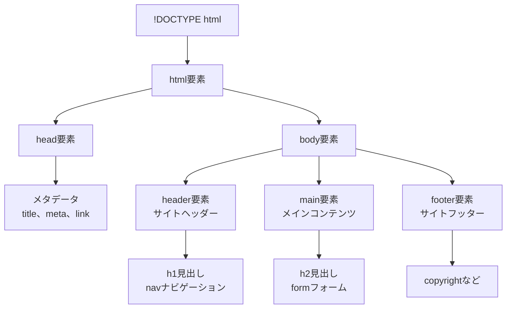
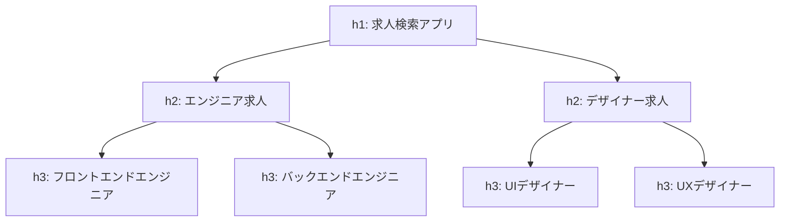
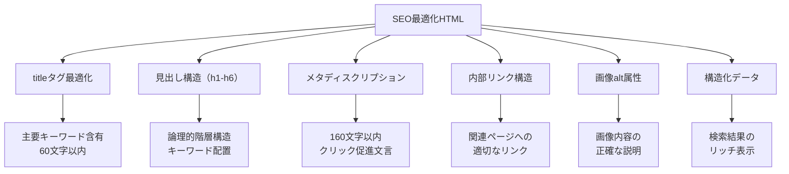

# HTML：Webページの骨組み

## はじめに

これまでWebの基礎理解フェーズで、インターネット・HTTP・ブラウザの仕組みを学びました。ブラウザがHTTPレスポンスを受け取り、HTMLファイルをWebページに変換することは理解できました。

今度は、そのHTMLファイルの中身を詳しく見ていきましょう。**HTML**（HyperText Markup Language）は、Webページの「骨組み」を作る言語です。建物でいうところの設計図や骨格にあたります。

この章では、HTMLの役割、重要なタグ、セマンティックHTML、そしてSEOやアクセシビリティとの関係について学びます。Webディレクターとして、技術的根拠に基づいた要件定義ができるようになります。

## 📊 この章の重要度：🔴 必須

**Webディレクターにとって：**
- Webサイトの構造設計の基盤
- SEO・アクセシビリティ要件の技術的根拠
- フロントエンド開発者との効果的なコミュニケーション

## あなたがこれを知ると変わること

**SEO要件定義時の会話の変化：**
- 開発者：「SEO対策をしたいです」
- あなた（修得前）：「検索で上位に表示されるようにしてください」
- あなた（修得後）：「**titleタグで主要キーワード**を含めたページタイトルを設定し、**h1タグでページ主題**を明確にしてください。さらに、**metaタグでdescription**を最適化し、**構造化データ**でリッチスニペット対応もお願いします」

**アクセシビリティ要件の変化：**
- 以前：「障害者対応をしてください」
- 今後：「**セマンティックHTML**でスクリーンリーダー対応、**alt属性**で画像説明、**aria-label**でフォーム要素の明確化をお願いします」

**デザイン・開発連携の変化：**
- デザイナー：「このボタンを目立たせたいです」
- あなた（修得前）：「大きくて赤いボタンにしてください」
- あなた（修得後）：「**CTA(Call To Action)ボタン**として**buttonタグ**でマークアップし、**視覚的階層**と**HTMLの意味的階層**を一致させましょう」

## HTML：Web世界の建築設計図

### HTMLとは

**HTML**（HyperText Markup Language）とは、Webページの構造と内容を定義する**マークアップ言語**です。プログラミング言語ではなく、**マークアップ**（目印付け）言語です。

**建築との比較：**
- **設計図**: HTML（部屋の配置、構造を定義）
- **内装・外装**: CSS（見た目、装飾を定義）
- **設備・システム**: JavaScript（動作、機能を定義）

**HTMLの特徴：**
- **構造化**: 見出し、段落、リストなどの文書構造を定義
- **セマンティック**: 各要素の「意味」を明確化
- **アクセシブル**: 様々なデバイス・支援技術で理解可能
- **標準化**: W3Cによる国際標準

### HTMLの基本構造

HTMLファイルは、**決まった構造**を持っています。これは建物の設計図と同じで、どの建物にも基礎・柱・屋根が必要なように、HTMLにも必須の部分があります。

**HTMLの基本構造：**
```html
<!DOCTYPE html>
<html lang="ja">
<head>
    <!-- ページの設定情報（ユーザーには見えない） -->
    <title>ページのタイトル</title>
</head>
<body>
    <!-- ページの内容（ユーザーに表示される） -->
    <h1>メインタイトル</h1>
    <p>本文のテキスト</p>
</body>
</html>
```

**各部分の役割：**
- **`<!DOCTYPE html>`**: 「これはHTML5文書です」という宣言
- **`<html>`**: HTML文書全体を包む大きな箱
- **`<head>`**: ページの設定情報（タイトル、文字エンコーディングなど）
- **`<body>`**: 実際にブラウザに表示される内容

**建物に例えると：**
- `<head>` = 設計図・建築許可証（見えないけど重要）
- `<body>` = 実際の建物（人が住む・使う部分）

**HTML構造の解説：**



## HTMLタグの役割と意味

### 構造を表すタグ

**セマンティックHTML**とは、各要素の「意味」を適切に表現するHTMLです。見た目ではなく、**内容の意味**に基づいてタグを選択します。

**主要な構造タグ：**

| タグ | 意味 | 使用例 |
|------|------|--------|
| `<header>` | ヘッダー領域 | サイトタイトル、ナビゲーション |
| `<nav>` | ナビゲーション | メニュー、パンくずリスト |
| `<main>` | メインコンテンツ | ページの主要な内容 |
| `<article>` | 記事 | ブログ記事、ニュース記事 |
| `<section>` | セクション | 章、節の区切り |
| `<aside>` | 補足情報 | サイドバー、関連情報 |
| `<footer>` | フッター領域 | 著作権、問い合わせ先 |

**セマンティックHTMLの効果：**

**良い例：意味を明確にしたマークアップ**
```html
<header>
    <h1>会社概要</h1>
    <nav>メニューがここに入る</nav>
</header>
```

**悪い例：意味が不明なマークアップ**  
```html
<div class="header">
    <div class="title">会社概要</div>
    <div class="menu">メニューがここに入る</div>
</div>
```

**なぜセマンティックHTMLが重要なのか：**
- **検索エンジン**：内容の意味を正しく理解できる
- **スクリーンリーダー**：視覚障害者が内容を理解しやすい
- **開発チーム**：コードの意図が明確で保守しやすい
- **将来の拡張**：新しい技術やデバイスに対応しやすい

### 見出しタグ：情報の階層構造

**見出しタグ（h1〜h6）**は、コンテンツの階層構造を表現する最も重要なタグです。本の章立てのように、情報を整理して伝えます。

**見出しの階層構造：**
```html
<h1>大見出し（本のタイトル）</h1>
<h2>中見出し（章）</h2>
<h3>小見出し（節）</h3>
```

**日常生活での例え：**
- **h1**: 本のタイトル「料理の基本」
- **h2**: 章のタイトル「和食の基本」「洋食の基本」
- **h3**: 節のタイトル「出汁の取り方」「パスタの茹で方」

**見出し構造の可視化：**


**見出しのSEO効果：**
- **h1タグ**: ページの主要テーマ（1ページに1つ）
- **h2-h6タグ**: コンテンツの階層構造（SEOキーワード含有）
- **論理的な順序**: h1→h2→h3の順で段階的に使用

### フォーム要素：ユーザーとの対話

**フォーム**は、ユーザーから情報を収集する重要な要素です。紙の申込書をWebページにしたようなものです。

**基本的なフォーム例：**
```html
<form>
    <label for="name">お名前</label>
    <input type="text" id="name" name="name">
    
    <label for="email">メールアドレス</label>
    <input type="email" id="email" name="email">
    
    <button type="submit">送信する</button>
</form>
```

**フォームの主要な部品：**
- **`<input>`**: 文字入力欄（名前、メールアドレスなど）
- **`<select>`**: 選択肢のドロップダウン（都道府県選択など）
- **`<textarea>`**: 長文入力欄（お問い合わせ内容など）
- **`<button>`**: 送信ボタン
- **`<label>`**: 入力欄の説明ラベル

**日常生活での例え：**
フォームは「紙の申込書のWeb版」と考えると分かりやすいです。
- 名前欄 → `<input type="text">`
- 選択肢 → `<select>`（チェックボックス形式）
- 自由記述欄 → `<textarea>`
- 送信ボタン → `<button>`

**フォーム要素のアクセシビリティ：**
- **label要素**: 入力項目の説明（`for`属性とIDを関連付け）
- **fieldset・legend**: 関連する項目のグループ化
- **aria-describedby**: 補足説明の関連付け
- **required属性**: 必須項目の明示
- **placeholder**: 入力例の提示

### リンクと画像：コンテンツの充実

**リンク要素（aタグ）:**
```html
<!-- 通常のリンク -->
<a href="/search?keyword=python">Python求人を検索</a>

<!-- 外部リンク（新しいタブで開く） -->
<a href="https://example.com" target="_blank" rel="noopener noreferrer">
    外部サービスサイト
</a>

<!-- メールリンク -->
<a href="mailto:contact@example.com">お問い合わせ</a>

<!-- 電話リンク -->
<a href="tel:+81-3-1234-5678">03-1234-5678</a>

<!-- ページ内リンク -->
<a href="#section1">第1章へジャンプ</a>
```

**画像要素（imgタグ）:**
```html
<!-- 基本的な画像 -->


<!-- レスポンシブ画像 -->


<!-- 装飾的な画像（代替テキスト不要） -->

```

## メタデータ：検索エンジンとブラウザへの情報

### 基本のメタタグ

**メタタグ**は、ページの情報を検索エンジンやブラウザに伝える重要な要素です。本の「奥付」や「帯」のような役割を果たします。

**重要なメタタグの例：**
```html
<head>
    <title>Python求人 | 求人検索アプリ</title>
    <meta name="description" content="Python開発者向けの求人情報を検索できます">
    <meta name="viewport" content="width=device-width, initial-scale=1.0">
</head>
```

**各メタタグの役割：**
- **`<title>`**: ページのタイトル（ブラウザのタブに表示）
- **`description`**: ページの概要（検索結果に表示される説明文）
- **`viewport`**: スマホ対応のための設定

**日常生活での例え：**
- `<title>` = 本のタイトル（表紙に書かれている）
- `description` = 本の帯に書かれた内容紹介
- `viewport` = 本のサイズ設定（文庫本、単行本など）

**Webディレクターとしてのポイント：**
- **title**: 32文字以内、キーワードを含める
- **description**: 120文字程度、ページ内容を簡潔に要約

### 構造化データ：検索結果を豊かにする

**構造化データ**とは、検索エンジンにページの内容をより詳しく伝える仕組みです。これにより、検索結果に**リッチスニペット**（星評価、価格、画像など）が表示されます。

**構造化データの効果：**
- **通常の検索結果**: タイトルと説明文のみ
- **リッチスニペット**: 星評価、価格、画像、営業時間なども表示

**実際の効果例：**
- **求人情報**: 給与範囲、勤務地、雇用形態が検索結果に表示
- **商品情報**: 価格、在庫状況、レビュー評価が表示
- **レシピ**: 調理時間、カロリー、評価が表示

**日常生活での例え：**
構造化データは「商品パッケージの栄養成分表示」のようなものです。
- 商品名だけでなく、カロリー、原材料、価格などが一目で分かる
- 検索エンジンも同様に、ページの詳細情報を理解できる

**Webディレクターとしてのポイント：**
構造化データは専門的ですが、SEO効果が高いため、開発者に実装を依頼する価値があります。

## SEOとHTML構造

### 検索エンジン最適化の基本

**SEO**（Search Engine Optimization）において、HTMLの構造は極めて重要です。

**SEOに効果的なHTML構造：**



**実際のSEO最適化例：**

```html
<!-- ❌ SEO効果の低いHTML -->
<html>
<head>
    <title>ホーム</title>
    <meta name="description" content="サイトです">
</head>
<body>
    <div class="big-text">サイトタイトル</div>
    <div>
        <div>内容</div>
        <div>詳細情報</div>
    </div>
</body>
</html>

<!-- ✅ SEO最適化されたHTML -->
<html lang="ja">
<head>
    <title>Python求人検索 | 年収500万円以上のエンジニア転職サイト</title>
    <meta name="description" content="Python開発者向けの高年収求人を検索できます。年収500万円以上、リモートワーク可能な求人多数掲載。無料会員登録で企業からスカウトも。">
    <link rel="canonical" href="https://example.com/search/python">
</head>
<body>
    <header>
        <h1>Python求人検索</h1>
        <nav aria-label="メインナビゲーション">
            <ul>
                <li><a href="/">求人検索</a></li>
                <li><a href="/companies">企業一覧</a></li>
                <li><a href="/salary">年収ガイド</a></li>
            </ul>
        </nav>
    </header>
    
    <main>
        <h2>高年収Python求人一覧</h2>
        <section>
            <h3>注目のPython求人</h3>
            <article>
                <h4>
                    <a href="/jobs/123">AIエンジニア | 年収600-900万円 | フルリモート可</a>
                </h4>
                <p>機械学習・深層学習を活用したWebサービス開発をお任せします...</p>
            </article>
        </section>
    </main>
</html>
```

### 内部リンク最適化

**内部リンク**により、サイト全体のSEO価値を向上させます。

```html
<!-- 関連する求人への内部リンク -->
<aside>
    <h3>関連する求人</h3>
    <ul>
        <li><a href="/search?keyword=Django">Django求人一覧</a></li>
        <li><a href="/search?keyword=Flask">Flask求人一覧</a></li>
        <li><a href="/search?location=東京&keyword=Python">東京のPython求人</a></li>
    </ul>
</aside>

<!-- パンくずナビゲーション -->
<nav aria-label="パンくずナビゲーション">
    <ol>
        <li><a href="/">ホーム</a></li>
        <li><a href="/search">求人検索</a></li>
        <li><a href="/search?keyword=Python">Python求人</a></li>
        <li aria-current="page">フロントエンドエンジニア</li>
    </ol>
</nav>

> **補足**: `aria-current="page"`は、現在のページを示します。これにより、スクリーンリーダーの利用者は、自分が今どのページにいるのかを正確に把握できます。
```

## アクセシビリティとHTML

### Web Content Accessibility Guidelines (WCAG)

**アクセシビリティ**とは、障害の有無に関わらず、すべてのユーザーがWebサイトを利用できるようにすることです。

**アクセシビリティの4つの原則：**
1. **知覚可能** (Perceivable): 情報と UI コンポーネントは、ユーザーが知覚できる方法で提示されなければならない
2. **操作可能** (Operable): UI コンポーネントとナビゲーションは操作可能でなければならない
3. **理解可能** (Understandable): 情報と UI の操作は理解可能でなければならない
4. **堅牢** (Robust): コンテンツは様々なユーザーエージェントで確実に解釈できるよう堅牢でなければならない

### 実装レベルでのアクセシビリティ

**スクリーンリーダー対応：**
```html
<!-- ❌ アクセシビリティに配慮されていない -->
<div onclick="submit()">送信</div>

<input type="text" placeholder="名前">

<!-- ✅ アクセシビリティに配慮されたマークアップ -->
<button type="submit">フォームを送信する</button>

<label for="name">お名前</label>
<input type="text" id="name" name="name" required aria-describedby="name-help">
<small id="name-help">姓名を全角ひらがなまたは漢字でご入力ください</small>
```

**キーボードナビゲーション：**
```html
<!-- フォーカス順序が自然なフォーム -->
<form>
    <input type="text" name="keyword" aria-label="検索キーワード">
    <select name="location" aria-label="勤務地選択">
        <option value="">すべての地域</option>
        <option value="tokyo">東京</option>
    </select>
    <button type="submit">検索実行</button>
</form>

> **補足**: `tabindex`属性を利用してキーボードのフォーカス順序を制御できますが、`tabindex="1"`以上を指定する強制的な順序変更は、ユーザーの混乱を招く可能性があるため**非推奨**です。HTMLの記述順がそのままフォーカス順序になるように実装するのが最も望ましい方法です。

<!-- スキップリンク -->
<a href="#main-content" class="skip-link">メインコンテンツへスキップ</a>
<header>...</header>
<main id="main-content">...</main>
```

**ARIA属性の活用：**
```html
<!-- ライブリージョン（動的更新の通知） -->
<div id="search-results" aria-live="polite" aria-label="検索結果">
    <p>検索中...</p>
</div>

<!-- 展開・折りたたみメニュー -->
<button aria-expanded="false" aria-controls="mobile-menu" 
        onclick="toggleMenu()">
    メニュー
</button>
<nav id="mobile-menu" aria-hidden="true">
    <ul>
        <li><a href="/">ホーム</a></li>
        <li><a href="/search">求人検索</a></li>
    </ul>
</nav>

<!-- 進行状況の表示 -->
<div role="progressbar" aria-valuenow="3" aria-valuemin="1" 
     aria-valuemax="5" aria-label="登録ステップ">
    ステップ 3 / 5
</div>
```

## Webディレクターとしての活用方法

### HTML構造要件書の作成

**プロジェクト初期で定義すべきHTML要件：**

```
HTML構造要件書

1. SEO要件
   ✅ ページタイトル: 主要キーワード + 企業名（60文字以内）
   ✅ メタディスクリプション: 160文字以内、CTA含有
   ✅ 見出し構造: h1（1つ）→h2→h3の論理的階層
   ✅ 構造化データ: 業界標準のスキーマ実装
   ✅ カノニカルURL: 重複コンテンツ対策

2. アクセシビリティ要件
   ✅ WCAG 2.1 AA レベル準拠
   ✅ スクリーンリーダー対応（alt属性、aria-label）
   ✅ キーボードナビゲーション対応
   ✅ コントラスト比 4.5:1 以上
   ✅ フォーカス表示の明確化

3. 技術要件
   ✅ HTML5セマンティック要素の使用
   ✅ バリデーション エラーゼロ
   ✅ モバイルファースト設計
   ✅ ページ読み込み速度: 3秒以内
```

### フロントエンド開発者との会話例

**HTML構造に関する具体的な指示：**

```
❌ Before（曖昧な指示）:
「検索フォームを作ってください」

✅ After（具体的な指示）:
「検索フォームは以下の要件で実装してください：
・fieldset/legendでグループ化
・label要素で各項目の説明を明確化
・required属性で必須項目を明示
・aria-describedbyで入力例を関連付け
・エラーメッセージはaria-live="polite"で通知
・送信ボタンはbutton要素（type="submit"）を使用」
```

**SEO要件の伝達：**

```
❌ Before（結果重視）:
「SEOで上位表示されるようにしてください」

✅ After（実装要件重視）:
「SEO要件として以下を実装してください：
・h1タグ: "Python求人検索 | 東京都内の高年収エンジニア転職"
・meta description: "Python開発者向けの..."（160文字以内）
・求人データの構造化データ（JobPosting schema）
・関連求人への内部リンク設置
・パンくずナビゲーション実装」
```

### 品質チェックポイント

**HTML品質確認チェックリスト：**

```
📋 基本構造チェック
□ DOCTYPE宣言が正しく設定されている
□ lang属性が適切に設定されている
□ 文字エンコーディング（UTF-8）が指定されている
□ ビューポートメタタグが設定されている

📋 セマンティクスチェック
□ 見出しタグ（h1-h6）が論理的な順序で使用されている
□ h1タグがページに1つだけ設定されている
□ nav、main、aside等のセマンティック要素が適切に使用されている
□ リストは ul/ol/li で適切にマークアップされている

📋 アクセシビリティチェック
□ すべての画像にalt属性が設定されている
□ フォーム要素にlabel要素が関連付けられている
□ リンクテキストが内容を的確に表している
□ コントラスト比が基準を満たしている

📋 SEOチェック  
□ titleタグが各ページで固有かつ適切に設定されている
□ meta descriptionが設定されている
□ 内部リンクが適切に設置されている
□ 構造化データが実装されている（該当ページ）
```

### ブラウザ開発者ツールでの確認方法

**Chrome DevTools での HTML確認：**

1. **Elements タブ**: HTML構造の確認
   - セマンティック要素の使用状況
   - 見出し階層の確認
   - aria属性の設定確認

2. **Console タブ**: HTMLバリデーション
   ```javascript
   // アクセシビリティ問題の検出
   document.querySelectorAll('img:not([alt])').length; // alt属性なし画像
   document.querySelectorAll('input:not([aria-label]):not([id])').length; // ラベルなし入力
   ```

3. **Lighthouse タブ**: 総合評価
   - Performance: ページ読み込み速度
   - Accessibility: アクセシビリティスコア
   - Best Practices: HTML/CSS/JSのベストプラクティス
   - SEO: SEO最適化状況

## まとめ

- **HTML**はWebページの骨組みを作るマークアップ言語で、**セマンティック**（意味的）なマークアップが重要
- **構造化タグ**（header、nav、main、article、section、aside、footer）により、コンテンツの意味を明確化
- **見出しタグ（h1-h6）**は情報の階層構造を表現し、SEOとアクセシビリティに大きく影響
- **フォーム要素**は適切なlabel、fieldset、aria属性でアクセシビリティを確保
- **メタデータ**（title、meta、OGP、構造化データ）により検索エンジンとSNSでの表示を最適化
- **アクセシビリティ**はWCAG 2.1 AA準拠を目標に、すべてのユーザーが利用できるWebサイトを実現
- Webディレクターは技術的根拠に基づいた要件定義と、開発者との具体的なコミュニケーションを実行
- ブラウザ開発者ツールを活用した品質確認により、HTML構造の適切性を継続的に管理

次の章では「CSS：Webページの見た目とレイアウト」について学び、HTMLで構築した骨組みに、どのように視覚的なデザインを適用するかを理解していきます。レスポンシブデザイン、CSSフレームワーク、デザインシステムとの連携について、Webディレクターの視点から深掘りします。