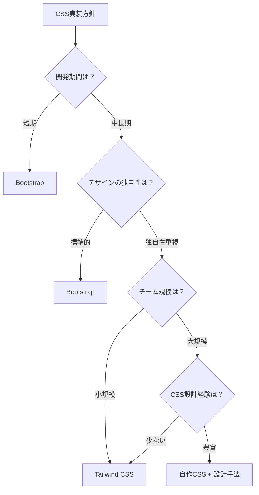
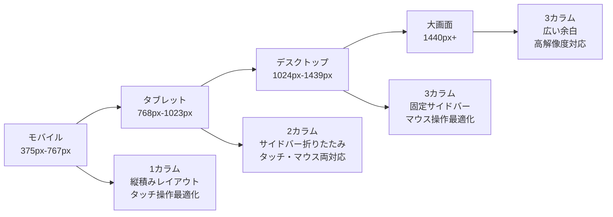

# CSS：見た目とレイアウト

## はじめに

前章でHTMLによるWebページの骨組み作りを学びました。HTMLが建物の設計図や骨格だとすれば、**CSS**（Cascading Style Sheets）は内装・外装・装飾を担当します。

CSSにより、HTMLで構築された構造に色彩、レイアウト、アニメーションを適用して、ユーザーインターフェースを構築できます。また、レスポンシブデザインにより、スマートフォンからデスクトップまで、あらゆるデバイスで最適な表示を提供できます。

この章では、CSSの役割、レスポンシブデザイン、CSSフレームワーク、そしてWebディレクターとしてのデザイン要件定義について学びます。

## 📊 この章の重要度：🟡 推奨

**Webディレクターにとって：**
- デザイン要件の技術的実現可能性判断
- レスポンシブ対応の品質管理
- デザイナー・開発者間の効果的な橋渡し

## あなたがこれを知ると変わること

**デザイン要件定義時の会話の変化：**
- デザイナー：「このボタンを目立たせたいです」
- あなた（修得前）：「大きくて赤いボタンにしてください」
- あなた（修得後）：「**プライマリーボタン**として**hover状態**と**focus状態**を定義し、**アクセシビリティのコントラスト比**を確保してください」

**レスポンシブ対応の指示変化：**
- 以前：「スマホでも見られるようにしてください」
- 今後：「**モバイルファースト**設計で、**ブレークポイント**は375px・768px・1024pxで、**フレキシブルグリッド**を使用してください」

**CSS管理の方針変化：**
- 開発者：「CSSが複雑になってきました」
- あなた（修得前）：「整理してください」
- あなた（修得後）：「**CSS設計手法**（BEM・OOCSS）を導入し、**コンポーネント単位**で管理しましょう。**CSSフレームワーク**の活用も検討しましょう」

## CSS：Webページの装飾言語

### CSSとは

**CSS**（Cascading Style Sheets）とは、HTMLで構築された構造に「見た目」を適用するスタイルシート言語です。

**建築との比較：**
- **HTML**: 設計図・骨組み（どこに何があるか）
- **CSS**: 内装・外装（どのように見えるか）
- **JavaScript**: 設備・システム（どのように動くか）

**CSSの3つの主要な役割：**
1. **視覚的デザイン**: 色、フォント、サイズ、装飾
2. **レイアウト**: 要素の配置、間隔、整列
3. **レスポンシブ**: デバイスサイズに応じた最適化

### CSSとHTMLの分離の重要性

**CSSとHTMLの分離が重要な理由：**

**悪い例：HTMLに直接スタイルを記述**
```html
<h1 style="color: blue; font-size: 28px;">タイトル</h1>
```

**良い例：CSSファイルに分離**
```html
<!-- HTML ファイル -->
<h1 class="page-title">タイトル</h1>
```
```css
/* CSS ファイル */
.page-title {
    color: blue;
    font-size: 28px;
}
```

**日常生活での例え：**
CSS分離は「服のコーディネート」と似ています。
- **悪い例**: 服に直接色やデザインを描く（変更が困難）
- **良い例**: 服（HTML）とアクセサリー（CSS）を分ける（組み合わせ自由）

**分離のメリット：**
- **保守性**: スタイルの一括変更が可能
- **再利用性**: 同じスタイルを複数箇所で使用
- **パフォーマンス**: CSSファイルのキャッシュが効く
- **役割分担**: デザイナーとプログラマーの作業分離

### CSSの基本文法

**CSSの書き方：**
```css
セレクター {
    プロパティ: 値;
}
```

**実際の例：**
```css
.button {
    color: white;
    background-color: blue;
}
```

**各部分の意味：**
- **セレクター（`.button`）**: どの要素にスタイルを適用するか
- **プロパティ（`color`）**: 何を変更するか（文字色、背景色など）
- **値（`white`）**: どのように変更するか（具体的な設定）

**日常生活での例え：**
CSSは「化粧や身だしなみの指示書」のようなものです。
- セレクター = 対象（「髪の毛に」「顔に」）
- プロパティ = 部位（「色を」「形を」）
- 値 = 具体的な指示（「茶色に」「丸く」）

**主要なセレクター：**

| セレクター | 記法 | 説明 | 使用例 |
|------------|------|------|--------|
| **要素セレクター** | `h1` | HTML要素を指定 | `h1 { color: blue; }` |
| **クラスセレクター** | `.class-name` | class属性を指定 | `.button { padding: 10px; }` |
| **IDセレクター** | `#id-name` | id属性を指定 | `#header { height: 60px; }` |
| **子孫セレクター** | `div p` | 親要素内の子要素 | `nav a { text-decoration: none; }` |
| **疑似クラス** | `:hover` | 要素の状態 | `button:hover { opacity: 0.8; }` |

## レイアウトシステム：要素の配置手法

### Flexbox：柔軟な1次元レイアウト

**Flexbox**（Flexible Box Layout）は、要素を柔軟に配置する現代的なレイアウト手法です。

**基本的なFlexboxの使用例：**
```css
.container {
    display: flex;
    justify-content: space-between; /* 要素を左右に配置 */
}
```

**Flexboxでできること：**
- 要素を横一列に並べる
- 要素を中央寄せする
- 残りスペースを均等に分割する
- 画面サイズに応じて自動調整する

**日常生活での例え：**
Flexboxは「弁当箱の仕切り」のようなものです。
- **固定サイズ**: おかずの量が決まっている仕切り
- **可変サイズ**: 残りスペースに応じて大きさが変わる仕切り
- **配置**: 左寄せ、中央、右寄せ、均等配置

**Flexboxの主要概念：**
- **主軸（main axis）**: 要素が並ぶ方向（横または縦）
- **交差軸（cross axis）**: 主軸に垂直な方向
- **flex-direction**: 主軸の方向を決定
- **justify-content**: 主軸方向の配置を制御
- **align-items**: 交差軸方向の配置を制御
- **flex-wrap**: 要素の折り返しを制御
- **gap**: 要素間の間隔を設定

### CSS Grid：2次元レイアウト

**CSS Grid**は、行と列を持つ2次元レイアウトシステムです。Flexboxが1次元（一方向）のレイアウトに適している一方、CSS Gridは複雑な2次元レイアウトを効率的に実現できます。

**CSS Gridの主要概念：**
- **grid-template-columns/rows**: 列・行のサイズを定義
- **grid-area**: 要素が占める領域を指定
- **grid-gap**: 要素間の間隔を設定
- **repeat()**: 同じパターンの繰り返しを効率的に記述
- **minmax()**: 最小値と最大値を指定した柔軟なサイズ設定
- **auto-fill/auto-fit**: 利用可能な空間に応じた自動調整

## レスポンシブデザイン：マルチデバイス対応

### メディアクエリ：デバイス別スタイル

**レスポンシブデザイン**により、スマートフォンからデスクトップまで各デバイスに適した表示を実現します。

**レスポンシブデザインの核心概念：**

**1. メディアクエリ（Media Queries）**
- 画面サイズや解像度に応じてCSSを切り替える仕組み
- ブレークポイント（画面サイズの区切り点）を設定
- 一般的なブレークポイント：375px（モバイル）、768px（タブレット）、1024px（デスクトップ）

**2. モバイルファースト設計**
- 最小画面サイズからスタイルを構築
- 画面が大きくなるにつれて機能やレイアウトを追加
- パフォーマンスと互換性の向上に寄与

**3. フレキシブルグリッド**
- 固定ピクセル単位ではなく相対単位（%、rem、vw）を使用
- コンテナの幅に応じて要素サイズが自動調整
- レイアウトの破綻を防止

### フレキシブルユニット：相対的なサイズ指定

**相対単位の種類と役割：**

**1. パーセンテージ（%）**
- 親要素のサイズに対する相対的な指定
- レイアウトの基本的な比率制御に使用

**2. rem（Root EM）**
- ルート要素（html）のフォントサイズを基準
- 一貫したスケーリングとアクセシビリティの向上

**3. em**
- 親要素のフォントサイズを基準
- ネストした要素の相対的な調整に使用

**4. ビューポート単位（vw、vh、vmin、vmax）**
- ブラウザの表示領域（ビューポート）を基準
- 画面サイズに応じた動的なサイズ調整

**5. clamp()関数**
- 最小値、推奨値、最大値を指定
- レスポンシブなサイズ調整の効率化

## CSSフレームワーク：効率的な開発

### Bootstrap：コンポーネント重視

**Bootstrap**は、事前に構築されたUIコンポーネントとグリッドシステムを提供するCSSフレームワークです。

**Bootstrapの特徴：**
- **12カラムグリッドシステム**: レスポンシブレイアウトの標準化
- **コンポーネントライブラリ**: ボタン、カード、ナビゲーション等の再利用可能なUI要素
- **ユーティリティクラス**: margin、padding、色彩等の細かな調整
- **JavaScript統合**: モーダル、ドロップダウン等のインタラクティブ機能
- **テーマカスタマイズ**: Sassベースのカスタマイズ機能

**適用場面：**
- 迅速なプロトタイプ開発
- 標準的なUIデザインで十分なプロジェクト
- 開発チームのCSS経験が限られている場合

### Tailwind CSS：ユーティリティファースト

**Tailwind CSS**は、小さなユーティリティクラスを組み合わせてデザインを構築するフレームワークです。

**Tailwind CSSの特徴：**
- **ユーティリティファースト**: 単一目的のクラスを組み合わせて構築
- **カスタマイズ性**: デザインの独自性を保ちながら効率化
- **PurgeCSS統合**: 未使用CSSの自動削除によるファイルサイズ最適化
- **設計制約**: デザインシステムの一貫性を保つための制約機能
- **JIT（Just-In-Time）**: オンデマンドでCSSを生成

**適用場面：**
- 独自性の高いデザインが必要なプロジェクト
- CSS設計の柔軟性が求められる場合
- パフォーマンスを重視するプロジェクト

### フレームワーク選択の基準

**プロジェクト要件別の選択：**

| 要件 | Bootstrap | Tailwind CSS | 自作CSS |
|------|-----------|--------------|---------|
| **開発速度** | 高 | 中 | 低 |
| **カスタマイズ性** | 中 | 高 | 高 |
| **ファイルサイズ** | 大 | 最適化可能 | 最小 |
| **学習コスト** | 低 | 中 | 高 |
| **チーム開発** | 容易 | 中程度 | 要設計 |
| **独自性** | 低 | 高 | 高 |

**選択フローチャート：**


## CSS設計手法：保守性の向上

### BEM：Block Element Modifier

**BEM**は、CSSクラス名に一貫した命名規則を提供する設計手法です。

**BEMの構成要素：**
- **Block（ブロック）**: 独立したコンポーネント（例：job-card）
- **Element（要素）**: ブロックの構成要素（例：job-card__title）
- **Modifier（修飾子）**: ブロックや要素の状態・バリエーション（例：job-card--featured）

**BEMの利点：**
- **予測可能性**: 命名規則により、HTMLとCSSの関係が明確
- **再利用性**: コンポーネント単位での独立性
- **保守性**: 変更の影響範囲が限定される
- **チーム開発**: 一貫した命名によるコミュニケーション向上

### CSS Custom Properties（CSS変数）

**CSS変数**により、一貫したデザインシステムを構築できます。

**CSS変数（Custom Properties）の概念：**
- **デザイントークン**: 色、フォント、スペーシング等の設計要素を変数として管理
- **一元管理**: :root で定義した変数を全体で共有
- **動的変更**: JavaScriptからの値変更が可能
- **ブラウザサポート**: モダンブラウザで標準サポート

**CSS変数の利点：**
- **保守性**: 変更時の影響が一元的に反映
- **一貫性**: デザインシステムの統一
- **効率性**: 値の重複排除
- **拡張性**: テーマ切り替え等の高度な機能実装

### ダークモード対応

**ダークモードの実装手法：**

**1. CSS変数を活用したテーマ切り替え**
- ライトテーマとダークテーマで異なる値を設定
- 共通のスタイルは変数を参照して動的に適用

**2. メディアクエリによる自動検出**
- `prefers-color-scheme: dark` でOSの設定を検出
- ユーザーの環境設定に自動的に対応

**3. JavaScript制御による手動切り替え**
- data属性やクラス名の切り替えで実装
- ユーザーの好みに応じた細かな制御が可能

**ダークモード設計の考慮点：**
- **コントラスト比**: 視認性を保つための適切な色彩設計
- **画像対応**: ダークテーマに適した画像の準備
- **ブランド一貫性**: 企業カラーとダークモードの両立

## パフォーマンス最適化

### CSSの最適化手法

**パフォーマンス最適化の核心概念：**

**1. ファイルサイズ削減**
- **ショートハンドプロパティ**: 複数プロパティを一つに統合
- **未使用CSS削除**: 実際に使われていないスタイルを排除
- **圧縮（Minification）**: 空白・改行・コメントを除去

**2. Critical CSS**
- **Above-the-fold**: 初回表示エリアの重要なスタイルをインライン化
- **非同期読み込み**: 重要度の低いCSSは後から読み込み
- **レンダリングブロック回避**: 初期表示の高速化

**3. 効率的なセレクター**
- **セレクターの単純化**: 過度にネストした複雑なセレクターを避ける
- **IDセレクター**: 高いパフォーマンスだが保守性とのバランスを考慮
- **ユニバーサルセレクター**: 必要最小限の使用

## CSSの能力と限界：技術理解の基礎

### CSSでできること

**1. 視覚的デザイン**
- **色彩設計**: 文字色、背景色、グラデーション
- **タイポグラフィ**: フォント選択、サイズ、行間、文字間隔
- **装飾**: 枠線、角丸、影効果
- **透明度**: opacity、rgba等による透過効果

**2. レイアウト制御**
- **配置**: position、float、flex、grid による要素配置
- **サイズ調整**: width、height、margin、padding の制御
- **Z軸制御**: z-index による重なり順序の管理
- **スクロール制御**: overflow による表示領域の制御

**3. レスポンシブ対応**
- **メディアクエリ**: デバイス特性に応じたスタイル切り替え
- **フレキシブルレイアウト**: 画面サイズに応じた自動調整
- **相対単位**: デバイスに依存しないサイズ指定

**4. インタラクション効果**
- **疑似クラス**: :hover、:focus等の状態変化
- **トランジション**: 状態変化時のアニメーション
- **キーフレームアニメーション**: 複雑な動的効果
- **トランスフォーム**: 回転、拡大縮小、移動

### CSSでできないこと

**1. データ処理・ロジック**
- **条件分岐**: if文相当の複雑な条件処理
- **ループ処理**: 繰り返し処理（calcやcounter以外）
- **データベース連携**: 動的データの取得・更新
- **API通信**: 外部サービスとの通信

**2. ユーザー操作の高度な制御**
- **フォーム検証**: 入力値の複雑な検証ロジック
- **イベント処理**: クリック以外の複雑なイベント制御
- **ページ遷移**: URLの変更や画面遷移
- **ローカルストレージ**: ブラウザでのデータ永続化

**3. コンテンツの動的生成**
- **DOM操作**: HTML要素の動的追加・削除
- **テキスト変更**: 既存コンテンツの内容変更
- **画像の動的読み込み**: ユーザー操作に応じた画像切り替え

### CSSとJavaScriptの連携が必要な領域

**1. 状態管理**
- CSSで視覚的変化、JavaScriptで状態制御
- クラス名の動的変更による表示切り替え

**2. 複雑なアニメーション**
- CSSでトランジション定義、JavaScriptでタイミング制御
- パフォーマンスを考慮した適切な役割分担

**3. レスポンシブの高度な制御**
- CSSでレイアウト、JavaScriptでブレークポイント検知

## Webディレクターとしての活用方法

### デザインシステムの要件定義

**デザインシステム要件定義の要素：**

**1. カラーパレット設計**
- プライマリーカラー（ブランドカラー）の定義
- セカンダリーカラー（サブカラー）の設定
- グレースケールの段階的定義
- セマンティックカラー（success/warning/danger/info）
- アクセシビリティ基準（コントラスト比4.5:1以上）

**2. タイポグラフィシステム**
- フォントファミリーの選定（日本語対応考慮）
- フォントサイズスケールの定義
- 行間・文字間隔の標準化
- ヒエラルキーの明確化

**3. スペーシング・レイアウト設計**
- 基本単位の設定（通常4px、8pxベース）
- グリッドシステムの選択
- ブレークポイントの定義
- コンテンツ最大幅の設定

**4. コンポーネント仕様**
- UI要素の標準化（ボタン、フォーム、カード等）
- 状態デザイン（hover、focus、disabled等）
- バリエーションの定義

### レスポンシブ要件の定義

**デバイス別の対応要件：**



**具体的な指示例：**

```
❌ Before（曖昧な指示）:
「スマホ対応してください」

✅ After（具体的な指示）:
「レスポンシブ対応として以下を実装してください：

モバイル（375px-767px）:
・検索フォーム: 1カラム、縦積み配置
・求人カード: 1列表示、フルワイズ
・ナビゲーション: ハンバーガーメニュー
・フォントサイズ: 最小16px（ズーム不要）

タブレット（768px-1023px）:
・検索フォーム: 2カラム、インライン配置
・求人カード: 2列表示、グリッドレイアウト
・サイドバー: 折りたたみ式

デスクトップ（1024px+）:
・検索フォーム: 1行、インライン配置
・求人カード: 3列表示
・サイドバー: 固定表示」
```

### CSS品質管理

**CSS品質チェックリスト：**

```
📋 パフォーマンスチェック
□ CSSファイルサイズが適切（目安：500KB以下）
□ 未使用CSSが除去されている
□ Critical CSSがインライン化されている
□ CSS圧縮・最小化が実行されている

📋 保守性チェック
□ 一貫した命名規則（BEM等）が適用されている
□ CSS変数でデザイントークンが管理されている
□ コンポーネント単位でCSSが分離されている
□ コメントで設計意図が記述されている

📋 アクセシビリティチェック
□ コントラスト比が4.5:1以上
□ フォーカス状態が視覚的に明確
□ テキストサイズが16px以上
□ カラーだけで情報を伝達していない

📋 レスポンシブチェック
□ 全ブレークポイントで表示確認済み
□ 画像が適切にリサイズされる
□ フォントサイズが読みやすい
□ タッチ要素が44px以上
```

### デザイナー・開発者との連携

**デザインハンドオフでの指示：**

```
❌ Before（デザイン重視）:
「このデザイン通りに実装してください」

✅ After（技術考慮）:
「デザインの実装において以下を考慮してください：

1. グリッドシステム
   ・Bootstrap12カラムまたはCSS Grid使用
   ・余白はspacing変数（4px単位）で統一

2. インタラクション
   ・ホバー状態: opacity 0.8, transform translateY(-2px)
   ・フォーカス状態: box-shadow で明確化
   ・アニメーション: 0.3s ease統一

3. 状態管理
   ・読み込み中: skeleton UI表示
   ・エラー状態: danger カラー使用
   ・成功状態: success カラー使用

4. パフォーマンス
   ・画像lazy loading実装
   ・CSSアニメーションはtransform使用
   ・重要でないCSSは非同期読み込み」
```

## まとめ

- **CSS**はHTMLの構造に視覚的デザインとレイアウトを適用する言語で、HTMLとの適切な分離が重要
- **Flexbox・CSS Grid**により現代的で柔軟なレイアウトを実現、デバイスサイズに応じた調整が可能
- **レスポンシブデザイン**はメディアクエリとフレキシブルユニットで、全デバイスでの適切な表示を実現
- **CSSフレームワーク**（Bootstrap・Tailwind）は開発効率とプロジェクト要件に応じて選択
- **CSS設計手法**（BEM・CSS変数）により保守性が高く一貫したスタイルシステムを構築
- **パフォーマンス最適化**はCritical CSS・圧縮・未使用コード削除で効率的なページ読み込みを実現
- **CSSの能力と限界**を理解することで、JavaScriptとの適切な役割分担が可能
- Webディレクターはデザインシステム要件定義・品質管理・チーム間連携でCSS活用を効率化

次の章では「JavaScript：インタラクションと動的機能」について学び、HTMLとCSSで構築された静的なWebページに、どのように動的な機能とユーザーインタラクションを追加するかを理解していきます。DOM操作、イベント処理、現代的なフロントエンド開発の基礎について、Webディレクターの視点から深掘りします。