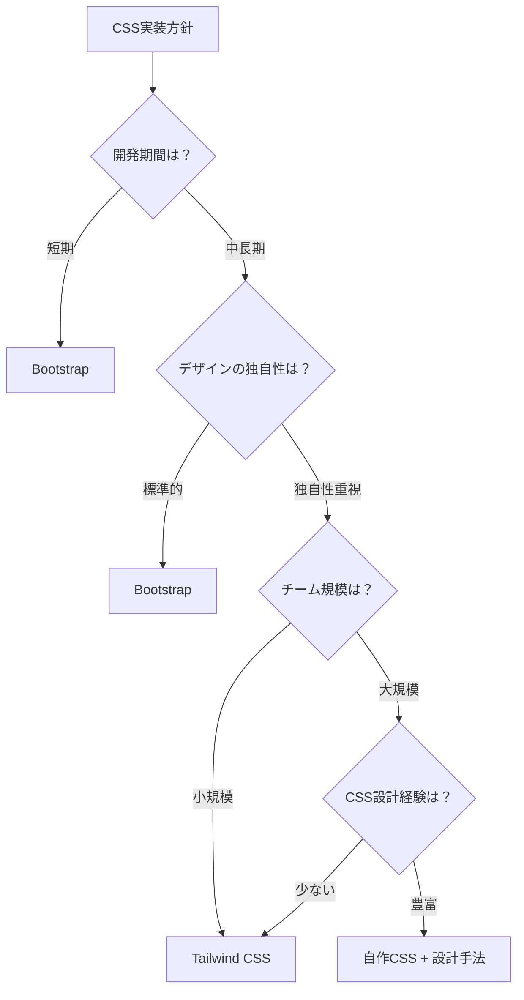
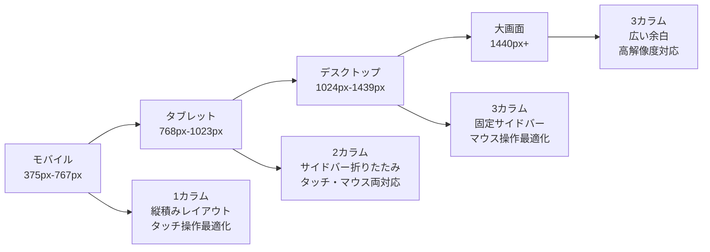

# CSS：見た目とレイアウト

## はじめに

前章でHTMLによるWebページの骨組み作りを学びました。HTMLが建物の設計図や骨格だとすれば、**CSS**（Cascading Style Sheets）は内装・外装・装飾を担当します。

CSSにより、HTMLで構築された構造に色彩、レイアウト、アニメーションを加えて、ユーザーにとって美しく使いやすいWebページを実現できます。また、レスポンシブデザインにより、スマートフォンからデスクトップまで、あらゆるデバイスで最適な表示を提供できます。

この章では、CSSの役割、レスポンシブデザイン、CSSフレームワーク、そしてWebディレクターとしてのデザイン要件定義について学びます。

## 📊 この章の重要度：🟡 推奨

**Webディレクターにとって：**
- デザイン要件の技術的実現可能性判断
- レスポンシブ対応の品質管理
- デザイナー・開発者間の効果的な橋渡し

## あなたがこれを知ると変わること

**デザイン要件定義時の会話の変化：**
- デザイナー：「このボタンを目立たせたいです」
- あなた（修得前）：「大きくて赤いボタンにしてください」
- あなた（修得後）：「**プライマリーボタン**として**hover状態**と**focus状態**を定義し、**アクセシビリティのコントラスト比**を確保してください」

**レスポンシブ対応の指示変化：**
- 以前：「スマホでも見られるようにしてください」
- 今後：「**モバイルファースト**設計で、**ブレークポイント**は375px・768px・1024pxで、**フレキシブルグリッド**を使用してください」

**CSS管理の方針変化：**
- 開発者：「CSSが複雑になってきました」
- あなた（修得前）：「整理してください」
- あなた（修得後）：「**CSS設計手法**（BEM・OOCSS）を導入し、**コンポーネント単位**で管理しましょう。**CSSフレームワーク**の活用も検討しましょう」

## CSS：Webページの装飾言語

### CSSとは

**CSS**（Cascading Style Sheets）とは、HTMLで構築された構造に「見た目」を適用するスタイルシート言語です。

**建築との比較：**
- **HTML**: 設計図・骨組み（どこに何があるか）
- **CSS**: 内装・外装（どのように見えるか）
- **JavaScript**: 設備・システム（どのように動くか）

**CSSの3つの主要な役割：**
1. **視覚的デザイン**: 色、フォント、サイズ、装飾
2. **レイアウト**: 要素の配置、間隔、整列
3. **レスポンシブ**: デバイスサイズに応じた最適化

### CSSとHTMLの分離の重要性

**CSSとHTMLの分離が重要な理由：**

**悪い例：HTMLに直接スタイルを記述**
```html
<h1 style="color: blue; font-size: 28px;">タイトル</h1>
```

**良い例：CSSファイルに分離**
```html
<!-- HTML ファイル -->
<h1 class="page-title">タイトル</h1>
```
```css
/* CSS ファイル */
.page-title {
    color: blue;
    font-size: 28px;
}
```

**日常生活での例え：**
CSS分離は「服のコーディネート」と似ています。
- **悪い例**: 服に直接色やデザインを描く（変更が困難）
- **良い例**: 服（HTML）とアクセサリー（CSS）を分ける（組み合わせ自由）

**分離のメリット：**
- **保守性**: スタイルの一括変更が可能
- **再利用性**: 同じスタイルを複数箇所で使用
- **パフォーマンス**: CSSファイルのキャッシュが効く
- **役割分担**: デザイナーとプログラマーの作業分離

### CSSの基本文法

**CSSの書き方：**
```css
セレクター {
    プロパティ: 値;
}
```

**実際の例：**
```css
.button {
    color: white;
    background-color: blue;
}
```

**各部分の意味：**
- **セレクター（`.button`）**: どの要素にスタイルを適用するか
- **プロパティ（`color`）**: 何を変更するか（文字色、背景色など）
- **値（`white`）**: どのように変更するか（具体的な設定）

**日常生活での例え：**
CSSは「化粧や身だしなみの指示書」のようなものです。
- セレクター = 対象（「髪の毛に」「顔に」）
- プロパティ = 部位（「色を」「形を」）
- 値 = 具体的な指示（「茶色に」「丸く」）
```

**主要なセレクター：**

| セレクター | 記法 | 説明 | 使用例 |
|------------|------|------|--------|
| **要素セレクター** | `h1` | HTML要素を指定 | `h1 { color: blue; }` |
| **クラスセレクター** | `.class-name` | class属性を指定 | `.button { padding: 10px; }` |
| **IDセレクター** | `#id-name` | id属性を指定 | `#header { height: 60px; }` |
| **子孫セレクター** | `div p` | 親要素内の子要素 | `nav a { text-decoration: none; }` |
| **疑似クラス** | `:hover` | 要素の状態 | `button:hover { opacity: 0.8; }` |

## レイアウトシステム：要素の配置手法

### Flexbox：柔軟な1次元レイアウト

**Flexbox**（Flexible Box Layout）は、要素を柔軟に配置する現代的なレイアウト手法です。

**基本的なFlexboxの使用例：**
```css
.container {
    display: flex;
    justify-content: space-between; /* 要素を左右に配置 */
}
```

**Flexboxでできること：**
- 要素を横一列に並べる
- 要素を中央寄せする
- 残りスペースを均等に分割する
- 画面サイズに応じて自動調整する

**日常生活での例え：**
Flexboxは「弁当箱の仕切り」のようなものです。
- **固定サイズ**: おかずの量が決まっている仕切り
- **可変サイズ**: 残りスペースに応じて大きさが変わる仕切り
- **配置**: 左寄せ、中央、右寄せ、均等配置

**Webディレクターとしてのポイント：**
Flexboxを使うことで、デバイスサイズに関係なく美しいレイアウトが実現できます。
    border-radius: 6px;
    font-weight: 600;
    cursor: pointer;
    transition: all 0.3s ease;
}

.search-button:hover {
    transform: translateY(-2px);
    box-shadow: 0 4px 12px rgba(0, 123, 255, 0.3);
}
```

**Flexboxの主要プロパティ：**
```css
.flex-container {
    display: flex;
    
    /* 主軸方向 */
    flex-direction: row; /* row | column | row-reverse | column-reverse */
    
    /* 主軸の配置 */
    justify-content: center; /* flex-start | flex-end | center | space-between | space-around */
    
    /* 交差軸の配置 */
    align-items: center; /* flex-start | flex-end | center | baseline | stretch */
    
    /* 改行 */
    flex-wrap: wrap; /* nowrap | wrap | wrap-reverse */
    
    /* 間隔 */
    gap: 1rem; /* 要素間の隙間 */
}

.flex-item {
    /* 伸縮性 */
    flex: 1; /* flex-grow flex-shrink flex-basis の短縮記法 */
    
    /* 個別の交差軸配置 */
    align-self: flex-end;
}
```

### CSS Grid：2次元レイアウト

**CSS Grid**は、行と列を持つ2次元レイアウトシステムです。

**求人一覧ページのグリッドレイアウト：**
```html
<!-- 求人一覧のHTML -->
<main class="job-listing">
    <aside class="sidebar">
        <h3>絞り込み</h3>
        <form class="filter-form">
            <!-- フィルター項目 -->
        </form>
    </aside>
    
    <section class="job-results">
        <div class="job-grid">
            <article class="job-card">
                <h3>フロントエンドエンジニア</h3>
                <p class="company">株式会社テックスタート</p>
                <p class="salary">年収500-700万円</p>
                <div class="tags">
                    <span class="tag">React</span>
                    <span class="tag">TypeScript</span>
                </div>
            </article>
            <!-- 他の求人カード -->
        </div>
    </section>
</main>
```

```css
/* グリッドレイアウト */
.job-listing {
    display: grid;
    grid-template-columns: 300px 1fr; /* サイドバー固定、メイン可変 */
    grid-template-areas: 
        "sidebar main";
    gap: 2rem;
    max-width: 1200px;
    margin: 0 auto;
    padding: 2rem;
}

.sidebar {
    grid-area: sidebar;
    background: #f8f9fa;
    padding: 1.5rem;
    border-radius: 8px;
    height: fit-content;
    position: sticky;
    top: 2rem; /* スクロール時に固定 */
}

.job-results {
    grid-area: main;
}

.job-grid {
    display: grid;
    grid-template-columns: repeat(auto-fill, minmax(300px, 1fr));
    gap: 1.5rem;
}

.job-card {
    background: white;
    border: 1px solid #e1e5e9;
    border-radius: 8px;
    padding: 1.5rem;
    transition: all 0.3s ease;
}

.job-card:hover {
    border-color: #007bff;
    box-shadow: 0 4px 12px rgba(0, 0, 0, 0.1);
    transform: translateY(-2px);
}
```

## レスポンシブデザイン：マルチデバイス対応

### メディアクエリ：デバイス別スタイル

**レスポンシブデザイン**により、スマートフォンからデスクトップまで最適な表示を実現します。

**ブレークポイントの設計：**
```css
/* モバイルファースト設計 */

/* ベーススタイル（モバイル：375px〜） */
.search-form {
    padding: 1rem;
}

.form-row {
    flex-direction: column;
    gap: 1rem;
}

.job-listing {
    grid-template-columns: 1fr;
    grid-template-areas: 
        "sidebar"
        "main";
    gap: 1rem;
}

/* タブレット（768px〜） */
@media (min-width: 768px) {
    .search-form {
        padding: 2rem;
    }
    
    .form-row {
        flex-direction: row;
        align-items: flex-end;
    }
    
    .job-grid {
        grid-template-columns: repeat(auto-fill, minmax(250px, 1fr));
    }
}

/* デスクトップ（1024px〜） */
@media (min-width: 1024px) {
    .job-listing {
        grid-template-columns: 300px 1fr;
        grid-template-areas: "sidebar main";
    }
    
    .job-grid {
        grid-template-columns: repeat(auto-fill, minmax(300px, 1fr));
    }
}

/* 大画面（1440px〜） */
@media (min-width: 1440px) {
    .job-listing {
        grid-template-columns: 350px 1fr;
    }
    
    .job-grid {
        grid-template-columns: repeat(auto-fill, minmax(350px, 1fr));
    }
}
```

**レスポンシブ画像：**
```css
/* 画像の最適化 */
.job-card img {
    width: 100%;
    height: auto;
    object-fit: cover; /* 比率を保ちながらトリミング */
    border-radius: 4px;
}

/* 高解像度ディスプレイ対応 */
@media (-webkit-min-device-pixel-ratio: 2), (min-resolution: 192dpi) {
    .company-logo {
        background-image: url('logo@2x.png');
        background-size: contain;
    }
}
```

### フレキシブルユニット：相対的なサイズ指定

**相対単位の活用：**
```css
/* フレキシブルなサイズ指定 */
.container {
    /* ビューポート相対単位 */
    width: 90vw; /* ビューポート幅の90% */
    max-width: 1200px; /* 最大幅を制限 */
    
    /* rem: ルート要素のフォントサイズ基準 */
    padding: 2rem; /* 通常 32px */
    margin: 1rem auto; /* 上下16px、左右中央 */
    
    /* em: 親要素のフォントサイズ基準 */
    font-size: 1.125em; /* 親要素の112.5% */
}

/* 動的な高さ設定 */
.hero-section {
    height: 100vh; /* ビューポート高の100% */
    min-height: 400px; /* 最小高さを保証 */
}

/* フルードタイポグラフィ */
.dynamic-text {
    font-size: clamp(1rem, 4vw, 2rem); /* 最小1rem、最大2rem、4vwで変動 */
}
```

## CSSフレームワーク：効率的な開発

### Bootstrap：コンポーネント重視

**Bootstrap**は、グリッドシステムとコンポーネントライブラリを提供するCSSフレームワークです。

**Bootstrapグリッドシステム：**
```html
<!-- Bootstrap のレスポンシブグリッド -->
<div class="container">
    <div class="row">
        <!-- モバイル：12列、タブレット：6列、デスクトップ：4列 -->
        <div class="col-12 col-md-6 col-lg-4">
            <div class="job-card">求人1</div>
        </div>
        <div class="col-12 col-md-6 col-lg-4">
            <div class="job-card">求人2</div>
        </div>
        <div class="col-12 col-md-6 col-lg-4">
            <div class="job-card">求人3</div>
        </div>
    </div>
</div>
```

**Bootstrapコンポーネント：**
```html
<!-- ナビゲーションバー -->
<nav class="navbar navbar-expand-lg navbar-dark bg-primary">
    <div class="container">
        <a class="navbar-brand" href="/">求人検索アプリ</a>
        
        <button class="navbar-toggler" type="button" 
                data-bs-toggle="collapse" data-bs-target="#navbarNav">
            <span class="navbar-toggler-icon"></span>
        </button>
        
        <div class="collapse navbar-collapse" id="navbarNav">
            <ul class="navbar-nav ms-auto">
                <li class="nav-item">
                    <a class="nav-link" href="/search">求人検索</a>
                </li>
                <li class="nav-item">
                    <a class="nav-link" href="/companies">企業一覧</a>
                </li>
            </ul>
        </div>
    </div>
</nav>

<!-- カード -->
<div class="card">
    <div class="card-body">
        <h5 class="card-title">フロントエンドエンジニア</h5>
        <h6 class="card-subtitle mb-2 text-muted">株式会社テックスタート</h6>
        <p class="card-text">React・TypeScriptを使用した開発</p>
        <a href="/jobs/123" class="btn btn-primary">詳細を見る</a>
    </div>
</div>

<!-- フォーム -->
<form>
    <div class="mb-3">
        <label for="keyword" class="form-label">キーワード</label>
        <input type="text" class="form-control" id="keyword">
    </div>
    <div class="mb-3">
        <label for="location" class="form-label">勤務地</label>
        <select class="form-select" id="location">
            <option>すべての地域</option>
            <option>東京</option>
        </select>
    </div>
    <button type="submit" class="btn btn-primary">検索</button>
</form>
```

### Tailwind CSS：ユーティリティファースト

**Tailwind CSS**は、小さなユーティリティクラスを組み合わせてデザインを構築するフレームワークです。

**Tailwindでの同等実装：**
```html
<!-- ナビゲーションバー -->
<nav class="bg-blue-600 text-white p-4">
    <div class="container mx-auto flex justify-between items-center">
        <a href="/" class="text-xl font-bold">求人検索アプリ</a>
        <div class="hidden md:flex space-x-6">
            <a href="/search" class="hover:text-blue-200 transition">求人検索</a>
            <a href="/companies" class="hover:text-blue-200 transition">企業一覧</a>
        </div>
    </div>
</nav>

<!-- カード -->
<div class="bg-white rounded-lg shadow-md p-6 hover:shadow-lg transition-shadow">
    <h3 class="text-xl font-semibold text-gray-900 mb-2">
        フロントエンドエンジニア
    </h3>
    <p class="text-gray-600 mb-2">株式会社テックスタート</p>
    <p class="text-gray-700 mb-4">React・TypeScriptを使用した開発</p>
    <a href="/jobs/123" 
       class="bg-blue-600 text-white px-4 py-2 rounded hover:bg-blue-700 transition">
        詳細を見る
    </a>
</div>

<!-- フォーム -->
<form class="space-y-6">
    <div>
        <label class="block text-sm font-medium text-gray-700 mb-2">
            キーワード
        </label>
        <input type="text" 
               class="w-full px-3 py-2 border border-gray-300 rounded-md 
                      focus:outline-none focus:ring-2 focus:ring-blue-500">
    </div>
    <button type="submit" 
            class="w-full bg-blue-600 text-white py-2 px-4 rounded-md 
                   hover:bg-blue-700 focus:outline-none focus:ring-2 focus:ring-blue-500">
        検索
    </button>
</form>
```

### フレームワーク選択の基準

**プロジェクト要件別の選択：**

| 要件 | Bootstrap | Tailwind CSS | 自作CSS |
|------|-----------|--------------|---------|
| **開発速度** | 高 | 中 | 低 |
| **カスタマイズ性** | 中 | 高 | 高 |
| **ファイルサイズ** | 大 | 最適化可能 | 最小 |
| **学習コスト** | 低 | 中 | 高 |
| **チーム開発** | 容易 | 中程度 | 要設計 |
| **独自性** | 低 | 高 | 高 |

**選択フローチャート：**


## CSS設計手法：保守性の向上

### BEM：Block Element Modifier

**BEM**は、CSSクラス名に一貫した命名規則を提供する設計手法です。

**BEM命名規則：**
```css
/* Block: 独立したコンポーネント */
.job-card { }

/* Element: Blockの構成要素 */
.job-card__title { }
.job-card__company { }
.job-card__salary { }
.job-card__tags { }

/* Modifier: BlockやElementの状態・バリエーション */
.job-card--featured { } /* 注目求人 */
.job-card--urgent { } /* 急募 */
.job-card__title--large { } /* 大きなタイトル */
```

**BEMの実装例：**
```html
<!-- HTML -->
<article class="job-card job-card--featured">
    <h3 class="job-card__title job-card__title--large">
        フロントエンドエンジニア
    </h3>
    <p class="job-card__company">株式会社テックスタート</p>
    <p class="job-card__salary">年収500-700万円</p>
    <div class="job-card__tags">
        <span class="job-card__tag">React</span>
        <span class="job-card__tag">TypeScript</span>
    </div>
</article>
```

```css
/* CSS */
.job-card {
    background: white;
    border: 1px solid #e1e5e9;
    border-radius: 8px;
    padding: 1.5rem;
    transition: all 0.3s ease;
}

.job-card--featured {
    border-color: #007bff;
    background: linear-gradient(135deg, #fff, #f8fbff);
}

.job-card__title {
    font-size: 1.25rem;
    font-weight: 600;
    color: #333;
    margin-bottom: 0.5rem;
}

.job-card__title--large {
    font-size: 1.5rem;
}

.job-card__company {
    color: #666;
    font-weight: 500;
    margin-bottom: 0.5rem;
}

.job-card__salary {
    color: #007bff;
    font-weight: 600;
    margin-bottom: 1rem;
}

.job-card__tags {
    display: flex;
    gap: 0.5rem;
    flex-wrap: wrap;
}

.job-card__tag {
    background: #e3f2fd;
    color: #1976d2;
    padding: 0.25rem 0.75rem;
    border-radius: 12px;
    font-size: 0.875rem;
    font-weight: 500;
}
```

### CSS Custom Properties（CSS変数）

**CSS変数**により、一貫したデザインシステムを構築できます。

```css
/* デザイントークン（設計における基本要素） */
:root {
    /* カラーパレット */
    --color-primary: #007bff;
    --color-primary-dark: #0056b3;
    --color-primary-light: #66b3ff;
    
    --color-secondary: #6c757d;
    --color-success: #28a745;
    --color-warning: #ffc107;
    --color-danger: #dc3545;
    
    /* グレースケール */
    --color-gray-50: #f8f9fa;
    --color-gray-100: #e9ecef;
    --color-gray-300: #dee2e6;
    --color-gray-500: #6c757d;
    --color-gray-700: #495057;
    --color-gray-900: #212529;
    
    /* タイポグラフィ */
    --font-family-base: 'Hiragino Kaku Gothic ProN', 'Hiragino Sans', Meiryo, sans-serif;
    --font-family-heading: 'Roboto', 'Noto Sans JP', sans-serif;
    
    --font-size-xs: 0.75rem;   /* 12px */
    --font-size-sm: 0.875rem;  /* 14px */
    --font-size-base: 1rem;    /* 16px */
    --font-size-lg: 1.125rem;  /* 18px */
    --font-size-xl: 1.25rem;   /* 20px */
    --font-size-2xl: 1.5rem;   /* 24px */
    --font-size-3xl: 1.875rem; /* 30px */
    
    /* スペーシング */
    --spacing-xs: 0.25rem;  /* 4px */
    --spacing-sm: 0.5rem;   /* 8px */
    --spacing-md: 1rem;     /* 16px */
    --spacing-lg: 1.5rem;   /* 24px */
    --spacing-xl: 2rem;     /* 32px */
    --spacing-2xl: 3rem;    /* 48px */
    
    /* ボーダー */
    --border-radius-sm: 4px;
    --border-radius-md: 8px;
    --border-radius-lg: 12px;
    
    /* シャドウ */
    --shadow-sm: 0 1px 3px rgba(0, 0, 0, 0.1);
    --shadow-md: 0 4px 12px rgba(0, 0, 0, 0.1);
    --shadow-lg: 0 8px 25px rgba(0, 0, 0, 0.15);
    
    /* アニメーション */
    --transition-fast: 0.15s ease;
    --transition-base: 0.3s ease;
    --transition-slow: 0.5s ease;
}

/* CSS変数の使用 */
.job-card {
    background: white;
    border: 1px solid var(--color-gray-300);
    border-radius: var(--border-radius-md);
    padding: var(--spacing-lg);
    box-shadow: var(--shadow-sm);
    transition: all var(--transition-base);
}

.job-card:hover {
    border-color: var(--color-primary);
    box-shadow: var(--shadow-md);
}

.job-card__title {
    font-family: var(--font-family-heading);
    font-size: var(--font-size-xl);
    color: var(--color-gray-900);
    margin-bottom: var(--spacing-sm);
}

.job-card__salary {
    color: var(--color-primary);
    font-weight: 600;
    font-size: var(--font-size-lg);
}
```

### ダークモード対応

**CSS変数を活用したダークモード：**
```css
/* ライトモード（デフォルト） */
:root {
    --bg-primary: #ffffff;
    --bg-secondary: #f8f9fa;
    --text-primary: #212529;
    --text-secondary: #6c757d;
    --border-color: #dee2e6;
}

/* ダークモード */
@media (prefers-color-scheme: dark) {
    :root {
        --bg-primary: #1a1a1a;
        --bg-secondary: #2d2d2d;
        --text-primary: #ffffff;
        --text-secondary: #a6a6a6;
        --border-color: #404040;
    }
}

/* または、クラスベースの切り替え */
[data-theme="dark"] {
    --bg-primary: #1a1a1a;
    --bg-secondary: #2d2d2d;
    --text-primary: #ffffff;
    --text-secondary: #a6a6a6;
    --border-color: #404040;
}

/* 共通スタイル */
body {
    background-color: var(--bg-primary);
    color: var(--text-primary);
    transition: background-color var(--transition-base), 
                color var(--transition-base);
}

.job-card {
    background: var(--bg-primary);
    border-color: var(--border-color);
    color: var(--text-primary);
}
```

## パフォーマンス最適化

### CSSの最適化手法

**ファイルサイズ削減：**
```css
/* ❌ 非効率なCSS */
.job-card {
    background-color: #ffffff;
    background-image: none;
    background-repeat: no-repeat;
    background-position: 0% 0%;
    background-attachment: scroll;
}

/* ✅ 効率的なCSS */
.job-card {
    background: white;
}

/* 未使用プロパティの削除 */
.unused-style {
    /* 使用されていないスタイルは削除 */
}
```

**Critical CSS：**
```html
<!-- インライン化する重要なCSS -->
<style>
    /* Above-the-fold（初回表示エリア）の重要なスタイルのみ */
    body { font-family: sans-serif; margin: 0; }
    .header { background: #007bff; color: white; padding: 1rem; }
    .hero { height: 100vh; display: flex; align-items: center; }
</style>

<!-- その他のCSSは非同期読み込み -->
<link rel="preload" href="/static/styles.css" as="style" onload="this.onload=null;this.rel='stylesheet'">
```

**CSS削減・圧縮：**
```css
/* 開発時（読みやすい形式） */
.job-card {
    background-color: white;
    border: 1px solid #dee2e6;
    border-radius: 8px;
    padding: 1.5rem;
    transition: all 0.3s ease;
}

/* 本番環境（圧縮） */
.job-card{background:#fff;border:1px solid #dee2e6;border-radius:8px;padding:1.5rem;transition:all .3s ease}
```

## Webディレクターとしての活用方法

### デザインシステムの要件定義

**デザインシステム要件書の作成：**

```
CSS・デザインシステム要件書

1. カラーパレット
   ✅ プライマリー: #007bff（ブランドカラー）
   ✅ セカンダリー: #6c757d（サブカラー）
   ✅ グレースケール: 50/100/300/500/700/900
   ✅ セマンティックカラー: success/warning/danger/info
   ✅ アクセシビリティ: コントラスト比4.5:1以上

2. タイポグラフィ
   ✅ フォントファミリー: Hiragino Sans, Meiryo（日本語）
   ✅ フォントサイズ: 12/14/16/18/20/24/30px
   ✅ 行間: 1.4-1.6（可読性確保）
   ✅ 文字間隔: 適切なletter-spacing設定

3. スペーシング・レイアウト
   ✅ 基本単位: 4px（4/8/16/24/32/48px）
   ✅ グリッドシステム: 12カラム
   ✅ ブレークポイント: 375/768/1024/1440px
   ✅ 最大幅: 1200px（コンテンツ幅）

4. コンポーネント
   ✅ ボタン: primary/secondary/outline
   ✅ フォーム: input/select/textarea/checkbox/radio
   ✅ カード: default/featured/compact
   ✅ ナビゲーション: header/sidebar/breadcrumb
```

### レスポンシブ要件の定義

**デバイス別の対応要件：**



**具体的な指示例：**

```
❌ Before（曖昧な指示）:
「スマホ対応してください」

✅ After（具体的な指示）:
「レスポンシブ対応として以下を実装してください：

モバイル（375px-767px）:
・検索フォーム: 1カラム、縦積み配置
・求人カード: 1列表示、フルワイズ
・ナビゲーション: ハンバーガーメニュー
・フォントサイズ: 最小16px（ズーム不要）

タブレット（768px-1023px）:
・検索フォーム: 2カラム、インライン配置
・求人カード: 2列表示、グリッドレイアウト
・サイドバー: 折りたたみ式

デスクトップ（1024px+）:
・検索フォーム: 1行、インライン配置
・求人カード: 3列表示
・サイドバー: 固定表示」
```

### CSS品質管理

**CSS品質チェックリスト：**

```
📋 パフォーマンスチェック
□ CSSファイルサイズが適切（目安：500KB以下）
□ 未使用CSSが除去されている
□ Critical CSSがインライン化されている
□ CSS圧縮・最小化が実行されている

📋 保守性チェック
□ 一貫した命名規則（BEM等）が適用されている
□ CSS変数でデザイントークンが管理されている
□ コンポーネント単位でCSSが分離されている
□ コメントで設計意図が記述されている

📋 アクセシビリティチェック
□ コントラスト比が4.5:1以上
□ フォーカス状態が視覚的に明確
□ テキストサイズが16px以上
□ カラーだけで情報を伝達していない

📋 レスポンシブチェック
□ 全ブレークポイントで表示確認済み
□ 画像が適切にリサイズされる
□ フォントサイズが読みやすい
□ タッチ要素が44px以上
```

### デザイナー・開発者との連携

**デザインハンドオフでの指示：**

```
❌ Before（デザイン重視）:
「このデザイン通りに実装してください」

✅ After（技術考慮）:
「デザインの実装において以下を考慮してください：

1. グリッドシステム
   ・Bootstrap12カラムまたはCSS Grid使用
   ・余白はspacing変数（4px単位）で統一

2. インタラクション
   ・ホバー状態: opacity 0.8, transform translateY(-2px)
   ・フォーカス状態: box-shadow で明確化
   ・アニメーション: 0.3s ease統一

3. 状態管理
   ・読み込み中: skeleton UI表示
   ・エラー状態: danger カラー使用
   ・成功状態: success カラー使用

4. パフォーマンス
   ・画像lazy loading実装
   ・CSSアニメーションはtransform使用
   ・重要でないCSSは非同期読み込み」
```

## まとめ

- **CSS**はHTMLの構造に視覚的デザインとレイアウトを適用する言語で、HTMLとの適切な分離が重要
- **Flexbox・CSS Grid**により現代的で柔軟なレイアウトを実現、デバイスサイズに応じた最適化が可能
- **レスポンシブデザイン**はメディアクエリとフレキシブルユニットで、全デバイスでの最適な表示を保証
- **CSSフレームワーク**（Bootstrap・Tailwind）は開発効率とプロジェクト要件に応じて選択
- **CSS設計手法**（BEM・CSS変数）により保守性が高く一貫したスタイルシステムを構築
- **パフォーマンス最適化**はCritical CSS・圧縮・未使用コード削除で高速なページ読み込みを実現
- Webディレクターはデザインシステム要件定義・品質管理・チーム間連携でCSS活用を最大化

次の章では「JavaScript：インタラクションと動的機能」について学び、HTMLとCSSで構築された静的なWebページに、どのように動的な機能とユーザーインタラクションを追加するかを理解していきます。DOM操作、イベント処理、現代的なフロントエンド開発の基礎について、Webディレクターの視点から深掘りします。