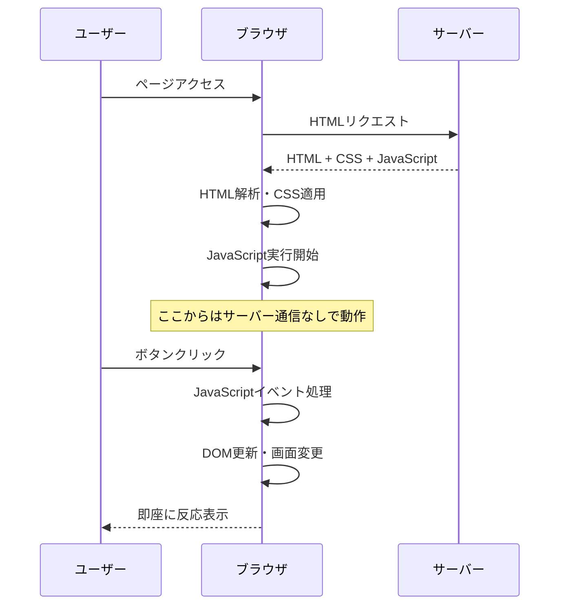
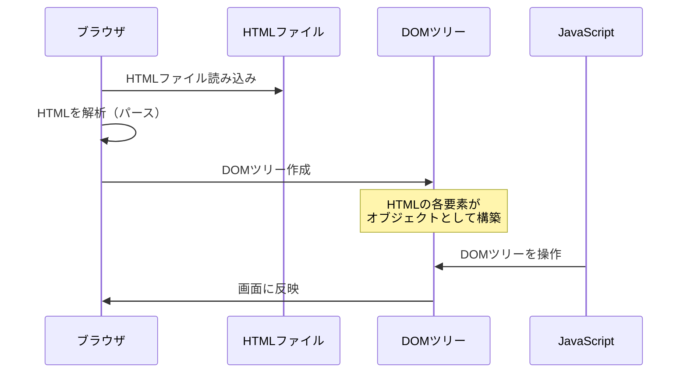
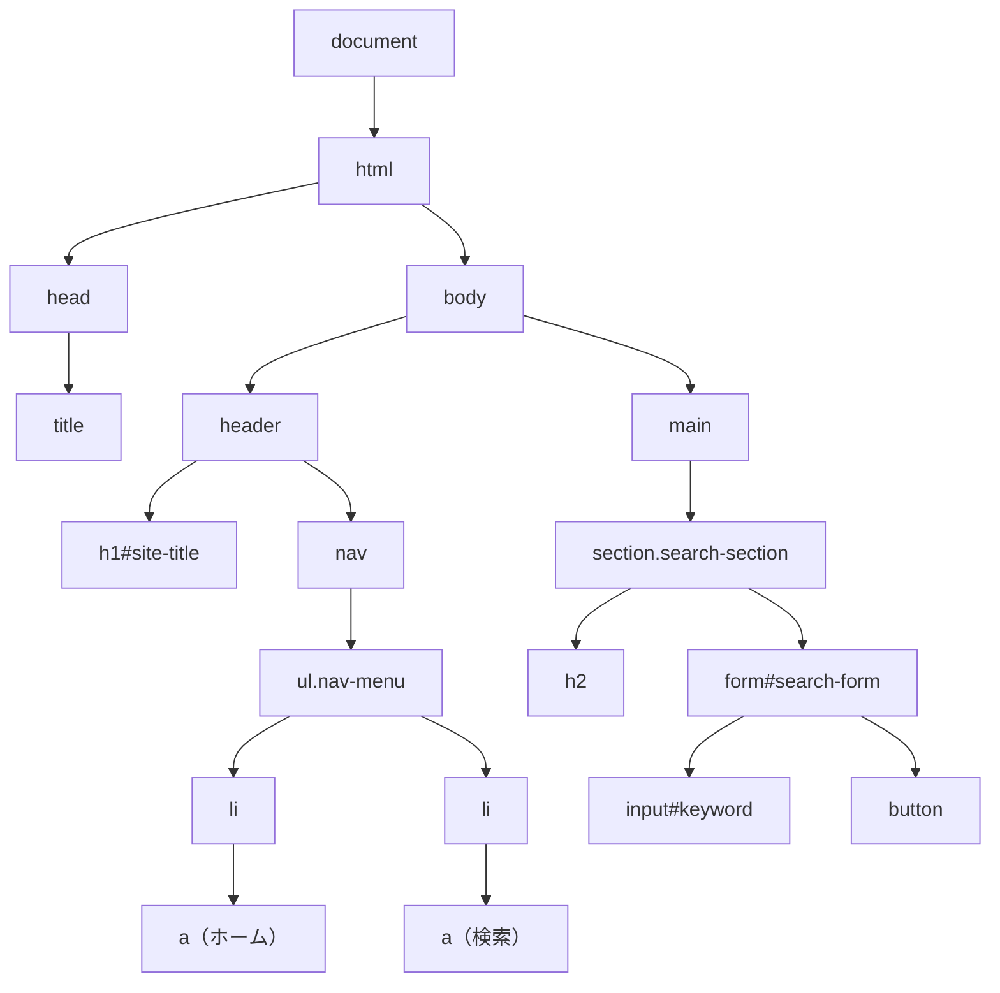
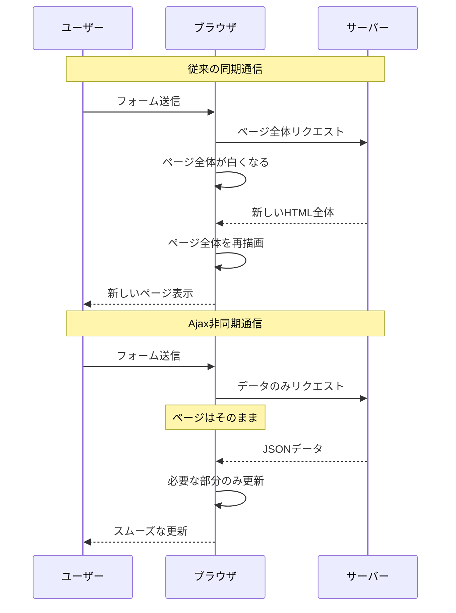
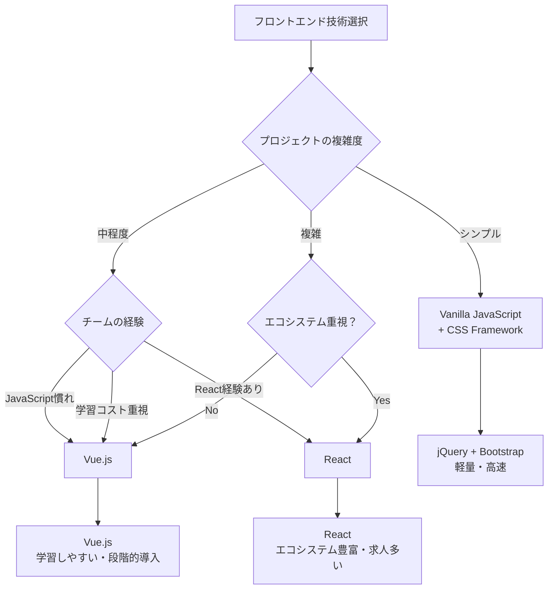

# JavaScript：インタラクションと動的機能

## はじめに

これまでHTMLでWebページの骨組みを、CSSで見た目とレイアウトを学びました。しかし、現代のWebサイトは静的な情報表示だけでなく、ユーザーの操作に反応し、動的に内容を変更する**インタラクティブ**な体験を提供します。

**JavaScript**は、Webページに「動き」と「反応」を与える言語です。ボタンをクリックしたときの処理、フォームの入力チェック、ページの一部だけを更新する機能など、ユーザーエクスペリエンスを大きく向上させる技術です。

この章では、JavaScriptの役割、DOM操作、イベント処理、そして現代的なフロントエンド開発について学び、Webディレクターとしてインタラクション要件を適切に定義できるようになります。

## 📊 この章の重要度：🟡 推奨

**Webディレクターにとって：**
- ユーザーインタラクション要件の技術的実現可能性判断
- フロントエンドフレームワーク選択の基準理解
- パフォーマンス・アクセシビリティ影響の把握

## あなたがこれを知ると変わること

**インタラクション要件定義の会話の変化：**
- デザイナー：「この部分をアニメーションさせたいです」
- あなた（修得前）：「動きをつけてください」
- あなた（修得後）：「**CSSアニメーション**か**JavaScript**か、パフォーマンスを考慮して選択し、**アクセシビリティのprefers-reduced-motion**に配慮してください」

**フォーム機能の要件変化：**
- 以前：「入力チェックをしてください」
- 今後：「**リアルタイムバリデーション**で**JavaScriptクライアント側**と**サーバー側**の両方でチェック、**エラーメッセージ**は**aria-live**で読み上げ対応してください」

**フロントエンド技術選択の判断変化：**
- 開発者：「ReactとVueどちらにしましょうか？」
- あなた（修得前）：「どちらでも大丈夫です」
- あなた（修得後）：「プロジェクトの複雑度、チームスキル、**コンポーネント再利用性**、**パフォーマンス要件**を考慮して判断しましょう」

## JavaScript：Webページの生命を吹き込む言語

### JavaScriptとは

**JavaScript**とは、Webブラウザ上で動作する**プログラミング言語**です。HTMLとCSSが静的な構造と見た目を作るのに対し、JavaScriptは動的な機能とインタラクションを実現します。

**劇場との比較：**
- **HTML**: 舞台セット（構造・配置）
- **CSS**: 照明・衣装（見た目・装飾）
- **JavaScript**: 俳優・演出（動き・相互作用）

**JavaScriptの主要な役割：**
1. **DOM操作**: HTMLの内容を動的に変更
2. **イベント処理**: ユーザーの操作に反応
3. **データ通信**: サーバーとの非同期通信（Ajax）
4. **アニメーション**: 視覚的な動きの演出
5. **フォーム処理**: 入力検証・送信制御

### ブラウザでのJavaScript実行

**JavaScriptはクライアントサイド言語：**



**サーバーサイドとの違い：**

| 特徴 | JavaScript（クライアント） | Python（サーバー） |
|------|---------------------------|-------------------|
| **実行場所** | ユーザーのブラウザ | サーバー |
| **応答速度** | 即座 | ネットワーク通信が必要 |
| **セキュリティ** | コードが見える | コードが隠れる |
| **データアクセス** | 制限あり | データベース直接アクセス |
| **処理能力** | ユーザー端末に依存 | サーバースペック |

## DOM：HTMLを操作する仕組み

### DOMとは

**DOM**（Document Object Model）とは、**ブラウザがHTMLを解析して作成する「オブジェクトツリー」**です。JavaScriptはこのDOMツリーを通じてHTMLの内容を操作します。

**HTMLからDOMへの変換プロセス：**



**DOMの基本概念：**
```html
<!-- 1. ブラウザがこのHTMLを解析 -->
<button id="search-btn">検索</button>
```
```javascript
// 2. 解析結果のDOMツリーを JavaScript で操作
document.getElementById('search-btn').textContent = '検索中...';
```

**日常生活での例え：**
DOMは「設計図から模型を作る」プロセスのようなものです。
- **HTML**: 建物の設計図（静的な情報）
- **ブラウザのパース処理**: 設計図を見ながら模型を組み立てる
- **DOM**: 完成した立体模型（操作可能な構造体）
- **JavaScript**: 模型の部品を動かす手（具体的な操作）

**DOMでできること：**
- テキストの内容を変更する
- 新しい要素を追加・削除する
- スタイル（色、サイズ）を変更する
- ユーザーの操作に反応する
```
<html>
<body>
    <header>
        <h1 id="site-title">求人検索アプリ</h1>
        <nav>
            <ul class="nav-menu">
                <li><a href="/">ホーム</a></li>
                <li><a href="/search">検索</a></li>
            </ul>
        </nav>
    </header>
    <main>
        <section class="search-section">
            <h2>求人を検索</h2>
            <form id="search-form">
                <input type="text" id="keyword" placeholder="キーワード">
                <button type="submit">検索</button>
            </form>
        </section>
    </main>
</body>
</html>
```

**対応するDOMツリー構造：**


### DOM操作の基本

DOM操作は「Webページの内容をJavaScriptで変更すること」です。

**基本的な操作例：**
```javascript
// 要素を見つける
const button = document.getElementById('search-btn');

// 内容を変更する
button.textContent = '検索中...';

// スタイルを変更する
button.style.color = 'blue';
```

**DOM操作でできること：**
- **要素を見つける**: 特定のボタンやテキストを探す
- **内容を変更**: 文字を書き換える、画像を差し替える
- **見た目を変更**: 色を変える、サイズを変える
- **要素を追加・削除**: 新しい要素を作る、不要な要素を消す

**日常生活での例え：**
DOM操作は「部屋の模様替え」のようなものです。
- **要素を見つける** = 「テーブルはどこかな？」
- **内容を変更** = 「花瓶の花を別の花に替える」
- **見た目を変更** = 「カーテンの色を変える」
- **要素の追加・削除** = 「新しい椅子を置く、古い雑誌を捨てる」

**Webディレクターとしてのポイント：**
DOM操作により、ページを再読み込みすることなく、ユーザーの操作に応じて即座にコンテンツを更新できます。これがモダンなWebサイトの「動的な体験」の基盤です。

## イベント処理：ユーザーの操作に反応する

### イベントとは

**イベント**とは、ユーザーの操作やブラウザの状態変化を表すものです。JavaScriptはこれらのイベントを「監視」し、適切な処理を実行します。

**主要なイベントの種類：**

| イベント | 発生タイミング | 使用例 |
|----------|----------------|--------|
| **click** | 要素をクリック | ボタン押下、リンククリック |
| **change** | 入力値が変更 | フォーム入力、選択ボックス |
| **input** | 入力中（リアルタイム） | 検索候補表示、文字数カウント |
| **submit** | フォーム送信 | 検索実行、データ送信 |
| **load** | ページ読み込み完了 | 初期化処理 |
| **scroll** | スクロール | 無限スクロール、ヘッダー固定 |
| **resize** | ウィンドウサイズ変更 | レスポンシブ処理 |

### イベント処理の基本

**基本的なイベント処理例：**
```javascript
// ボタンがクリックされた時の処理
button.addEventListener('click', function() {
    alert('ボタンが押されました！');
});

// フォーム送信時の処理
form.addEventListener('submit', function() {
    // 検索を実行する処理
});
```

**日常生活での例え：**
イベント処理は「呼び鈴システム」のようなものです。
- **ユーザーの操作** = 呼び鈴を押す（ボタンクリック、入力など）
- **イベントリスナー** = 呼び鈴の音を聞く人（JavaScriptのコード）
- **処理の実行** = 玄関に出る（画面更新、データ送信など）

**よく使われるイベント処理：**
- **ボタンクリック**: 検索実行、フォーム送信、メニュー開閉
- **フォーム入力**: リアルタイム検索、入力チェック
- **ページスクロール**: 無限スクロール、ヘッダー固定
- **画像ホバー**: 画像の拡大、ツールチップ表示

**Webディレクターとしてのポイント：**
イベント処理により、ユーザーの一つ一つの操作に対して適切な反応を返すことで、直感的で使いやすいWebサイトを実現できます。

### フォームバリデーション：入力チェック

**フォームバリデーション**とは、ユーザーが入力した内容が正しいかどうかをチェックする機能です。

**基本的なバリデーション例：**
```javascript
// メールアドレスの形式チェック
if (email.includes('@')) {
    // 正しい形式
} else {
    // エラーメッセージを表示
}
```

**日常生活での例え：**
フォームバリデーションは「受付での書類チェック」のようなものです。
- **必須項目チェック** = 「お名前が書かれていますか？」
- **形式チェック** = 「電話番号は数字になっていますか？」
- **エラー通知** = 「こちらの項目を修正してください」

**よくあるバリデーション：**
- **必須入力**: 名前、メールアドレスなど必ず入力してもらう項目
- **形式チェック**: メールアドレス、電話番号の正しい形式
- **文字数制限**: パスワードの長さ、コメントの文字数
- **重複チェック**: パスワード確認の一致確認

**Webディレクターとしてのポイント：**
バリデーションは「ユーザーが間違いに気づきやすくする仕組み」です。エラーメッセージは分かりやすく、修正方法も示すことが重要です。

## Ajax：ページを更新せずにサーバーと通信

### 非同期通信とは

**Ajax**（Asynchronous JavaScript and XML）により、ページ全体を更新することなく、サーバーと部分的にデータをやり取りできます。

**従来の同期通信 vs Ajax（非同期通信）：**



### Ajax（非同期通信）の基本

**基本的なAjax例：**
```javascript
// サーバーからデータを取得
fetch('/api/search')
  .then(response => response.json())
  .then(data => {
    // 取得したデータで画面を更新
  });
```

**日常生活での例え：**
Ajaxは「宅配便の追跡システム」のようなものです。
- **従来の方法**: 配達状況を知るために配送センターまで行く（ページ全体更新）
- **Ajax**: スマホで追跡番号を入力すると、その場で状況が分かる（部分更新）

**Ajaxの利点：**
- **ページ更新なし**: 白い画面にならず、スムーズな操作
- **高速**: 必要なデータだけを取得するため早い
- **良いUX**: ユーザーの操作が中断されない
- **リアルタイム**: チャットやライブ更新が可能

**よく使われる場面：**
- **検索機能**: 入力と同時に候補を表示
- **お気に入り機能**: ハートボタンをクリックして即座に反映
- **チャット**: 新しいメッセージが自動で表示
- **いいね機能**: ページ更新なしで数値が変わる

**Webディレクターとしてのポイント：**
Ajaxは現代のWebサイトに不可欠な技術です。ユーザーの待ち時間を減らし、直感的な操作を実現できます。

## アクセシビリティとJavaScript

### 支援技術への配慮

**アクセシビリティ**とは、視覚障害者、聴覚障害者、身体障害者など、様々な状況のユーザーがWebサイトを利用できるようにする配慮です。

**基本的な配慮例：**
```javascript
// 画面の変更をスクリーンリーダーに通知
element.setAttribute('aria-live', 'polite');
element.textContent = '検索結果が更新されました';
```

**日常生活での例え：**
アクセシビリティは「公共施設のバリアフリー」のようなものです。
- **音声読み上げ**: 点字ブロック（目の見えない人のための案内）
- **キーボード操作**: 車椅子用のスロープ（マウスが使えない人のための配慮）
- **色の配慮**: 大きな文字の案内板（見えにくい人のための配慮）

**重要な配慮ポイント：**
- **スクリーンリーダー対応**: 画面の変更を音声で伝える
- **キーボード操作**: マウスなしでも全ての機能を使える
- **色だけに頼らない**: 色以外でも情報を伝える
- **動きの配慮**: 激しいアニメーションを避ける

**具体的な実装：**
- **aria-live**: 画面の更新をスクリーンリーダーに通知
- **focus管理**: キーボードでの移動を適切に制御
- **alt属性**: 画像の説明をテキストで提供
- **コントラスト**: 文字と背景の色の差を十分に確保

**Webディレクターとしてのポイント：**
アクセシビリティは法的要件でもあり、より多くのユーザーにサービスを提供する機会でもあります。企画段階から配慮することが重要です。

## 現代的なフロントエンド開発

### Single Page Application (SPA)

**SPAとは：**
従来のWebサイトがページごとにHTMLを読み込むのに対し、SPAは一つのHTMLページ上でJavaScriptによってコンテンツを動的に変更するアプリケーションです。

**従来のMPA vs SPA：**

| 特徴 | MPA（Multi-Page Application） | SPA（Single Page Application） |
|------|-------------------------------|--------------------------------|
| **ページ遷移** | サーバーから新しいHTML取得 | JavaScript でコンテンツ更新 |
| **初回読み込み** | 高速 | やや重い |
| **ページ切り替え** | やや重い | 高速 |
| **SEO** | 良好 | 要対策 |
| **開発複雑度** | 低 | 高 |
| **ユーザー体験** | 標準的 | 流麗 |

### フロントエンドフレームワーク

**フレームワーク**とは、JavaScriptでの開発をより効率的にするためのツールセットです。

**主要なフレームワーク：**

**React（Meta/Facebook製）：**
- **特徴**: コンポーネントベースの開発、大規模アプリに向いている
- **学習難易度**: やや高い
- **メリット**: エコシステムが豊富、求人が多い、企業での採用実績

**Vue.js（Evan You製）：**
- **特徴**: 学習しやすい、段階的な導入が可能
- **学習難易度**: 低い
- **メリット**: 習得しやすい、既存プロジェクトに導入しやすい

**日常生活での例え：**
フレームワークは「料理の道具セット」のようなものです。
- **包丁・まな板・鍋** = 基本的なJavaScript
- **フードプロセッサー・炊飯器** = フレームワーク（複雑な処理を簡単に）
- **レシピ本** = フレームワークのドキュメント（作り方の指南書）

**フレームワークのメリット：**
- **開発効率**: 同じ作業を何度も書く必要がない
- **品質安定**: 多くの人が使っているため、バグが少ない
- **チーム開発**: 共通のルールで開発できる
- **保守性**: コードの構造が整理されている

### フレームワーク選択の基準

**プロジェクト要件別の選択：**



**選択の基準：**

| 要素 | Vue.js | React | Vanilla JS |
|------|--------|--------|------------|
| **プロジェクト規模** | 小〜中規模 | 中〜大規模 | 小規模 |
| **学習コスト** | 低い | 高い | 中程度 |
| **開発速度** | 高い | 高い | 低い |
| **チーム規模** | 小〜中チーム | 大チーム | 個人〜小チーム |

**Webディレクターとしての判断ポイント：**
- **プロジェクトの複雑さ**: 画面数や機能の多さ
- **チームのスキル**: 既存の技術力と学習可能な期間
- **長期運用**: メンテナンスのしやすさ
- **予算と期間**: 開発コストと納期のバランス

## WebディレクターとしてのJavaScript活用

### インタラクション要件の定義

**Webディレクターとして重要なこと：**

**要件定義の変化：**
- **改善前**: 「動きをつけてください」
- **改善後**: 「ボタンクリック時に0.3秒でフェードイン、Ajax通信でページ更新なし、エラー時は分かりやすいメッセージ表示」

**品質管理のポイント：**
- **機能チェック**: 全ての機能が期待通りに動作するか
- **パフォーマンス**: ページ読み込みが3秒以内か
- **アクセシビリティ**: キーボードだけでも操作できるか
- **セキュリティ**: 個人情報が適切に保護されているか

**技術選択での発言：**
「技術選択は、プロジェクトの規模・チームのスキル・予算・期間を総合的に判断して決定しましょう。Vue.jsは学習コストが低く、Reactは大規模プロジェクトに向いています。」

**日常生活での例え：**
JavaScriptの管理は「イベント運営」のようなものです。
- **企画段階**: どんな体験を提供するか（要件定義）
- **準備段階**: スタッフ配置、設備確認（品質管理）
- **当日運営**: 来場者の反応を見ながら調整（パフォーマンス監視）

## まとめ

- **JavaScript**はWebページに動的機能とインタラクションを提供し、ユーザーエクスペリエンスを大幅に向上させる
- **DOM操作**により HTMLを動的に変更し、**イベント処理**でユーザーの操作に即座に反応
- **Ajax（Fetch API）**によりページ更新なしでサーバーと通信し、スムーズなユーザー体験を実現
- **アクセシビリティ**ではキーボード操作・スクリーンリーダー対応・適切なaria属性設定が不可欠
- **フロントエンドフレームワーク**（React・Vue.js）は複雑なアプリケーション開発で威力を発揮、要件に応じた選択が重要
- **パフォーマンス最適化**はバンドルサイズ・実行時間・メモリ使用量の管理で高速な動作を保証
- Webディレクターは技術的実現可能性の判断・要件定義・品質管理でJavaScript知識を活用し、チーム間の効果的な橋渡しを実現

これで**03_Web構成要素フェーズ**が完了しました。HTML・CSS・JavaScriptの3本柱を理解することで、フロントエンド技術の全体像と相互関係を把握し、Webディレクターとして開発者との技術的対話が可能になりました。

次の**04_Web実践活用フェーズ**では、API・データベース・現代的Web技術について学び、フロントエンドとバックエンドの連携、そして実際のWebサービス運用に必要な技術について理解を深めていきます。