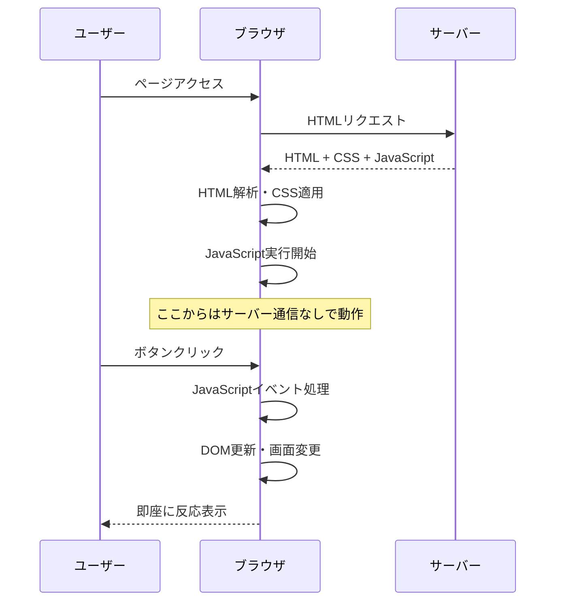
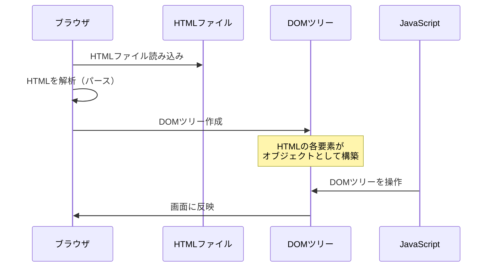
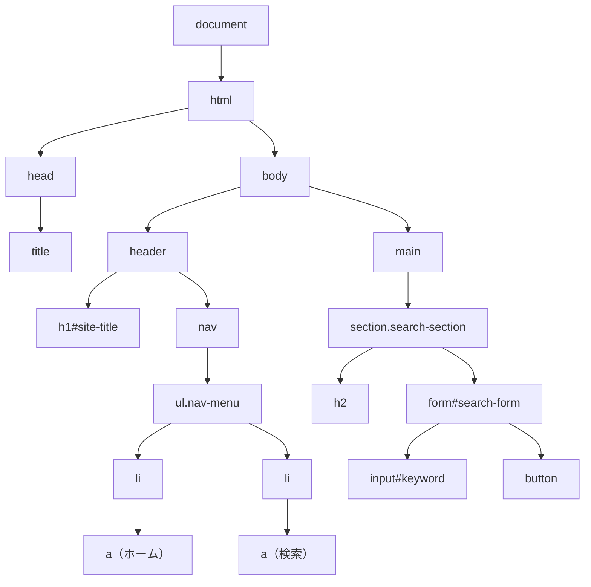
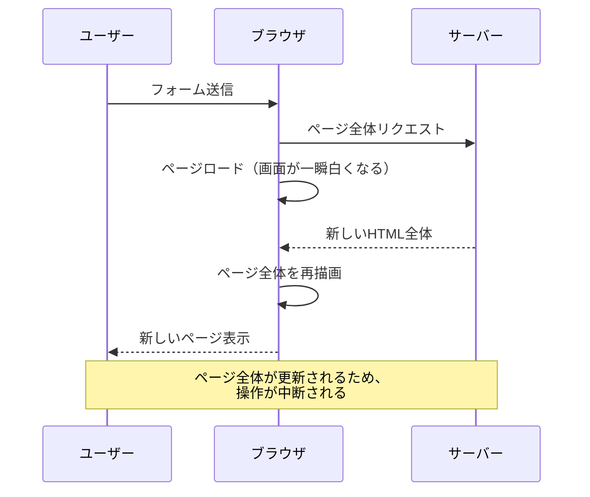
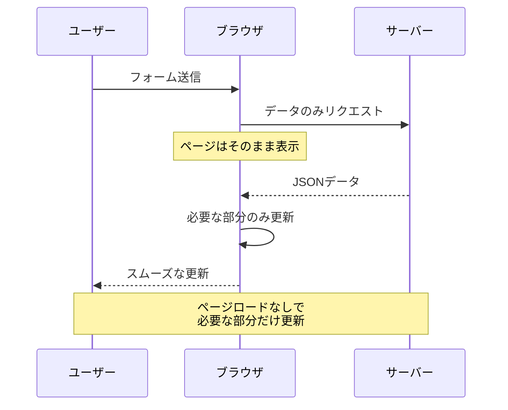

# JavaScript：インタラクションと動的機能

## はじめに

これまでHTMLでWebページの骨組みを、CSSで見た目とレイアウトを学びました。しかし、現代のWebサイトは静的な情報表示だけでなく、ユーザーの操作に反応し、動的に内容を変更する**インタラクティブ**な体験を提供します。

**JavaScript**は、Webページに「動き」と「反応」を与える言語です。ボタンをクリックしたときの処理、フォームの入力チェック、ページの一部だけを更新する機能など、ユーザーエクスペリエンスを大きく向上させる技術です。

この章では、JavaScriptの役割、DOM操作、イベント処理、そして現代的なフロントエンド開発について学び、Webディレクターとしてインタラクション要件を適切に定義できるようになります。

## 📊 この章の重要度：🟡 推奨

**Webディレクターにとって：**
- ユーザーインタラクション要件の技術的実現可能性判断
- フロントエンドフレームワーク選択の基準理解
- パフォーマンス・アクセシビリティ影響の把握

## あなたがこれを知ると変わること

**インタラクション要件定義の会話の変化：**
- デザイナー：「この部分をアニメーションさせたいです」
- あなた（修得前）：「動きをつけてください」
- あなた（修得後）：「**CSSアニメーション**か**JavaScript**か、パフォーマンスを考慮して選択し、**アクセシビリティのprefers-reduced-motion**に配慮してください」

**フォーム機能の要件変化：**
- 以前：「入力チェックをしてください」
- 今後：「**リアルタイムバリデーション**で**JavaScriptクライアント側**と**サーバー側**の両方でチェック、**エラーメッセージ**は**aria-live**で読み上げ対応してください」

**フロントエンド技術選択の判断変化：**
- 開発者：「ReactとVueどちらにしましょうか？」
- あなた（修得前）：「どちらでも大丈夫です」
- あなた（修得後）：「プロジェクトの複雑度、チームスキル、**コンポーネント再利用性**、**パフォーマンス要件**を考慮して判断しましょう」

## JavaScript：Webページの生命を吹き込む言語

### JavaScriptとは

**JavaScript**とは、Webブラウザ上で動作する**プログラミング言語**です。HTMLとCSSが静的な構造と見た目を作るのに対し、JavaScriptは動的な機能とインタラクションを実現します。

**建築物との比較：**
- **HTML**: 建物の構造躯体（柱・梁・基礎）
- **CSS**: 建物の仕上げ（外装・内装・色彩）
- **JavaScript**: 建物の設備システム（照明・空調・エレベーター）

**JavaScriptの主要な役割：**
1. **DOM操作**: HTMLの内容を動的に変更
2. **イベント処理**: ユーザーの操作に反応
3. **データ通信**: サーバーとの非同期通信（Ajax）
4. **アニメーション**: 視覚的な動きの演出
5. **フォーム処理**: 入力検証・送信制御

### ブラウザでのJavaScript実行

**JavaScriptはクライアントサイド言語：**



**サーバーサイドとの違い：**

| 特徴 | JavaScript（クライアント） | Python（サーバー） |
|------|---------------------------|-------------------|
| **実行場所** | ユーザーのブラウザ | サーバー |
| **応答速度** | 即座 | ネットワーク通信が必要 |
| **セキュリティ** | コードが見える | コードが隠れる |
| **データアクセス** | 制限あり | データベース直接アクセス |
| **処理能力** | ユーザー端末に依存 | サーバースペック |

## DOM：HTMLを操作する仕組み

### DOMとは

**DOM**（Document Object Model）とは、**ブラウザがHTMLを解析して作成する「オブジェクトツリー」**です。JavaScriptはこのDOMツリーを通じてHTMLの内容を操作します。

**HTMLからDOMへの変換プロセス：**



**DOMの基本概念：**
```html
<!-- 1. ブラウザがこのHTMLを解析 -->
<button id="search-btn">検索</button>
```
```javascript
// 2. 解析結果のDOMツリーを JavaScript で操作
document.getElementById('search-btn').textContent = '検索中...';
```

**日常生活での例え：**
DOMは「設計図から模型を作る」プロセスのようなものです。
- **HTML**: 建物の設計図（静的な情報）
- **ブラウザのパース処理**: 設計図を見ながら模型を組み立てる
- **DOM**: 完成した立体模型（操作可能な構造体）
- **JavaScript**: 模型の部品を動かす手（具体的な操作）

**DOMでできること：**
- テキストの内容を変更する
- 新しい要素を追加・削除する
- スタイル（色、サイズ）を変更する
- ユーザーの操作に反応する
```
<html>
<body>
    <header>
        <h1 id="site-title">求人検索アプリ</h1>
        <nav>
            <ul class="nav-menu">
                <li><a href="/">ホーム</a></li>
                <li><a href="/search">検索</a></li>
            </ul>
        </nav>
    </header>
    <main>
        <section class="search-section">
            <h2>求人を検索</h2>
            <form id="search-form">
                <input type="text" id="keyword" placeholder="キーワード">
                <button type="submit">検索</button>
            </form>
        </section>
    </main>
</body>
</html>
```

**対応するDOMツリー構造：**


### DOM操作の基本

DOM操作は「Webページの内容をJavaScriptで変更すること」です。

**基本的な操作例：**
```javascript
// 要素を見つける
const button = document.getElementById('search-btn');

// 内容を変更する
button.textContent = '検索中...';

// スタイルを変更する
button.style.color = 'blue';
```

**DOM操作でできること：**
- **要素を見つける**: 特定のボタンやテキストを探す
- **内容を変更**: 文字を書き換える、画像を差し替える
- **見た目を変更**: 色を変える、サイズを変える
- **要素を追加・削除**: 新しい要素を作る、不要な要素を消す

**建築物での例え：**
DOM操作は「建物の改修工事」のようなものです。
- **要素を見つける** = 「対象の部屋・設備はどこかな？」
- **内容を変更** = 「看板の文字を書き換える」
- **見た目を変更** = 「壁の色を塗り替える」
- **要素の追加・削除** = 「新しい設備を設置する、古い設備を撤去する」

**Webディレクターとしてのポイント：**
DOM操作により、ページを再読み込みすることなく、ユーザーの操作に応じて即座にコンテンツを更新できます。これがモダンなWebサイトの「動的な体験」の基盤です。

## イベント処理：ユーザーの操作に反応する

### イベントとは

**イベント**とは、ユーザーの操作やブラウザの状態変化を表すものです。ブラウザがこれらのイベントを検出・発火し、JavaScriptがそれを「監視」して適切な処理を実行します。

**主要なイベントの種類：**

| イベント | 発生タイミング | 使用例 |
|----------|----------------|--------|
| **click** | 要素をクリック | ボタン押下、リンククリック |
| **change** | 入力値が変更 | フォーム入力、選択ボックス |
| **input** | 入力中（リアルタイム） | 検索候補表示、文字数カウント |
| **submit** | フォーム送信 | 検索実行、データ送信 |
| **load** | ページ読み込み完了 | 初期化処理 |
| **scroll** | スクロール | 無限スクロール、ヘッダー固定 |
| **resize** | ウィンドウサイズ変更 | レスポンシブ処理 |

### イベント処理の基本

**addEventListenerの構文：**
```javascript
イベント監視したいDOM要素.addEventListener(監視イベント, 発生時に実行される処理)
```

**構文の詳細解説：**
1. **イベント監視したいDOM要素**: `document.getElementById('button-id')`等で取得した要素
2. **監視イベント**: `'click'`、`'submit'`、`'input'`等のイベント名（文字列）
3. **発生時に実行される処理**: `function() { }`で書かれた関数

**基本的なイベント処理例：**
```javascript
// 1. ボタン要素を取得
const button = document.getElementById('search-btn');

// 2. ボタンがクリックされた時の処理を設定
button.addEventListener('click', function() {
    alert('ボタンが押されました！');
});

// フォーム送信時の処理
const form = document.getElementById('search-form');
form.addEventListener('submit', function() {
    // 検索を実行する処理
});
```

**ステップバイステップの解説：**
```javascript
// ステップ1: 監視したい要素を見つける
const button = document.getElementById('my-button');

// ステップ2: 「何が起きたら」（イベント）を指定
// ステップ3: 「何をするか」（処理）を指定
button.addEventListener('click', function() {
    console.log('ボタンがクリックされました');
});
```

**HTMLとJavaScriptの対応関係：**
```html
<!-- HTML側: ボタンを定義 -->
<button id="search-btn">検索</button>
<p id="result">結果がここに表示されます</p>
```
```javascript
// JavaScript側: ボタンの動作を定義
const button = document.getElementById('search-btn');
const result = document.getElementById('result');

button.addEventListener('click', function() {
    result.textContent = '検索を実行しました！';
});
```

**よくある間違いと正しい書き方：**
```javascript
// ❌ 間違い: 括弧を忘れる
button.addEventListener('click', myFunction);  // () を付けない

// ❌ 間違い: イベント名にonを付ける
button.addEventListener('onclick', function() {});  // 'click'が正しい

// ✅ 正しい書き方
button.addEventListener('click', function() {
    // ここに処理を書く
});
```

**建築物での例え：**
イベント処理は「建物のセンサーシステム」のようなものです。
- **ユーザーの操作** = センサーの感知（ボタンクリック、入力など）
- **イベントリスナー** = センサーの監視装置（JavaScriptのコード）
- **処理の実行** = 自動制御の作動（画面更新、データ送信など）

<details>
<summary><strong>📋 補足：onclick属性について</strong></summary>

### onclick属性とaddEventListenerの違い

**onclick属性を使った方法：**
```html
<!-- HTML内に直接書く方法 -->
<button onclick="alert('ボタンが押されました！')">クリック</button>
```

**addEventListener を使った方法：**
```html
<!-- HTML側 -->
<button id="my-button">クリック</button>
```
```javascript
// JavaScript側
document.getElementById('my-button').addEventListener('click', function() {
    alert('ボタンが押されました！');
});
```

### なぜaddEventListenerが推奨されるのか

| 比較項目 | onclick属性 | addEventListener |
|----------|-------------|------------------|
| **HTMLとJSの分離** | 混在する | 分離される |
| **複数のイベント** | 1つのみ | 複数設定可能 |
| **保守性** | 低い | 高い |
| **チーム開発** | 混乱しやすい | 管理しやすい |

**実際の違いの例：**
```html
<!-- onclick属性: 上書きされてしまう -->
<button onclick="console.log('最初')" onclick="console.log('2番目')">
ボタン
</button>
<!-- 結果: "2番目" のみ実行される -->
```

```javascript
// addEventListener: 両方実行される
button.addEventListener('click', function() {
    console.log('最初');
});
button.addEventListener('click', function() {
    console.log('2番目');
});
// 結果: "最初" と "2番目" の両方が実行される
```

### いつonclick属性を使うか

**使っても良い場面：**
- 学習・プロトタイプ段階
- 非常にシンプルな一回限りの処理

**避けるべき場面：**
- 本格的な開発プロジェクト
- 複数のイベント処理が必要
- チームでの開発

</details>

**よく使われるイベント処理：**
- **ボタンクリック**: 検索実行、フォーム送信、メニュー開閉
- **フォーム入力**: リアルタイム検索、入力チェック
- **ページスクロール**: 無限スクロール、ヘッダー固定
- **画像ホバー**: 画像の拡大、ツールチップ表示

**Webディレクターとしてのポイント：**
イベント処理により、ユーザーの一つ一つの操作に対して適切な反応を返すことで、直感的で使いやすいWebサイトを実現できます。

### フォームバリデーション：入力チェック

**フォームバリデーション**とは、ユーザーが入力した内容が正しいかどうかをチェックする機能です。

**基本的なバリデーション例：**
```javascript
// メールアドレスの形式チェック
if (email.includes('@')) {
    // 正しい形式
} else {
    // エラーメッセージを表示
}
```

**建築物での例え：**
フォームバリデーションは「建築確認申請の審査」のようなものです。
- **必須項目チェック** = 「建築主の情報は記載されていますか？」
- **形式チェック** = 「図面の寸法は適切に記載されていますか？」
- **エラー通知** = 「この項目を建築基準法に適合するよう修正してください」

**よくあるバリデーション：**
- **必須入力**: 名前、メールアドレスなど必ず入力してもらう項目
- **形式チェック**: メールアドレス、電話番号の正しい形式
- **文字数制限**: パスワードの長さ、コメントの文字数
- **重複チェック**: パスワード確認の一致確認

**Webディレクターとしてのポイント：**
バリデーションは「ユーザーが間違いに気づきやすくする仕組み」です。エラーメッセージは分かりやすく、修正方法も示すことが重要です。

## Ajax：ページを更新せずにサーバーと通信

### 非同期通信とは

**Ajax**（**A**synchronous **J**avaScript **a**nd **X**ML：エイジャックス）により、ページ全体を更新することなく、サーバーと部分的にデータをやり取りできます。

**従来の同期通信 vs Ajax（非同期通信）：**

**従来の同期通信：**


**Ajax（非同期通信）：**


### Ajax（非同期通信）の基本

**基本的なAjax例：**
```javascript
// サーバーからデータを取得
fetch('/api/search')
  .then(response => response.json())
  .then(data => {
    // 取得したデータで画面を更新
  });
```

**建築物での例え：**
Ajaxは「ビル管理システムの遠隔監視」のようなものです。
- **従来の方法**: 設備状況を知るために機械室まで行く（ページロード発生）
- **Ajax**: 管理室のモニターで即座に設備状況が確認できる（部分更新のみ）

**Ajaxの利点：**
- **ページ更新なし**: ページロードが発生せず、スムーズな操作
- **高速**: 必要なデータだけを取得するため早い
- **良いUX**: ユーザーの操作が中断されない
- **リアルタイム**: チャットやライブ更新が可能

**実際のサービスでのAjax活用例：**
- **Google Maps**: 地図をドラッグしても画面全体は更新されず、新しい地図データのみ取得
- **Gmail**: メール一覧でメールを開いても、ページ全体が再読み込みされない
- **Facebook/Twitter**: いいねボタンをクリックしてもページロードなしで数値が変わる
- **YouTube**: 動画再生中でもコメントやチャンネル情報が更新される
- **Amazon**: 商品をカートに追加してもページが切り替わらず、カート数だけ更新

**よく使われる場面：**
- **検索機能**: 入力と同時に候補を表示（Google検索のサジェスト）
- **お気に入り機能**: ハートボタンをクリックして即座に反映
- **チャット**: 新しいメッセージが自動で表示（LINE Web、Slack）
- **無限スクロール**: Instagram、Twitterのタイムライン

**Webディレクターとしてのポイント：**
Ajaxは現代のWebサイトに不可欠な技術です。ユーザーの待ち時間を減らし、直感的な操作を実現できます。

## Single Page Application (SPA) の概念

### SPAとは

**SPA**（Single Page Application）とは、従来のWebサイトがページごとにHTMLを読み込むのに対し、**一つのHTMLページ上でJavaScriptによってコンテンツを動的に変更するアプリケーション**です。

**建築物での例え：**
SPAは「可動式の間仕切りがある建物」のようなものです。
- **従来のWebサイト**: 部屋ごとに建物が分かれている（ページ遷移で新しいHTML取得）
- **SPA**: 一つの大きな建物内で間仕切りを動かして部屋を変える（JavaScript で画面更新）

**SPAの特徴：**
- **高速なページ遷移**: 必要な部分のみ更新
- **ネイティブアプリのような体験**: スムーズな操作感
- **状態の保持**: フォーム入力などが保持される
- **複雑な開発**: JavaScript の高度な知識が必要

**代表的なSPAの例：**
- **Gmail**: メール一覧から詳細まで画面遷移なし
- **Twitter**: タイムライン更新で画面全体は変わらない
- **Google Maps**: 地図をドラッグしても画面は一つのまま


## WebディレクターとしてのJavaScript活用

### インタラクション要件の定義

**Webディレクターとして重要なこと：**

**要件定義の変化：**
- **改善前**: 「動きをつけてください」
- **改善後**: 「ボタンクリック時に0.3秒でフェードイン、Ajax通信でページ更新なし、エラー時は分かりやすいメッセージ表示」

**品質管理のポイント：**
- **機能チェック**: 全ての機能が期待通りに動作するか
- **パフォーマンス**: ページ読み込みが3秒以内か
- **アクセシビリティ**: キーボードだけでも操作できるか
- **セキュリティ**: 個人情報が適切に保護されているか

**技術選択での発言：**
「技術選択は、プロジェクトの規模・チームのスキル・予算・期間を総合的に判断して決定しましょう。Vue.jsは学習コストが低く、Reactは大規模プロジェクトに向いています。」

**建築物での例え：**
JavaScriptの管理は「建物の設計・施工管理」のようなものです。
- **設計段階**: どんな機能を持つ建物にするか（要件定義）
- **施工段階**: 各設備の品質チェック、工程管理（品質管理）
- **運用段階**: 建物の状況を監視しながら保守（パフォーマンス監視）

## まとめ

- **JavaScript**はWebページに動的機能とインタラクションを提供し、ユーザーエクスペリエンスを大幅に向上させる
- **DOM操作**により HTMLを動的に変更し、**イベント処理**でユーザーの操作に即座に反応
- **Ajax（Fetch API）**によりページ更新なしでサーバーと通信し、スムーズなユーザー体験を実現
- **アクセシビリティ**ではキーボード操作・スクリーンリーダー対応・適切なaria属性設定が不可欠
- **フロントエンドフレームワーク**（React・Vue.js）は複雑なアプリケーション開発で威力を発揮、要件に応じた選択が重要
- **パフォーマンス最適化**はバンドルサイズ・実行時間・メモリ使用量の管理で高速な動作を保証
- Webディレクターは技術的実現可能性の判断・要件定義・品質管理でJavaScript知識を活用し、チーム間の効果的な橋渡しを実現

これで**03_Web構成要素フェーズ**が完了しました。HTML・CSS・JavaScriptの3本柱を理解することで、フロントエンド技術の全体像と相互関係を把握し、Webディレクターとして開発者との技術的対話が可能になりました。

次の**04_Web実践活用フェーズ**では、API・データベース・現代的Web技術について学び、フロントエンドとバックエンドの連携、そして実際のWebサービス運用に必要な技術について理解を深めていきます。