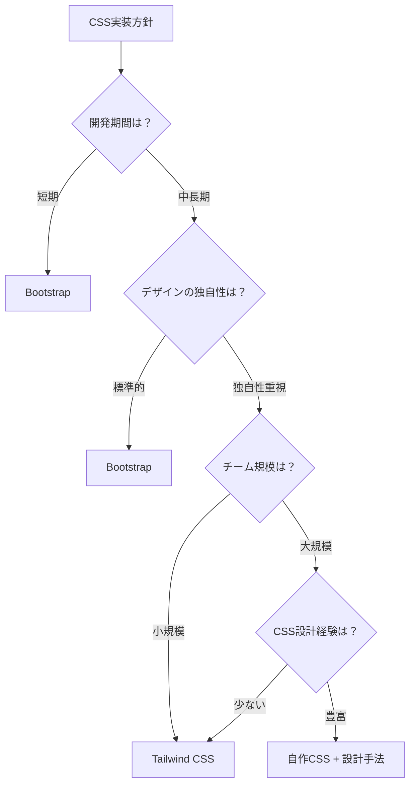
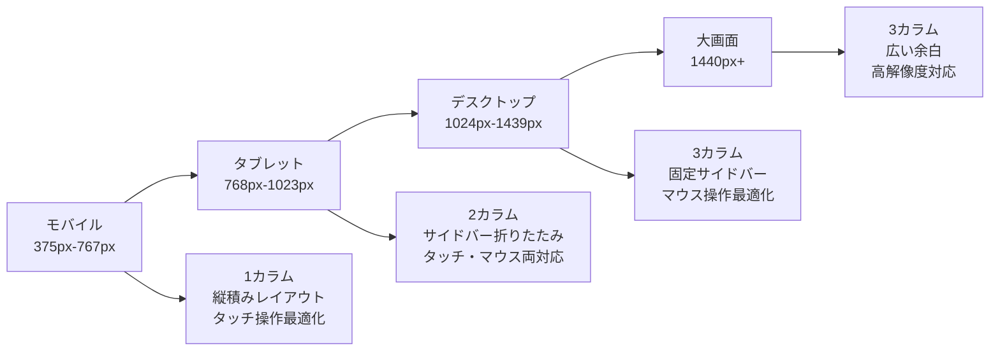

# CSS設計・フレームワーク・最適化

## はじめに

CSS の基本概念とレイアウト手法を理解した後は、より効率的で保守性の高いCSS開発のための実践的なアプローチについて学びます。

この章では、CSSフレームワークの活用、設計手法による保守性向上、パフォーマンス最適化、そしてWebディレクターとしての実務での活用方法について詳しく解説します。

## 📊 この章の重要度：🟤 応用

**Webディレクターにとって：**
- 大規模プロジェクトでの技術選択の判断材料
- 開発効率と品質管理のバランス
- チーム開発における標準化の推進

## あなたがこれを知ると変わること

**技術選択の会話の変化：**
- 開発者：「CSSフレームワークを使いたいです」
- あなた（修得前）：「おまかせします」
- あなた（修得後）：「プロジェクト規模・期間・カスタマイズ要件を考慮して、**Bootstrap**（迅速）か**Tailwind**（独自性）か**自作CSS**（完全制御）を選択しましょう」

**保守性の議論の変化：**
- 以前：「CSSが複雑になってメンテナンスが大変です」
- 今後：「**BEM命名規則**で管理し、**CSS変数**でデザイントークンを一元化、**コンポーネント設計**で再利用性を向上させましょう」

## CSSフレームワーク：効率的な開発

### Bootstrap：コンポーネント重視

**Bootstrap**は、事前に構築されたUIコンポーネントとグリッドシステムを提供するCSSフレームワークです。

**Bootstrapの特徴：**
- **12カラムグリッドシステム**: レスポンシブレイアウトの標準化
- **コンポーネントライブラリ**: ボタン、カード、ナビゲーション等の再利用可能なUI要素
- **ユーティリティクラス**: margin、padding、色彩等の細かな調整
- **JavaScript統合**: モーダル、ドロップダウン等のインタラクティブ機能
- **テーマカスタマイズ**: Sassベースのカスタマイズ機能

**適用場面：**
- 迅速なプロトタイプ開発
- 標準的なUIデザインで十分なプロジェクト
- 開発チームのCSS経験が限られている場合

### Tailwind CSS：ユーティリティファースト

**Tailwind CSS**は、小さなユーティリティクラスを組み合わせてデザインを構築するフレームワークです。

**Tailwind CSSの特徴：**
- **ユーティリティファースト**: 単一目的のクラスを組み合わせて構築
- **カスタマイズ性**: デザインの独自性を保ちながら効率化
- **PurgeCSS統合**: 未使用CSSの自動削除によるファイルサイズ最適化
- **設計制約**: デザインシステムの一貫性を保つための制約機能
- **JIT（Just-In-Time）**: オンデマンドでCSSを生成

**適用場面：**
- 独自性の高いデザインが必要なプロジェクト
- CSS設計の柔軟性が求められる場合
- パフォーマンスを重視するプロジェクト

### フレームワーク選択の基準

**プロジェクト要件別の選択：**

| 要件 | Bootstrap | Tailwind CSS | 自作CSS |
|------|-----------|--------------|---------|
| **開発速度** | 高 | 中 | 低 |
| **カスタマイズ性** | 中 | 高 | 高 |
| **ファイルサイズ** | 大 | 最適化可能 | 最小 |
| **学習コスト** | 低 | 中 | 高 |
| **チーム開発** | 容易 | 中程度 | 要設計 |
| **独自性** | 低 | 高 | 高 |

**選択フローチャート：**


## CSS設計手法：保守性の向上

### BEM：Block Element Modifier

**BEM**は、CSSクラス名に一貫した命名規則を提供する設計手法です。

**BEMの構成要素：**
- **Block（ブロック）**: 独立したコンポーネント（例：job-card）
- **Element（要素）**: ブロックの構成要素（例：job-card__title）
- **Modifier（修飾子）**: ブロックや要素の状態・バリエーション（例：job-card--featured）

**BEMの利点：**
- **予測可能性**: 命名規則により、HTMLとCSSの関係が明確
- **再利用性**: コンポーネント単位での独立性
- **保守性**: 変更の影響範囲が限定される
- **チーム開発**: 一貫した命名によるコミュニケーション向上

**実践例：**
```css
/* Block */
.job-card {
    border: 1px solid #ddd;
    padding: 16px;
    margin-bottom: 16px;
}

/* Element */
.job-card__title {
    font-size: 18px;
    font-weight: bold;
    margin-bottom: 8px;
}

.job-card__company {
    color: #666;
    font-size: 14px;
}

/* Modifier */
.job-card--featured {
    border-color: #007bff;
    background-color: #f8f9fa;
}

.job-card__title--urgent {
    color: #dc3545;
}
```

### CSS Custom Properties（CSS変数）

**CSS変数**により、一貫したデザインシステムを構築できます。

**CSS変数（Custom Properties）の概念：**
- **デザイントークン**: 色、フォント、スペーシング等の設計要素を変数として管理
- **一元管理**: :root で定義した変数を全体で共有
- **動的変更**: JavaScriptからの値変更が可能
- **ブラウザサポート**: モダンブラウザで標準サポート

**実践例：**
```css
:root {
    /* カラーパレット */
    --primary-color: #007bff;
    --secondary-color: #6c757d;
    --success-color: #28a745;
    --danger-color: #dc3545;
    --warning-color: #ffc107;
    --info-color: #17a2b8;
    
    /* フォント */
    --font-family-base: 'Helvetica Neue', Arial, sans-serif;
    --font-size-base: 16px;
    --line-height-base: 1.5;
    
    /* スペーシング */
    --spacing-xs: 4px;
    --spacing-sm: 8px;
    --spacing-md: 16px;
    --spacing-lg: 24px;
    --spacing-xl: 32px;
    
    /* ブレークポイント */
    --breakpoint-sm: 576px;
    --breakpoint-md: 768px;
    --breakpoint-lg: 992px;
    --breakpoint-xl: 1200px;
}

/* 使用例 */
.button {
    background-color: var(--primary-color);
    padding: var(--spacing-sm) var(--spacing-md);
    font-family: var(--font-family-base);
    border: none;
    border-radius: 4px;
}
```

**CSS変数の利点：**
- **保守性**: 変更時の影響が一元的に反映
- **一貫性**: デザインシステムの統一
- **効率性**: 値の重複排除
- **拡張性**: テーマ切り替え等の高度な機能実装

### ダークモード対応

**ダークモードの実装手法：**

**1. CSS変数を活用したテーマ切り替え**
```css
:root {
    --bg-color: #ffffff;
    --text-color: #333333;
    --border-color: #dddddd;
}

[data-theme="dark"] {
    --bg-color: #1a1a1a;
    --text-color: #ffffff;
    --border-color: #444444;
}

body {
    background-color: var(--bg-color);
    color: var(--text-color);
    transition: background-color 0.3s, color 0.3s;
}
```

**2. メディアクエリによる自動検出**
```css
@media (prefers-color-scheme: dark) {
    :root {
        --bg-color: #1a1a1a;
        --text-color: #ffffff;
    }
}
```

**3. JavaScript制御による手動切り替え**
```javascript
// テーマ切り替え
function toggleTheme() {
    const currentTheme = document.documentElement.getAttribute('data-theme');
    const newTheme = currentTheme === 'dark' ? 'light' : 'dark';
    document.documentElement.setAttribute('data-theme', newTheme);
    localStorage.setItem('theme', newTheme);
}
```

**ダークモード設計の考慮点：**
- **コントラスト比**: 視認性を保つための適切な色彩設計
- **画像対応**: ダークテーマに適した画像の準備
- **ブランド一貫性**: 企業カラーとダークモードの両立

## パフォーマンス最適化

### CSSの最適化手法

**パフォーマンス最適化の核心概念：**

**1. ファイルサイズ削減**
- **ショートハンドプロパティ**: 複数プロパティを一つに統合
- **未使用CSS削除**: 実際に使われていないスタイルを排除
- **圧縮（Minification）**: 空白・改行・コメントを除去

**2. Critical CSS**
- **Above-the-fold**: 初回表示エリアの重要なスタイルをインライン化
- **非同期読み込み**: 重要度の低いCSSは後から読み込み
- **レンダリングブロック回避**: 初期表示の高速化

**3. 効率的なセレクター**
- **セレクターの単純化**: 過度にネストした複雑なセレクターを避ける
- **IDセレクター**: 高いパフォーマンスだが保守性とのバランスを考慮
- **ユニバーサルセレクター**: 必要最小限の使用

**実践的な最適化例：**
```css
/* ❌ 非効率なセレクター */
.header .navigation ul li a.active {
    color: red;
}

/* ✅ 効率的なセレクター */
.nav-link--active {
    color: red;
}

/* ❌ 非効率なプロパティ */
.box {
    margin-top: 10px;
    margin-right: 15px;
    margin-bottom: 10px;
    margin-left: 15px;
}

/* ✅ ショートハンドプロパティ */
.box {
    margin: 10px 15px;
}
```

## CSSの能力と限界：技術理解の基礎

### CSSでできること

**1. 視覚的デザイン**
- **色彩設計**: 文字色、背景色、グラデーション
- **タイポグラフィ**: フォント選択、サイズ、行間、文字間隔
- **装飾**: 枠線、角丸、影効果
- **透明度**: opacity、rgba等による透過効果

**2. レイアウト制御**
- **配置**: position、float、flex、grid による要素配置
- **サイズ調整**: width、height、margin、padding の制御
- **Z軸制御**: z-index による重なり順序の管理
- **スクロール制御**: overflow による表示領域の制御

**3. レスポンシブ対応**
- **メディアクエリ**: デバイス特性に応じたスタイル切り替え
- **フレキシブルレイアウト**: 画面サイズに応じた自動調整
- **相対単位**: デバイスに依存しないサイズ指定

**4. インタラクション効果**
- **疑似クラス**: :hover、:focus等の状態変化
- **トランジション**: 状態変化時のアニメーション
- **キーフレームアニメーション**: 複雑な動的効果
- **トランスフォーム**: 回転、拡大縮小、移動

### CSSでできないこと

**1. データ処理・ロジック**
- **条件分岐**: if文相当の複雑な条件処理
- **ループ処理**: 繰り返し処理（calcやcounter以外）
- **データベース連携**: 動的データの取得・更新
- **API通信**: 外部サービスとの通信

**2. ユーザー操作の高度な制御**
- **フォーム検証**: 入力値の複雑な検証ロジック
- **イベント処理**: クリック以外の複雑なイベント制御
- **ページ遷移**: URLの変更や画面遷移
- **ローカルストレージ**: ブラウザでのデータ永続化

**3. コンテンツの動的生成**
- **DOM操作**: HTML要素の動的追加・削除
- **テキスト変更**: 既存コンテンツの内容変更
- **画像の動的読み込み**: ユーザー操作に応じた画像切り替え

### CSSとJavaScriptの連携が必要な領域

**1. 状態管理**
- CSSで視覚的変化、JavaScriptで状態制御
- クラス名の動的変更による表示切り替え

**2. 複雑なアニメーション**
- CSSでトランジション定義、JavaScriptでタイミング制御
- パフォーマンスを考慮した適切な役割分担

**3. レスポンシブの高度な制御**
- CSSでレイアウト、JavaScriptでブレークポイント検知

## Webディレクターとしての活用方法

### デザインシステムの要件定義

**デザインシステム要件定義の要素：**

**1. カラーパレット設計**
- プライマリーカラー（ブランドカラー）の定義
- セカンダリーカラー（サブカラー）の設定
- グレースケールの段階的定義
- セマンティックカラー（success/warning/danger/info）
- アクセシビリティ基準（コントラスト比4.5:1以上）

**2. タイポグラフィシステム**
- フォントファミリーの選定（日本語対応考慮）
- フォントサイズスケールの定義
- 行間・文字間隔の標準化
- ヒエラルキーの明確化

**3. スペーシング・レイアウト設計**
- 基本単位の設定（通常4px、8pxベース）
- グリッドシステムの選択
- ブレークポイントの定義
- コンテンツ最大幅の設定

**4. コンポーネント仕様**
- UI要素の標準化（ボタン、フォーム、カード等）
- 状態デザイン（hover、focus、disabled等）
- バリエーションの定義

### レスポンシブ要件の定義

**デバイス別の対応要件：**



**具体的な指示例：**

```
❌ Before（曖昧な指示）:
「スマホ対応してください」

✅ After（具体的な指示）:
「レスポンシブ対応として以下を実装してください：

モバイル（375px-767px）:
・検索フォーム: 1カラム、縦積み配置
・求人カード: 1列表示、フルワイズ
・ナビゲーション: ハンバーガーメニュー
・フォントサイズ: 最小16px（ズーム不要）

タブレット（768px-1023px）:
・検索フォーム: 2カラム、インライン配置
・求人カード: 2列表示、グリッドレイアウト
・サイドバー: 折りたたみ式

デスクトップ（1024px+）:
・検索フォーム: 1行、インライン配置
・求人カード: 3列表示
・サイドバー: 固定表示」
```

### CSS品質管理

**CSS品質チェックリスト：**

```
📋 パフォーマンスチェック
□ CSSファイルサイズが適切（目安：500KB以下）
□ 未使用CSSが除去されている
□ Critical CSSがインライン化されている
□ CSS圧縮・最小化が実行されている

📋 保守性チェック
□ 一貫した命名規則（BEM等）が適用されている
□ CSS変数でデザイントークンが管理されている
□ コンポーネント単位でCSSが分離されている
□ コメントで設計意図が記述されている

📋 アクセシビリティチェック
□ コントラスト比が4.5:1以上
□ フォーカス状態が視覚的に明確
□ テキストサイズが16px以上
□ カラーだけで情報を伝達していない

📋 レスポンシブチェック
□ 全ブレークポイントで表示確認済み
□ 画像が適切にリサイズされる
□ フォントサイズが読みやすい
□ タッチ要素が44px以上
```

### デザイナー・開発者との連携

**デザインハンドオフでの指示：**

```
❌ Before（デザイン重視）:
「このデザイン通りに実装してください」

✅ After（技術考慮）:
「デザインの実装において以下を考慮してください：

1. グリッドシステム
   ・Bootstrap12カラムまたはCSS Grid使用
   ・余白はspacing変数（4px単位）で統一

2. インタラクション
   ・ホバー状態: opacity 0.8, transform translateY(-2px)
   ・フォーカス状態: box-shadow で明確化
   ・アニメーション: 0.3s ease統一

3. 状態管理
   ・読み込み中: skeleton UI表示
   ・エラー状態: danger カラー使用
   ・成功状態: success カラー使用

4. パフォーマンス
   ・画像lazy loading実装
   ・CSSアニメーションはtransform使用
   ・重要でないCSSは非同期読み込み」
```

## まとめ

- **CSSフレームワーク**：プロジェクト要件（開発期間・独自性・チーム規模）に応じてBootstrap・Tailwind・自作CSSを選択
- **CSS設計手法**：BEM命名規則・CSS変数・ダークモード対応により保守性と一貫性を向上
- **パフォーマンス最適化**：ファイルサイズ削減・Critical CSS・効率的セレクターで高速化を実現
- **能力と限界**：CSSの役割を理解し、JavaScriptとの適切な連携で機能を実現
- **Webディレクター活用**：デザインシステム要件定義・品質管理・チーム連携で効率的なCSS開発を推進

次の章では「JavaScript：インタラクションと動的機能」について学び、静的なHTML/CSSに動的な機能を追加する方法を理解していきます。
