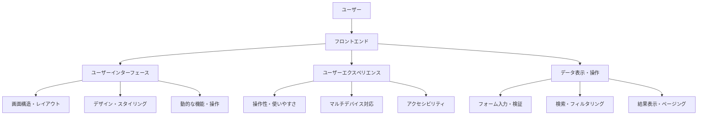
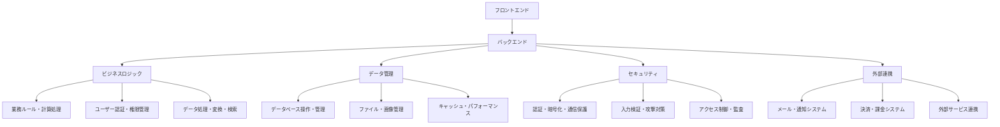
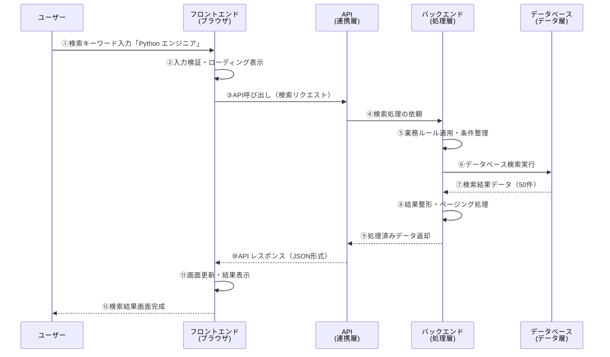
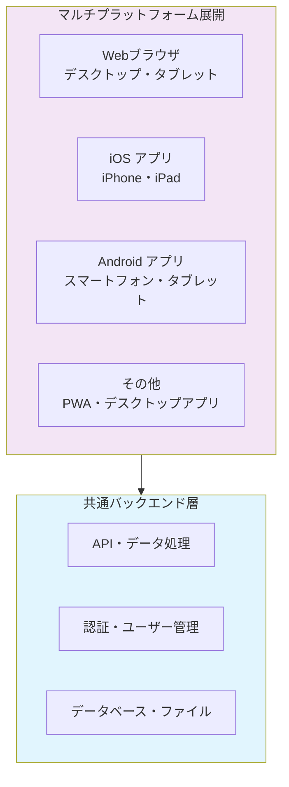
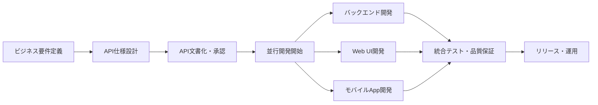
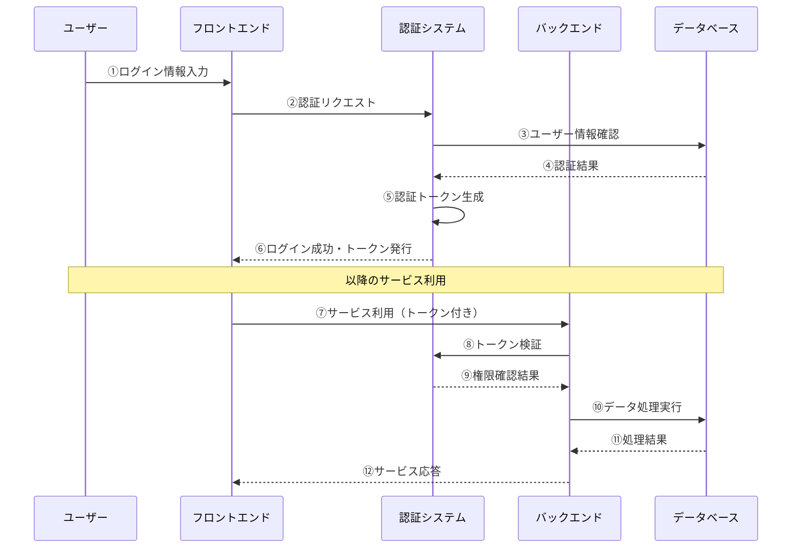

# フロントエンドとバックエンドの詳細

## はじめに

これまでのフェーズで、Webサイトの基本的な仕組み（インターネット、HTTP、ブラウザ）と、Webページを構成する3つの要素（HTML、CSS、JavaScript）について学びました。これらの知識は、Webサイトの「表面」がどのように作られ、動いているかを理解するための基盤です。

しかし、私たちが普段利用する多くのWebサービス（ECサイト、SNS、予約システムなど）は、単に情報を表示するだけでなく、ユーザーからの入力に応じて動的にコンテンツを生成したり、データを保存したり、複雑な処理を行っています。このような「裏側」の処理を担うのが**バックエンド**であり、ユーザーが直接触れる「表面」を担う**フロントエンド**と連携することで、Webサービスは成り立っています。

この章では、フロントエンドとバックエンドの具体的な役割分担、両者をつなぐ**API**（Application Programming Interface）の概念、そしてモバイルアプリとの連携など、Webサービス全体のシステム構成について深く掘り下げていきます。Webディレクターとして、システム全体の設計を理解し、開発者と効果的に協働するために不可欠な知識です。

## 📊 この章の重要度：🟡 推奨

**Webディレクターにとって：**
- Webサービス全体のシステムアーキテクチャを理解し、要件定義に参画できる
- フロントエンド・バックエンド開発チーム間の連携を円滑に進められる
- APIの役割と設計の基本を理解し、データ連携の要件を定義できる
- モバイルアプリとWebサイトの連携戦略を技術的な視点から検討できる
- 習得目安：Webアプリケーションの企画・設計や大規模プロジェクトに関わる前に

## あなたがこれを知ると変わること

**システム設計時の判断力向上：**
- 開発者：「どのような構成にしましょうか？」
- あなた（修得前）：「よくわからないので、お任せします」
- あなた（修得後）：「**要件を整理**しましょう。**ユーザー数**・**更新頻度**・**将来のモバイルアプリ対応**を考慮して、**フロントエンドとバックエンドを分離**したAPI連携システムで進めませんか？」

**データ連携要件の明確化：**
- 以前：「データを取得できるようにしてください」
- 今後：「**どのデータを**・**いつ**・**どの形式で**取得するか明確にしましょう。**リアルタイム性**・**セキュリティレベル**・**エラー時の動作**も定義が必要です」

**チーム間コミュニケーション向上：**
- デザイナー：「この画面のデータはどこから来ますか？」
- あなた（修得前）：「開発者に聞いてください」
- あなた（修得後）：「**バックエンドから取得**します。**データ読み込み時間**や**エラー表示**を考慮したUI設計にしましょう。**ローディング状態**の表現も重要です」

**プロジェクト戦略の具体化：**
- 以前：「将来はアプリ化したいです」
- 今後：「**API設計を共通化**して、**Webとモバイルで同じバックエンドを活用**する戦略にしましょう。開発コストを**30-40%削減**できます」

## フロントエンドとバックエンドの基本概念

### 役割分担の明確化

**フロントエンド**と**バックエンド**は、それぞれ異なる責任を持ちながら協調してWebサービスを提供します。Webディレクターとして、この役割分担を理解することで、適切な要件定義と効果的なチーム管理が可能になります。

**分かりやすい比較：レストランの運営**
```
🏪 レストラン全体 = Webサービス
├─ 🍽️ ホール（接客エリア） = フロントエンド
│   ├─ お客様との直接対応
│   ├─ メニュー表示・注文受付
│   ├─ 料理の提供・会計
│   └─ 快適な空間演出
│
├─ 👨‍🍳 キッチン（調理場） = バックエンド  
│   ├─ 料理の調理・品質管理
│   ├─ 食材の在庫管理
│   ├─ レシピ・調理工程管理
│   └─ 衛生・安全管理
│
└─ 📋 注文伝票システム = API
    ├─ ホール↔キッチンの情報伝達
    ├─ 注文内容の正確な伝達
    ├─ 調理状況の共有
    └─ 効率的な連携実現
```

**Webサービスでの実際の役割：**

### フロントエンドの責任範囲

**フロントエンド**は、ユーザーが直接触れる部分のすべてを担当します。Webディレクターとして、フロントエンドの役割を理解することで、UI/UX要件の明確化と適切な品質管理が可能になります。



**フロントエンドの主要責任領域：**

| 領域 | 担当内容 | Webディレクターの関与点 |
|------|----------|------------------------|
| **ユーザーインターフェース** | 画面構成・操作要素の配置 | UI設計・ワイヤーフレーム確認 |
| **ユーザーエクスペリエンス** | 操作性・使いやすさの実現 | UXシナリオ・操作フロー定義 |
| **レスポンシブデザイン** | マルチデバイス・画面サイズ対応 | 対応デバイス・ブレークポイント決定 |
| **パフォーマンス** | 表示速度・操作レスポンス最適化 | 表示速度要件・品質基準設定 |
| **アクセシビリティ** | 障害者・高齢者への配慮 | 包摂的設計・法令遵守要件 |

### バックエンドの責任範囲

**バックエンド**は、データ処理・ビジネスロジック・セキュリティなど、ユーザーからは見えない重要な処理を担当します。Webディレクターとして、バックエンドの役割を理解することで、システム要件の定義と適切なリスク管理が可能になります。



**バックエンドの主要責任領域：**

| 領域 | 担当内容 | Webディレクターの関与点 |
|------|----------|------------------------|
| **ビジネスロジック** | 業務ルール・計算処理の実装 | 業務要件・仕様の明確化 |
| **データ管理** | データベース設計・操作 | データ構造・保存期間・バックアップ要件 |
| **セキュリティ** | 認証・暗号化・攻撃対策 | セキュリティポリシー・コンプライアンス |
| **パフォーマンス** | レスポンス速度・負荷対応 | パフォーマンス要件・SLA設定 |
| **外部連携** | API・サービス連携 | 連携先選定・契約・仕様調整 |

## 実際のWebサービス例：求人検索サービス

### システム全体アーキテクチャの理解

求人検索サービスを例に、フロントエンドとバックエンドの連携、そしてWebディレクターが理解すべきシステム構成要素を見てみましょう。

```mermaid
flowchart LR
    subgraph Frontend["フロントエンド層"]
        A1["ユーザーインターフェース"]
        A2["検索フォーム・結果表示"]
        A3["ユーザー登録・ログイン"]
        A4["お気に入り・応募管理"]
    end
    
    subgraph API["API連携層"]
        B1["データ取得・検索"]
        B2["ユーザー管理・認証"]
        B3["操作・更新処理"]
        B4["外部サービス連携"]
    end
    
    subgraph Backend["バックエンド層"]
        C1["業務ロジック処理"]
        C2["データベース管理"]
        C3["セキュリティ・認証"]
        C4["外部API連携"]
    end
    
    subgraph Data["データ層"]
        D1["求人情報"]
        D2["ユーザー情報"]
        D3["応募・お気に入り"]
        D4["企業・管理データ"]
    end
    
    Frontend --> API
    API --> Backend
    Backend --> Data
```



**Webディレクターが押さえるべきポイント：**

| 層 | 主要機能 | 要件定義での注意点 |
|-----|--------|--------------------|
| **フロントエンド層** | UI/UX・操作性 | ユーザーシナリオ・デザイン要件・レスポンシブ対応 |
| **API連携層** | データの橋渡し | データ形式・レスポンス速度・エラーハンドリング |
| **バックエンド層** | 業務ロジック・処理 | 業務ルール・パフォーマンス・セキュリティ |
| **データ層** | 情報の蓄積・管理 | データ構造・容量・バックアップ・保持期間 |

### データの流れ：求人検索機能

**ユーザーが求人を検索する場合のデータフロー：**



**Webディレクターが理解すべき各ステップ：**

| ステップ | 処理内容 | 要件定義で考慮すべき点 |
|----------|----------|----------------------|
| **①-② ユーザー入力** | 検索条件の入力・検証 | 必須項目・入力制限・エラーメッセージ |
| **③ API呼び出し** | フロントエンド→バックエンド通信 | 通信方式・データ形式・セキュリティ |
| **④-⑥ 検索処理** | 業務ロジック・データ検索 | 検索精度・対象範囲・パフォーマンス |
| **⑦-⑨ 結果処理** | データ整形・応答準備 | 表示項目・並び順・ページング |
| **⑩-⑫ 結果表示** | 画面更新・ユーザー通知 | 表示形式・操作性・アクセシビリティ |

### データ連携の設計ポイント

**Webディレクターが意識すべきデータフローの要素：**

```
🔄 データの一連の流れでの品質管理

1. 入力段階
   ✅ 必須項目・形式検証
   ✅ エラーメッセージの分かりやすさ
   ✅ 不正入力の防止

2. 処理段階
   ✅ レスポンス時間（ユーザビリティ）
   ✅ データ精度・完全性
   ✅ エラー発生時の対応

3. 出力段階
   ✅ 表示項目・並び順の適切性
   ✅ ページング・検索結果数
   ✅ 操作性・アクセシビリティ
```

**システム連携での要件定義ポイント：**

| 要素 | Webディレクターの責任範囲 | 具体的な定義項目 |
|------|------------------------|------------------|
| **入力要件** | ユーザビリティ・業務ルール | 必須項目・入力制限・検証ルール・エラー表示 |
| **処理要件** | パフォーマンス・品質 | レスポンス時間・検索精度・同時アクセス数 |
| **出力要件** | 情報設計・UI/UX | 表示項目・並び順・ページネーション・操作性 |
| **エラー要件** | ユーザー体験・運用 | エラー種別・メッセージ内容・復旧手順 |

## API設計：フロントエンドとバックエンドの契約

### APIとは何か：デジタル世界の「取引ルール」

**API**（Application Programming Interface）とは、フロントエンドとバックエンドが情報をやり取りするための「約束事」です。レストランの例で言えば、注文用紙の書き方やキッチンとの連絡ルールのようなものです。

Webディレクターとして、APIの基本概念を理解することで、開発チーム間の連携を円滑にし、システム全体の品質管理に貢献できます。

### API設計の基本原則

**API設計で重要な4つの要素：**

```
📋 API設計の核となる要素

1. 何を（What）
   ✅ どのデータを取得・操作するか
   ✅ 求人情報・ユーザー情報・お気に入り等

2. どのように（How）
   ✅ データの取得・作成・更新・削除
   ✅ 検索・フィルタリング・並び替え

3. どの形式で（Format）
   ✅ データの送受信形式
   ✅ JSON・XML・その他の構造化データ

4. どの条件で（Condition）
   ✅ 認証・権限・セキュリティ
   ✅ エラーハンドリング・制限事項
```

**求人検索サービスのAPI設計例：**

| 機能 | 操作内容 | Webディレクターの定義項目 |
|------|----------|-------------------------|
| **求人検索** | キーワード・条件での検索 | 検索対象項目・並び順・検索精度要件 |
| **求人詳細** | 特定求人の詳細情報取得 | 表示項目・関連データ・アクセス制御 |
| **お気に入り** | ユーザーのお気に入り管理 | 登録・削除ルール・データ保持期間 |
| **ユーザー管理** | 認証・プロフィール管理 | 必須項目・セキュリティレベル・プライバシー |

### データ形式とエラーハンドリング

**API設計におけるWebディレクターの責任：**

APIがどのような形式でデータを返すか、エラーが発生した時にどう対応するかを明確に定義することで、ユーザー体験の向上と開発効率の改善を実現できます。

```
📊 API レスポンス設計の要素

1. 成功時のデータ構造
   ✅ 必要な情報がすべて含まれているか
   ✅ フロントエンドで扱いやすい形式か
   ✅ 将来の拡張に対応できるか

2. エラー時の情報提供
   ✅ ユーザーに分かりやすいメッセージ
   ✅ 開発者向けの詳細情報
   ✅ 復旧方法・対処法の提示

3. データの一貫性
   ✅ 全API共通の形式・命名規則
   ✅ 日時・数値・文字列の統一フォーマット
   ✅ 多言語・国際化への対応
```

**Webディレクターが定義すべき項目：**

| 要素 | 定義内容 | 具体例 |
|------|----------|--------|
| **データ項目** | 表示・処理に必要な情報 | 求人タイトル・企業名・勤務地・給与・詳細 |
| **エラーメッセージ** | ユーザー向け分かりやすい説明 | 「検索条件を確認してください」「一時的にアクセスできません」 |
| **ページング** | 大量データの分割表示 | 1ページ20件・最大100件・総件数表示 |
| **並び順** | デフォルト・選択可能な順序 | 新着順・関連度順・給与順・距離順 |

### API仕様の文書化と管理

**APIドキュメントの重要性：**

APIドキュメントは、フロントエンド・バックエンド開発者間の「仕様書」として機能します。Webディレクターとして、このドキュメントの品質管理と活用促進は、プロジェクト成功の重要な要素です。

```
📚 API仕様書で管理すべき項目

1. 機能仕様
   ✅ 各APIの目的・役割
   ✅ 入力パラメータ・制限事項
   ✅ 出力データ・形式

2. 技術仕様
   ✅ 通信方式・セキュリティ
   ✅ エラーコード・ハンドリング
   ✅ パフォーマンス・制限

3. 業務仕様
   ✅ 業務ルール・バリデーション
   ✅ 権限・アクセス制御
   ✅ データライフサイクル

4. 運用仕様
   ✅ 監視・ログ・アラート
   ✅ 障害対応・復旧手順
   ✅ バージョン管理・互換性
```

**Webディレクターとしての活用方法：**

| 活用場面 | 目的 | 具体的アクション |
|----------|------|------------------|
| **要件定義** | 機能仕様の明確化 | 業務ルール・データ項目・制約条件の文書化 |
| **進捗管理** | 開発状況の把握 | API実装状況・テスト完了状況の確認 |
| **品質管理** | 仕様適合性確認 | レビュー・テスト・受入基準の設定 |
| **チーム連携** | 情報共有・調整 | 変更通知・影響範囲・対応優先度の管理 |

## マルチプラットフォーム戦略：WebとモバイルApp連携

### 統合プラットフォーム戦略の重要性

現代のWebサービスは、Webブラウザだけでなく、スマートフォンアプリ、タブレットアプリなど、複数のプラットフォームでサービス提供することが一般的です。Webディレクターとして、統一されたユーザー体験と効率的な開発・運用を実現するための戦略を理解することが重要です。



**マルチプラットフォーム戦略のメリット：**

```
🌐 統合プラットフォーム戦略の価値

✅ 開発・運用コスト効率化
   ・共通バックエンドで開発リソース集約
   ・データ・業務ロジックの一元管理
   ・セキュリティ・法令対応の統一

✅ ユーザー体験の一貫性
   ・プラットフォーム間でのデータ同期
   ・統一されたブランド体験
   ・シームレスな利用環境

✅ ビジネス機会の最大化
   ・ユーザー接触点の拡大
   ・利用シーン・デバイスの多様化
   ・マーケティング・分析の統合
```

### アプリ開発アプローチの戦略的選択

**Webディレクターが理解すべき開発手法の選択基準：**

| アプローチ | 開発効率 | ユーザー体験 | 適用場面・判断基準 |
|------------|----------|-------------|-------------------|
| **Webアプリ（PWA）** | ⭐⭐⭐⭐⭐ | ⭐⭐⭐ | コスト重視・迅速なリリース・頻繁な更新 |
| **ハイブリッドアプリ** | ⭐⭐⭐⭐ | ⭐⭐ | Web技術活用・アプリストア配布必要 |
| **クロスプラットフォーム** | ⭐⭐⭐ | ⭐⭐⭐⭐ | iOS・Android同時開発・ネイティブ風UI |
| **ネイティブアプリ** | ⭐⭐ | ⭐⭐⭐⭐⭐ | 最高性能・プラットフォーム固有機能活用 |

**戦略的判断のためのチェックリスト：**

```
📋 アプリ開発アプローチ選択の判断基準

💰 コスト・リソース
□ 開発予算・期間の制約
□ 保守・運用コストの許容範囲
□ 開発チームのスキル・経験
□ 採用・拡張計画

👥 ユーザー・ビジネス要件
□ ターゲットユーザーの利用環境
□ 必要な機能・パフォーマンス水準
□ ブランド体験・差別化要件
□ 将来の機能拡張計画

⚙️ 技術・運用要件
□ データ連携・セキュリティ要件
□ 更新頻度・配信戦略
□ アプリストア審査・配布方針
□ 分析・モニタリング要件
```

### API ファーストアプローチ：戦略的システム設計

**API ファースト設計**により、Webとモバイルアプリで共通のバックエンドを活用できます。Webディレクターとして、この設計手法を理解し、プロジェクト計画に組み込むことで、効率的で拡張性の高いシステムを実現できます。

**API ファースト開発プロセス：**



**Webディレクターが管理すべきポイント：**

```
🎯 API ファースト戦略の管理要素

📋 企画・設計段階
✅ API仕様の早期確定
✅ フロントエンド・バックエンド間の合意形成
✅ モバイル対応を含めた将来拡張性の確保

👥 開発・チーム管理
✅ 並行開発チームの進捗調整
✅ API変更時の影響範囲管理
✅ 統合テスト・品質保証の計画

💼 ビジネス価値の最大化
✅ マルチプラットフォーム展開の戦略
✅ 開発・運用コストの最適化
✅ ユーザー体験の一貫性確保
```

**API ファースト設計の実践的メリット：**

| メリット | 具体的効果 | Webディレクターへの価値 |
|----------|------------|----------------------|
| **開発効率化** | フロントエンド・バックエンド並行開発 | スケジュール短縮・リスク分散 |
| **品質向上** | 仕様の明確化・テスト自動化 | 品質管理・保守性向上 |
| **拡張性確保** | 新プラットフォーム対応の容易性 | 将来投資・事業拡大の柔軟性 |
| **チーム連携** | 明確な責任分界・効率的コミュニケーション | プロジェクト管理・生産性向上 |

## 認証・認可システム：セキュリティとユーザー体験の両立

### 認証・認可の基本概念

**認証**（Authentication）と**認可**（Authorization）は、Webサービスのセキュリティとユーザー体験を支える重要な仕組みです。Webディレクターとして、これらの概念を理解し、適切な要件定義を行うことで、安全で使いやすいサービスを実現できます。

```
🔐 認証・認可の違いと役割

🆔 認証（Authentication）
   ・「あなたは誰ですか？」を確認
   ・ログイン・パスワード・多要素認証
   ・ユーザーの身元確認

🔑 認可（Authorization）
   ・「何ができますか？」を制御
   ・権限・役割・アクセス制御
   ・機能・データへのアクセス許可
```

**現代的な認証システムの流れ：**



### 認証・認可システムの要件定義

**Webディレクターが定義すべき認証・認可要件：**

```
🛡️ セキュリティ要件の設計ポイント

📋 認証方式の選択
✅ パスワード・多要素認証・SSO
✅ セキュリティレベルと利便性のバランス
✅ 法令・業界基準への適合

🔐 権限設計
✅ ユーザー役割（管理者・一般・ゲスト）
✅ 機能別アクセス制御
✅ データレベルの権限分離

⚙️ ユーザー体験
✅ ログイン・ログアウトの流れ
✅ セッション管理・自動ログアウト
✅ エラー・復旧フローの設計

🔄 運用・保守
✅ パスワードリセット・変更
✅ アクセスログ・監査
✅ セキュリティインシデント対応
```

**認証・認可要件の判断基準：**

| 要素 | 要件レベル | 適用場面・判断基準 |
|------|------------|-------------------|
| **基本認証** | 必須 | ユーザー登録・ログイン・セッション管理 |
| **多要素認証** | 推奨〜必須 | 個人情報・決済・管理機能へのアクセス |
| **SSO連携** | 選択 | 企業向け・他サービス連携・利便性重視 |
| **権限管理** | 必須 | 役割別機能制限・データアクセス制御 |
| **監査ログ** | 推奨〜必須 | セキュリティ要件・法令対応・トラブル対応 |

## Webディレクターとしての実践活用

### システムアーキテクチャ設計への参画

**技術選択会議での戦略的発言力向上：**

```
❌ Before（技術理解不足）:
「開発者に任せます」「どの方法が良いですか？」

✅ After（要件ベース判断）:
「ビジネス要件と技術要件を整理して判断しましょう：

📊 ビジネス要件
・Web + モバイルアプリの同時提供が必要
・ユーザー数：初期1万人、3年後10万人想定
・リリース期間：6ヶ月以内

⚙️ 技術要件
・共通バックエンドでコスト最適化
・マルチプラットフォーム対応
・セキュリティ・拡張性の確保

🎯 推奨アーキテクチャ
・API ファースト設計で開発効率化
・統一認証システムでセキュリティ確保
・段階的リリースでリスク分散

💰 投資対効果
・開発コスト30%削減、運用コスト40%削減
・将来の機能拡張・他プラットフォーム対応が容易」
```

### API設計要件の定義と管理

**API要件定義書の作成プロセス：**

Webディレクターとして、API設計の品質と開発効率を左右する要件定義を主導することで、プロジェクト成功の確率を大幅に向上させることができます。

```
📋 API要件定義の体系的アプローチ

1️⃣ ビジネス要件の明確化
✅ 提供する機能・サービスの範囲
✅ ユーザーシナリオ・業務フロー
✅ データの種類・量・更新頻度
✅ セキュリティ・コンプライアンス要件

2️⃣ 技術要件の設定
✅ パフォーマンス要件（レスポンス時間・同時接続数）
✅ 可用性・信頼性要件（稼働率・障害対応）
✅ スケーラビリティ（将来の拡張・負荷増大）
✅ 互換性・標準準拠（REST・OpenAPI・HTTP標準）

3️⃣ ユーザビリティ要件
✅ エラーメッセージの分かりやすさ
✅ レスポンス形式の一貫性
✅ 開発者向けドキュメントの充実
✅ テスト・デバッグの容易性

4️⃣ 運用・保守要件
✅ モニタリング・ログ・アラート
✅ バージョン管理・後方互換性
✅ セキュリティ更新・脆弱性対応
✅ 障害復旧・データバックアップ
```

### 開発チーム間の連携促進とプロジェクト管理

**効果的なチーム連携の実現：**

フロントエンド・バックエンド開発チームの連携を円滑にすることで、開発効率の向上、品質の改善、そしてプロジェクト成功確率の大幅な向上を実現できます。

```
🤝 チーム連携強化の実践手法

📅 定期コミュニケーション設計
✅ 週次技術同期会（進捗・課題・調整）
✅ 日次スタンドアップ（短時間・集中）
✅ マイルストーン毎の振り返り会

📋 情報共有・文書管理
✅ API仕様書の一元管理・リアルタイム更新
✅ 変更履歴・影響範囲の可視化
✅ 課題管理・優先度設定の透明化

🔧 開発プロセス最適化
✅ 並行開発のためのワークフロー設計
✅ 統合テスト・品質保証の計画・実行
✅ デプロイ・リリース プロセスの標準化

⚡ 課題解決・意思決定
✅ 技術的課題のエスカレーション ルール
✅ 仕様変更・優先度変更の迅速な判断
✅ リスク管理・コンティンジェンシー プラン
```

**Webディレクターが促進すべき連携活動：**

| 活動 | 目的 | 具体的アクション | 期待効果 |
|------|------|------------------|----------|
| **仕様調整会議** | 要件の認識統一 | API仕様・UI要件の詳細議論 | 手戻り削減・品質向上 |
| **進捗同期** | スケジュール調整 | 依存関係・ボトルネックの早期発見 | 遅延回避・リスク軽減 |
| **品質レビュー** | 統合品質確保 | パフォーマンス・セキュリティ・UXチェック | 品質向上・ユーザー満足度向上 |
| **知識共有** | チーム能力向上 | 技術勉強会・ベストプラクティス共有 | 生産性向上・技術力向上 |

### 品質管理・テスト戦略の設計と実行

**統合品質保証の戦略的アプローチ：**

フロントエンド・バックエンド連携システムの品質管理は、Webディレクターの重要な責任領域です。体系的な品質保証戦略により、ユーザー満足度の向上とビジネスリスクの軽減を同時に実現できます。

```
🎯 品質管理の包括的アプローチ

🔍 品質計画・要件定義
✅ 品質目標・基準の明確化（パフォーマンス・可用性・セキュリティ）
✅ テスト戦略・範囲の設定（機能・統合・パフォーマンス・セキュリティ）
✅ 受入基準・完了条件の定義

⚙️ テスト実行・品質評価
✅ 段階的テスト実行（単体→統合→システム→受入）
✅ 継続的品質監視（自動テスト・CI/CD・品質メトリクス）
✅ ユーザビリティ・アクセシビリティ評価

📊 品質分析・改善
✅ 品質データ分析・傾向把握
✅ 課題特定・根本原因分析
✅ 継続的改善・プロセス最適化

🚀 リリース・運用品質管理
✅ リリース判定・Go/No-Go決定
✅ 本番環境品質監視・アラート
✅ インシデント対応・ポストモータム
```

**Webディレクターが主導すべき品質管理領域：**

| 領域 | 責任範囲 | 具体的アクション | ビジネス価値 |
|------|----------|------------------|--------------|
| **機能品質** | 要件適合・ユーザビリティ | 受入テスト・ユーザビリティテスト | ユーザー満足度・競合優位性 |
| **パフォーマンス** | レスポンス・可用性 | 負荷テスト・監視・改善 | ユーザー体験・事業継続性 |
| **セキュリティ** | 脆弱性・コンプライアンス | セキュリティテスト・監査・対策 | 信頼性・法令遵守・リスク軽減 |
| **運用品質** | 保守性・拡張性・信頼性 | 運用テスト・災害復旧・変更管理 | 運用効率・コスト最適化・安定性 |

## まとめ

- **フロントエンド・バックエンドの役割分担**を理解することで、適切な要件定義とチーム管理を実現し、開発効率と品質の向上を同時に達成
- **API設計の基本原則**を習得し、データ連携の要件定義・品質管理を主導することで、システム全体の統合性と拡張性を確保
- **マルチプラットフォーム戦略**により、Web・モバイルアプリの統合的な企画・開発を推進し、開発コスト最適化とユーザー体験の一貫性を実現
- **認証・認可システム**の要件定義を通じて、セキュリティ・ユーザビリティ・コンプライアンスのバランスを取った実装を指導
- **API ファーストアプローチ**の採用により、並行開発・品質向上・将来拡張性を確保し、プロジェクト成功確率を大幅に向上
- **チーム連携促進**と**品質管理戦略**により、フロントエンド・バックエンド開発チーム間の効果的な協働を実現し、高品質なシステムを構築
- Webディレクターは**技術的判断基準の理解**に基づき、ビジネス価値と技術的実現可能性を両立させる戦略的意思決定を担う

**習得したスキル：**
✅ システムアーキテクチャ設計への戦略的参画  
✅ API設計要件の定義・管理・品質保証  
✅ マルチプラットフォーム戦略の企画・推進  
✅ 認証・認可システムの要件定義・セキュリティ管理  
✅ 開発チーム間の連携促進・プロジェクト管理  
✅ 統合品質保証・テスト戦略の設計・実行  

次の章では「データベースとバックエンド処理」について学び、データ設計の基本原則、RDB・NoSQLの選択基準、セキュリティ・パフォーマンス要件など、Webディレクターとして知っておくべきデータ管理の戦略的知識を習得します。