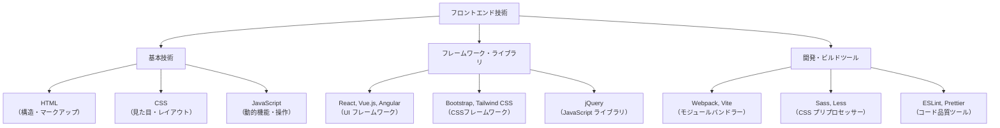
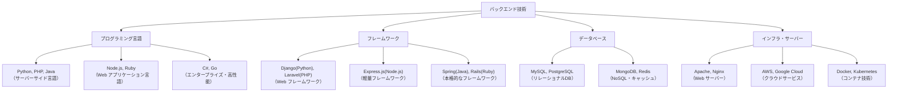
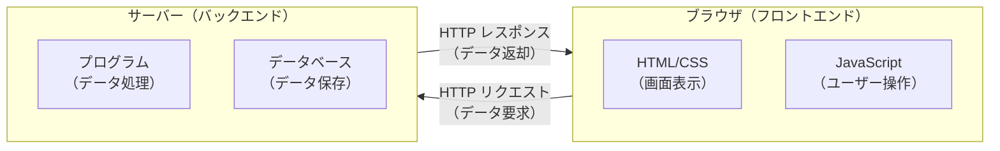
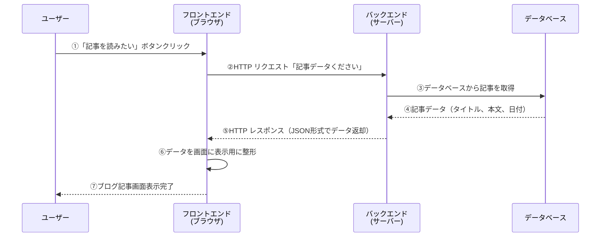
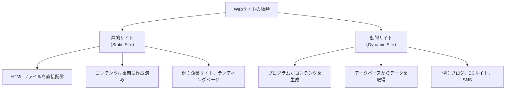
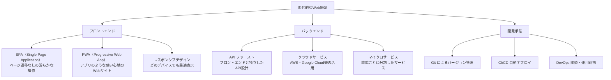

# フロントエンドとバックエンドの詳細

## はじめに

これまでのフェーズで、Webサイトの基本的な仕組み（インターネット、HTTP、ブラウザ）と、Webページを構成する3つの要素（HTML、CSS、JavaScript）について学びました。

今度は、現代のWebサービスを支える**フロントエンド**と**バックエンド**という2つの大きな領域について詳しく理解していきましょう。

**フロントエンド**は、ユーザーが直接見て触れる部分（ブラウザに表示される画面や操作）を担当し、**バックエンド**は、ユーザーには見えない裏側でデータ処理やビジネスロジックを担当します。

この章では、それぞれの役割、使われる技術、そして両者がどのように連携してWebサービスを実現しているかを学びます。Webディレクターとして、開発者と技術的な会話ができるようになる基礎知識を身につけましょう。

## 📊 この章の重要度：🟡 推奨

**Webディレクターにとって：**
- フロントエンド・バックエンドの基本的な違いと役割の理解
- Web開発プロジェクトで使われる技術の全体像の把握
- 開発者との技術的な会話に必要な基礎知識の習得
- 習得目安：Webアプリケーション開発プロジェクトに関わる前に

## あなたがこれを知ると変わること

**開発者との会話での変化：**
- 開発者：「この機能はフロントエンドとバックエンドの連携が必要です」
- あなた（修得前）：「...（よくわからない）」
- あなた（修得後）：「**ブラウザ側の処理**と**サーバー側の処理**の連携ですね。どのような形でデータをやり取りしますか？」

**技術選択の議論での変化：**
- 以前：「どの技術を使うかお任せします」
- 今後：「**静的サイト**か**動的サイト**か、まず要件を整理しましょう。ユーザー情報を扱うなら**バックエンド処理**が必要ですね」

**問題発生時の対応変化：**
- 以前：「サイトの動作がおかしいです」
- 今後：「**フロントエンドの表示エラー**なのか、**バックエンドのデータ処理エラー**なのか切り分けて調べましょう」

**プロジェクト理解の向上：**
- 以前：「Webサイトを作ってください」
- 今後：「**フロントエンド**（画面・UI）と**バックエンド**（データ処理・サーバー）、どちらも必要な機能ですね」

## フロントエンドとは何か

### フロントエンドの基本概念

**フロントエンド**とは、ユーザーが直接見て操作する部分のことです。Webブラウザに表示される画面、ボタンのクリック、フォームの入力など、すべてがフロントエンドの領域です。

**フロントエンドの主な役割：**
- ユーザーインターフェース（UI）の表示
- ユーザーの操作（クリック、入力）の受付
- データの表示・整形
- ブラウザでの動的な処理

**分かりやすい例え：店舗の接客フロア**
```
🏪 実店舗 = Webサイト
├─ 🎨 店内レイアウト・装飾 = HTML・CSS
├─ 🛍️ 商品の陳列・表示 = データ表示
├─ 👥 お客様との接客・案内 = JavaScript
└─ 💳 レジでの会計手続き = フォーム処理
```

### フロントエンドの技術スタック

**フロントエンド開発で使われる主要な技術：**



**具体的な技術と役割：**

| 技術カテゴリ | 主要技術 | 役割・用途 |
|------------|---------|-----------|
| **基本技術** | HTML, CSS, JavaScript | すべてのWebサイトの基盤技術 |
| **JavaScript フレームワーク** | React, Vue.js, Angular | 複雑なWebアプリケーションの開発効率化 |
| **CSS フレームワーク** | Bootstrap, Tailwind CSS | 統一されたデザインシステムの構築 |
| **開発ツール** | Webpack, npm, Git | 開発効率化・品質管理・チーム協働 |

### フロントエンドの現代的な動向

**最近のフロントエンド開発のトレンド：**

```
🔥 現代的なフロントエンド開発
├─ SPA（Single Page Application）
│   └─ 一つのページで動的にコンテンツを切り替え
├─ レスポンシブデザイン
│   └─ スマホ・タブレット・PC で最適な表示
├─ PWA（Progressive Web App）
│   └─ Webアプリでネイティブアプリのような体験
└─ 静的サイトジェネレーター
    └─ 高速・セキュアな静的サイト生成
```

## バックエンドとは何か

### バックエンドの基本概念

**バックエンド**とは、ユーザーからは見えない「裏側」でデータ処理やビジネスロジックを担当する部分のことです。Webサーバー上で動作し、データベースとの連携、ユーザー認証、セキュリティ対策などを行います。

**バックエンドの主な役割：**
- データベースの操作（データの保存・取得・更新・削除）
- ビジネスロジックの処理（計算、判定、業務ルール）
- ユーザー認証・権限管理
- セキュリティ対策・データ保護
- 外部サービスとの連携

**分かりやすい例え：店舗のバックオフィス**
```
🏪 実店舗 = Webサイト
├─ 📦 倉庫での在庫管理 = データベース操作
├─ 💰 売上計算・決済処理 = ビジネスロジック
├─ 🔐 金庫・セキュリティ = データ保護・認証
└─ 📞 本社・取引先との連携 = 外部API連携
```

### バックエンドの技術スタック

**バックエンド開発で使われる主要な技術：**



**具体的な技術と役割：**

| 技術カテゴリ | 主要技術 | 役割・用途 |
|------------|---------|-----------|
| **プログラミング言語** | Python, PHP, Java, Node.js | サーバー側の処理・ロジック実装 |
| **Web フレームワーク** | Django, Laravel, Express.js | Web アプリケーション開発の効率化 |
| **データベース** | MySQL, PostgreSQL, MongoDB | データの永続化・管理・検索 |
| **Web サーバー** | Apache, Nginx | HTTP リクエスト処理・ファイル配信 |
| **クラウド・インフラ** | AWS, Google Cloud, Docker | サーバー運用・スケーリング・デプロイ |

### バックエンドの現代的な動向

**最近のバックエンド開発のトレンド：**

```
⚡ 現代的なバックエンド開発
├─ マイクロサービス
│   └─ 機能ごとに分割した小さなサービス群
├─ API ファースト設計
│   └─ フロントエンドと独立したAPI開発
├─ クラウドネイティブ
│   └─ AWS・Google Cloud 等のクラウドサービス活用
├─ サーバーレス
│   └─ サーバー管理不要の関数型サービス
└─ コンテナ技術
    └─ Docker・Kubernetes での効率的なデプロイ
```

## フロントエンドとバックエンドの連携

### 基本的な連携の仕組み

フロントエンドとバックエンドは、**HTTP通信**を使ってデータをやり取りします。これまで学んだHTTP通信が、フロントエンドとバックエンドの連携でも使われています。



**連携の基本パターン：**

| パターン | フロントエンドの役割 | バックエンドの役割 |
|---------|-------------------|-------------------|
| **データ表示** | サーバーからデータを取得して画面に表示 | データベースからデータを取得して返却 |
| **データ送信** | ユーザー入力を受け取りサーバーに送信 | データを受け取りデータベースに保存 |
| **ユーザー認証** | ログイン画面でユーザー情報を送信 | ユーザー情報を確認し認証結果を返却 |
| **検索機能** | 検索条件をサーバーに送信 | 条件に合うデータを検索して返却 |

### 実際の連携例：ブログサイト

**ユーザーがブログ記事を読む場合のデータフロー：**



**各ステップの説明：**

| ステップ | 処理内容 | 担当 |
|----------|----------|------|
| **①** | ユーザーが記事リンクをクリック | ユーザー |
| **②** | サーバーに記事データを要求 | フロントエンド |
| **③④** | データベースから記事情報を取得 | バックエンド |
| **⑤** | 取得したデータをブラウザに送信 | バックエンド |
| **⑥⑦** | データを受け取り画面に表示 | フロントエンド |

### 静的サイトと動的サイトの違い

**Webサイトの種類による処理の違い：**



**それぞれの特徴：**

| 種類 | メリット | デメリット | 適用場面 |
|------|----------|------------|----------|
| **静的サイト** | 高速・セキュア・低コスト | 更新が手間・機能制限 | 企業紹介・ランディングページ |
| **動的サイト** | 柔軟・機能豊富・更新容易 | 複雑・コスト高・保守必要 | ブログ・ECサイト・会員システム |

## 現代的なWeb開発の全体像

### Web開発の技術トレンド

**最近のWeb開発で注目されている動向：**



### Webサービスの種類と特徴

**現代的なWebサービスの主要パターン：**

| タイプ | 特徴 | 技術例 | 適用場面 |
|--------|------|--------|----------|
| **従来型Webサイト** | サーバー側でHTML生成 | PHP, Python, Ruby | 企業サイト・ブログ・ニュースサイト |
| **SPA** | ブラウザ内で動的にページ更新 | React, Vue.js, Angular | Web アプリケーション・ダッシュボード |
| **静的サイト** | 事前にHTMLを生成 | Gatsby, Next.js, Hugo | 高速・セキュアなサイト |
| **PWA** | Webとアプリの中間 | Service Worker, Manifest | モバイル重視のサービス |

### APIの基本概念

**API（Application Programming Interface）とは：**
フロントエンドとバックエンドが**データをやり取りするための約束事**です。

**APIの役割：**
```
🔗 APIの基本的な役割
├─ データの取得（GET）
│   └─ 「ブログ記事のデータください」
├─ データの送信（POST）
│   └─ 「新しい記事を保存してください」
├─ データの更新（PUT）
│   └─ 「この記事を修正してください」
└─ データの削除（DELETE）
    └─ 「この記事を削除してください」
```

**Webディレクターが知っておくべきポイント：**
- APIは「データの窓口」のような役割
- フロントエンドとバックエンドを分離して開発できる
- 同じバックエンドをWebサイトとモバイルアプリで共有可能
- データ形式（主にJSON）とエラー処理の仕様が重要

## Webディレクターとして知っておくべきポイント

### 開発チームとの効果的なコミュニケーション

**フロントエンド・バックエンド開発者との会話で使える基本用語：**

| 領域 | よく使われる用語 | 意味・役割 |
|------|------------------|------------|
| **フロントエンド** | UI/UX, レスポンシブ, SPA | ユーザーが見る部分の設計・実装 |
| **バックエンド** | API, データベース, サーバー | データ処理・保存の仕組み |
| **連携** | HTTP, JSON, REST API | フロントエンド・バックエンド間の通信 |
| **開発手法** | Git, CI/CD, DevOps | 効率的な開発・デプロイの仕組み |

### プロジェクトでの技術選択の基準

**Webサイト・Webアプリケーションの技術選択で考慮すべき要素：**

```
🎯 技術選択の判断基準

📋 機能要件
✅ 静的コンテンツ vs 動的機能
✅ ユーザー登録・ログイン機能の有無
✅ データベース連携の必要性
✅ リアルタイム機能（チャット等）

💻 ユーザー要件
✅ 対象デバイス（PC・スマホ・タブレット）
✅ 想定ユーザー数・アクセス負荷
✅ 表示速度・パフォーマンス要件
✅ アクセシビリティ対応レベル

🔧 運用要件
✅ 更新頻度・コンテンツ管理方法
✅ セキュリティ・プライバシー要件
✅ 保守・運用体制
✅ 予算・開発期間
```

### 現代的なWeb開発プロジェクトの特徴

**従来の開発との違い：**

| 側面 | 従来の開発 | 現代的な開発 |
|------|------------|-------------|
| **チーム構成** | Webデザイナー + プログラマー | フロントエンド + バックエンド + DevOps |
| **開発手法** | ウォーターフォール | アジャイル・スクラム |
| **技術スタック** | HTML/CSS + サーバーサイド言語 | フレームワーク + API + クラウド |
| **デプロイ** | FTP アップロード | Git + CI/CD 自動デプロイ |
| **インフラ** | 専用サーバー・共有サーバー | クラウドサービス（AWS等） |

## まとめ

この章では、フロントエンドとバックエンドの基本概念、使われる技術、そして連携の仕組みについて学びました。

**学習した主要ポイント：**

- **フロントエンド**：ユーザーが直接見て操作する部分（HTML、CSS、JavaScript、UI フレームワーク）
- **バックエンド**：ユーザーには見えない裏側の処理（サーバーサイド言語、データベース、インフラ）
- **HTTP通信**：フロントエンドとバックエンドがデータをやり取りする基本的な仕組み
- **API**：フロントエンドとバックエンドの連携を可能にする「データの窓口」
- **静的サイト vs 動的サイト**：コンテンツの生成方法による違いと適用場面

**Webディレクターとして身につけた能力：**
✅ フロントエンド・バックエンドの基本的な違いと役割の理解  
✅ 開発者との技術的な会話に必要な基礎用語の習得  
✅ Web開発プロジェクトで使われる技術の全体像の把握  
✅ 技術選択の判断基準の理解  
✅ 現代的なWeb開発の特徴と従来との違いの認識

次の章では「データベースとバックエンド処理」について学び、データ設計の基本原則、RDB・NoSQLの選択基準、セキュリティ・パフォーマンス要件など、Webディレクターとして知っておくべきデータ管理の基礎知識を習得します。