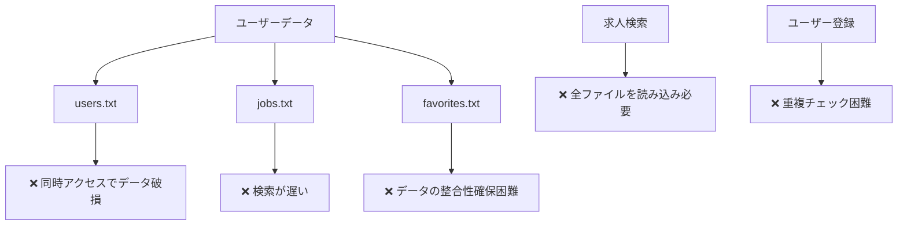
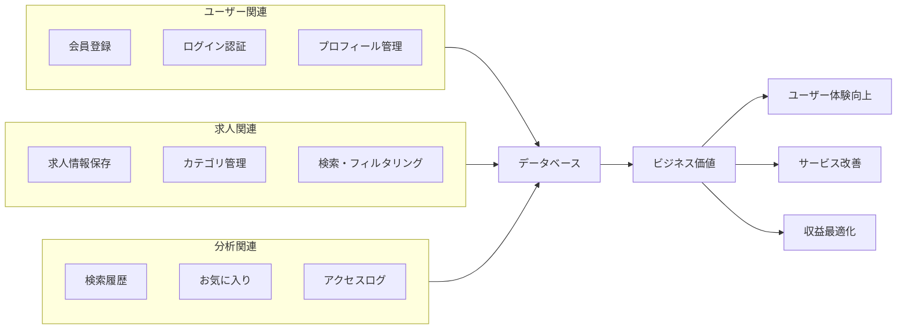
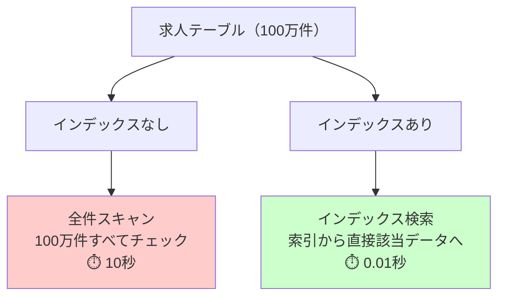
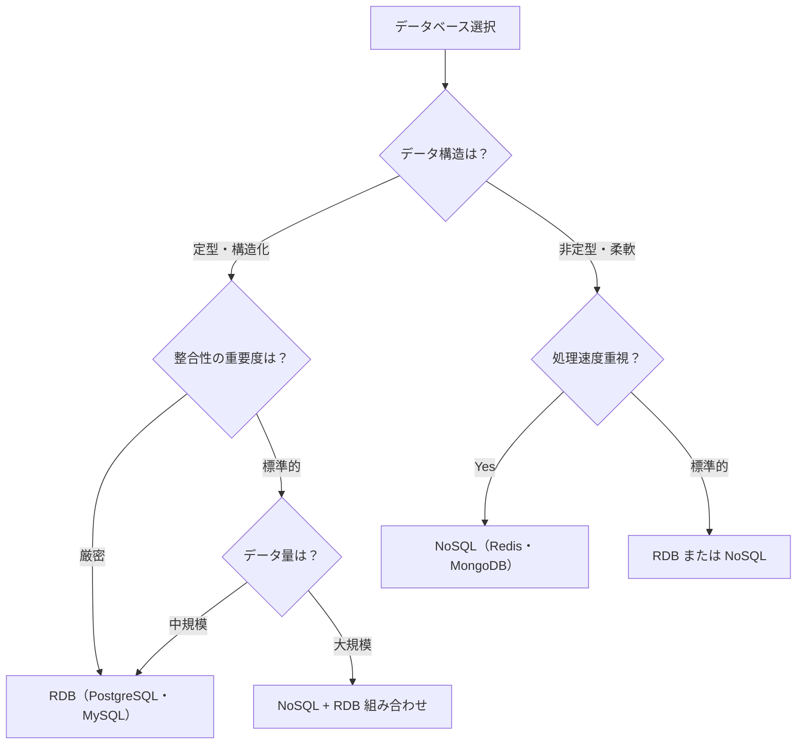
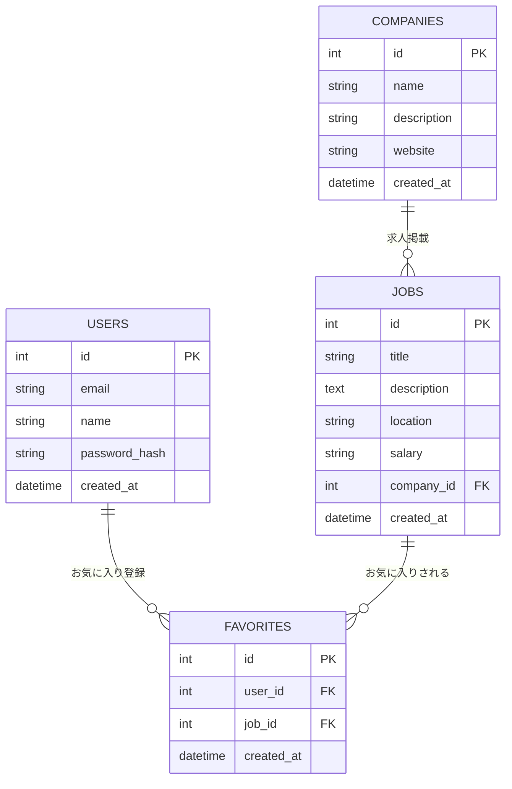
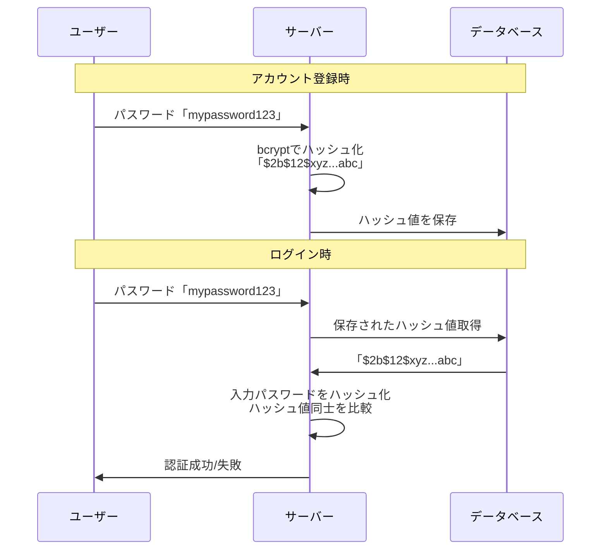
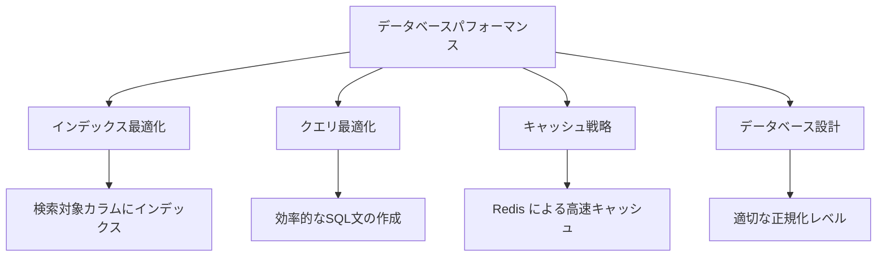

# データベースとバックエンド処理

## はじめに

前章でフロントエンドとバックエンドの連携について学びました。今度は、バックエンドの心臓部である**データベース**と、そこで行われる処理について詳しく理解していきましょう。

データベースは、Webサービスの「記憶装置」です。ユーザー情報、商品データ、検索履歴など、サービスに必要なすべての情報を安全に保管し、必要な時に素早く取り出せるようにします。

この章では、なぜデータベースが必要なのか、どのような種類があるのか、そしてWebディレクターとして知っておくべきデータ設計とセキュリティの基本について学びます。

## 📊 この章の重要度：🟡 推奨

**Webディレクターにとって：**
- データ設計・ER図の基本理解
- データベース選択基準の判断材料
- 個人情報保護・セキュリティ対策の技術要件

## あなたがこれを知ると変わること

**データ設計の要件定義変化：**
- 開発者：「ユーザーデータをどう管理しましょうか？」
- あなた（修得前）：「データを保存してください」
- あなた（修得後）：「ユーザー登録データは個人情報を含むため、**パスワードはハッシュ化保存**、**PostgreSQL**で関係性を管理し、**セッションはRedis**で高速処理してください」

**パフォーマンス要件の変化：**
- 以前：「早く表示されるようにしてください」
- 今後：「検索結果は**200ms以内**を目標に、**データベースインデックス**最適化と**キャッシュ戦略**を検討し、必要に応じて**CDN**活用してください」

**セキュリティ対策の具体化：**
- 開発者：「セキュリティ対策をしたいです」
- あなた（修得前）：「安全にしてください」
- あなた（修得後）：「**SQL インジェクション対策**、**パスワードハッシュ化**、**個人情報の暗号化**、**アクセスログ記録**を実装し、**定期バックアップ**も設定してください」

## なぜデータベースが必要なのか

### ファイル保存の限界

**ファイルだけでデータ管理する場合の問題：**



**データベースのメリット：**
- **高速検索**: インデックスにより大量データから瞬時に検索
- **同時アクセス**: 複数ユーザーが同時にデータ操作可能
- **整合性保証**: データの矛盾を防ぐ仕組み
- **セキュリティ**: アクセス権限・暗号化・監査ログ
- **バックアップ・復旧**: データ損失を防ぐ仕組み

### 実際のWebサービスでの役割

**求人検索サービスでのデータベース活用例：**



## データベースの種類と選択基準

### RDB（リレーショナルデータベース）

**RDB**は、データを**表形式**で管理し、表同士の**関係性**を定義できるデータベースです。

**特徴：**
- **構造化データ**: 決まった形式でデータを保存
- **ACID特性**: データの整合性を厳密に保証
- **SQL**: 標準的な問い合わせ言語
- **インデックス**: 高速検索を実現する仕組み
- **スケーラビリティ**: 垂直スケーリング（サーバースペック向上）

### インデックス：高速検索の仕組み

**インデックス**とは、データベースのテーブルに対して作成する「索引」です。辞書の索引のように、特定の列（カラム）の値を素早く見つけるための仕組みです。

**インデックスの仕組み：**



**日常生活での例え：**
インデックスは「図書館の索引カード」のようなものです。
- **インデックスなし**: 欲しい本を見つけるために全ての本棚を端から確認
- **インデックスあり**: 索引カードで場所を調べて、その棚に直接行く

**インデックスの効果：**
```
検索対象：「東京都」の求人を検索

❌ インデックスなし
→ 100万件の求人データを1件ずつチェック
→ 平均50万件をスキャン（10秒）

✅ locationカラムにインデックス
→ 索引から「東京都」の位置を特定
→ 該当データに直接アクセス（0.01秒）
```

**インデックス作成の基準：**
- **検索頻度が高い**: よく使われる検索条件の列
- **選択性が高い**: 様々な値を持つ列（例：メールアドレス）
- **WHERE句でよく使用**: 絞り込み条件に使われる列

**インデックスのトレードオフ：**

| メリット | デメリット |
|----------|-----------|
| 検索速度大幅向上 | ストレージ容量増加 |
| ソート処理高速化 | データ更新速度低下 |
| JOIN処理最適化 | メンテナンス負荷増加 |

**実際のインデックス例：**
```sql
-- 求人検索でよく使用される列にインデックス作成
CREATE INDEX idx_jobs_location ON jobs(location);  -- 勤務地検索
CREATE INDEX idx_jobs_title ON jobs(title);        -- 職種検索
CREATE INDEX idx_jobs_created_at ON jobs(created_at); -- 新着順
```

**主要なRDB：**
- **PostgreSQL**: 高機能・オープンソース
- **MySQL**: 高速・普及率高い
- **SQL Server**: Microsoft製・企業向け
- **Oracle**: 大企業向け・高機能

**適用場面：**
```
✅ ECサイト：注文・決済・在庫管理
✅ 会計システム：厳密なデータ整合性が必要
✅ 求人サイト：ユーザー・企業・求人の関係管理
✅ CRM：顧客情報の構造化管理
```

### NoSQL（非リレーショナルデータベース）

**NoSQL**は、RDBの制約にとらわれず、柔軟なデータ構造で高速処理を実現するデータベースです。

**主な種類：**

| 種類 | 特徴 | 代表例 | 適用場面 |
|------|------|--------|----------|
| **ドキュメント型** | JSON形式でデータ保存 | MongoDB | コンテンツ管理・ログ |
| **キー・バリュー型** | シンプルな構造・高速 | Redis | セッション・キャッシュ |
| **グラフ型** | 関係性重視 | Neo4j | SNS・推薦システム |
| **カラム型** | 大量データ処理 | Cassandra | 分析・ログ処理 |

**適用場面：**
```
✅ SNS：投稿・コメントの柔軟な構造
✅ IoT：大量センサーデータの高速処理
✅ ゲーム：リアルタイムランキング
✅ 分析：ビッグデータ処理
```

### 選択基準：RDB vs NoSQL

**プロジェクト要件による選択フローチャート：**



**実際のサービス例：**

**ECサイト（中規模）**
- **RDB**: ユーザー・商品・注文管理（整合性重視）
- **Redis**: セッション・カート情報（高速アクセス）

**メディアサイト（大規模）**
- **MongoDB**: 記事・コメント（柔軟な構造）
- **PostgreSQL**: ユーザー・課金情報（整合性重視）
- **Redis**: キャッシュ・ランキング（高速処理）

## データ設計の基本：求人検索サービスの例

### ER図（Entity Relationship Diagram）の理解

**ER図**は、データベースの構造を視覚的に表現する図です。

**基本概念：**
- **エンティティ**: データの主体（ユーザー、求人、企業）
- **リレーション**: エンティティ間の関係
- **属性**: エンティティの特性（名前、メールアドレス）

**求人検索サービスのデータ構造：**



### データ正規化の概念

**正規化**とは、データの重複を排除し、整合性を保つためにテーブルを適切に分割することです。

**正規化前（問題のあるデータ構造）：**
```
求人テーブル
- 求人ID: 1
- タイトル: フロントエンドエンジニア
- 企業名: 株式会社A
- 企業説明: IT企業です...
- 企業サイト: https://company-a.com
```

**正規化後（改善されたデータ構造）：**
```
求人テーブル
- 求人ID: 1
- タイトル: フロントエンドエンジニア
- 企業ID: 10

企業テーブル
- 企業ID: 10
- 企業名: 株式会社A
- 企業説明: IT企業です...
- 企業サイト: https://company-a.com
```

**正規化のメリット：**
- **データ重複排除**: 企業情報を1箇所で管理
- **更新の容易さ**: 企業情報変更時は1箇所のみ修正
- **整合性保証**: 矛盾したデータの発生を防止

## セキュリティとデータ保護

### 機密データの適切な管理

**保護すべき機密データ：**
- **識別情報**: 氏名、メールアドレス、電話番号
- **機密情報**: パスワード、クレジットカード情報
- **行動データ**: 検索履歴、アクセスログ、位置情報

### データセキュリティの実装

#### ハッシュ化による機密データ保護

**ハッシュ化とは：**
一方向の暗号化処理で、元のデータ（平文）を固定長の文字列に変換し、**元に戻すことができない**処理です。同じ入力には必ず同じハッシュ値が生成されるため、データの照合に利用されます。

**パスワード管理でのハッシュ化：**

```
❌ 危険な保存方法（平文保存）
データベース: password = "mypassword123"
→ 情報漏洩時に実際のパスワードが見える

✅ 安全な保存方法（ハッシュ化）
データベース: password_hash = "$2b$12$xyz...abc"
→ 元のパスワードは推測不可能
```

**ハッシュ化による認証の流れ：**



**ハッシュ化のメリット：**
- **元に戻せない**: データベースが漏洩してもパスワードは分からない
- **一意性**: 同じパスワードは同じハッシュ値になる
- **照合可能**: ハッシュ値同士の比較で認証可能
- **ソルト対応**: レインボーテーブル攻撃への対策

**暗号化とハッシュ化の使い分け：**

| 項目 | 暗号化（AES等） | ハッシュ化（bcrypt等） |
|------|-----------------|----------------------|
| **復元性** | 復号可能 | 復元不可 |
| **用途** | 個人情報・クレカ情報 | パスワード・認証 |
| **比較方法** | 復号後に比較 | ハッシュ値同士を比較 |
| **セキュリティ** | 鍵の管理が重要 | 一方向なので高セキュリティ |

**データ保護の実装方針：**
```
🔒 保存時データ保護
- パスワード: bcrypt ハッシュ化（復元不可）
- 個人情報: AES-256 暗号化（必要時復号）
- 機密データ: 専用暗号化キー管理

🔒 通信時暗号化（ネットワーク）
- HTTPS/TLS: 全通信の暗号化
- VPN: 管理者アクセスの保護
```

**アクセス制御：**
```
👤 認証（Authentication）：本人確認
- パスワード + 二要素認証
- JWT トークン管理
- セッション管理

🛡️ 認可（Authorization）：権限管理
- ユーザー権限: 一般・プレミアム・管理者
- データアクセス制御: 自分のデータのみ閲覧可能
- API アクセス制限: レート制限・IP制限
```

**監査ログ：**
```
📊 アクセスログ記録
- 誰が、いつ、何にアクセスしたか
- データ変更の履歴
- 不正アクセスの検知
- 法的要請時の証跡提供
```

## パフォーマンス最適化

### データベースのパフォーマンス要素

**応答速度の改善ポイント：**



**具体的な最適化例：**

**インデックス設定：**
```sql
-- 求人検索でよく使用される項目にインデックス作成
CREATE INDEX idx_jobs_location ON jobs(location);
CREATE INDEX idx_jobs_title ON jobs(title);
CREATE INDEX idx_jobs_created_at ON jobs(created_at);
```

**キャッシュ戦略：**
```
🚀 Redis キャッシュ活用
- 人気求人ランキング: 1時間キャッシュ
- 検索結果: 10分キャッシュ
- ユーザーセッション: 24時間キャッシュ
```

### スケーラビリティ対策

**垂直スケーリング vs 水平スケーリング：**

| 方式 | 方法 | メリット | デメリット |
|------|------|----------|-----------|
| **垂直** | サーバースペック向上 | 実装簡単・設計変更不要 | コスト高・限界あり |
| **水平** | サーバー台数増加 | 無制限拡張・コスト効率 | 設計複雑・整合性課題 |

**実際のスケーリング戦略：**
```
📈 成長段階別のスケーリング

初期（〜1万ユーザー）
- 単一データベースサーバー
- 垂直スケーリング

成長期（〜10万ユーザー）
- 読み取り専用レプリカ追加
- Redis キャッシュ導入

拡張期（10万ユーザー〜）
- データベースシャーディング
- CDN・ロードバランサー導入
```

## Webディレクターとしての活用方法

### データ設計要件の定義

**データ要件定義書の作成ポイント：**

```
データベース設計要件書

1. 基本方針
   ✅ 個人情報保護法準拠
   ✅ データ整合性確保（ACID特性）
   ✅ 高可用性・災害対策
   ✅ パフォーマンス要件（レスポンス時間目標）

2. データ種別と保護レベル
   ✅ 個人情報：暗号化保存・アクセス制限
   ✅ 決済情報：PCI DSS準拠・専用保護
   ✅ 行動データ：匿名化・集計のみ利用
   ✅ 公開情報：一般的なセキュリティ対策

3. バックアップ・復旧戦略
   ✅ 日次自動バックアップ
   ✅ 異地点保存・暗号化
   ✅ RTO（復旧時間目標）：4時間以内
   ✅ RPO（復旧ポイント目標）：1時間以内

4. パフォーマンス要件
   ✅ 検索クエリ：200ms以内
   ✅ ユーザー登録：1秒以内
   ✅ 同時接続数：1000ユーザー対応
   ✅ データ増加率：月10%想定
```

### データベース選択の判断基準

**技術選択会議での具体的判断：**

```
❌ Before（技術理解不足）:
「どのデータベースが良いですか？」

✅ After（要件ベース判断）:
「プロジェクト要件を整理しましょう：

1. データ特性
   ・構造化データ中心（ユーザー・求人・企業）
   ・厳密な整合性が必要（決済・会員情報）
   ・検索パフォーマンス重視

2. 技術要件
   ・同時アクセス：1000ユーザー
   ・データ量：初期10万件、年50%増加
   ・可用性：99.9%（月次7時間まで停止許容）

3. 推奨選択
   ・メインDB：PostgreSQL（整合性・機能豊富）
   ・キャッシュ：Redis（セッション・高速検索）
   ・将来的にNoSQL検討（ログ分析・推薦システム）」
```

### セキュリティ要件の具体化

**セキュリティチェックリストの作成：**

```
📋 データセキュリティ チェックリスト

💾 データ保護
□ パスワードハッシュ化（bcrypt等）実装済み
□ 個人情報暗号化（AES-256）実装済み
□ データベース接続暗号化（SSL/TLS）実装済み
□ 機密データマスキング（開発環境）実装済み

🔐 アクセス制御
□ 最小権限の原則（必要最小限のアクセス権）
□ 二要素認証（管理者アカウント）
□ セッション管理（適切なタイムアウト）
□ API レート制限（DoS攻撃対策）

📊 監査・モニタリング
□ アクセスログ記録・保存
□ 異常検知アラート設定
□ 定期的なセキュリティ監査
□ インシデント対応手順整備

🔄 バックアップ・復旧
□ 日次自動バックアップ
□ 暗号化バックアップ・異地点保存
□ 復旧手順書・定期テスト
□ データ削除要請対応手順
```

### 運用・保守計画の策定

**データベース運用計画：**

```
運用・保守計画書

📈 パフォーマンス監視
- CPU・メモリ・ディスク使用率監視
- クエリ実行時間・スロークエリ検出
- 接続数・デッドロック監視
- 週次パフォーマンスレポート

🔧 メンテナンス計画
- 月次：統計情報更新・インデックス最適化
- 四半期：データベースバージョン更新検討
- 年次：容量計画・ハードウェア更新検討
- 緊急時：障害対応・データ復旧手順

📊 容量計画
- データ増加率監視（月次）
- ストレージ容量予測（6ヶ月先）
- スケーリング判断基準設定
- コスト最適化提案
```

## まとめ

- **データベース**はWebサービスの記憶装置として、高速検索・同時アクセス・整合性保証・セキュリティを提供
- **RDB vs NoSQL**の選択は、データ構造・整合性要件・処理速度・データ量で判断
- **データ設計**では正規化によりデータ重複を排除し、ER図で構造を可視化
- **セキュリティ対策**は暗号化・アクセス制御・監査ログでGDPR等の法規制に対応
- **パフォーマンス最適化**はインデックス・キャッシュ・クエリ最適化で応答速度を向上
- Webディレクターは**データ要件定義**・**技術選択判断**・**セキュリティ要件具体化**・**運用計画策定**で価値を提供
- **ビジネス価値との関連**を意識し、技術選択をコスト・パフォーマンス・セキュリティで総合的に判断

次の章では「ブラウザ開発ツールの活用」について学び、Webディレクターが実際に手を動かして品質確認・問題調査・パフォーマンス測定を行うための実践的なツール活用法を習得していきます。Chrome DevToolsを中心とした具体的な操作方法と、開発者との効果的なコミュニケーション手法を身につけます。