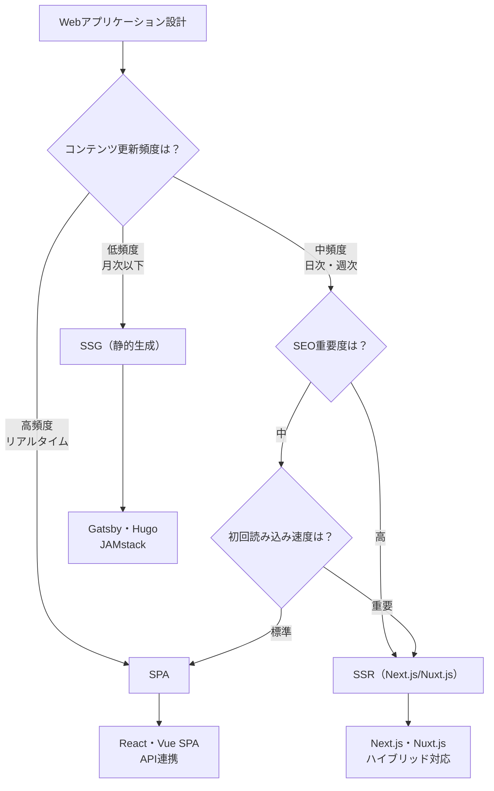

# 現代的なWeb技術

## はじめに

これまでWeb技術の基礎から実践的な活用方法まで学んできました。最後に、これからのWeb開発で重要になる**現代的な技術トレンド**について理解していきましょう。

**SPA**（Single Page Application）、**SSR**（Server-Side Rendering）、**JAMstack**、**ヘッドレスCMS**など、現代のWeb開発では様々な新しいアプローチが登場しています。これらの技術を理解することで、Webディレクターとして適切な技術選択を行い、長期的な戦略を策定できるようになります。

この章では、現代的Web技術の概念、それぞれのメリット・デメリット、そして実際のプロジェクトでの選択基準について学び、技術トレンドを踏まえた意思決定能力を身につけます。

## 📊 この章の重要度：🟢 応用

**Webディレクターにとって：**
- 現代的Web技術選択の判断基準
- フロントエンドフレームワーク導入の意思決定
- 技術トレンドを踏まえた長期戦略

## あなたがこれを知ると変わること

**技術選択の判断変化：**
- 開発者：「SPAにしましょうか？」
- あなた（修得前）：「よくわからないので、お任せします」
- あなた（修得後）：「**SEO重要度**と**初回読み込み速度**要件を考慮して、**Next.js のSSR**で実装し、**静的生成**も活用しましょう」

**フレームワーク選択の戦略化：**
- 以前：「流行りのReactで」
- 今後：「**チームスキル**、**プロジェクト規模**、**保守性**を総合評価して、**Vue.js + Nuxt.js**が最適です。**学習コスト**と**開発効率**のバランスが良好です」

**CMS選択の高度化：**
- 開発者：「WordPressでよろしいですか？」
- あなた（修得前）：「はい、お願いします」
- あなた（修得後）：「**ヘッドレスCMS**を検討しましょう。**マルチチャンネル配信**、**開発者体験**、**セキュリティ**を重視して**Contentful + Next.js**の**JAMstack**構成を提案します」

## SPA vs SSR vs 静的サイト：現代的なアーキテクチャ選択

### 従来のMPA（Multi-Page Application）の課題

**従来のWebサイト（MPA）の特徴：**
```
🔄 ページ遷移のたびにサーバーから新しいHTML取得
📄 各ページが独立したHTMLファイル
⚡ 初回読み込みは高速、ページ遷移は遅い
🔍 SEO対応は容易
```

**MPAの課題：**
- ページ遷移時の画面フラッシュ（白い画面）
- ユーザー体験の分断
- 状態管理の複雑化
- モダンなUIパターンの実現困難

### SPA（Single Page Application）

**SPAとは：**
一つのHTMLページ上で、JavaScriptによってコンテンツを動的に変更するアプリケーション。

**SPAの特徴とメリット：**
```
⚡ 高速なページ遷移
- 必要な部分のみ更新
- ネイティブアプリのような体験

🎯 優れたユーザー体験
- スムーズなアニメーション
- 状態の保持（フォーム入力等）
- インタラクティブなUI

💻 効率的な開発
- コンポーネントベース設計
- 状態管理の一元化
- フロントエンド・バックエンド分離
```

**SPAの課題とデメリット：**
```
🐌 初回読み込み時間
- 大きなJavaScriptバンドル
- 白い画面の表示時間

🔍 SEO対策の複雑化
- クローラーのJavaScript実行制限
- メタタグの動的設定が必要

♿ アクセシビリティ課題
- ページ遷移の通知困難
- ブラウザの戻るボタン対応

📱 低スペック端末での性能問題
```

### SSR（Server-Side Rendering）

**SSRとは：**
サーバー側でHTMLを生成してからブラウザに送信し、その後SPAとして動作する技術。

**SSRのメリット：**
```
🚀 初回表示の高速化
- サーバーで完成したHTMLを送信
- JavaScriptなしでも基本表示

🔍 SEO・SNSシェア対応
- クローラーが完全なHTMLを取得
- OGPタグの適切な設定

♿ アクセシビリティ向上
- プログレッシブエンハンスメント
- JavaScript無効環境での基本動作
```

**SSRの課題：**
```
💰 インフラコスト増
- サーバー処理能力が必要
- Node.js等の実行環境

⚙️ 開発・運用の複雑化
- クライアント・サーバー両対応
- ハイドレーション問題

⏱️ サーバー応答時間
- 動的生成による遅延リスク
```

### 静的サイト生成（SSG：Static Site Generation）

**SSGとは：**
ビルド時にHTMLを事前生成し、CDNで高速配信する技術。

**SSGのメリット：**
```
⚡ 最高の表示速度
- CDNからの静的ファイル配信
- サーバー処理なし

💰 低コスト運用
- 静的ホスティングで十分
- スケーラビリティが容易

🔒 高いセキュリティ
- 攻撃面の最小化
- サーバーサイド脆弱性なし

🔍 優秀なSEO
- 完全な静的HTML
- クローラーフレンドリー
```

**SSGの制約：**
```
📝 動的コンテンツ制限
- リアルタイム更新困難
- ユーザー固有コンテンツ制限

🔄 更新プロセス
- コンテンツ変更時の再ビルド必要
- 更新の即座反映困難
```

### アーキテクチャ選択の判断基準

**プロジェクト要件による選択フローチャート：**



**実際のサービス例での技術選択：**

| サービス種別 | 推奨技術 | 選択理由 |
|-------------|----------|----------|
| **企業サイト** | SSG（Gatsby・Next.js） | SEO重視・更新頻度低・高速表示 |
| **ECサイト** | SSR（Next.js Commerce） | SEO・初回表示・動的機能のバランス |
| **管理画面** | SPA（React・Vue） | インタラクティブ・SEO不要 |
| **メディアサイト** | SSR + SSG | SEO・表示速度・大量コンテンツ |
| **SNS・ダッシュボード** | SPA | リアルタイム・ユーザー体験重視 |

## フロントエンドフレームワーク：効率的な開発基盤

### 主要フレームワークの特徴比較

**React（Meta/Facebook開発）：**
```
🎯 特徴
- コンポーネントベース設計
- 豊富なエコシステム
- 企業採用率が高い

✅ メリット
- 求人・学習リソース豊富
- Next.js等の上位フレームワーク充実
- 大規模開発に適している

❌ デメリット
- 学習コストが高い
- 設定・ツール選択が複雑
- 初期セットアップが煩雑
```

**Vue.js（Evan You開発）：**
```
🎯 特徴
- 学習しやすい構文
- 段階的導入可能
- バランスの良い設計

✅ メリット
- 日本語ドキュメント充実
- 既存サイトへの部分的導入可能
- 開発効率が良い

❌ デメリット
- エコシステムがReactより小さい
- 大企業での採用事例が少ない
- 英語圏での情報がやや少ない
```

**Angular（Google開発）：**
```
🎯 特徴
- 企業向け大規模アプリケーション
- TypeScript標準
- フルスタックフレームワーク

✅ メリット
- Google支援で安定性高い
- 大規模チーム開発に適している
- 標準化されたアーキテクチャ

❌ デメリット
- 学習コストが最も高い
- 小規模プロジェクトにはオーバースペック
- 頻繁なメジャーバージョンアップ
```

### フレームワーク選択の判断基準

**プロジェクト要件による選択マトリックス：**

| 要件 | React | Vue.js | Angular | Vanilla JS |
|------|-------|--------|---------|------------|
| **小規模（〜10画面）** | △ | ◎ | ✗ | ◎ |
| **中規模（〜50画面）** | ◎ | ◎ | △ | △ |
| **大規模（50画面〜）** | ◎ | △ | ◎ | ✗ |
| **学習コスト重視** | △ | ◎ | ✗ | ◎ |
| **エコシステム重視** | ◎ | △ | ◎ | ✗ |
| **企業サポート重視** | ◎ | △ | ◎ | ✗ |

**実際の選択プロセス：**
```
技術選択会議での判断要素

1. チーム要件
   ✅ 現在のスキルセット
   ✅ 学習可能期間
   ✅ 採用・拡張計画

2. プロジェクト要件
   ✅ 規模・複雑度
   ✅ 開発期間
   ✅ 保守・運用期間

3. ビジネス要件
   ✅ 予算制約
   ✅ リスク許容度
   ✅ 技術的差別化の必要性

4. 長期戦略
   ✅ 技術ロードマップ
   ✅ 他プロジェクトとの整合性
   ✅ 技術者採用戦略
```

## JAMstack：現代的なWeb開発アーキテクチャ

### JAMstackとは

**JAMstack**は、JavaScript・APIs・Markup を組み合わせた現代的なWeb開発アーキテクチャです。

**JAMstack の構成要素：**
```
🅙 JavaScript
- フロントエンドの動的機能
- React・Vue等のフレームワーク

🅰️ APIs
- 外部サービス・マイクロサービス
- ヘッドレスCMS・認証・決済

🅼 Markup
- 事前生成された静的HTML
- CDNでの高速配信
```

**JAMstack のメリット：**
```
⚡ パフォーマンス
- CDNでの静的ファイル配信
- サーバー処理の最小化

💰 コスト効率
- 静的ホスティングの低コスト
- サーバー管理不要

🔒 セキュリティ
- 攻撃面の最小化
- マイクロサービスでのリスク分散

🎯 開発者体験
- モダンな開発ツール
- デプロイの自動化

📈 スケーラビリティ
- CDNでの自動スケール
- マイクロサービスでの部分最適化
```

### ヘッドレスCMS：コンテンツ管理の新しい形

**従来CMS vs ヘッドレスCMS：**

| 特徴 | 従来CMS（WordPress等） | ヘッドレスCMS（Contentful等） |
|------|----------------------|------------------------------|
| **アーキテクチャ** | モノリシック | API ファースト |
| **フロントエンド** | テーマ・テンプレート | 自由な技術選択 |
| **配信先** | Web限定 | マルチチャンネル |
| **開発者体験** | PHP・テーマ開発 | モダンJS・Git連携 |
| **セキュリティ** | サーバー管理必要 | API経由・CDN配信 |
| **スケーラビリティ** | サーバー依存 | CDN・API自動スケール |

**ヘッドレスCMSのメリット：**
```
🌐 マルチチャンネル配信
- Web・モバイルアプリ・IoTデバイス
- 同一コンテンツの効率的活用

👨‍💻 開発者体験向上
- モダンなフロントエンド技術
- Git・CI/CDとの統合

🔒 セキュリティ向上
- CMSとフロントエンドの分離
- API経由のアクセス制限

📈 パフォーマンス最適化
- 静的サイト生成との組み合わせ
- CDNでの高速配信
```

**主要なヘッドレスCMS：**

| CMS | 特徴 | 適用場面 |
|-----|------|----------|
| **Contentful** | 使いやすいUI・多機能 | 企業サイト・メディア |
| **Strapi** | オープンソース・自由度高 | カスタマイズ重視 |
| **Sanity** | リアルタイム・開発者向け | 複雑なデータ構造 |
| **Ghost** | ブログ特化・高速 | メディア・出版 |

### JAMstack プロジェクトの実装例

**企業サイトのJAMstack構成：**
```
📝 コンテンツ管理: Contentful（ヘッドレスCMS）
⚛️ フロントエンド: Next.js（React SSG）
🚀 ホスティング: Vercel（CDN・自動デプロイ）
🔧 開発フロー: GitHub → 自動ビルド → 配信

📊 期待効果:
- ページ読み込み: 1秒以内
- 運用コスト: 月額1万円以下
- 開発効率: 従来比50%向上
- セキュリティ: 脆弱性リスク大幅減
```

## モジュールバンドラー・ビルドツール：開発効率の向上

### 現代的な開発ワークフロー

**モジュールバンドラー**とは、複数のJavaScriptファイルやCSS・画像等を最適化して統合するツールです。

**主要ツールの特徴：**

| ツール | 特徴 | 適用場面 |
|--------|------|----------|
| **Webpack** | 高機能・カスタマイズ性 | 大規模・複雑なプロジェクト |
| **Vite** | 高速・モダン | 開発効率重視 |
| **Parcel** | 設定不要・簡単 | 小中規模・学習目的 |
| **esbuild** | 超高速ビルド | パフォーマンス重視 |

**ビルドプロセスの最適化効果：**
```
📦 ファイル統合・最小化
- 100個のJSファイル → 1個の最適化ファイル
- 開発時: 読みやすい分割構造
- 本番時: 高速読み込み

🗜️ コード圧縮・最適化
- 不要なコード削除（Tree Shaking）
- 画像・CSS自動圧縮
- ファイルサイズ50-70%削減

🔄 開発体験向上
- ホットリロード（自動更新）
- TypeScript・SCSS自動変換
- エラー検出・修正支援
```

## Webディレクターとしての技術戦略

### 技術選択の意思決定フレームワーク

**技術選択会議での体系的判断：**

```
技術選択評価シート

📊 ビジネス要件（重要度: 40%）
□ プロジェクト予算・期間制約
□ 想定ユーザー数・アクセスパターン
□ SEO・マーケティング要件
□ 競合優位性・差別化要素

👥 チーム要件（重要度: 30%）
□ 現在のスキルセット・経験
□ 学習投資可能期間・コスト
□ 採用・拡張計画
□ 外部パートナー活用可能性

⚙️ 技術要件（重要度: 20%）
□ パフォーマンス・スケーラビリティ
□ セキュリティ・コンプライアンス
□ 保守・運用性
□ 他システムとの連携要件

🔮 長期戦略（重要度: 10%）
□ 技術ロードマップとの整合性
□ 業界トレンド・将来性
□ 投資回収・ROI見込み
□ リスク・代替案の存在
```

### プロジェクト段階別の技術戦略

**MVP（Minimum Viable Product）段階：**
```
🎯 目標: 最速でのユーザー検証
📋 推奨技術:
- フロントエンド: 既存スキル活用（Vue.js等）
- バックエンド: Firebase・Supabase等のBaaS
- ホスティング: Vercel・Netlify等の簡単デプロイ

💡 判断基準:
- 開発速度 > 最適化
- 検証速度 > スケーラビリティ
- 学習コスト最小化
```

**成長期：**
```
🎯 目標: ユーザー増加・機能拡張対応
📋 推奨技術:
- アーキテクチャ: JAMstack・マイクロサービス
- データベース: 要件に応じた適切な選択
- CDN・キャッシュ: パフォーマンス最適化

💡 判断基準:
- スケーラビリティ重視
- 開発効率とパフォーマンスのバランス
- 技術的負債の最小化
```

**スケール期：**
```
🎯 目標: 大規模トラフィック・国際展開対応
📋 推奨技術:
- マルチリージョン対応
- マイクロサービス・API Gateway
- AI・機械学習活用

💡 判断基準:
- エンタープライズレベルの信頼性
- グローバル対応・多言語化
- 高度な分析・最適化機能
```

### 技術投資のROI計算

**技術導入の投資対効果分析：**

```
JAMstack 導入のROI計算例

💰 初期投資
- 技術学習・トレーニング: 300万円
- システム移行・開発: 800万円
- 総初期投資: 1,100万円

💵 年間効果
- インフラコスト削減: 240万円/年
- 開発効率向上（30%）: 360万円/年
- セキュリティリスク軽減: 100万円/年
- 年間効果合計: 700万円/年

📈 ROI計算
- 投資回収期間: 1.6年
- 3年間ROI: 110%（1,100万円投資で2,100万円効果）

🎯 追加効果（定量化困難）
- ブランド価値向上
- 開発者満足度・採用力向上
- 競合優位性確保
```

### 技術トレンド対応戦略

**2025年以降の技術トレンド：**

```
🤖 AI・機械学習統合
- ChatGPT API・画像生成AIの組み込み
- パーソナライゼーション・推薦システム
- 自動コンテンツ生成・翻訳

🌐 Web3・分散技術
- ブロックチェーン・NFT活用
- 分散ストレージ・CDN
- 暗号化・プライバシー強化

📱 モバイル・エッジコンピューティング
- PWA（Progressive Web Apps）進化
- 5G・エッジ最適化
- AR・VR Web統合

♿ アクセシビリティ・包摂性
- 音声インターフェース
- 多言語・多文化対応
- ユニバーサルデザイン
```

**継続的な技術キャッチアップ戦略：**

```
📚 学習・情報収集計画
- 月次: 技術ブログ・カンファレンス動画
- 四半期: 実際のプロトタイプ作成・検証
- 年次: 大規模カンファレンス参加・ネットワーキング

🔬 実験・検証プロセス
- 小規模プロジェクトでの新技術試行
- A/Bテストでの効果測定
- チーム内での知識共有・標準化

📋 技術ロードマップ更新
- 半年ごとの戦略見直し
- 市場動向・競合分析
- チームスキル・採用計画との連携
```

## まとめ

- **現代的Web技術**（SPA・SSR・SSG）は要件に応じた適切な選択が重要で、SEO・パフォーマンス・開発効率を総合的に判断
- **フロントエンドフレームワーク**選択はチームスキル・プロジェクト規模・長期戦略を考慮した体系的アプローチが必要
- **JAMstack・ヘッドレスCMS**により高パフォーマンス・低コスト・高セキュリティな現代的Webサイトを実現
- **技術選択の意思決定**はビジネス要件・チーム要件・技術要件・長期戦略の4軸で評価し、ROI計算で投資対効果を明確化
- **技術トレンド対応**は継続的な学習・実験・検証プロセスで競合優位性を確保
- Webディレクターは**技術の目利き**として、ビジネス価値と技術的実現可能性を両立させる戦略的判断を担う
- **長期的な技術投資**により、組織の技術力向上・採用力強化・競合優位性確保を実現

これで**04_Web実践活用フェーズ**が完了しました。次の**05_Web専門応用フェーズ**では、セキュリティ・パフォーマンス・SEO・アクセシビリティの専門領域を学習し、Webディレクターとして最高レベルの技術判断・品質管理ができるようになります。実践的なWeb技術の活用能力とプロジェクト管理スキルを基盤として、さらに専門性の高い技術領域へと進んでいきます。