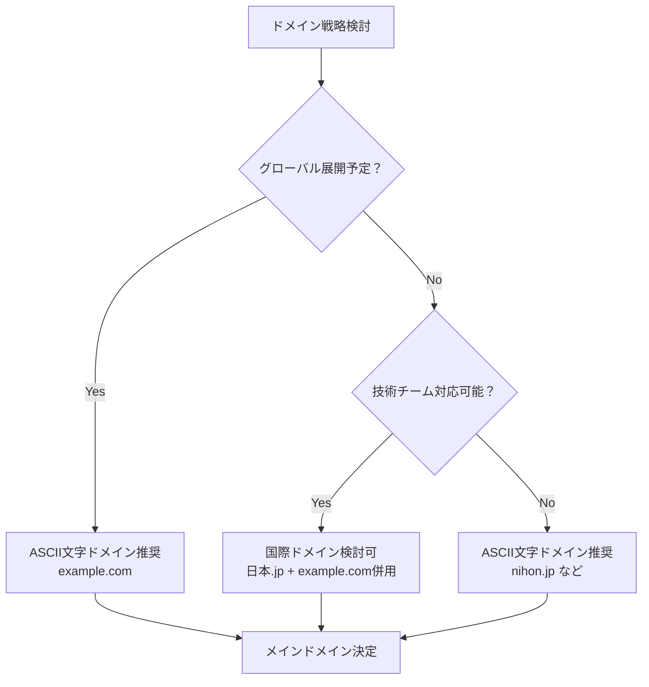
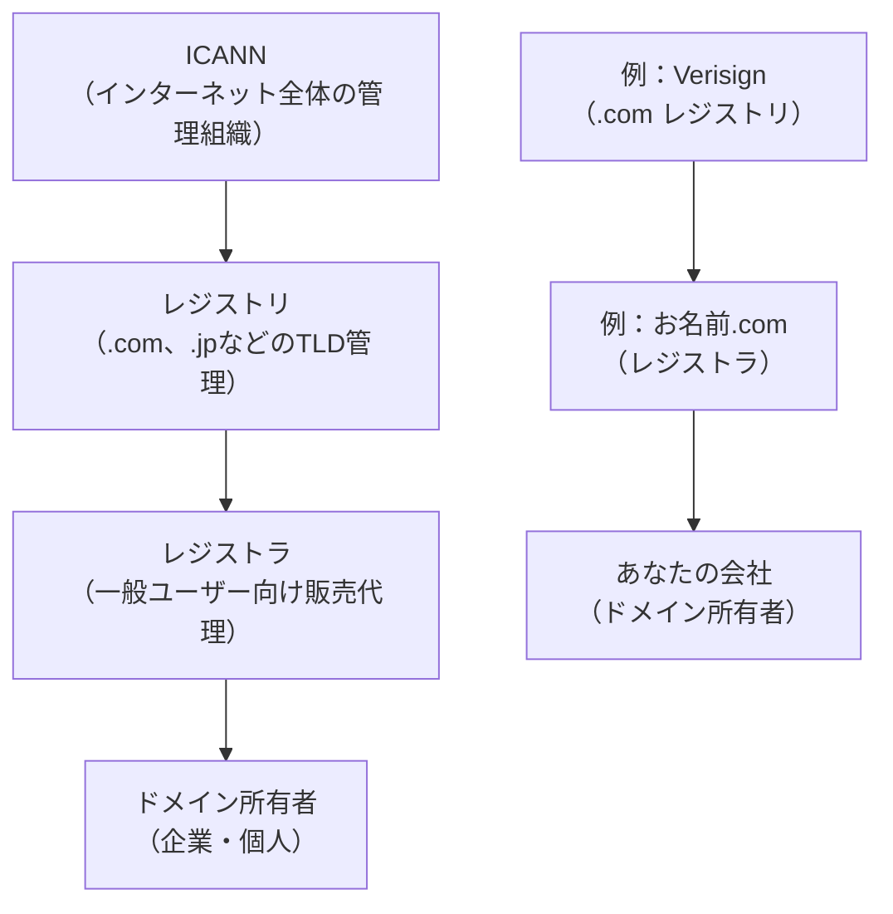
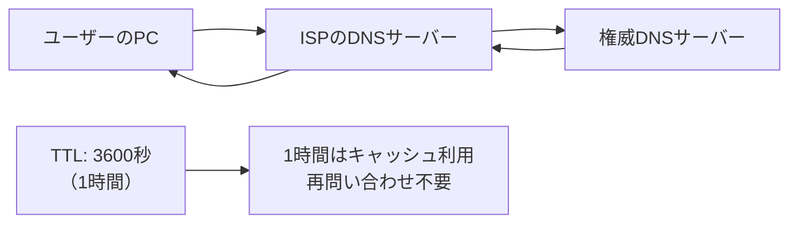
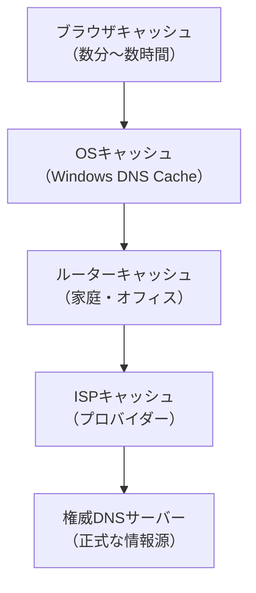
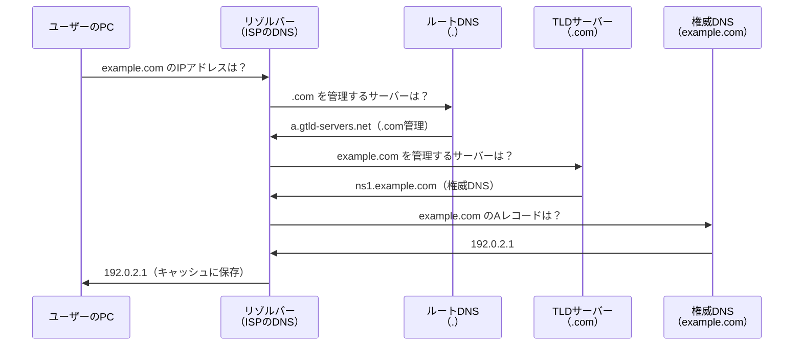
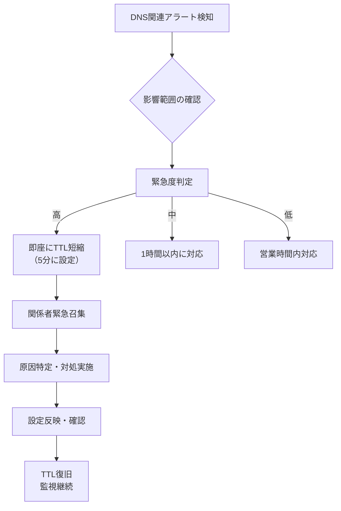

# ドメイン管理とDNS実践設定

## はじめに

Web基礎理解でインターネットとWebの世界について学び、ドメイン名やDNSの基本概念を理解しました。この章では、Webディレクターとして実際にプロジェクトで遭遇するドメイン管理とDNS設定の実践的なスキルを身につけます。

国際ドメインの仕組み、実際のドメイン取得プロセス、DNS設定の詳細、そしてセキュリティやメール配信に必要なTXTレコードの設定まで、業務で直面する具体的な作業を理解していきましょう。

## 📊 この章の重要度：🟢 応用

**Webディレクターにとって：**
- プロジェクト開始時のドメイン・DNS戦略立案に必須
- セキュリティ・メール配信設定の要件定義に直結
- 習得目安：中規模以上のプロジェクト責任者になる前に

## あなたがこれを知ると変わること

**ドメイン選定時の変化：**
- 以前：「.comで取得してください」という曖昧な指示
- 今後：「国際展開を考慮して.com、日本語ドメインは避けてASCII文字で統一します」

**DNS設定時の変化：**
- 開発者：「メール配信のためSPFレコードの設定が必要です」
- あなた（修得前）：「よくわからないので任せます」
- あなた（修得後）：「SPFレコードでspf.example.comを許可し、~allで厳格に設定しましょう」

**サイト障害対応時の変化：**
- 以前：「サイトが見えません」で終わり
- 今後：「Aレコードは正常、TTLが24時間なので変更反映に時間がかかっています」

**セキュリティ要件定義での変化：**
- 以前：「セキュリティ対策をお願いします」
- 今後：「DMARC policyをquarantineに設定し、DMARCレポートでメール送信状況を監視します」

## 国際ドメインとPunycode：グローバル対応の実践

### 国際化ドメイン名（IDN）の仕組み

**国際化ドメイン名**とは、ASCII文字以外（日本語、中国語、アラビア語等）を含むドメイン名のことです。内部的には**Punycode**という形式で処理されます。

**実際の変換例：**
```
表示ドメイン: 日本.jp
実際のドメイン: xn--wgv71a.jp （Punycode形式）

表示ドメイン: コンピューター.com  
実際のドメイン: xn--tckwe.com

表示ドメイン: москва.рф （ロシア語「モスクワ」）
実際のドメイン: xn--80adxhks.xn--p1ai
```

### Webディレクターが知るべき国際ドメインの注意点

**✅ メリット：**
- **ブランド認知向上**：地域密着型サービスでのローカリゼーション効果
- **SEO効果**：一部検索エンジンで地域性が評価される場合
- **ユーザビリティ**：現地語ユーザーにとって直感的

**⚠️ デメリット・リスク：**
- **技術的複雑性**：古いシステムでの互換性問題
- **入力困難性**：URL直接入力が困難（特にモバイル）
- **フィッシング攻撃**：類似文字による偽装攻撃の可能性
- **コスト増**：多言語ドメインの管理コスト

**実践的な選択基準：**


### 実際のプロジェクトでの判断例

**ケース1：地域密着型ECサイト**
```
要件：日本国内のみ、高齢者ユーザー多数
判断：日本語ドメイン + 英語ドメイン併用
理由：ブランド認知効果を優先、技術的負担を受容
```

**ケース2：SaaSプラットフォーム**
```
要件：グローバル展開、API提供
判断：ASCII文字ドメインのみ
理由：技術的互換性とグローバル対応を優先
```

## ドメイン取得の実践プロセス

### レジストラとは

**レジストラ**とは、ドメイン名の登録・管理を行う認定事業者のことです。世界中のドメイン名は階層的に管理されており、レジストラはその管理システムの重要な一部を担っています。

**ドメイン管理の階層構造：**


**レジストラの主な役割：**
- **ドメイン登録受付**：ユーザーからの登録申請を処理
- **DNS管理機能提供**：基本的なDNSレコード設定機能
- **更新・期限管理**：ドメインの年次更新と期限切れ防止
- **移管手続き**：他レジストラとの間でのドメイン移管
- **技術サポート**：設定に関する問い合わせ対応

**Webディレクターが理解すべきポイント：**
- レジストラは「ドメインの販売代理店」のような存在
- 同じドメインでも、レジストラによって価格・サービス内容が異なる
- 一度登録後も、レジストラ間での移管（引っ越し）が可能
- レジストラ選択は長期的な運用コストと利便性に大きく影響

### レジストラ選択の実践基準

**主要レジストラの特徴比較：**

| レジストラ | 価格 | 管理画面 | DNS機能 | サポート | 推奨用途 |
|-----------|------|----------|---------|----------|----------|
| **お名前.com** | 安価 | 複雑 | 基本 | 日本語 | 個人・小規模 |
| **ムームードメイン** | 安価 | 簡単 | 基本 | 日本語 | 初心者・小規模 |
| **Amazon Route 53** | 高価 | 高機能 | 高機能 | 英語 | 企業・高可用性 |
| **Cloudflare** | 中価 | 高機能 | 高機能 | 英語 | セキュリティ重視 |
| **Google Domains** | 中価 | 簡単 | 高機能 | 多言語 | バランス重視 |

### 実際の取得プロセス

**Phase 1: ドメイン戦略策定**
```
1. ブランド名確定
2. TLD（トップレベルドメイン）選択
   - .com: 汎用性最高、グローバル向け
   - .jp: 日本企業の信頼性向上
   - .co.jp: 日本法人限定、高信頼性
   - .org: 非営利・教育機関
3. 複数候補準備（商標確認含む）
```

**Phase 2: 取得・設定作業**
```powershell
# ドメイン検索例（お名前.comでの確認）
# Webインターフェースでの検索手順：

1. https://www.onamae.com/ にアクセス
2. 希望ドメイン名を入力
3. 複数TLDで一括検索実行
4. 取得可能性・価格を確認
5. whois情報の匿名化設定
6. 自動更新設定の有効化
```

**Phase 3: DNS初期設定**
```
1. ネームサーバー指定
   - レジストラ提供DNS利用
   - 外部DNS（Cloudflare等）利用
2. 基本レコード設定
   - Aレコード: Webサーバーへの指定
   - CNAMEレコード: www サブドメイン設定
   - MXレコード: メールサーバー設定
```

### ドメイン管理のベストプラクティス

**セキュリティ設定：**
```
✅ 実施必須項目：
- 2段階認証の有効化
- whois情報の適切な匿名化
- ドメインロック（移管防止）の設定
- 自動更新の有効化（期限切れ防止）

⚠️ 注意すべき設定：
- 管理者メールアドレスの定期確認
- 支払い方法の冗長化（クレカ + 銀行振込等）
- 緊急時連絡先の社内共有
```

## DNS詳細設定とレコード管理

### DNSレコードとは

**DNSレコード**とは、ドメイン名に関する情報を格納するデータのことです。「このドメイン名はどのIPアドレスに対応するか」「メールサーバーはどこか」といった情報を、種類別に整理して保存しています。

**DNSレコードの基本構造：**
```
example.com.    300    IN    A    192.0.2.1
    ↑           ↑      ↑     ↑        ↑
  ドメイン名    TTL   クラス  種類   データ（値）
```

### 主要なDNSレコードタイプ

**Aレコード（Address Record）**
- **役割**：ドメイン名をIPv4アドレス（32ビット）に対応させる最も基本的なレコード
- **例**：`example.com` → `192.0.2.1`
- **用途**：Webサイトのメインドメイン設定

**CNAMEレコード（Canonical Name Record）**
- **役割**：ドメイン名を別のドメイン名に対応させる（エイリアス・別名の設定）
- **例**：`www.example.com` → `example.com`
- **用途**：サブドメインの設定、CDNやクラウドサービスへの接続
- **制限**：ルートドメイン（example.com）には設定不可

**MXレコード（Mail Exchange Record）**
- **役割**：そのドメイン宛のメールを受信するメールサーバーを指定
- **例**：`example.com` のメールを `mail.example.com` で受信
- **特徴**：優先度（数字が小さいほど優先）を設定可能

**TXTレコード（Text Record）**
- **役割**：任意のテキスト情報を格納（主に認証や設定に使用）
- **例**：SPF設定、DKIM設定、ドメイン所有権確認
- **用途**：セキュリティ設定、各種サービスとの連携

**NSレコード（Name Server Record）**
- **役割**：そのドメインの権威DNSサーバー（正式な情報を持つサーバー）を指定
- **例**：`example.com` の情報は `ns1.example.com` が管理
- **重要性**：このレコードが間違っていると、すべてのDNS解決が失敗

### TTL（Time To Live）とは

**TTL**とは、DNSレコードの「賞味期限」のような概念です。DNSサーバーやブラウザは、一度取得したDNS情報を一定時間キャッシュ（保存）しますが、TTLはその保存期間を秒単位で指定します。

**TTLの仕組み：**


**TTLの影響：**
- **短いTTL（300秒等）**：変更が素早く反映、DNSサーバーへの負荷増
- **長いTTL（86400秒等）**：変更反映に時間がかかる、DNSサーバーへの負荷減

**実践的なTTL設定：**
```
通常運用時：3600秒（1時間）
→ 変更予定のある設定：300秒（5分）
→ 変更実行後、安定化確認：3600秒に戻す
```

### DNSキャッシュとは

**DNSキャッシュ**とは、一度調べたドメイン名とIPアドレスの対応関係を一時的に保存する仕組みです。毎回DNSサーバーに問い合わせることなく、保存された情報を再利用できるため、Webサイトの表示速度向上と通信量削減を実現します。

**キャッシュの階層構造：**


**キャッシュのメリット：**
- **高速化**：再問い合わせが不要なため、サイト表示が速い
- **負荷軽減**：DNSサーバーへのアクセス回数を削減
- **耐障害性**：一時的にDNSサーバーが停止してもアクセス可能

**キャッシュによる注意点：**
- **変更反映の遅延**：DNS設定を変更してもすぐには反映されない
- **不整合の可能性**：各階層でキャッシュ時間が異なるため、一時的に異なる結果が返る場合

**実務でのキャッシュ管理：**
```
DNS設定変更時の手順：
1. 事前にTTLを短縮（例：300秒）
2. TTL分の時間待機（古いキャッシュの期限切れ）
3. 設定変更実行
4. 複数の場所・ツールで確認
5. 安定化後、TTLを元に戻す
```

### 主要DNSレコードタイプの実践活用

**Aレコード：IPv4アドレス指定**
```
# 基本設定例
example.com.     300    IN    A    192.0.2.1
www.example.com. 300    IN    A    192.0.2.1

# 負荷分散での複数IP指定
example.com.     300    IN    A    192.0.2.1
example.com.     300    IN    A    192.0.2.2
example.com.     300    IN    A    192.0.2.3
```

**CNAMEレコード：エイリアス設定**
```
# サブドメイン設定
www.example.com.     300    IN    CNAME    example.com.
blog.example.com.    300    IN    CNAME    external-blog.provider.com.
cdn.example.com.     300    IN    CNAME    d1234.cloudfront.net.

# 注意：CNAMEはルートドメイン（example.com）には設定不可
```

**MXレコード：メールサーバー指定**
```
# 基本メール設定
example.com.    300    IN    MX    10    mail.example.com.

# Google Workspace設定例
example.com.    300    IN    MX    1     aspmx.l.google.com.
example.com.    300    IN    MX    5     alt1.aspmx.l.google.com.
example.com.    300    IN    MX    5     alt2.aspmx.l.google.com.
example.com.    300    IN    MX    10    alt3.aspmx.l.google.com.
example.com.    300    IN    MX    10    alt4.aspmx.l.google.com.
```

### TTL（Time To Live）の戦略的設定

**TTL設定の実践ガイド：**

| 用途 | 推奨TTL | 理由 |
|------|---------|------|
| **本番Webサイト** | 3600秒（1時間） | 変更頻度と応答速度のバランス |
| **開発・ステージング** | 300秒（5分） | 頻繁な変更に対応 |
| **CDN・静的リソース** | 86400秒（24時間） | キャッシュ効率を最大化 |
| **メールサーバー（MX）** | 3600秒（1時間） | 配信安定性を優先 |
| **緊急時切り替え前** | 300秒（5分） | 迅速な切り替えに備える |

**実際の運用例：**
```
# 通常運用時
example.com.    3600    IN    A    192.0.2.1

# サーバー移行1週間前（TTL短縮）
example.com.    300     IN    A    192.0.2.1

# 移行実行時（新IPに変更）
example.com.    300     IN    A    203.0.113.1

# 移行完了後（TTL復旧）
example.com.    3600    IN    A    203.0.113.1
```

## TXTレコードの実践活用

### SPF：メール送信者認証

**SPF（Sender Policy Framework）**は、ドメインからのメール送信を許可するサーバーを指定する仕組みです。

**基本的なSPFレコード設定：**
```
# 自社メールサーバーのみ許可
example.com.    300    IN    TXT    "v=spf1 ip4:192.0.2.1 -all"

# Google Workspace利用時
example.com.    300    IN    TXT    "v=spf1 include:_spf.google.com -all"

# 複数サービス利用時
example.com.    300    IN    TXT    "v=spf1 include:_spf.google.com include:amazonses.com ip4:192.0.2.1 -all"

# 段階的導入（監視モード）
example.com.    300    IN    TXT    "v=spf1 include:_spf.google.com ~all"
```

**SPF設定の実践ポイント：**
- **-all**：厳格モード（推奨）- 指定以外からの送信を完全拒否
- **~all**：ソフト失敗 - 指定以外を怪しいとマークするが配信
- **?all**：中立 - SPF検証を行わない
- **+all**：全許可 - セキュリティ効果なし（非推奨）

### DKIM：デジタル署名による認証

**DKIM（DomainKeys Identified Mail）**は、メール内容の改ざん検知と送信者認証を行います。

**DKIM設定プロセス：**
```
1. メールサービスでDKIM有効化
2. 公開鍵の取得
3. DNSのTXTレコードに公開鍵登録

# Google WorkspaceのDKIM設定例
google._domainkey.example.com.  300  IN  TXT  "v=DKIM1; k=rsa; p=MIGfMA0GCSqGSIb3DQEBAQUAA4GNADCBiQKBgQC..."

# Amazon SESのDKIM設定例
7v7vs6w47njt4aq22hagdofspbbm434a._domainkey.example.com.  300  IN  TXT  "v=DKIM1; k=rsa; p=MIGfMA0..."
```

### DMARC：包括的メール認証ポリシー

**DMARC（Domain-based Message Authentication, Reporting, and Conformance）**は、SPFとDKIMの結果に基づく認証ポリシーを定義します。

**段階的DMARC導入戦略：**
```
# Phase 1: 監視モード（レポート収集のみ）
_dmarc.example.com.  300  IN  TXT  "v=DMARC1; p=none; rua=mailto:dmarc@example.com; ruf=mailto:dmarc@example.com; sp=none; ri=86400"

# Phase 2: 隔離モード（迷惑メールフォルダに配置）
_dmarc.example.com.  300  IN  TXT  "v=DMARC1; p=quarantine; rua=mailto:dmarc@example.com; pct=10"

# Phase 3: 拒否モード（完全拒否）
_dmarc.example.com.  300  IN  TXT  "v=DMARC1; p=reject; rua=mailto:dmarc@example.com; ruf=mailto:dmarc@example.com"
```

**DMARCパラメータ解説：**
- **p=policy**：認証失敗時の動作（none/quarantine/reject）
- **rua=**：集約レポート送信先メールアドレス
- **ruf=**：詳細レポート送信先メールアドレス
- **pct=**：ポリシー適用率（段階導入用）

### その他の重要TXTレコード

**ドメイン所有権確認（各種サービス）：**
```
# Google Search Console
example.com.  300  IN  TXT  "google-site-verification=abc123..."

# Microsoft 365
example.com.  300  IN  TXT  "MS=ms12345678"

# Facebook Domain Verification
example.com.  300  IN  TXT  "facebook-domain-verification=abc123..."
```

## 名前解決プロセスの基本理解

### 名前解決の流れ

**DNS名前解決プロセス：**



### 処理の流れ（ステップ解説）

**Step 1: 初期問い合わせ**
- ユーザーがブラウザに「example.com」と入力
- PCがISPのDNSサーバー（リゾルバー）に問い合わせ

**Step 2: ルートDNSへの問い合わせ**
- リゾルバーがルートDNSサーバーに「.comを管理するサーバーは？」と問い合わせ
- ルートDNSが「.com」を管理するTLDサーバーの情報を返答

**Step 3: TLDサーバーへの問い合わせ**
- リゾルバーが.com TLDサーバーに「example.comを管理するサーバーは？」と問い合わせ
- TLDサーバーがexample.comの権威DNSサーバー情報を返答

**Step 4: 権威DNSへの問い合わせ**
- リゾルバーがexample.comの権威DNSサーバーに「example.comのIPアドレスは？」と問い合わせ
- 権威DNSサーバーが正確なIPアドレス（192.0.2.1）を返答

**Step 5: 結果の返却とキャッシュ**
- リゾルバーがユーザーのPCにIPアドレスを返答
- 各段階でTTLに基づいてキャッシュに保存され、次回の問い合わせを高速化

**Webディレクターとしての理解ポイント：**
- DNS設定変更は多段階のキャッシュを経て反映されるため、即座には反映されない
- 問題が発生した場合、どの段階で失敗しているかの特定が重要
- キャッシュの存在により、変更後しばらくは新旧の情報が混在する可能性がある

## よくあるトラブルと解決法

### DNS設定に関するトラブルシューティング

**トラブル1: 「ドメインが設定したのにサイトが表示されない」**

```powershell
# 診断手順
1. nslookup example.com
   → 結果が返らない場合：DNS設定未完了または反映待ち
   → 間違ったIPが返る場合：Aレコード設定ミス

2. ping example.com
   → タイムアウトの場合：サーバー側の問題
   → 応答あり：HTTP設定の問題

3. TTL確認とキャッシュクリア
   nslookup -debug example.com
   → TTLを確認し、反映時間を計算
```

**解決アクション：**
```
- DNS設定の再確認（Aレコード、CNAME）
- TTL時間経過の待機（最大設定TTL分）
- ローカルDNSキャッシュクリア：ipconfig /flushdns
- 別DNSサーバーでの確認（8.8.8.8等）
```

**トラブル2: 「メールが送信できない・届かない」**

```powershell
# 診断手順
1. MXレコード確認
   nslookup -type=MX example.com

2. SPFレコード確認
   nslookup -type=TXT example.com

3. メール配信テスト
   # mail-tester.com 等の外部サービスで検証
```

**解決アクション：**
```
- MXレコードの設定確認
- SPF、DKIM、DMARCの段階的設定
- メールサーバーのログ確認依頼
- 主要メールプロバイダーでの配信テスト
```

**トラブル3: 「DNSの変更が反映されない」**

**原因別対処法：**
```
原因1: TTL時間が長すぎる
対処: 変更前にTTLを短く設定（300秒等）

原因2: キャッシュの影響
対処: 複数のDNSサーバーで確認
- 8.8.8.8（Google）
- 1.1.1.1（Cloudflare）
- 権威DNSへの直接問い合わせ

原因3: 設定ミス
対処: DNSレコードの構文確認
- 末尾ドット（.）の有無
- レコードタイプの正確性
- 優先度の設定（MXレコード）
```

### セキュリティ関連のトラブル

**トラブル: 「DMARCポリシーでメールが拒否される」**

**段階的解決アプローチ：**
```
Phase 1: 現状把握
- DMARC レポートの分析
- 正当な送信元と不正な送信元の識別

Phase 2: 設定調整
- SPF レコードの見直し（include 追加）
- DKIM 設定の確認
- DMARC ポリシーの緩和（reject → quarantine）

Phase 3: 段階的強化
- pct パラメータで段階適用
- 正当送信の確認後、厳格化
```

## Webディレクターの実践活用

### プロジェクト開始時のドメイン戦略策定

**ドメイン要件定義チェックリスト：**

```markdown
□ ブランドドメイン戦略
  - メインドメイン選定（.com/.jp/.co.jp）
  - サブドメイン構成（www/api/cdn/admin）
  - 国際展開時の多言語ドメイン戦略

□ 技術要件
  - SSL証明書の種類（DV/OV/EV）
  - CDN利用有無とサブドメイン設計
  - APIエンドポイントのドメイン設計

□ セキュリティ要件
  - メール認証（SPF/DKIM/DMARC）設定
  - ドメイン管理の権限・責任者設定
  - 更新・移管時の手順策定

□ 運用要件
  - DNS管理ツール選定
  - 障害時エスカレーション手順
  - ドメイン更新の責任者・予算確保
```

### 開発チームとの効果的な協働

**DNS関連の要件伝達例：**

```
❌ 曖昧な指示：
「ドメインの設定をお願いします」

✅ 具体的な指示：
「example.com の Aレコードを 192.0.2.1 に設定、
www.example.com は example.com への CNAME、
TTLは通常1時間、サーバー切り替え時は5分に短縮してください」
```

**メール配信要件の伝達例：**

```
❌ 曖昧な指示：
「メールが送信できるように設定してください」

✅ 具体的な指示：
「Google Workspace利用のため、
MXレコードをGoogle指定値に設定、
SPFに _spf.google.com を include、
DKIMとDMARCは段階導入（最初はp=none）で
レポート送信先を admin@example.com に設定してください」
```

### 運用フェーズでの監視・管理

**定期確認項目：**

```
月次確認：
□ ドメイン更新期限（期限6ヶ月前にアラート）
□ SSL証明書期限（期限3ヶ月前にアラート）
□ DMARC レポートの分析
□ DNS設定の変更履歴確認

四半期確認：
□ 未使用サブドメインの整理
□ DNS TTL設定の最適化検討
□ セキュリティポリシー見直し

年次確認：
□ ドメインポートフォリオ全体見直し
□ レジストラ・DNS プロバイダー評価
□ 災害時復旧手順の見直し・訓練
```

### セキュリティインシデント対応

**DNS関連インシデントの初動対応：**



**対応例：DNS ハイジャック検知時**
```
1. 即座に権威DNSサーバーでレコード確認
2. 不正な変更を検出した場合、レジストラに緊急連絡  
3. ドメインロック強化、認証情報変更
4. 影響を受けたサービスの復旧作業
5. インシデント報告書作成、再発防止策検討
```

## 実際のプロジェクト例：ECサイトのドメイン設計

### 要件定義から運用まで

**プロジェクト概要：**
- 中規模ECサイトの構築
- 日本国内向け、将来的な海外展開予定
- Google Workspace利用、マーケティングメール配信あり

**ドメイン設計：**
```
メインサイト: shop.example.com
- Aレコード: ロードバランサーのIP
- TTL: 3600秒

静的リソース: cdn.example.com  
- CNAME: CloudFront distribution
- TTL: 86400秒

API: api.example.com
- Aレコード: APIサーバーのIP
- TTL: 1800秒

管理画面: admin.example.com
- Aレコード: 管理サーバーのIP（IP制限あり）
- TTL: 3600秒

ステージング: staging.example.com
- Aレコード: ステージングサーバーのIP
- TTL: 300秒
```

**メール設定：**
```
MXレコード:
example.com.  300  IN  MX  1   aspmx.l.google.com.
example.com.  300  IN  MX  5   alt1.aspmx.l.google.com.
example.com.  300  IN  MX  5   alt2.aspmx.l.google.com.

SPFレコード:
example.com.  300  IN  TXT  "v=spf1 include:_spf.google.com include:amazonses.com -all"

DMARCレコード（段階導入）:
_dmarc.example.com.  300  IN  TXT  "v=DMARC1; p=quarantine; rua=mailto:dmarc@example.com; pct=25"
```

**運用での成果：**
- メール配信到達率：98%以上（DMARC導入効果）
- DNS関連障害：0件（適切なTTL設定）
- セキュリティインシデント：0件（適切な認証設定）

## まとめ

### この章で学んだこと

1. **国際ドメインとPunycode**
   - 日本語ドメインの仕組みと実用性判断
   - グローバル展開時のドメイン戦略
   - セキュリティリスクと対策

2. **ドメイン取得と管理**
   - レジストラ選択の実践基準
   - セキュリティを考慮した管理手法
   - ドメインポートフォリオの戦略的管理

3. **DNS詳細設定**
   - 各レコードタイプの実践的活用
   - TTL最適化によるパフォーマンス向上
   - 負荷分散・冗長化の実装

4. **TXTレコードとセキュリティ**
   - SPF/DKIM/DMARC の段階的導入
   - メール配信セキュリティの向上
   - 各種サービス連携のドメイン認証

5. **トラブルシューティング**
   - 系統的な問題特定手法
   - DNS関連障害の迅速な復旧
   - セキュリティインシデント対応

### 次のステップ

この章で学んだドメイン・DNS管理の実践スキルは、Webプロジェクトのインフラ基盤を支える重要な知識です。次の専門応用フェーズでは、これらの知識を活用してより高度なセキュリティやパフォーマンス最適化に取り組んでいきます。

### 🎯 実践のヒント

**日常業務での活用：**
- **プロジェクト開始時**：ドメイン戦略の策定と要件定義
- **開発フェーズ**：環境别サブドメイン設計と DNS 設定
- **運用フェーズ**：監視・保守の計画策定と実施
- **障害対応**：迅速な問題特定と復旧作業の指揮

**スキル向上のために：**
- 実際のDNS設定作業の見学・参加
- DMARC レポートの定期的な分析
- DNS関連の最新セキュリティ情報の継続学習
- 他社事例・ベストプラクティスの調査研究

**開発チームとの協働強化：**
- DNS設定変更時の適切な要件伝達
- セキュリティポリシーの技術的実装支援
- 障害時の初動対応と適切なエスカレーション
- 定期的なドメイン・DNS設定の見直し提案

## 📚 用語集

### ドメイン・DNS基本用語

| 用語 | 読み方 | 定義 |
|------|-------|------|
| **IDN** | アイディーエヌ | 国際化ドメイン名（Internationalized Domain Name） |
| **Punycode** | ピューニーコード | 国際化ドメイン名をASCII文字で表現する仕組み |
| **レジストラ** | - | ドメイン名の登録・管理を行う認定事業者 |
| **権威DNS** | けんいディーエヌエス | ドメインの正式な情報を持つDNSサーバー |
| **TTL** | ティーティーエル | Time To Live（DNSキャッシュの有効時間） |

### DNSレコード用語

| 用語 | 読み方 | 定義 |
|------|-------|------|
| **Aレコード** | エーレコード | ドメイン名とIPv4アドレスの対応を定義 |
| **CNAMEレコード** | シーネームレコード | ドメイン名の別名（エイリアス）を定義 |
| **MXレコード** | エムエックスレコード | メールサーバーの指定を定義 |
| **TXTレコード** | テキストレコード | 任意のテキスト情報を格納（認証・設定用） |
| **NSレコード** | エヌエスレコード | ドメインの権威DNSサーバーを指定 |

### メール認証用語

| 用語 | 読み方 | 定義 |
|------|-------|------|
| **SPF** | エスピーエフ | Sender Policy Framework（送信者認証の仕組み） |
| **DKIM** | ディーキム | DomainKeys Identified Mail（デジタル署名認証） |
| **DMARC** | ディーマーク | Domain-based Message Authentication（包括認証ポリシー） |
| **-all** | ハードフェイル | SPFで指定以外の送信者を完全拒否 |
| **~all** | ソフトフェイル | SPFで指定以外の送信者を怪しいとマーク |

### 実務・運用用語

| 用語 | 読み方 | 定義 |
|------|-------|------|
| **ドメインロック** | - | 不正な移管を防ぐドメイン保護機能 |
| **whois代理公開** | フーイズだいりこうかい | ドメイン所有者情報の匿名化サービス |
| **ゾーンファイル** | - | DNSサーバーに設定するレコード情報の集合 |
| **DNS プロパゲーション** | ディーエヌエスプロパゲーション | DNS設定変更がインターネット全体に反映される過程 |
| **DNS ハイジャック** | ディーエヌエスハイジャック | DNS設定を不正に変更する攻撃 |

**用語活用のポイント：**
- インフラチーム・セキュリティチームとの技術的対話で必須
- ドメイン・DNS関連の要件定義や仕様書作成時に正確な用語使用
- 障害対応時の迅速で正確な状況共有
- ベンダー選定時の技術的評価項目の理解