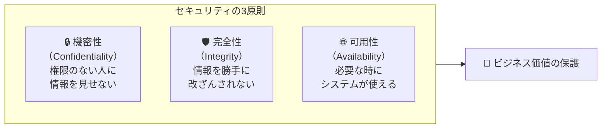
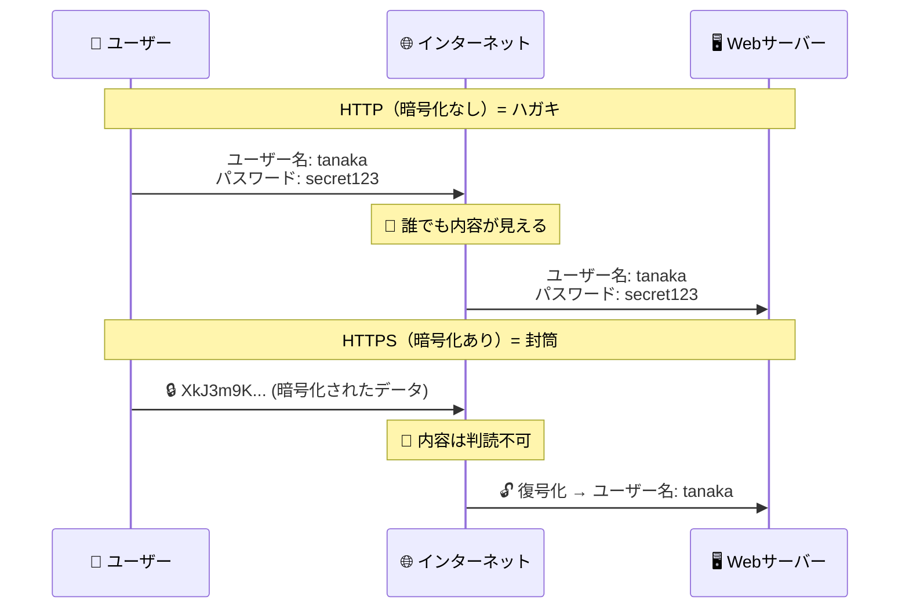
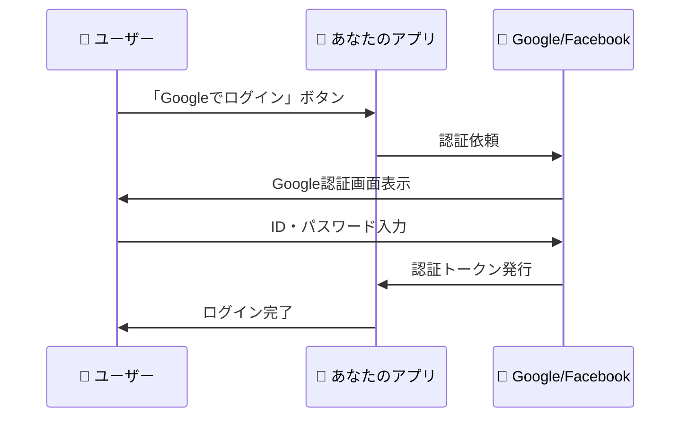
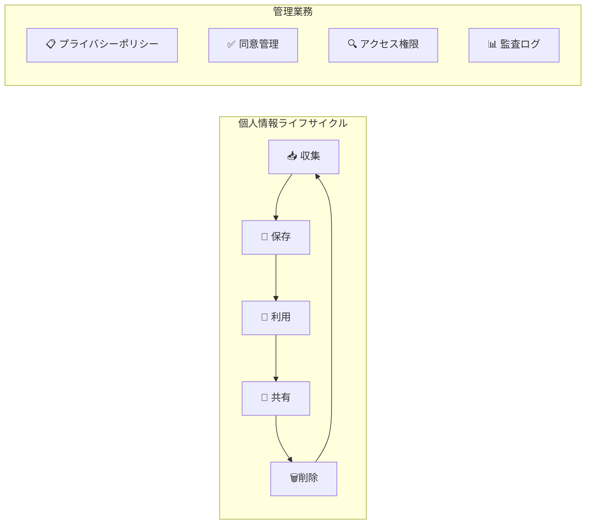
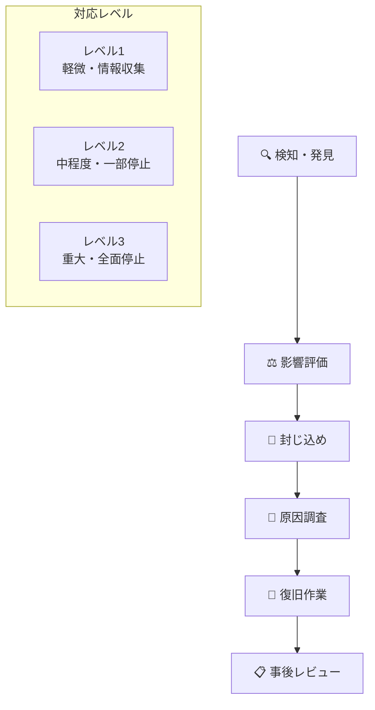

# Webセキュリティの基礎

## はじめに

これまでのフェーズで学んだWeb技術の基礎知識を活用して、今度は「安全なWebサービス」を構築・管理するための知識を深めていきます。現代のWebディレクターには、単にWebサイトを作るだけでなく、ユーザーの情報を守り、企業のリスクを管理する役割が求められています。

セキュリティと聞くと「難しい技術的な話」と感じるかもしれませんが、実際には**リスクを理解し、適切な対策を計画する**管理業務が中心です。この章では、Webディレクターが押さえておくべきセキュリティの基本概念、法的コンプライアンス、そして開発チームやセキュリティ専門家との効果的な協働方法について学びます。

## 📊 この章の重要度：🟢 応用

**Webディレクターにとって：**
- セキュリティ要件の定義・監査・管理業務に必須
- 個人情報保護法・GDPR等のコンプライアンス対応
- セキュリティインシデント発生時の対応力向上
- 習得目安：大規模プロジェクトや個人情報取扱業務の責任者となる前に

## あなたがこれを知ると変わること

**セキュリティ要件定義の会話での変化：**
- 開発者：「セキュリティはどの程度まで対応しますか？」
- あなた（修得前）：「一般的なレベルで...」
- あなた（修得後）：「**個人情報はAES-256暗号化**、**ユーザー認証はOAuth 2.0 + JWT**、**OWASP Top 10対策実施**、**年2回のペネトレーションテスト**を要件とします」

**インシデント対応時の変化：**
- チーム：「ログイン機能に問題が発生しました」
- あなた（修得前）：「急いで直してください」
- あなた（修得後）：「**影響範囲の特定**・**一時停止判断**・**ユーザー通知**・**原因調査**・**再発防止策**の順で対応しましょう。**CSIRT手順**に従って進めます」

**コンプライアンス対応の戦略化：**
- 以前：「個人情報保護法に対応してください」
- 今後：「**データ分類**・**保持期間設定**・**アクセス権限管理**・**監査ログ**・**削除要求対応**の体制を構築し、**GDPR準拠**も視野に入れましょう」

**経営層への提案力向上：**
- 以前：「セキュリティ強化が必要です」  
- 今後：「**サイバー攻撃によるビジネス停止リスク**を考慮し、**年間予算の3%をセキュリティ投資**に充当することで、**99.9%の可用性確保**と**顧客信頼度向上**を実現できます」

## Webセキュリティの全体像：多層防御の考え方

### セキュリティの基本原則：CIA

Webセキュリティは、**CIA**と呼ばれる3つの基本原則を守ることから始まります：



**Webディレクターの管理視点：**
- **機密性**：顧客情報・営業秘密・個人データの保護
- **完全性**：商品情報・価格・ユーザーデータの正確性確保
- **可用性**：サービス停止による機会損失・信頼失墜の防止

### 多層防御システム：城塞都市モデル

現代的なWebセキュリティは、**多層防御**（Defense in Depth）の考え方に基づいています：

```
🏰 Webセキュリティの多層防御
├─ 🌐 ネットワーク層
│   ├─ ファイアウォール・DDoS対策
│   └─ VPN・ネットワーク分離
├─ 🖥️ サーバー層  
│   ├─ OS・ミドルウェアのアップデート
│   └─ アクセス制御・監視システム
├─ 🔐 アプリケーション層
│   ├─ 認証・認可システム
│   ├─ 入力値検証・SQLインジェクション対策
│   └─ HTTPS・データ暗号化
├─ 📊 データ層
│   ├─ データベース暗号化
│   ├─ バックアップ・復旧システム
│   └─ アクセスログ・監査証跡
└─ 👤 ユーザー層
    ├─ セキュリティ教育・意識向上
    └─ パスワード管理・多要素認証
```

**Webディレクターの責任範囲：**
- **要件定義**：各層で必要なセキュリティレベルの設定
- **予算管理**：セキュリティ投資の優先順位付け・ROI評価
- **体制構築**：インシデント対応・定期監査の仕組み作り
- **コンプライアンス**：法的要件・業界標準への適合確保

## HTTPS・SSL/TLS：暗号化通信の基本

### HTTPSの役割：郵便配達の比喩

**HTTP**（暗号化なし）は**ハガキ**、**HTTPS**（暗号化あり）は**封筒に入れた手紙**のようなものです：



**SSL/TLS証明書の管理：**
- **証明書の役割**：「このサイトは本物です」という身分証明書
- **有効期限管理**：通常1年、自動更新の仕組み構築が重要
- **証明書の種類選択**：DV・OV・EV証明書の使い分け

### Webディレクターのセキュリティ管理業務

**証明書管理の実務：**
```
✅ 証明書ライフサイクル管理
├─ 導入計画：証明書種類の選定・予算確保
├─ 運用監視：有効期限・更新スケジュール管理
├─ インシデント対応：証明書エラー時の緊急対応
└─ コスト最適化：Let's Encrypt等の無料証明書活用検討
```

## ユーザー認証・認可システム：身元確認と権限管理

### 認証と認可の違い：空港セキュリティの比喩

**認証**（Authentication）と**認可**（Authorization）は、空港のセキュリティシステムで例えると分かりやすくなります：

```
🛂 空港セキュリティ = Webシステムのアクセス制御
├─ 🆔 認証（Authentication）
│   └─ 「あなたは誰ですか？」→ パスポートチェック
└─ 🎫 認可（Authorization）  
    └─ 「どこに行けますか？」→ 搭乗券・ビザチェック
```

**Webサービスでの実装例：**
```
👤 ユーザーのログインプロセス
├─ 🔐 認証フェーズ
│   ├─ ID・パスワード入力
│   ├─ 多要素認証（SMS・アプリ認証）
│   └─ 本人確認完了
└─ 🎯 認可フェーズ
    ├─ ユーザー権限の確認
    ├─ アクセス可能な機能・データの特定
    └─ 適切な画面・メニューを表示
```

### 現代的な認証システム：OAuth 2.0とJWT

**OAuth 2.0**：「他のサービスのアカウントでログイン」する仕組み



**JWT**（JSON Web Token）：認証情報を安全に保存・伝送する技術

**Webディレクターの管理ポイント：**
- **ユーザー体験の向上**：ソーシャルログインによる利便性向上
- **セキュリティレベルの選択**：一般ユーザー・管理者・決済情報の権限分け
- **コスト効率**：独自認証システム開発vs既存サービス活用の判断

## 個人情報保護・GDPR・コンプライアンス対応

### データ保護法制の世界的動向

**GDPR**（EU一般データ保護規則）は、世界の個人情報保護の基準となっています：

```
🌍 世界のデータ保護法制
├─ 🇪🇺 GDPR（EU一般データ保護規則）
│   ├─ 全世界のビジネスに影響
│   ├─ 制裁金：売上の4%または2,000万ユーロ
│   └─ 「忘れられる権利」「データポータビリティ」
├─ 🇯🇵 個人情報保護法（日本）
│   ├─ 2022年4月改正施行
│   └─ 個人関連情報・Cookie規制強化
└─ 🇺🇸 CCPA（カリフォルニア州消費者プライバシー法）
    └─ アメリカ向けサービスでは必須対応
```

### データ管理の実務体制

**個人情報のライフサイクル管理：**



**Webディレクターの管理業務：**
```
✅ コンプライアンス管理体制
├─ 法的要件の整理・更新
├─ プライバシーポリシー・利用規約の策定
├─ データ収集・利用・削除プロセスの設計
├─ ユーザー同意管理システムの構築
├─ 定期監査・リスクアセスメントの実施
└─ インシデント発生時の報告・対応体制
```

## セキュリティリスク管理：OWASP Top 10

### Webアプリケーションの代表的脅威

**OWASP Top 10**：Webアプリケーションの最も危険な脆弱性トップ10

```
🚨 OWASP Top 10（2021年版）- Webディレクター管理視点
├─ 01. アクセス制御の不備
│   └─ 管理：権限設計・定期レビュー・アクセスログ監視
├─ 02. 暗号化の不備  
│   └─ 管理：暗号化方針策定・証明書管理・データ分類
├─ 03. インジェクション攻撃
│   └─ 管理：開発標準・コードレビュー・セキュリティテスト
├─ 04. 安全でない設計
│   └─ 管理：セキュリティ要件定義・脅威モデリング・設計レビュー
└─ 05. セキュリティ設定ミス
    └─ 管理：設定標準・変更管理・定期監査・自動チェック
```

**Webディレクターの予防的管理：**
- **開発プロセス**：セキュリティ要件の組み込み・レビュー体制
- **運用プロセス**：定期脆弱性診断・アップデート管理
- **緊急対応**：インシデント対応計画・復旧手順の整備

## セキュリティインシデント対応：CSIRT運営

### インシデント対応の基本フロー

**CSIRT**（Computer Security Incident Response Team）：セキュリティインシデント対応チーム



**Webディレクターの役割：**
```
✅ インシデント対応管理
├─ 対応体制の構築・定期訓練の実施
├─ ステークホルダー連絡・報告体制の整備
├─ メディア対応・顧客コミュニケーション計画
├─ 業務継続・代替手段の準備・検証
└─ 事後改善・再発防止策の策定・実行
```

### インシデントコミュニケーション管理

**ステークホルダー別コミュニケーション戦略：**
- **経営層**：ビジネス影響・対応コスト・中長期戦略
- **ユーザー**：透明性・迅速な情報提供・具体的対策
- **監督官庁**：法的要件・報告義務・改善計画
- **開発チーム**：技術的調査・復旧作業・原因分析

## AI・自動化時代のセキュリティ戦略

### AI技術とセキュリティの両面性

**AI活用によるセキュリティ向上：**
```
🤖 AIセキュリティ活用
├─ 🔍 異常検知・行動分析
│   └─ 不正ログイン・異常アクセスの自動検出
├─ 🛡️ 自動脅威対応
│   └─ リアルタイム攻撃ブロック・自動隔離
├─ 📊 リスク分析・予測
│   └─ 脆弱性評価・攻撃予測・リスクスコアリング
└─ 🔐 認証強化
    └─ 生体認証・行動認証・リスクベース認証
```

**AI時代の新たなセキュリティリスク：**
- **AIモデルへの攻撃**：敵対的サンプル・モデル汚染
- **プライバシー侵害リスク**：過度な個人情報収集・プロファイリング
- **自動化による誤判定**：正常ユーザーのブロック・業務影響

**Webディレクターの戦略的判断：**
- **ROI評価**：AI導入コストvs効果測定・継続改善
- **ユーザー体験**：セキュリティ強化と利便性のバランス
- **倫理・法的配慮**：AI判断の透明性・説明責任・人間による監督

## まとめ：セキュリティ管理者としてのWebディレクター

### 本章で習得したセキュリティ管理能力

**技術的理解から管理業務への展開：**
- ✅ **HTTPS・認証システム**の仕組み理解 → **要件定義・運用計画**策定能力
- ✅ **個人情報保護・GDPR**の要件理解 → **コンプライアンス体制**構築能力  
- ✅ **OWASP Top 10・脆弱性**の理解 → **リスク管理・予防策**立案能力
- ✅ **インシデント対応**の流れ理解 → **危機管理・復旧戦略**実行能力

### セキュリティ投資の戦略的判断

**経営層・ステークホルダーとの対話力：**
```
💼 セキュリティROI・投資判断
├─ リスク定量化：攻撃被害額・復旧コスト・信頼失墜の試算
├─ 投資優先順位：脅威レベル・影響度・対策コストの評価
├─ 継続改善：定期監査・脆弱性診断・セキュリティ教育の体系化
└─ 競争優位性：セキュリティ品質による顧客信頼・差別化戦略
```

### 次のステップ：パフォーマンス・SEO・アクセシビリティ

このセキュリティ基礎を習得したことで、次章の「パフォーマンス・SEO・アクセシビリティ」では、**セキュリティを前提とした**品質管理・最適化戦略を学ぶことができます。

**継続的な専門性向上：**
- 最新のセキュリティ脅威・対策技術の情報収集
- セキュリティコミュニティ・勉強会への参加
- 実プロジェクトでのセキュリティ要件定義・監査実践
- チーム・組織でのセキュリティ文化醸成・教育推進

Webディレクターとして、技術的品質と事業成果を両立する**セキュリティ管理者**の役割を発揮していきましょう。