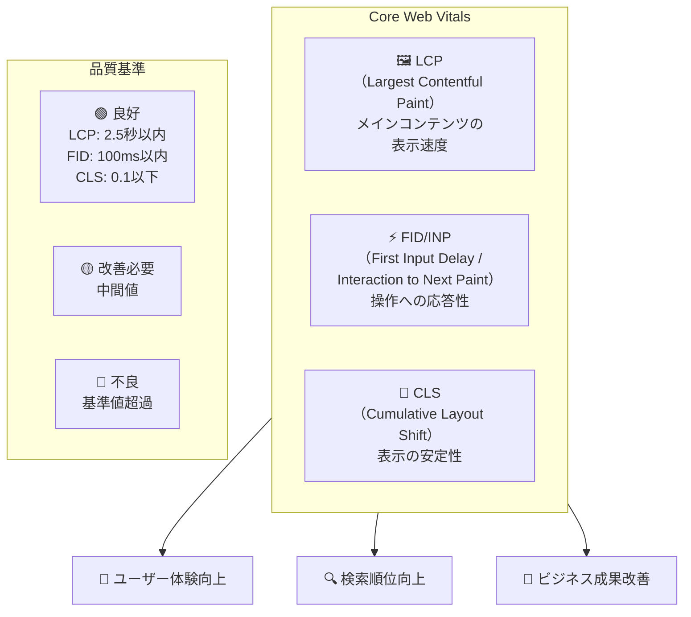
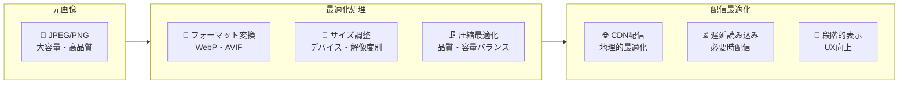
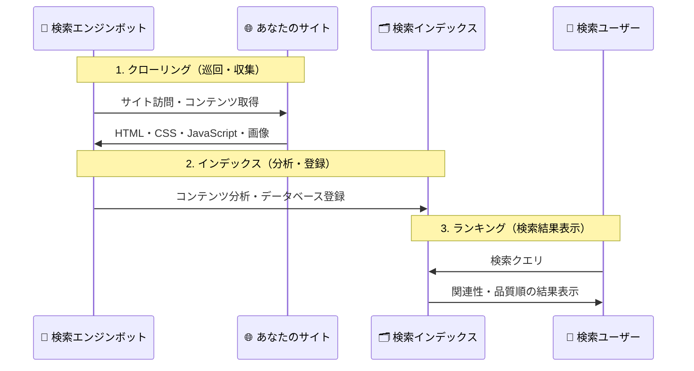
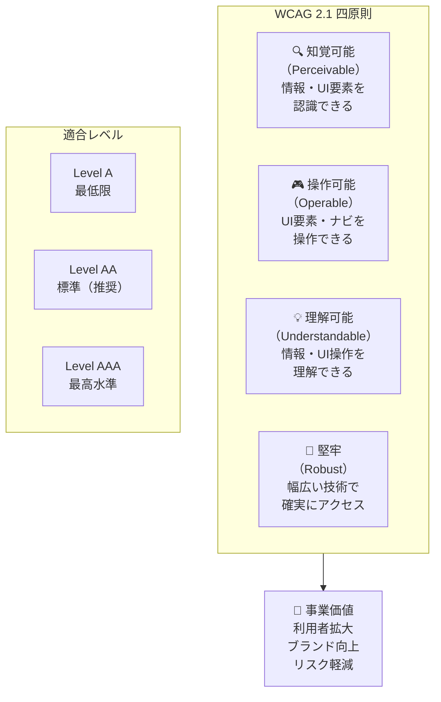
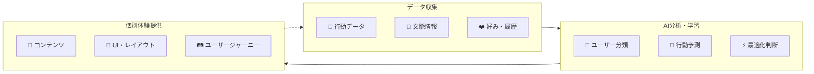
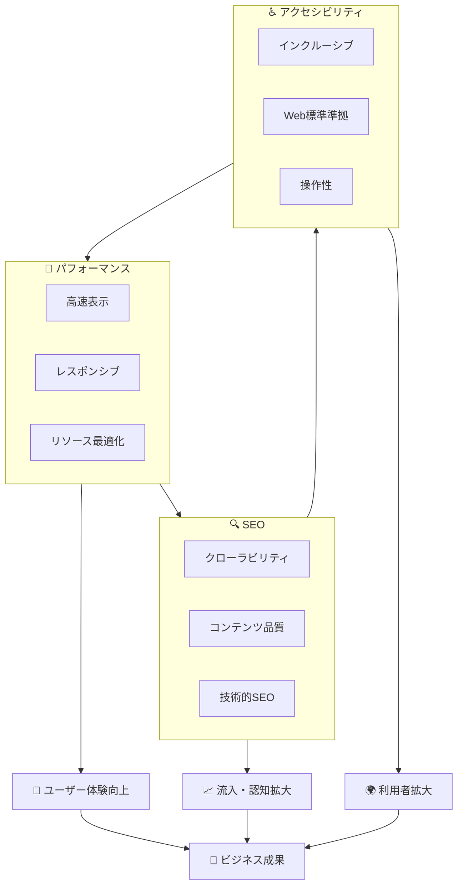

# パフォーマンス・SEO・アクセシビリティ

## はじめに

前章でWebセキュリティの基礎を学び、安全なWebサービスを構築・管理する知識を身につけました。今度は、**ユーザー体験の質**と**ビジネス成果に直結する品質管理**について深く掘り下げていきます。

現代のWebディレクターは、「見た目が良い」「機能が動く」だけでなく、**高速で快適**（パフォーマンス）、**検索で見つけやすい**（SEO）、**誰もが使いやすい**（アクセシビリティ）という3つの品質軸で、Webサービスの価値を最大化する責任があります。

この章では、Core Web Vitals等の具体的指標を活用したパフォーマンス管理、テクニカルSEOの要件定義、WCAG準拠のアクセシビリティ監査、そしてAI時代の最新Web最適化手法について学びます。これらは全て、**ユーザー満足度向上**と**事業成果拡大**に直結する戦略的な管理業務です。

## 📊 この章の重要度：🟢 応用

**Webディレクターにとって：**
- ユーザー体験品質の定量的管理・継続改善
- 検索エンジン最適化による集客力向上・ROI改善
- アクセシビリティ対応による利用者拡大・法的リスク軽減
- AI・機械学習を活用した次世代Web最適化戦略
- 習得目安：UX・マーケティング成果に責任を持つプロジェクトの前に

## あなたがこれを知ると変わること

**パフォーマンス改善の戦略的会話：**
- エンジニア：「サイトの表示が遅いです」
- あなた（修得前）：「速くしてください」
- あなた（修得後）：「**Core Web VitalsでLCP 1.5秒以下**を目標とし、**画像WebP変換**・**CDN配信**・**Critical CSS最適化**で段階的に改善しましょう。**コンバージョン率3%向上**が見込めます」

**SEO要件の具体的定義：**
- マーケティング：「検索順位を上げたいです」
- あなた（修得前）：「SEO対策をお願いします」
- あなた（修得後）：「**テクニカルSEO監査**を実施し、**構造化データ**・**Core Web Vitals**・**モバイルファースト**・**E-A-T強化**で検索エドライン適合度を向上させましょう。**半年で流入20%向上**を目指します」

**アクセシビリティの事業価値提示：**
- 経営層：「アクセシビリティ対応は必要ですか？」
- あなた（修得前）：「法的要求だから...」
- あなた（修得後）：「**全人口の15%がアクセシビリティ課題を抱えており**、**WCAG準拠により潜在顧客350万人拡大**が可能です。**ブランド価値向上**と**リスク軽減**の両面で投資効果があります」

**AI時代の最適化戦略：**
- 開発チーム：「次世代技術で何を優先しますか？」
- あなた（修得前）：「流行りの技術を...」
- あなた（修得後）：「**AIパーソナライゼーション**で**CVR15%向上**、**画像自動最適化**で**運用コスト30%削減**、**予測分析**で**UX改善サイクル**を半自動化しましょう」

## Core Web Vitals：Googleが定めるユーザー体験指標

### Core Web Vitalsの3つの指標

**Core Web Vitals**は、Googleが「優れたユーザー体験」として定義した3つの定量指標です：



**Webディレクターの管理視点：**
- **LCP最適化**：ファーストビューの画像・動画・フォント読み込み戦略
- **FID/INP改善**：JavaScript処理の最適化・インタラクション設計
- **CLS安定化**：レイアウト崩れ防止・広告・動的コンテンツ管理

### パフォーマンス測定・監視体制

**継続的品質管理の仕組み：**

```
📊 パフォーマンス管理サイクル
├─ 🔍 測定・監視
│   ├─ Google PageSpeed Insights（月次）
│   ├─ Lighthouse CI（デプロイ毎）
│   ├─ Real User Monitoring（リアルタイム）
│   └─ WebPageTest（詳細分析）
├─ 📈 分析・課題特定
│   ├─ ボトルネック箇所の識別
│   ├─ ユーザー行動・デバイス別分析
│   └─ 競合比較・ベンチマーキング
├─ 🎯 改善計画・実行
│   ├─ 優先順位付け・ROI評価
│   ├─ 開発リソース・スケジュール調整
│   └─ A/Bテスト・段階的展開
└─ ✅ 効果検証・継続改善
    ├─ KPI改善度・ビジネス影響測定
    └─ 次期改善テーマ・戦略更新
```

## 画像・CDN・キャッシュ最適化戦略

### 画像最適化：次世代フォーマットとレスポンシブ配信

**画像最適化の戦略的アプローチ：**



**Webディレクターの管理ポイント：**
- **コンテンツ戦略**：画像品質基準・ファイルサイズ上限の設定
- **運用効率**：自動最適化・一括変換・品質管理の仕組み構築
- **コスト管理**：CDN・ストレージ・処理コストの監視・最適化

### CDN・エッジコンピューティング活用

**グローバル配信最適化：**

```
🌍 CDN・エッジ最適化戦略
├─ 🚀 配信速度向上
│   ├─ 地理的最適配置（東京・大阪・海外）
│   ├─ キャッシュ戦略（静的・動的コンテンツ）
│   └─ HTTP/3・QUIC対応
├─ 🛡️ セキュリティ強化
│   ├─ DDoS攻撃対策・WAF機能
│   └─ SSL証明書・セキュリティヘッダー
├─ 📊 パフォーマンス分析
│   ├─ アクセス解析・レスポンス時間監視
│   └─ エラー率・可用性管理
└─ 💰 コスト最適化
    ├─ トラフィック・帯域幅管理
    └─ キャッシュ効率・ヒット率向上
```

## テクニカルSEO：検索エンジン最適化の技術的側面

### 検索エンジンの理解促進：クローリング・インデックス・ランキング

**SEOの3段階プロセス：**



**Webディレクターの管理業務：**
- **クローリング最適化**：サイトマップ・robots.txt・内部リンク構造
- **インデックス品質**：メタデータ・構造化データ・コンテンツ品質
- **ランキング向上**：E-A-T・ユーザー体験・技術的品質の総合管理

### 構造化データとリッチスニペット

**検索結果での差別化戦略：**

```
🎯 構造化データ活用
├─ 📄 記事・ブログ
│   ├─ Article Schema：公開日・著者・評価
│   └─ リッチスニペット：星評価・画像・要約表示
├─ 🛍️ 商品・サービス
│   ├─ Product Schema：価格・在庫・レビュー
│   └─ 検索結果：商品画像・価格・評価表示
├─ 🏢 企業・店舗
│   ├─ Organization Schema：住所・営業時間・連絡先
│   └─ ナレッジパネル：地図・口コミ・基本情報
└─ 📅 イベント・キャンペーン
    ├─ Event Schema：日時・場所・チケット情報
    └─ 検索結果：カレンダー・参加ボタン表示
```

**実装管理のポイント：**
- **データ品質**：正確性・一貫性・更新性の管理
- **表示効果測定**：クリック率・インプレッション・順位変動の分析
- **継続最適化**：Google Search Console・構造化データテストツール活用

## WCAG準拠アクセシビリティ：インクルーシブデザインの実践

### アクセシビリティの4原則：POUR

**WCAG 2.1**が定める4つの基本原則：



**Webディレクターの管理視点：**
- **Level AA準拠**：法的要求・企業責任の観点から推奨レベル
- **段階的改善**：既存サイト・新規開発での優先順位付け
- **ROI評価**：利用者拡大・ブランド価値向上・リスク軽減の定量化

### インクルーシブデザインの実践管理

**多様なユーザーニーズへの対応：**

```
👥 アクセシビリティ対象者・ニーズ
├─ 👁️ 視覚障害
│   ├─ 全盲：スクリーンリーダー・音声対応
│   └─ 弱視：拡大表示・コントラスト・色覚対応
├─ 👂 聴覚障害
│   ├─ 字幕・手話動画・視覚的フィードバック
│   └─ 音声依存機能の代替手段提供
├─ 🖐️ 運動機能障害
│   ├─ キーボード操作・音声入力対応
│   └─ クリック領域拡大・操作時間調整
├─ 🧠 認知・学習障害
│   ├─ シンプルな表現・明確なナビゲーション
│   └─ エラーメッセージ・ヘルプ機能充実
└─ 👴 高齢者・一時的制約
    ├─ 大きな文字・分かりやすいUI
    └─ 怪我・疲労・環境制約への配慮
```

**継続的アクセシビリティ管理：**
- **監査・テスト**：自動チェックツール・専門家監査・ユーザーテスト
- **教育・意識向上**：開発チーム・デザイナー・コンテンツ制作者の研修
- **品質保証**：開発プロセス・レビュー体制へのアクセシビリティ組み込み

## AI時代のWeb最適化（2025年版）

### AIパーソナライゼーション：個別最適化の実現

**機械学習によるユーザー体験向上：**



**Webディレクターの戦略判断：**
- **プライバシー配慮**：個人情報保護・透明性・ユーザー制御権の確保
- **効果測定**：パーソナライゼーションによるKPI改善・ROI評価
- **倫理的配慮**：フィルターバブル・差別的扱いの回避・公平性確保

### 画像・コンテンツ自動最適化

**AI活用による運用効率化：**

```
🤖 AI自動最適化機能
├─ 🖼️ 画像処理自動化
│   ├─ フォーマット変換・圧縮最適化
│   ├─ alt属性・キャプション自動生成
│   └─ 顔認識・重要領域の自動検出
├─ 📝 コンテンツ生成・改善
│   ├─ メタディスクリプション・タイトル最適化
│   ├─ A/Bテスト用バリエーション生成
│   └─ 多言語翻訳・ローカライゼーション
├─ 🎯 レイアウト・UI最適化
│   ├─ デバイス・ユーザー別レイアウト調整
│   ├─ 色・フォント・配置の自動最適化
│   └─ コンバージョン向上要素の識別・改善
└─ 📊 予測分析・改善提案
    ├─ パフォーマンス問題の事前予測
    ├─ ユーザー行動分析・離脱防止
    └─ SEO・アクセシビリティ改善提案
```

### 次世代Web技術：WebAssembly・PWA・Web3

**技術トレンドの戦略的活用：**

```
🚀 次世代Web技術活用戦略
├─ ⚡ WebAssembly（WASM）
│   ├─ 高性能計算・リアルタイム処理
│   ├─ 画像・動画処理・ゲーム・CAD
│   └─ ネイティブアプリレベルの体験
├─ 📱 PWA（Progressive Web Apps）
│   ├─ アプリストア不要・軽量インストール
│   ├─ オフライン動作・プッシュ通知
│   └─ モバイル・デスクトップ統一体験
├─ 🌐 Web3・ブロックチェーン
│   ├─ 分散型ID・ウォレット連携
│   ├─ NFT・暗号資産統合
│   └─ データ主権・プライバシー強化
└─ 🥽 メタバース・VR/AR Web
    ├─ WebXR・3D体験・バーチャル空間
    ├─ 没入型EC・教育・エンターテイメント
    └─ デジタルツイン・リモートコラボレーション
```

**導入判断の戦略フレームワーク：**
- **事業適合性**：ターゲット・業界・ユースケースとの親和性
- **技術成熟度**：開発コスト・安定性・人材確保の現実性
- **競争優位性**：差別化効果・市場ポジショニング・投資回収期間

## 統合的品質管理：パフォーマンス・SEO・アクセシビリティの相乗効果

### 3つの品質軸の相互関係

**品質向上の好循環サイクル：**



**相乗効果の具体例：**
- **高速表示**（パフォーマンス）→ **検索順位向上**（SEO）→ **操作性改善**（アクセシビリティ）
- **構造化データ**（SEO）→ **スクリーンリーダー対応**（アクセシビリティ）→ **画像最適化**（パフォーマンス）
- **キーボード操作**（アクセシビリティ）→ **ユーザビリティ向上**（パフォーマンス）→ **滞在時間改善**（SEO）

### 品質KPI・ROI管理体制

**統合的品質管理ダッシュボード：**

```
📊 品質管理KPI体系
├─ 🚀 パフォーマンス指標
│   ├─ Core Web Vitals：LCP・FID・CLS
│   ├─ ビジネス影響：CVR・直帰率・滞在時間
│   └─ 技術指標：ページサイズ・リクエスト数・キャッシュ効率
├─ 🔍 SEO指標
│   ├─ 検索順位・クリック率・インプレッション
│   ├─ オーガニック流入・コンバージョン・収益
│   └─ インデックス数・構造化データ・エラー率
├─ ♿ アクセシビリティ指標
│   ├─ WCAG適合レベル・自動テスト結果
│   ├─ 利用者拡大・満足度・エラー報告
│   └─ 支援技術対応・キーボード操作・色覚対応
└─ 💰 ROI・コスト効率
    ├─ 改善投資・運用コスト・効果測定
    ├─ 競合比較・ベンチマーキング・市場ポジション
    └─ リスク軽減・ブランド価値・長期効果
```

## まとめ：品質管理エキスパートとしてのWebディレクター

### 本章で習得した品質管理能力

**定量的品質管理から戦略立案までの体系化：**
- ✅ **Core Web Vitals・パフォーマンス**測定 → **UX改善・事業成果向上**戦略
- ✅ **テクニカルSEO・構造化データ**理解 → **検索流入・認知拡大**施策立案
- ✅ **WCAGアクセシビリティ**監査 → **インクルーシブ・利用者拡大**戦略構築
- ✅ **AI最適化・次世代技術**活用 → **競争優位・イノベーション**推進力

### 品質とビジネス成果の直結管理

**ROI・事業価値を示すWebディレクター：**
```
💼 品質改善のビジネス価値提示
├─ パフォーマンス向上：表示速度1秒改善 → CVR 7%向上 → 年間売上XX億円増
├─ SEO最適化：検索順位向上 → オーガニック流入30%増 → 広告費XX万円削減
├─ アクセシビリティ：利用者拡大15% → 潜在顧客XXX万人 → ブランド価値向上
└─ AI活用：自動化による運用効率50%向上 → 人件費XX万円削減 → 戦略業務集中
```

### 継続的品質向上の組織化

**品質文化の醸成・チーム育成：**
- **品質基準・ガイドライン**の策定・浸透・定期更新
- **測定・監視・改善**サイクルの自動化・効率化
- **開発プロセス・レビュー**への品質要件組み込み
- **ステークホルダー**への品質価値・ROI継続的説明

### Web専門応用フェーズの完了：技術的リーダーシップの確立

**セキュリティ基礎**（前章）と**品質管理**（本章）の習得により、現代的なWebプロジェクトで**技術的リーダーシップ**を発揮できるWebディレクターとなりました。

**次のステップ：実践・応用・継続成長**
- 実プロジェクトでの品質管理・改善施策の実践適用
- 業界コミュニティ・技術カンファレンスでの情報収集・ネットワーキング
- AI・次世代技術の継続的学習・戦略的活用の検討
- チーム・組織での品質文化醸成・後進育成・知識共有の推進

**総合的Webディレクター能力の発揮**：技術理解・品質管理・戦略立案・チームリーダーシップを統合し、**ユーザー価値創造**と**事業成果拡大**を両立する専門家として活躍していきましょう。