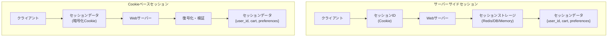
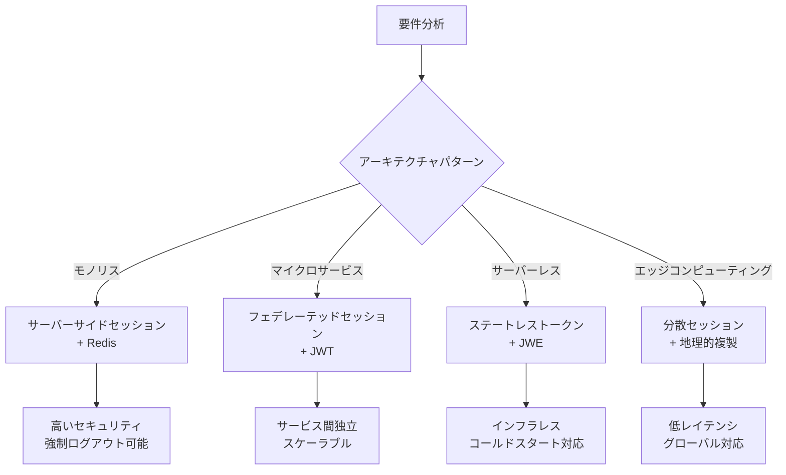

# 高度なセッション管理技術

## はじめに

現代のWebアプリケーションにおいて、**セッション管理**は最も重要なアーキテクチャ設計の一つです。ユーザーの認証状態、ショッピングカート、一時的なデータを効率的かつ安全に管理する必要があります。

セッション管理の実装方式は、アプリケーションのスケーラビリティ、パフォーマンス、セキュリティに直結します。不適切な設計は、システム全体のボトルネックとなり、セキュリティ脆弱性の原因にもなります。

この章では、**サーバーサイドセッション**と**Cookieベースセッション**の技術的詳細、各種ストレージ方式の特性、セッション設計のベストプラクティスを学びます。

## 📊 この章の重要度：🔴 応用（専門技術）

**システムアーキテクトにとって：**
- スケーラビリティを考慮したセッション設計
- パフォーマンス最適化とセキュリティのバランス
- 分散システムでのセッション管理戦略

## セッション管理方式の技術的比較

**アーキテクチャ設計時の判断変化：**
- 従来：「フレームワークのデフォルト設定で」
- 高度：「ユーザー数、データ量、セキュリティ要件、インフラコストを総合的に評価し、最適なセッション戦略を選択」

## サーバーサイドセッション vs. Cookieベースセッション

### 基本的なアーキテクチャの違い



### サーバーサイドセッションの詳細実装

**特徴：**
- Cookieには最小限のセッションID（通常128-256bit）のみ保存
- 実際のセッションデータはサーバー側のストレージに保存
- **ステートフル**なアーキテクチャ

**実装例（Flask + Redis）：**
```python
import redis
import uuid
import json
from datetime import datetime, timedelta

class ServerSideSessionManager:
    def __init__(self, redis_client):
        self.redis = redis_client
        self.session_prefix = "session:"
        self.default_ttl = 3600  # 1時間
    
    def create_session(self, user_id, data=None):
        """新規セッション作成"""
        session_id = str(uuid.uuid4())  # 暗号論的に安全なID
        session_data = {
            'user_id': user_id,
            'created_at': datetime.utcnow().isoformat(),
            'last_accessed': datetime.utcnow().isoformat(),
            'data': data or {}
        }
        
        # Redisに保存（TTL付き）
        self.redis.setex(
            f"{self.session_prefix}{session_id}",
            self.default_ttl,
            json.dumps(session_data)
        )
        
        return session_id
    
    def get_session(self, session_id):
        """セッション取得と最終アクセス時刻更新"""
        session_data = self.redis.get(f"{self.session_prefix}{session_id}")
        
        if session_data:
            data = json.loads(session_data)
            # 最終アクセス時刻を更新
            data['last_accessed'] = datetime.utcnow().isoformat()
            
            # TTLを延長（スライディングセッション）
            self.redis.setex(
                f"{self.session_prefix}{session_id}",
                self.default_ttl,
                json.dumps(data)
            )
            
            return data
        
        return None
    
    def update_session(self, session_id, update_data):
        """セッションデータ更新"""
        session_data = self.get_session(session_id)
        if session_data:
            session_data['data'].update(update_data)
            session_data['last_accessed'] = datetime.utcnow().isoformat()
            
            self.redis.setex(
                f"{self.session_prefix}{session_id}",
                self.default_ttl,
                json.dumps(session_data)
            )
            
            return True
        return False
    
    def destroy_session(self, session_id):
        """セッション削除"""
        return self.redis.delete(f"{self.session_prefix}{session_id}")
```

**メリット：**
- **セキュリティが高い**：機密データはクライアント側に存在しない
- **データサイズ制限なし**：Cookieの4KB制限に影響されない
- **サーバー側で完全制御**：強制ログアウト、セッション無効化が可能
- **監査ログ対応**：アクセス履歴の詳細記録が可能

**デメリット：**
- **サーバー負荷**：セッションストレージの管理コストが発生
- **スケーラビリティの課題**：複数サーバー間での状態共有が必要
- **インフラ複雑性**：Redis等の外部ストレージが必要

### Cookieベースセッションの詳細実装

**特徴：**
- セッションデータ自体を暗号化してCookieに保存
- サーバーは**ステートレス**：セッション用ストレージが不要
- JWTやItsDangerousライブラリを使用

**実装例（Flask + ItsDangerous）：**
```python
from itsdangerous import URLSafeTimedSerializer, BadSignature, SignatureExpired
import json
from datetime import datetime, timedelta

class CookieBasedSessionManager:
    def __init__(self, secret_key, salt='session'):
        self.serializer = URLSafeTimedSerializer(secret_key)
        self.salt = salt
        self.max_age = 3600  # 1時間
    
    def create_session_token(self, user_id, data=None):
        """セッションデータをトークン化"""
        session_data = {
            'user_id': user_id,
            'created_at': datetime.utcnow().isoformat(),
            'data': data or {}
        }
        
        # データを署名付きトークンに変換
        token = self.serializer.dumps(session_data, salt=self.salt)
        return token
    
    def validate_session_token(self, token):
        """トークンの検証とデータ取得"""
        try:
            # 署名と有効期限を検証
            session_data = self.serializer.loads(
                token,
                salt=self.salt,
                max_age=self.max_age
            )
            return session_data
            
        except SignatureExpired:
            # トークンの有効期限切れ
            return None
            
        except BadSignature:
            # 不正なトークン
            return None
    
    def update_session_token(self, token, update_data):
        """セッションデータ更新（新しいトークン生成）"""
        session_data = self.validate_session_token(token)
        
        if session_data:
            session_data['data'].update(update_data)
            # 新しいトークンを生成して返す
            return self.create_session_token(
                session_data['user_id'], 
                session_data['data']
            )
        
        return None

# Flask アプリケーションでの使用例
@app.route('/login', methods=['POST'])
def login():
    # ユーザー認証処理
    if authenticate_user(request.form['username'], request.form['password']):
        # セッショントークン生成
        token = session_manager.create_session_token(
            user.id, 
            {'username': user.username, 'role': user.role}
        )
        
        response = make_response(redirect('/dashboard'))
        response.set_cookie(
            'session_token',
            token,
            httponly=True,
            secure=True,
            samesite='Lax',
            max_age=3600
        )
        return response
```

**メリット：**
- **サーバー負荷軽減**：セッションストレージが不要
- **水平スケーラビリティ**：複数サーバー間で状態共有不要
- **インフラ簡素化**：Redis等の外部依存なし
- **オフライン対応**：一時的なネットワーク断でも継続可能

**デメリット：**
- **データサイズ制限**：Cookieの4KB制限
- **セキュリティリスク**：暗号化キーの漏洩でデータ復号可能
- **強制ログアウト困難**：サーバー側からの強制無効化が困難
- **トークン更新オーバーヘッド**：データ更新時に毎回トークン再生成

## セッションの有効期間とライフサイクル管理

### セッション有効期間の戦略

セッション有効期間の設計は、セキュリティとユーザビリティのバランスが重要です。

**1. 絶対期限（Absolute Timeout）**
```python
class AbsoluteTimeoutSession:
    def __init__(self, session_lifetime=7200):  # 2時間
        self.session_lifetime = session_lifetime
    
    def create_session(self, user_id):
        expires_at = datetime.utcnow() + timedelta(seconds=self.session_lifetime)
        session_data = {
            'user_id': user_id,
            'created_at': datetime.utcnow().isoformat(),
            'expires_at': expires_at.isoformat()
        }
        
        # 絶対期限でのTTL設定
        self.redis.setex(
            f"session:{session_id}",
            self.session_lifetime,  # 作成時点から固定期間
            json.dumps(session_data)
        )
```

**2. スライディング期限（Sliding Timeout）**
```python
class SlidingTimeoutSession:
    def __init__(self, idle_timeout=1800):  # 30分
        self.idle_timeout = idle_timeout
    
    def access_session(self, session_id):
        session_data = self.redis.get(f"session:{session_id}")
        
        if session_data:
            data = json.loads(session_data)
            data['last_accessed'] = datetime.utcnow().isoformat()
            
            # アクセスのたびにTTLを延長
            self.redis.setex(
                f"session:{session_id}",
                self.idle_timeout,  # 最後のアクセスから30分
                json.dumps(data)
            )
            
            return data
        return None
```

**3. ハイブリッド期限（組み合わせ）**
```python
class HybridTimeoutSession:
    def __init__(self, absolute_limit=28800, idle_timeout=1800):
        self.absolute_limit = absolute_limit  # 8時間
        self.idle_timeout = idle_timeout      # 30分
    
    def access_session(self, session_id):
        session_data = self.redis.get(f"session:{session_id}")
        
        if session_data:
            data = json.loads(session_data)
            created_at = datetime.fromisoformat(data['created_at'])
            
            # 絶対期限チェック
            if datetime.utcnow() - created_at > timedelta(seconds=self.absolute_limit):
                self.redis.delete(f"session:{session_id}")
                return None
            
            # スライディング期限の更新
            data['last_accessed'] = datetime.utcnow().isoformat()
            remaining_time = min(
                self.idle_timeout,
                self.absolute_limit - int((datetime.utcnow() - created_at).total_seconds())
            )
            
            self.redis.setex(
                f"session:{session_id}",
                remaining_time,
                json.dumps(data)
            )
            
            return data
        return None
```

### 業界別セッション有効期間の設計指針

| 業界・用途 | 絶対期限 | スライディング期限 | 理由 |
|-----------|---------|-------------------|------|
| **金融・決済** | 15-30分 | 5-10分 | 高セキュリティ要求 |
| **医療・個人情報** | 30-60分 | 15分 | プライバシー保護 |
| **一般ECサイト** | 24時間 | 30分 | 利便性とセキュリティ |
| **メディア・情報** | 7日 | 1時間 | ユーザビリティ重視 |
| **ゲーム・エンタメ** | 30日 | 2時間 | ユーザー体験重視 |

## 分散システムでのセッション管理

### セッション共有戦略

**1. 共有ストレージパターン（Redis Cluster）**
```python
import redis.sentinel

class DistributedSessionManager:
    def __init__(self):
        # Redis Sentinelを使用した高可用性構成
        sentinel = redis.sentinel.Sentinel([
            ('redis-sentinel-1', 26379),
            ('redis-sentinel-2', 26379),
            ('redis-sentinel-3', 26379)
        ])
        
        # マスター・スレーブ構成
        self.master = sentinel.master_for('mymaster', socket_timeout=0.1)
        self.slave = sentinel.slave_for('mymaster', socket_timeout=0.1)
    
    def write_session(self, session_id, data):
        """マスターに書き込み"""
        return self.master.setex(f"session:{session_id}", 3600, json.dumps(data))
    
    def read_session(self, session_id):
        """スレーブから読み込み（読み取り専用）"""
        try:
            data = self.slave.get(f"session:{session_id}")
            return json.loads(data) if data else None
        except:
            # スレーブ障害時はマスターから読み込み
            data = self.master.get(f"session:{session_id}")
            return json.loads(data) if data else None
```

**2. セッション複製パターン（Multi-Region）**
```python
class MultiRegionSessionManager:
    def __init__(self):
        self.primary_redis = redis.Redis(host='redis-us-east')
        self.backup_redis = redis.Redis(host='redis-eu-west')
        self.local_cache = {}
    
    def replicated_write(self, session_id, data):
        """複数リージョンへの複製書き込み"""
        json_data = json.dumps(data)
        
        # プライマリリージョンへの書き込み
        try:
            self.primary_redis.setex(f"session:{session_id}", 3600, json_data)
        except redis.ConnectionError:
            pass
        
        # バックアップリージョンへの非同期複製
        try:
            self.backup_redis.setex(f"session:{session_id}", 3600, json_data)
        except redis.ConnectionError:
            pass
        
        # ローカルキャッシュも更新
        self.local_cache[session_id] = data
    
    def resilient_read(self, session_id):
        """障害耐性のある読み込み"""
        # L1: ローカルキャッシュ
        if session_id in self.local_cache:
            return self.local_cache[session_id]
        
        # L2: プライマリリージョン
        try:
            data = self.primary_redis.get(f"session:{session_id}")
            if data:
                parsed_data = json.loads(data)
                self.local_cache[session_id] = parsed_data
                return parsed_data
        except redis.ConnectionError:
            pass
        
        # L3: バックアップリージョン
        try:
            data = self.backup_redis.get(f"session:{session_id}")
            if data:
                return json.loads(data)
        except redis.ConnectionError:
            pass
        
        return None
```

## セッション関連のセキュリティ対策

### セッション固定攻撃（Session Fixation）対策

```python
class SecureSessionManager:
    def login_user(self, user_id, current_session_id=None):
        """ログイン時のセッション再生成"""
        
        # 既存セッションが存在する場合は無効化
        if current_session_id:
            self.destroy_session(current_session_id)
        
        # 新しいセッションIDを生成
        new_session_id = self.generate_secure_session_id()
        
        # セッションデータを作成
        session_data = {
            'user_id': user_id,
            'authenticated': True,
            'login_time': datetime.utcnow().isoformat(),
            'ip_address': self.get_client_ip(),
            'user_agent': self.get_user_agent()
        }
        
        self.redis.setex(
            f"session:{new_session_id}",
            self.session_timeout,
            json.dumps(session_data)
        )
        
        return new_session_id
    
    def generate_secure_session_id(self):
        """暗号論的に安全なセッションID生成"""
        import secrets
        return secrets.token_urlsafe(32)  # 256ビットのランダム値
    
    def validate_session_context(self, session_id, request):
        """セッションコンテキストの検証"""
        session_data = self.get_session(session_id)
        
        if not session_data:
            return False
        
        # IPアドレスの検証（環境によっては無効化）
        if session_data.get('ip_address') != self.get_client_ip():
            self.destroy_session(session_id)
            return False
        
        # User-Agentの検証
        if session_data.get('user_agent') != self.get_user_agent():
            self.destroy_session(session_id)
            return False
        
        return True
```

### セッションハイジャック対策

```python
class AntiHijackingSessionManager:
    def __init__(self):
        self.suspicious_threshold = 5  # 疑わしいアクセス閾値
    
    def track_session_access(self, session_id, request):
        """セッションアクセスパターンの追跡"""
        access_key = f"access_log:{session_id}"
        
        access_info = {
            'timestamp': datetime.utcnow().isoformat(),
            'ip_address': self.get_client_ip(),
            'user_agent': self.get_user_agent(),
            'location': self.get_geolocation()
        }
        
        # アクセスログをリストに追加
        self.redis.lpush(access_key, json.dumps(access_info))
        self.redis.ltrim(access_key, 0, 10)  # 最新10件のみ保持
        self.redis.expire(access_key, 3600)
        
        # 異常パターンの検出
        if self.detect_suspicious_activity(session_id):
            self.force_logout_all_sessions(session_id)
            return False
        
        return True
    
    def detect_suspicious_activity(self, session_id):
        """疑わしいアクティビティの検出"""
        access_key = f"access_log:{session_id}"
        access_logs = self.redis.lrange(access_key, 0, -1)
        
        if len(access_logs) < 2:
            return False
        
        locations = []
        for log_entry in access_logs:
            data = json.loads(log_entry)
            locations.append(data.get('location', {}))
        
        # 地理的に離れた場所からの同時アクセス検出
        for i in range(len(locations) - 1):
            if self.calculate_distance(locations[i], locations[i+1]) > 1000:  # 1000km
                time_diff = self.calculate_time_difference(access_logs[i], access_logs[i+1])
                if time_diff < 3600:  # 1時間以内
                    return True
        
        return False
    
    def force_logout_all_sessions(self, user_id):
        """ユーザーの全セッションを強制ログアウト"""
        # ユーザーのセッション一覧を取得
        user_sessions_key = f"user_sessions:{user_id}"
        session_ids = self.redis.smembers(user_sessions_key)
        
        # 全セッションを削除
        for session_id in session_ids:
            self.destroy_session(session_id.decode())
        
        # セッション一覧もクリア
        self.redis.delete(user_sessions_key)
```

## パフォーマンス最適化とモニタリング

### セッションストレージのパフォーマンス比較

| ストレージ方式 | 読み取り速度 | 書き込み速度 | メモリ使用量 | 永続化 | スケーラビリティ |
|---------------|-------------|-------------|-------------|-------|-----------------|
| **メモリ** | 0.01ms | 0.01ms | 高 | なし | 低 |
| **Redis** | 0.1-1ms | 0.1-1ms | 中 | あり | 高 |
| **Database** | 10-50ms | 10-50ms | 低 | あり | 中 |
| **ファイルシステム** | 5-20ms | 5-20ms | 低 | あり | 低 |

### セッション関連メトリクスの監視

```python
import time
import psutil
from dataclasses import dataclass
from typing import Dict, List

@dataclass
class SessionMetrics:
    active_sessions: int
    session_creation_rate: float
    session_destruction_rate: float
    average_session_duration: float
    redis_memory_usage: float
    cache_hit_ratio: float

class SessionPerformanceMonitor:
    def __init__(self):
        self.metrics_history: List[SessionMetrics] = []
        self.start_time = time.time()
        
    def collect_metrics(self) -> SessionMetrics:
        """セッション関連メトリクスの収集"""
        # アクティブセッション数
        active_sessions = self.redis.dbsize()
        
        # セッション作成・削除レート（1分間あたり）
        creation_rate = self.get_session_creation_rate()
        destruction_rate = self.get_session_destruction_rate()
        
        # 平均セッション持続時間
        avg_duration = self.calculate_average_session_duration()
        
        # Redisメモリ使用量
        redis_info = self.redis.info('memory')
        memory_usage = redis_info['used_memory'] / (1024 * 1024)  # MB
        
        # キャッシュヒット率
        cache_hit_ratio = self.calculate_cache_hit_ratio()
        
        metrics = SessionMetrics(
            active_sessions=active_sessions,
            session_creation_rate=creation_rate,
            session_destruction_rate=destruction_rate,
            average_session_duration=avg_duration,
            redis_memory_usage=memory_usage,
            cache_hit_ratio=cache_hit_ratio
        )
        
        self.metrics_history.append(metrics)
        return metrics
    
    def detect_performance_issues(self, metrics: SessionMetrics) -> List[str]:
        """パフォーマンス問題の検出"""
        issues = []
        
        # メモリ使用量チェック
        if metrics.redis_memory_usage > 1024:  # 1GB
            issues.append("Redis memory usage exceeds 1GB")
        
        # キャッシュヒット率チェック
        if metrics.cache_hit_ratio < 0.95:  # 95%未満
            issues.append(f"Low cache hit ratio: {metrics.cache_hit_ratio:.2%}")
        
        # セッション作成レートの急増チェック
        if len(self.metrics_history) > 1:
            prev_rate = self.metrics_history[-2].session_creation_rate
            if metrics.session_creation_rate > prev_rate * 2:
                issues.append("Session creation rate doubled")
        
        return issues

class SessionLoadBalancer:
    """セッション負荷分散管理"""
    
    def __init__(self, redis_clusters: List[str]):
        self.clusters = {}
        for i, cluster in enumerate(redis_clusters):
            self.clusters[i] = redis.Redis.from_url(cluster)
    
    def get_cluster_for_session(self, session_id: str) -> redis.Redis:
        """セッションIDに基づくクラスター選択"""
        # 一貫性のあるハッシュアルゴリズム
        hash_value = hash(session_id) % len(self.clusters)
        return self.clusters[hash_value]
    
    def migrate_sessions(self, from_cluster: int, to_cluster: int):
        """セッションの動的マイグレーション"""
        source = self.clusters[from_cluster]
        target = self.clusters[to_cluster]
        
        # 全セッションキーを取得
        session_keys = source.keys("session:*")
        
        for key in session_keys:
            # データを取得
            data = source.get(key)
            ttl = source.ttl(key)
            
            # ターゲットクラスターに移行
            if ttl > 0:
                target.setex(key, ttl, data)
            else:
                target.set(key, data)
            
            # ソースから削除
            source.delete(key)
```

## 高度なセッション設計パターン

### マイクロサービス環境でのセッション管理

```python
class MicroserviceSessionManager:
    """マイクロサービス間でのセッション共有"""
    
    def __init__(self):
        self.session_gateway = redis.Redis(host='session-gateway')
        self.service_caches = {}
    
    def create_federated_session(self, user_id: str, services: List[str]):
        """複数サービス間で共有するセッション作成"""
        master_session_id = self.generate_session_id()
        
        # マスターセッション作成
        master_session = {
            'user_id': user_id,
            'created_at': datetime.utcnow().isoformat(),
            'authorized_services': services,
            'service_tokens': {}
        }
        
        # 各サービス用のトークン生成
        for service in services:
            service_token = self.generate_service_token(master_session_id, service)
            master_session['service_tokens'][service] = service_token
        
        # セッションゲートウェイに保存
        self.session_gateway.setex(
            f"master_session:{master_session_id}",
            7200,  # 2時間
            json.dumps(master_session)
        )
        
        return master_session_id, master_session['service_tokens']
    
    def validate_service_access(self, service_token: str, service_name: str):
        """サービス固有トークンの検証"""
        # トークンから情報を抽出
        token_data = self.decode_service_token(service_token)
        
        if not token_data:
            return None
        
        master_session_id = token_data['master_session_id']
        service = token_data['service']
        
        # マスターセッション取得
        master_session = self.session_gateway.get(f"master_session:{master_session_id}")
        
        if not master_session:
            return None
        
        session_data = json.loads(master_session)
        
        # サービス認可チェック
        if service not in session_data['authorized_services']:
            return None
        
        # サービス用ローカルキャッシュ更新
        local_cache_key = f"{service}:{master_session_id}"
        self.service_caches[local_cache_key] = {
            'user_id': session_data['user_id'],
            'cached_at': datetime.utcnow().isoformat()
        }
        
        return session_data['user_id']

class StatelessSessionHandler:
    """完全ステートレスなセッション管理"""
    
    def __init__(self, secret_key: str):
        self.secret_key = secret_key
        self.max_token_age = 3600
    
    def create_stateless_token(self, user_data: Dict) -> str:
        """ステートレストークン生成"""
        payload = {
            'user_data': user_data,
            'issued_at': time.time(),
            'expires_at': time.time() + self.max_token_age
        }
        
        # JWTライクなトークン生成
        header = {'alg': 'HS256', 'typ': 'JWT'}
        
        # Base64URL エンコード
        header_encoded = self.base64url_encode(json.dumps(header))
        payload_encoded = self.base64url_encode(json.dumps(payload))
        
        # HMAC署名
        message = f"{header_encoded}.{payload_encoded}"
        signature = hmac.new(
            self.secret_key.encode(),
            message.encode(),
            hashlib.sha256
        ).digest()
        signature_encoded = self.base64url_encode(signature)
        
        return f"{message}.{signature_encoded}"
    
    def validate_stateless_token(self, token: str) -> Dict:
        """ステートレストークン検証"""
        try:
            parts = token.split('.')
            if len(parts) != 3:
                return None
            
            header_encoded, payload_encoded, signature_encoded = parts
            
            # 署名検証
            message = f"{header_encoded}.{payload_encoded}"
            expected_signature = hmac.new(
                self.secret_key.encode(),
                message.encode(),
                hashlib.sha256
            ).digest()
            
            actual_signature = self.base64url_decode(signature_encoded)
            
            if not hmac.compare_digest(expected_signature, actual_signature):
                return None
            
            # ペイロード復号
            payload = json.loads(self.base64url_decode(payload_encoded))
            
            # 有効期限チェック
            if time.time() > payload['expires_at']:
                return None
            
            return payload['user_data']
            
        except (ValueError, json.JSONDecodeError):
            return None
```

## セッション設計の選択指針

### アーキテクチャ別推奨構成



### セッション戦略の決定マトリックス

| 要件 | サーバーサイド | Cookieベース | JWT/ステートレス | フェデレーテッド |
|------|---------------|-------------|-----------------|-----------------|
| **セキュリティ重視** | ✅ 最適 | ⚠️ 注意 | ⚠️ 注意 | ✅ 良い |
| **スケーラビリティ** | ⚠️ 制限あり | ✅ 優秀 | ✅ 優秀 | ✅ 優秀 |
| **インフラシンプル性** | ❌ 複雑 | ✅ シンプル | ✅ シンプル | ❌ 複雑 |
| **強制ログアウト** | ✅ 可能 | ❌ 困難 | ❌ 困難 | ✅ 可能 |
| **オフライン対応** | ❌ 不可 | ✅ 部分的 | ✅ 部分的 | ❌ 不可 |
| **マイクロサービス** | ⚠️ 課題あり | ⚠️ 課題あり | ✅ 適している | ✅ 最適 |

## まとめ

**現代的なセッション管理の重要原則：**

1. **アーキテクチャ適合性**: システム構成に最適化されたセッション戦略の選択
2. **セキュリティ設計**: セッション固定、ハイジャック対策の確実な実装
3. **パフォーマンス最適化**: 適切なストレージ選択と負荷分散設計
4. **監視・運用性**: メトリクス収集とパフォーマンス問題の早期検出

**技術選択の評価基準：**
- **サーバーサイドセッション**: 高セキュリティ、強制制御が必要なシステム
- **Cookieベースセッション**: シンプルな構成、ステートレス志向のシステム
- **JWT/ステートレス**: マイクロサービス、サーバーレス環境
- **フェデレーテッド**: 複数サービス間での統合認証が必要なシステム

**運用における成功要因：**
- セッション有効期間の業界・用途別最適化
- 分散環境での可用性・一貫性の担保
- リアルタイムモニタリングと自動的な異常検知
- セキュリティインシデントへの迅速な対応体制

適切なセッション管理により、ユーザー体験とシステム安全性を両立し、スケーラブルで運用効率の高いWebアプリケーションを実現できます。
