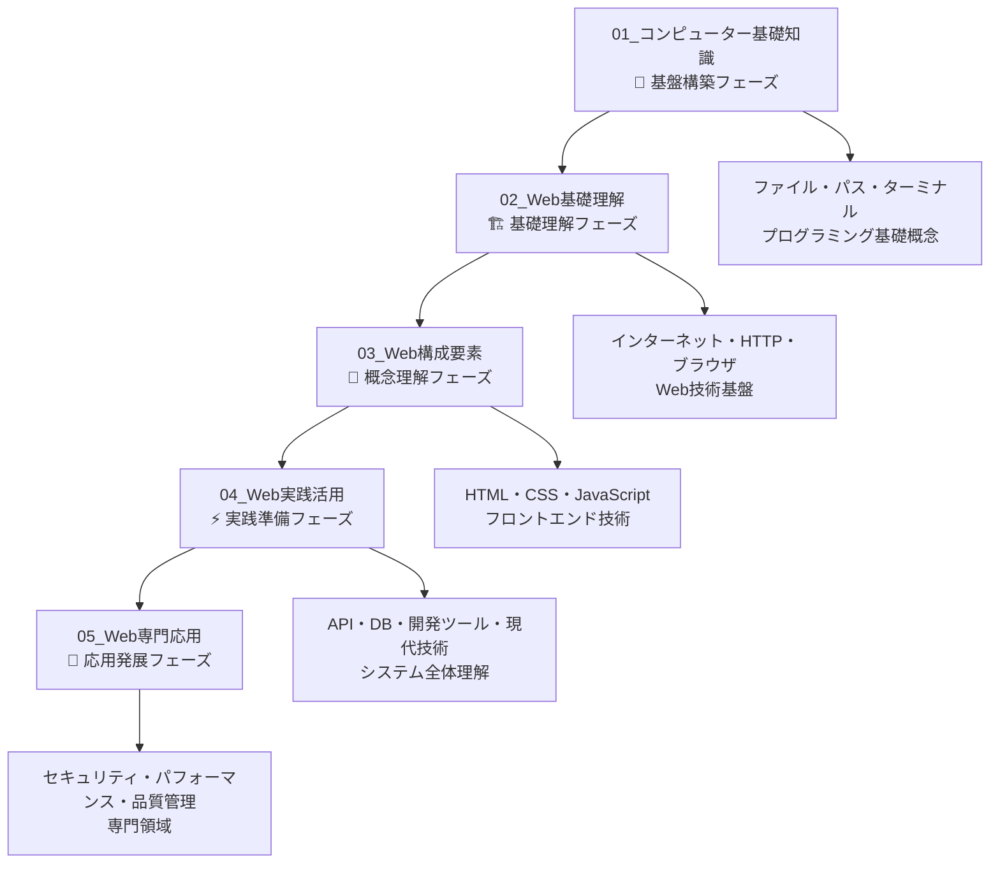

# Web学習ドキュメント全体構成

## 概要

非エンジニア向けWebディレクター学習ドキュメント群の全体構成および学習戦略をまとめたマスタードキュメントです。

**対象者：** プログラミング経験のない新卒Webディレクター、または技術知識を体系的に習得したい非エンジニア  
**最終目標：** 現代的なWeb開発プロジェクトを技術的に理解し、効果的に管理する能力習得  
**環境：** Windows環境、実践的なWebディレクター業務想定

## フェーズ別学習構成



## 詳細フェーズ構成

### 🧱 01_コンピューター基礎知識（優先度：必須）
**フォルダ：** `docs/01_コンピューター基礎知識/`  
**フェーズ目標：** コンピューター・プログラミングの基礎概念理解とWeb学習の土台作り

**学習内容：** ファイル・フォルダ・パス概念・ターミナル操作・プログラミング言語・ライブラリ・Gitなど、以降のWeb学習に必要な基盤知識を習得

**完了時の習得スキル：**
- ファイル/フォルダ/パスの基礎を実務の言葉で説明できる
- GUIとCLIの違いを理解し、基本コマンドで現在地と中身を確認できる
- エラー原因を「現在地」「相対パス」「実行場所」観点で仮説立てできる
- 外部ライブラリ利用の意義（生産性/品質/安全性）を判断軸で語れる
- Gitの"履歴と差分"という考え方を非エンジニア視点で理解できる

📖 **詳細な学習順序と内容は [01_コンピューター基礎知識/README.md](./01_コンピューター基礎知識/README.md) を参照**

---

### 🏗️ 02_Web基礎理解（優先度：高）
**フォルダ：** `docs/02_Web基礎理解/`  
**フェーズ目標：** Webの仕組み・HTTP通信・ブラウザ動作の根本理解

**学習内容：** インターネット基盤・クライアントサーバーモデル・HTTP通信・ブラウザ処理・Webサイト種別など、Web技術の基礎を包括的に習得

**完了時の習得スキル：**
- インターネット・Webインフラの基本構造理解
- HTTP通信とブラウザ動作の仕組み把握
- 技術選択（静的/動的、CMS等）の基準理解
- セキュリティ（HTTPS）の重要性理解

📖 **詳細な学習順序と内容は [02_Web基礎理解/README.md](./02_Web基礎理解/README.md) を参照**

---

### 🧠 03_Web構成要素（優先度：中）
**フォルダ：** `docs/03_Web構成要素/`  
**フェーズ目標：** HTML・CSS・JavaScript の詳細理解とフロントエンド開発者との協働

**学習内容：** HTML構造・CSS設計・JavaScript機能の役割を理解し、フロントエンド技術全体の協働・要件定義スキルを習得

**完了時の習得スキル：**
- HTML構造設計の原則とSEO・アクセシビリティ
- CSS・レスポンシブデザインの概念と実装方針
- JavaScript・DOMの概念とインタラクション設計
- フロントエンド技術の全体像と相互関係

📖 **詳細な学習順序と内容は [03_Web構成要素/README.md](./03_Web構成要素/README.md) を参照**

---

### ⚡ 04_Web実践活用（優先度：中）
**フォルダ：** `docs/04_Web実践活用/`  
**フェーズ目標：** API・データベース・現代的Web技術の理解と実務活用

**学習内容：** システムアーキテクチャ・API・データベース・開発ツール・現代技術の理解により、実務レベルの技術判断・プロジェクト管理能力を習得

**完了時の習得スキル：**
- フロントエンド・バックエンド アーキテクチャの全体像
- API設計・データフロー の基本理解
- データベース選択・設計 の基準理解
- 現代的Web技術スタック の概念理解

📖 **詳細な学習順序と内容は [04_Web実践活用/README.md](./04_Web実践活用/README.md) を参照**

---

### 🚀 05_Web専門応用（優先度：応用）
**フォルダ：** `docs/05_Web専門応用/`  
**フェーズ目標：** セキュリティ・パフォーマンス・品質管理の専門性習得

**学習内容：** Webセキュリティ・パフォーマンス最適化・SEO・アクセシビリティ・AI時代の技術トレンドなど、専門領域での技術的リーダーシップを習得

**完了時の習得スキル：**
- Webセキュリティ要件の適切な定義・監査
- Core Web Vitals を活用したパフォーマンス管理
- SEO・アクセシビリティ要件の定義・監査
- AI時代のWeb技術トレンド理解・活用

📖 **詳細な学習順序と内容は [05_Web専門応用/README.md](./05_Web専門応用/README.md) を参照**

## 学習推奨順序と戦略

### 基本的な学習フロー
```
🎯 段階的学習：前フェーズ完了を前提とした設計
🎯 実務重視：Webディレクター業務での実践的活用を最優先
🎯 継続性：01基礎知識→02-05Webまでの一貫した学習体験
🎯 専門性と実用性のバランス：技術詳細よりもビジネス価値重視
```

### 推奨学習順序
1. **01_コンピューター基礎知識** - コンピューター・プログラミング基礎の土台作り（優先度：必須）
2. **02_Web基礎理解** - Web技術の根本理解（優先度：高）
3. **03_Web構成要素** - フロントエンド技術の詳細理解（優先度：中）
4. **04_Web実践活用** - システム全体・現代技術の理解（優先度：中）
5. **05_Web専門応用** - 専門領域での技術的リーダーシップ（優先度：応用）

**📝 各フェーズの詳細な学習順序・方法・完了基準は、各章のREADME.mdを参照してください**

## 章間の連携ポイント

### スキル段階的発展
```
01完了時：コンピューター・プログラミングの基本理解
02完了時：Webの仕組み・HTTP・ブラウザ理解
03完了時：フロントエンド技術（HTML/CSS/JS）理解
04完了時：システム全体・API・現代技術理解
05完了時：専門性・技術的リーダーシップ習得
```

### 技術的継続性
- **01章のパス概念** → 02章のURL・ドメイン構造理解
- **01章のターミナル操作** → 04章の開発ツール活用
- **01章のエラー対応** → 02章のHTTPステータス・デバッグ
- **01章の環境変数** → 04章のサーバー環境・設定
- **01章のGit概念** → 04章のバージョン管理・チーム開発

## 最終的な学習成果

### 全フェーズ完了時のWebディレクター像

#### 🎯 技術要件定義能力
```
✅ Webサイト・アプリケーションの技術選択に参画
✅ API設計・データベース要件を開発者と議論
✅ セキュリティ・パフォーマンス要件を適切に定義
✅ 現代的Web技術（SPA・ヘッドレスCMS等）の選択判断
```

#### 🎯 問題解決・品質管理能力
```
✅ ブラウザ開発ツールで基本的な問題調査
✅ Core Web Vitalsでパフォーマンス課題を特定
✅ アクセシビリティ・SEOの基本的な監査
✅ セキュリティリスクの特定・対策提案
```

#### 🎯 現代的プロジェクト管理
```
✅ ヘッドレスCMS・JAMstackプロジェクトを理解
✅ AI機能統合の技術要件を定義
✅ レスポンシブ・PWA要件を管理
✅ 技術的リスク管理・予防策の立案・実行
```

#### 🎯 チームコラボレーション向上
```
✅ フロントエンド・バックエンド開発者と効果的に協働
✅ 技術的な課題を適切に報告・共有
✅ 現代的なWeb開発ワークフローを理解
✅ ステークホルダー間の技術的橋渡し
```

## 学習支援リソース

### 各フェーズの詳細情報
各章の詳細な学習内容・順序・方法については、以下の各章のREADME.mdを参照してください：

- **[01_コンピューター基礎知識/README.md](./01_コンピューター基礎知識/README.md)** - 基盤構築フェーズの詳細戦略
- **[02_Web基礎理解/README.md](./02_Web基礎理解/README.md)** - 基礎理解フェーズの詳細戦略
- **[03_Web構成要素/README.md](./03_Web構成要素/README.md)** - 構成要素フェーズの詳細戦略  
- **[04_Web実践活用/README.md](./04_Web実践活用/README.md)** - 実践活用フェーズの詳細戦略
- **[05_Web専門応用/README.md](./05_Web専門応用/README.md)** - 専門応用フェーズの詳細戦略

### 学習時の注意点
1. **段階的学習の重要性**：前フェーズ完了を前提とした設計
2. **実務重視**：Webディレクター業務での実践的活用を最優先
3. **継続性**：01基礎知識→02-05Webまでの一貫した学習体験
4. **専門性と実用性のバランス**：技術詳細よりもビジネス価値重視

### 学習完了の判断基準
- 各章のREADME.mdの「完了チェックリスト」をクリア
- 実際のWebプロジェクトでの技術的会話・判断ができる
- 開発者・デザイナー・ステークホルダーとの効果的な協働
- 技術的問題の適切な報告・解決提案ができる

**学習ペース：** 個人の状況に応じて柔軟に調整  
**推奨環境：** Windows 11、テキストエディタ（VS Code/Cursor推奨）、ネットワーク接続