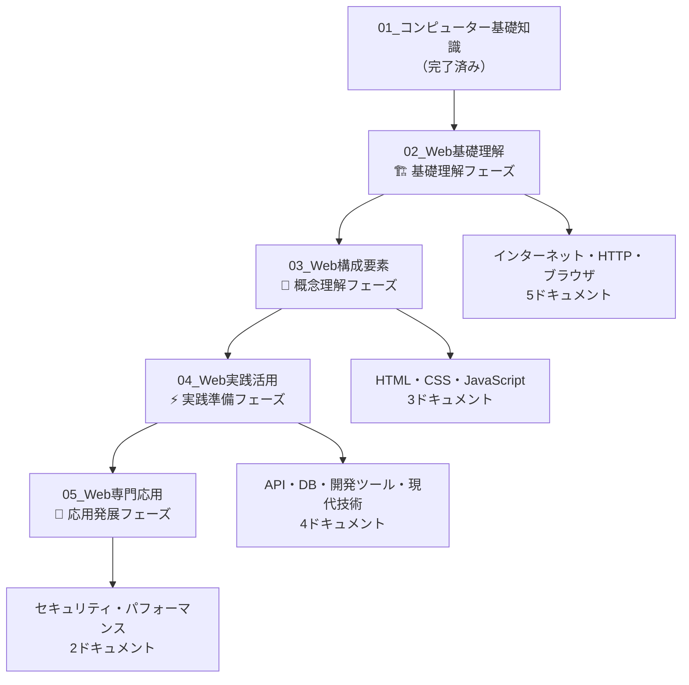

# Web学習ドキュメント全体構成

## 概要

非エンジニア向けWebディレクター学習ドキュメント群の全体構成および学習戦略をまとめたマスタードキュメントです。

**対象者：** 01_コンピューター基礎知識を完了したWebディレクター  
**最終目標：** 現代的なWeb開発プロジェクトを技術的に理解し、効果的に管理する能力習得  
**環境：** Windows環境、実践的なWebディレクター業務想定

## フェーズ別学習構成



## 詳細フェーズ構成

### 🏗️ 02_Web基礎理解（優先度：高）
**フォルダ：** `docs/02_Web基礎理解/`  
**フェーズ目標：** Webの仕組み・HTTP通信・ブラウザ動作の根本理解

#### ドキュメント一覧
```
01_必須_インターネットとWebの世界.md
02_必須_クライアントサーバーモデル.md
03_必須_HTTP通信の基本.md
04_推奨_ブラウザの役割と処理の流れ.md
05_推奨_WebサイトとWebアプリケーション.md
```

#### 完了時の習得スキル
- インターネット・Webインフラの基本構造理解
- HTTP通信とブラウザ動作の仕組み把握
- 技術選択（静的/動的、CMS等）の基準理解
- セキュリティ（HTTPS）の重要性理解

---

### 🧠 03_Web構成要素（優先度：中）
**フォルダ：** `docs/03_Web構成要素/`  
**フェーズ目標：** HTML・CSS・JavaScript の詳細理解とフロントエンド開発者との協働

#### ドキュメント一覧
```
01_必須_HTML：Webページの骨組み.md
02_推奨_CSS：見た目とレイアウト.md
03_推奨_JavaScript：インタラクションと動的機能.md
```

#### 完了時の習得スキル
- HTML構造設計の原則とSEO・アクセシビリティ
- CSS・レスポンシブデザインの概念と実装方針
- JavaScript・DOMの概念とインタラクション設計
- フロントエンド技術の全体像と相互関係

---

### ⚡ 04_Web実践活用（優先度：中）
**フォルダ：** `docs/04_Web実践活用/`  
**フェーズ目標：** API・データベース・現代的Web技術の理解と実務活用

#### ドキュメント一覧
```
01_推奨_フロントエンドとバックエンドの詳細.md
02_推奨_データベースとバックエンド処理.md
03_応用_ブラウザ開発ツールの活用.md
04_応用_現代的なWeb技術.md
```

#### 完了時の習得スキル
- フロントエンド・バックエンド アーキテクチャの全体像
- API設計・データフロー の基本理解
- データベース選択・設計 の基準理解
- 現代的Web技術スタック の概念理解

---

### 🚀 05_Web専門応用（優先度：応用）
**フォルダ：** `docs/05_Web専門応用/`  
**フェーズ目標：** セキュリティ・パフォーマンス・品質管理の専門性習得

#### ドキュメント一覧
```
01_応用_Webセキュリティの基礎.md
02_応用_パフォーマンス・SEO・アクセシビリティ.md
```

#### 完了時の習得スキル
- Webセキュリティ要件の適切な定義・監査
- Core Web Vitals を活用したパフォーマンス管理
- SEO・アクセシビリティ要件の定義・監査
- AI時代のWeb技術トレンド理解・活用

## 学習推奨順序と戦略

### Phase 1: 基礎固め（02_Web基礎理解）
```
🎯 優先順位：必須 > 推奨
🎯 学習方法：概念重視、図解活用
🎯 完了基準：HTTP・ブラウザ・技術選択の基本理解

推奨順序：
01→02→03（必須3つを最優先）
→ 04→05（推奨2つで基礎完成）
```

### Phase 2: 構成要素理解（03_Web構成要素）
```
🎯 前提条件：02完了必須
🎯 学習方法：実例重視、開発者ツール活用
🎯 完了基準：HTML/CSS/JSの役割・相互関係理解

推奨順序：
01（HTML）→ 02（CSS）→ 03（JavaScript）
段階的にフロントエンド全体像を構築
```

### Phase 3: 実践応用（04_Web実践活用）
```
🎯 前提条件：02+03完了推奨
🎯 学習方法：ケーススタディ、実務想定
🎯 完了基準：システム設計・API・現代技術の理解

推奨順序：
01（フロント・バック連携）→ 02（DB・バックエンド）
→ 03（開発ツール）→ 04（現代技術）
```

### Phase 4: 専門性向上（05_Web専門応用）
```
🎯 前提条件：02+03+04完了
🎯 学習方法：専門ツール活用、継続的実践
🎯 完了基準：技術的リーダーシップ・専門判断能力

推奨順序：
01（セキュリティ）→ 02（パフォーマンス・品質）
総合的な技術的判断能力の完成
```

## 01基礎知識との連携ポイント

### 技術的継続性
```
01_04_パス概念 → 02_01_URL・ドメイン構造
01_05,11_ターミナル → 04_03_開発ツール活用
01_10_エラー対応 → 02_03_HTTPステータス・デバッグ
01_13_環境変数 → 04_02_サーバー環境・設定
```

### スキル段階的発展
```
01完了時：コンピューター・プログラミングの基本理解
02完了時：Webの仕組み・HTTP・ブラウザ理解
03完了時：フロントエンド技術（HTML/CSS/JS）理解
04完了時：システム全体・API・現代技術理解
05完了時：専門性・技術的リーダーシップ習得
```

## 最終的な学習成果

### 全フェーズ完了時のWebディレクター像

#### 🎯 技術要件定義能力
```
✅ Webサイト・アプリケーションの技術選択に参画
✅ API設計・データベース要件を開発者と議論
✅ セキュリティ・パフォーマンス要件を適切に定義
✅ 現代的Web技術（SPA・ヘッドレスCMS等）の選択判断
```

#### 🎯 問題解決・品質管理能力
```
✅ ブラウザ開発ツールで基本的な問題調査
✅ Core Web Vitalsでパフォーマンス課題を特定
✅ アクセシビリティ・SEOの基本的な監査
✅ セキュリティリスクの特定・対策提案
```

#### 🎯 現代的プロジェクト管理
```
✅ ヘッドレスCMS・JAMstackプロジェクトを理解
✅ AI機能統合の技術要件を定義
✅ レスポンシブ・PWA要件を管理
✅ 技術的リスク管理・予防策の立案・実行
```

#### 🎯 チームコラボレーション向上
```
✅ フロントエンド・バックエンド開発者と効果的に協働
✅ 技術的な課題を適切に報告・共有
✅ 現代的なWeb開発ワークフローを理解
✅ ステークホルダー間の技術的橋渡し
```

## 学習支援リソース

### 各フェーズの詳細情報
- `02_Web基礎理解/memo.md` - 基礎理解フェーズの詳細戦略
- `03_Web構成要素/memo.md` - 構成要素フェーズの詳細戦略  
- `04_Web実践活用/memo.md` - 実践活用フェーズの詳細戦略
- `05_Web専門応用/memo.md` - 専門応用フェーズの詳細戦略

### 学習時の注意点
1. **段階的学習の重要性**：前フェーズ完了を前提とした設計
2. **実務重視**：Webディレクター業務での実践的活用を最優先
3. **継続性**：01基礎知識→02-05Webまでの一貫した学習体験
4. **専門性と実用性のバランス**：技術詳細よりもビジネス価値重視

### 学習完了の判断基準
- 各フェーズmemo.mdの「完了時の習得スキル」をクリア
- 実際のWebプロジェクトでの技術的会話・判断ができる
- 開発者・デザイナー・ステークホルダーとの効果的な協働
- 技術的問題の適切な報告・解決提案ができる

**学習ペース：** 個人の状況に応じて柔軟に調整  
**前提条件：** 01_コンピューター基礎知識完了必須